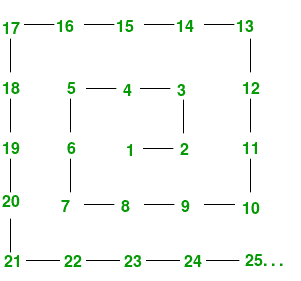
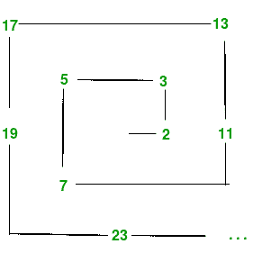

# 乌兰螺旋

> 原文:[https://www.geeksforgeeks.org/the-ulam-spiral/](https://www.geeksforgeeks.org/the-ulam-spiral/)

[乌兰螺旋或质数螺旋](https://en.wikipedia.org/wiki/Ulam_spiral)是一组质数的图形描述。它强调包含大量素数的突出对角线、水平线和垂直线在螺旋中的引人注目的外观。

**如何构建乌兰螺旋？**
数字螺旋是通过将正整数以螺旋排列写在正方形格子上而构成的，如图所示。



Ulam 螺旋是通过特别标记质数来产生的——例如，通过环绕质数或只写质数，或者通过用不同的颜色写质数和非质数——以获得如下的图形。



```
Code to Generate Prime Number
#importing the required libraries
import math
import itertools

def primes():
    yield 2
    primesSoFar = [2]
    for candidate in itertools.count(3, 2):
        for prime in (i for i in primesSoFar if i  100:      
            break
        print(p)

if __name__ == "__main__":
    main()

```

但这不是我们想要的。我们想产生乌兰螺旋，不是吗？
刚刚开始，所以下一步是生成素螺旋；为每个自然数(黑色或白色)生成一个像素，具体取决于该数是否为质数。为了生成这样的图，出于数学目的，我们将使用 python 和 numpy 的 [matplotlib](https://matplotlib.org/) 库。

所以现在的问题是我们应该如何处理？这是一个相当简单的想法。首先，我们必须生成一组'n^2'.大小的素数然后创建一个布尔值数组:1 代表质数，0 代表相同大小的复合'n^2'.数下一步应该是将第二个布尔值数组转换为从中心顺时针旋转的值，为此，我们可以继续以下步骤:

**1:** 生成一个包含‘n * n’元素的数组，然后将该数组重塑为‘n×n’阶的矩阵形式。

**2:** 创建另一个空列表，然后追加步骤 1 中生成的矩阵的第一行。

**3:** 删除第一行(我们刚刚追加到螺旋的那一行)。

**4:** 逆时针旋转阵列的其余部分。

**5:** 制作一个指数螺旋上升的平面阵列。

**6:** 用螺旋索引索引到我们的目标数组的扁平版本。

在完成这些步骤之后，你就可以开始了，最后用上面提到的 matplotlib 绘制出我们在下面的操作之后得到的数组。下面给出了代码，但我强烈建议你先自己尝试一下，然后再钻研代码。

```
# Python code to print Ulam's spiral
import numpy as np
import matplotlib.pyplot as plt
import matplotlib.cm as cm

# function to plot out the ulam spiral
def make_spiral(arr):
    nrows, ncols= arr.shape
    idx = np.arange(nrows*ncols).reshape(nrows,ncols)[::-1]
    spiral_idx = []
    while idx.size:
        spiral_idx.append(idx[0])

        # Remove the first row (the one we've
        # just appended to spiral).
        idx = idx[1:]

        # Rotate the rest of the array anticlockwise
        idx = idx.T[::-1]

    # Make a flat array of indices spiralling 
    # into the array.
    spiral_idx = np.hstack(spiral_idx)

    # Index into a flattened version of our 
    # target array with spiral indices.
    spiral = np.empty_like(arr)
    spiral.flat[spiral_idx] = arr.flat[::-1]
    return spiral

# edge size of the square array.
w = 251
# Prime numbers up to and including w**2.
primes = np.array([n for n in range(2,w**2+1) if all(
                        (n % m) != 0 for m in range(2,int(np.sqrt(n))+1))])

# Create an array of boolean values: 1 for prime, 0 for composite
arr = np.zeros(w**2, dtype='u1')
arr[primes-1] = 1

# Spiral the values clockwise out from the centre
arr = make_spiral(arr.reshape((w,w)))

plt.matshow(arr, cmap=cm.binary)
plt.axis('off')
plt.show()
```

为了更好地理解这个数学概念，请参考[视频。](https://www.youtube.com/user/numberphile)

本文由 **[Subhajit Saha](https://www.linkedin.com/in/subhajit-saha-06aa29131/)** 供稿。如果你喜欢 GeeksforGeeks 并想投稿，你也可以使用[contribute.geeksforgeeks.org](http://www.contribute.geeksforgeeks.org)写一篇文章或者把你的文章邮寄到 contribute@geeksforgeeks.org。看到你的文章出现在极客博客主页上，帮助其他极客。

如果你发现任何不正确的地方，或者你想分享更多关于上面讨论的话题的信息，请写评论。