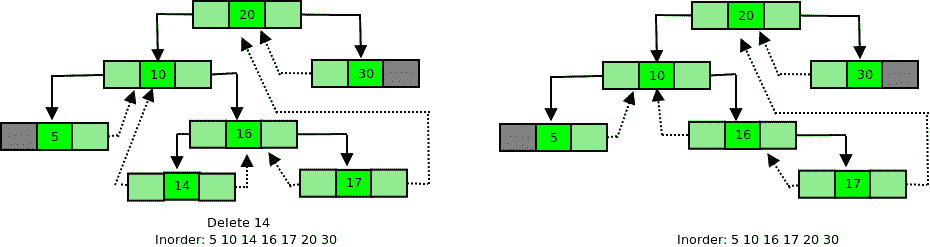
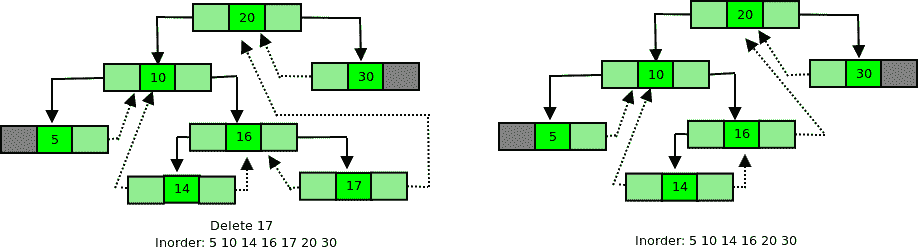
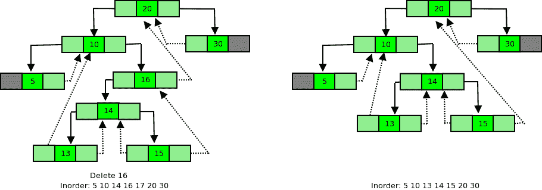
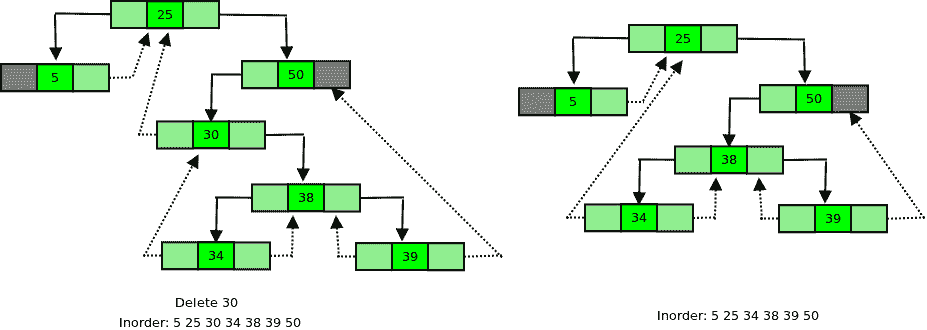

# 螺纹二叉查找树|删除

> 原文:[https://www . geesforgeks . org/threaded-binary-search-tree-delete/](https://www.geeksforgeeks.org/threaded-binary-search-tree-deletion/)

线程二叉树节点如下所示。

## C++

```
struct Node {
    struct Node *left, *right;
    int info;

    // false if left pointer points to predecessor
    // in Inorder Traversal
    bool lthread;

    // false if right pointer points to predecessor
    // in Inorder Traversal
    bool rthread;
};
```

## Java 语言(一种计算机语言，尤用于创建网站)

```
static class Node {
    Node left, right;
    int info;

    // True if left pointer points to predecessor
    // in Inorder Traversal
    boolean lthread;

    // True if right pointer points to predecessor
    // in Inorder Traversal
    boolean rthread;
};

// This code contributed by aashish1995
```

## 蟒蛇 3

```
class Node:
    def __init__(self):
        self.info = 0;
        self.left = None;
        self.right = None;

        # True if left pointer points to predecessor
        # in Inorder Traversal
        self.lthread = False;;

        # True if right pointer points to predecessor
        # in Inorder Traversal
        self.rthread = False;

# This code contributed by umadevi9616
```

## C#

```
public
  class Node
  {
    public
      Node left,
    right;
    public
      int info;

    // True if left pointer points to predecessor
    // in Inorder Traversal
    public
      bool lthread;

    // True if right pointer points to predecessor
    // in Inorder Traversal
    public
      bool rthread;
  };

// This code is contributed by aashish1995
```

## java 描述语言

```
<script>
 class Node {
     constructor(){

     this.left = null, this.right = null;
     this.info = 0;

    // True if left pointer points to predecessor
    // in Inorder Traversal
    this.lthread = false;

    // True if right pointer points to predecessor
    // in Inorder Traversal
    this.rthread = false;
}
}
// This code contributed by aashish1995
</script>
```

我们已经讨论过[插入线程二叉查找树](https://www.geeksforgeeks.org/threaded-binary-tree-insertion/)
在删除时，首先搜索要删除的关键字，然后删除找到关键字的节点有不同的情况。

## C++

```
// Deletes a key from threaded BST with given root and
// returns new root of BST.
struct Node* delThreadedBST(struct Node* root, int dkey)
{
    // Initialize parent as NULL and ptrent
    // Node as root.
    struct Node *par = NULL, *ptr = root;

    // Set true if key is found
    int found = 0;

    // Search key in BST : find Node and its
    // parent.
    while (ptr != NULL) {
        if (dkey == ptr->info) {
            found = 1;
            break;
        }
        par = ptr;
        if (dkey < ptr->info) {
            if (ptr->lthread == false)
                ptr = ptr->left;
            else
                break;
        }
        else {
            if (ptr->rthread == false)
                ptr = ptr->right;
            else
                break;
        }
    }

    if (found == 0)
        printf("dkey not present in tree\n");

    // Two Children
    else if (ptr->lthread == false && ptr->rthread == false)
        root = caseC(root, par, ptr);

    // Only Left Child
    else if (ptr->lthread == false)
        root = caseB(root, par, ptr);

    // Only Right Child
    else if (ptr->rthread == false)
        root = caseB(root, par, ptr);

    // No child
    else
        root = caseA(root, par, ptr);

    return root;
}
```

## Java 语言(一种计算机语言，尤用于创建网站)

```
// Deletes a key from threaded BST with given root and
// returns new root of BST.
Node delThreadedBST(Node root, int dkey)
{
    // Initialize parent as null and ptrent
    // Node as root.
    Node par = null, ptr = root;

    // Set true if key is found
    int found = 0;

    // Search key in BST : find Node and its
    // parent.
    while (ptr != null) {
        if (dkey == ptr.info) {
            found = 1;
            break;
        }
        par = ptr;
        if (dkey < ptr.info) {
            if (ptr.lthread == false)
                ptr = ptr.left;
            else
                break;
        }
        else {
            if (ptr.rthread == false)
                ptr = ptr.right;
            else
                break;
        }
    }

    if (found == 0)
        System.out.printf("dkey not present in tree\n");

    // Two Children
    else if (ptr.lthread == false && ptr.rthread == false)
        root = caseC(root, par, ptr);

    // Only Left Child
    else if (ptr.lthread == false)
        root = caseB(root, par, ptr);

    // Only Right Child
    else if (ptr.rthread == false)
        root = caseB(root, par, ptr);

    // No child
    else
        root = caseA(root, par, ptr);

    return root;
}

// This code is contributed by gauravrajput1
```

## 蟒蛇 3

```
# Deletes a key from threaded BST with given root and
# returns new root of BST.
def delThreadedBST(root, dkey):

    # Initialize parent as None and ptrent
    # Node as root.
    par = None;
    ptr = root;

    # Set True if key is found
    found = 0;

    # Search key in BST : find Node and its
    # parent.
    while (ptr != None):
        if (dkey == ptr.info):
            found = 1;
            break;

        par = ptr;
        if (dkey < ptr.info):
            if (ptr.lthread == False)
                ptr = ptr.left;
            else
                break;

        else:
            if (ptr.rthread == False)
                ptr = ptr.right;
            else
                break;

    if (found == 0):
        print("dkey not present in tree");

    # Two Children
    elif(ptr.lthread == False and ptr.rthread == False):
        root = caseC(root, par, ptr);

    # Only Left Child
    elif(ptr.lthread == False):
        root = caseB(root, par, ptr);

    # Only Right Child
    elif(ptr.rthread == False):
        root = caseB(root, par, ptr);

    # No child
    else:
        root = caseA(root, par, ptr);

    return root;

# This code is contributed by Rajput-Ji
```

## C#

```
// Deletes a key from threaded BST with given root and
// returns new root of BST.
Node delThreadedBST(Node root, int dkey)
{
    // Initialize parent as null and ptrent
    // Node as root.
    Node par = null, ptr = root;

    // Set true if key is found
    int found = 0;

    // Search key in BST : find Node and its
    // parent.
    while (ptr != null) {
        if (dkey == ptr.info) {
            found = 1;
            break;
        }
        par = ptr;
        if (dkey < ptr.info) {
            if (ptr.lthread == false)
                ptr = ptr.left;
            else
                break;
        }
        else {
            if (ptr.rthread == false)
                ptr = ptr.right;
            else
                break;
        }
    }

    if (found == 0)
        Console.Write("dkey not present in tree\n");

    // Two Children
    else if (ptr.lthread == false && ptr.rthread == false)
        root = caseC(root, par, ptr);

    // Only Left Child
    else if (ptr.lthread == false)
        root = caseB(root, par, ptr);

    // Only Right Child
    else if (ptr.rthread == false)
        root = caseB(root, par, ptr);

    // No child
    else
        root = caseA(root, par, ptr);

    return root;
}

// This code is contributed by gauravrajput1
```

## java 描述语言

```
<script>
// Deletes a key from threaded BST with given root and
// returns new root of BST.
function delThreadedBST(root , dkey)
{
    // Initialize parent as null and ptrent
    // Node as root.
    var par = null, ptr = root;

    // Set true if key is found
    var found = 0;

    // Search key in BST : find Node and its
    // parent.
    while (ptr != null) {
        if (dkey == ptr.info) {
            found = 1;
            break;
        }
        par = ptr;
        if (dkey < ptr.info) {
            if (ptr.lthread == false)
                ptr = ptr.left;
            else
                break;
        }
        else {
            if (ptr.rthread == false)
                ptr = ptr.right;
            else
                break;
        }
    }

    if (found == 0)
        document.write("dkey not present in tree\n");

    // Two Children
    else if (ptr.lthread == false && ptr.rthread == false)
        root = caseC(root, par, ptr);

    // Only Left Child
    else if (ptr.lthread == false)
        root = caseB(root, par, ptr);

    // Only Right Child
    else if (ptr.rthread == false)
        root = caseB(root, par, ptr);

    // No child
    else
        root = caseA(root, par, ptr);

    return root;
}

// This code is contributed by gauravrajput1
</script>
```

**案例 A:叶节点需要删除**
在 BST 中，删除一个叶节点，父节点的左右指针被设置为空。这里，它不是将指针设置为空，而是成为一个线程。
如果要删除的叶节点是其父节点的左子节点，那么在删除之后，父节点的左指针应该成为指向其父节点的前身的线程。

```
par -> lthread = true;
par -> left = ptr -> left;
```



如果要删除的叶节点是其父节点的右子节点，那么在删除之后，父节点的右指针应该成为指向其后继节点的线程。删除前是叶节点的后续节点，删除后将成为父节点的后续节点。



## C++

```
// Here 'par' is pointer to parent Node and 'ptr' is
// pointer to current Node.
struct Node* caseA(struct Node* root, struct Node* par,
                   struct Node* ptr)
{
    // If Node to be deleted is root
    if (par == NULL)
        root = NULL;

    // If Node to be deleted is left
    // of its parent
    else if (ptr == par->left) {
        par->lthread = true;
        par->left = ptr->left;
    }
    else {
        par->rthread = true;
        par->right = ptr->right;
    }

    // Free memory and return new root
    free(ptr);
    return root;
}
```

## Java 语言(一种计算机语言，尤用于创建网站)

```
// Here 'par' is pointer to parent Node and 'ptr' is
// pointer to current Node.
Node caseA(Node root, Node par,
                   Node ptr)
{

    // If Node to be deleted is root
    if (par == null)
        root = null;

    // If Node to be deleted is left
    // of its parent
    else if (ptr == par.left) {
        par.lthread = true;
        par.left = ptr.left;
    }
    else {
        par.rthread = true;
        par.right = ptr.right;
    }

    return root;
}

// This code is contributed by gauravrajput1
```

## 蟒蛇 3

```
# Here 'par' is pointer to parent Node and 'ptr' is
# pointer to current Node.
def caseA(root,par,ptr):

  # If Node to be deleted is root
    if (par == None):
        root = None

     # If Node to be deleted is left
    # of its parent
    elif(ptr == par.left):
        par.lthread = true
        par.left = ptr.left
    else:
        par.rthread = true
        par.right = ptr.right
return root

# This code is contributed by Patel2127.
```

## C#

```
// Here 'par' is pointer to parent Node and
// 'ptr' is pointer to current Node.
Node caseA(Node root, Node par, Node ptr)
{

    // If Node to be deleted is root
    if (par == null)
        root = null;

    // If Node to be deleted is left
    // of its parent
    else if (ptr == par.left)
    {
        par.lthread = true;
        par.left = ptr.left;
    }
    else
    {
        par.rthread = true;
        par.right = ptr.right;
    }
    return root;
}

// This code is contributed by rutvik_56
```

## java 描述语言

```
<script>

// Here 'par' is pointer to parent Node and
// 'ptr' is pointer to current Node.
function caseA(root, par, ptr)
{

    // If Node to be deleted is root
    if (par == null)
        root = null;

    // If Node to be deleted is left
    // of its parent
    else if (ptr == par.left)
    {
        par.lthread = true;
        par.left = ptr.left;
    }
    else
    {
        par.rthread = true;
        par.right = ptr.right;
    }
    return root;
}

// This code is contributed by rag2127

</script>
```

**情况 B:要删除的节点只有一个子节点**
在 BST 中删除该节点后，找出该节点的前序后继节点。

```
s = inSucc(ptr);
p = inPred(ptr);
```

如果要删除的节点有左子树，那么删除后其前任的右线程应该指向其继任者。

```
p->right = s;
```



在删除之前，15 是 16 的前身，2 是 16 的后继者。删除 16 后，节点 20 成为 15 的后继节点，因此 15 的右线程将指向 20。
如果要删除的节点有右子树，那么删除后其后继节点的左线程应该指向其父进程。

```
s->left = p;
```



在删除之前，25 是 30 的前身，34 是 30 的后继者。删除 30 后，节点 25 成为 34 的前身，因此 34 的左线程将指向 25。

## C++

```
// Here 'par' is pointer to parent Node and 'ptr' is
// pointer to current Node.
struct Node* caseB(struct Node* root, struct Node* par,
                   struct Node* ptr)
{
    struct Node* child;

    // Initialize child Node to be deleted has
    // left child.
    if (ptr->lthread == false)
        child = ptr->left;

    // Node to be deleted has right child.
    else
        child = ptr->right;

    // Node to be deleted is root Node.
    if (par == NULL)
        root = child;

    // Node is left child of its parent.
    else if (ptr == par->left)
        par->left = child;
    else
        par->right = child;

    // Find successor and predecessor
    Node* s = inSucc(ptr);
    Node* p = inPred(ptr);

    // If ptr has left subtree.
    if (ptr->lthread == false)
        p->right = s;

    // If ptr has right subtree.
    else {
        if (ptr->rthread == false)
            s->left = p;
    }

    free(ptr);
    return root;
}
```

## Java 语言(一种计算机语言，尤用于创建网站)

```
// Here 'par' is pointer to parent Node and 'ptr' is
// pointer to current Node.
static Node caseB(Node root, Node par,
                   Node ptr)
{
    Node child;

    // Initialize child Node to be deleted has
    // left child.
    if (ptr.lthread == false)
        child = ptr.left;

    // Node to be deleted has right child.
    else
        child = ptr.right;

    // Node to be deleted is root Node.
    if (par == null)
        root = child;

    // Node is left child of its parent.
    else if (ptr == par.left)
        par.left = child;
    else
        par.right = child;

    // Find successor and predecessor
    Node s = inSucc(ptr);
    Node p = inPred(ptr);

    // If ptr has left subtree.
    if (ptr.lthread == false)
        p.right = s;

    // If ptr has right subtree.
    else {
        if (ptr.rthread == false)
            s.left = p;
    }
    return root;
}

// This code is contributed by gauravrajput1
```

## C#

```
// Here 'par' is pointer to parent Node and
// 'ptr' is pointer to current Node.
static Node caseB(Node root, Node par,
                  Node ptr)
{
    Node child;

    // Initialize child Node to be deleted
    // has left child.
    if (ptr.lthread == false)
        child = ptr.left;

    // Node to be deleted has right child.
    else
        child = ptr.right;

    // Node to be deleted is root Node.
    if (par == null)
        root = child;

    // Node is left child of its parent.
    else if (ptr == par.left)
        par.left = child;
    else
        par.right = child;

    // Find successor and predecessor
    Node s = inSucc(ptr);
    Node p = inPred(ptr);

    // If ptr has left subtree.
    if (ptr.lthread == false)
        p.right = s;

    // If ptr has right subtree.
    else
    {
        if (ptr.rthread == false)
            s.left = p;
    }
    return root;
}

// This code is contributed by gauravrajput1
```

## java 描述语言

```
<script>

// Here 'par' is pointer to parent Node and 'ptr' is
// pointer to current Node.
function caseB(root,par,ptr)
{
    let child;

    // Initialize child Node to be deleted has
    // left child.
    if (ptr.lthread == false)
        child = ptr.left;

    // Node to be deleted has right child.
    else
        child = ptr.right;

    // Node to be deleted is root Node.
    if (par == null)
        root = child;

    // Node is left child of its parent.
    else if (ptr == par.left)
        par.left = child;
    else
        par.right = child;

    // Find successor and predecessor
    let s = inSucc(ptr);
    let p = inPred(ptr);

    // If ptr has left subtree.
    if (ptr.lthread == false)
        p.right = s;

    // If ptr has right subtree.
    else {
        if (ptr.rthread == false)
            s.left = p;
    }
    return root;
}

// This code is contributed by avanitrachhadiya2155

</script>
```

**案例 C:待删除节点有两个子节点**
我们找到 Node ptr(待删除节点)的有序继承者，然后将这个继承者的信息复制到 Node ptr 中。在此之后，使用案例 A 或案例 b 删除后续节点

## C++

```
// Here 'par' is pointer to parent Node and 'ptr' is
// pointer to current Node.
struct Node* caseC(struct Node* root, struct Node* par,
                   struct Node* ptr)
{
    // Find inorder successor and its parent.
    struct Node* parsucc = ptr;
    struct Node* succ = ptr->right;

    // Find leftmost child of successor
    while (succ->left != NULL) {
        parsucc = succ;
        succ = succ->left;
    }

    ptr->info = succ->info;

    if (succ->lthread == true && succ->rthread == true)
        root = caseA(root, parsucc, succ);
    else
        root = caseB(root, parsucc, succ);

    return root;
}
```

## Java 语言(一种计算机语言，尤用于创建网站)

```
// Here 'par' is pointer to parent Node and 'ptr' is
    // pointer to current Node.
    static Node caseC(Node root, Node par,
                      Node ptr)
    {

        // Find inorder successor and its parent.
        Node parsucc = ptr;
        Node succ = ptr.right;

        // Find leftmost child of successor
        while (succ.lthread == false) {
            parsucc = succ;
            succ = succ.left;
        }

        ptr.info = succ.info;

        if (succ.lthread == true && succ.rthread == true)
            root = caseA(root, parsucc, succ);
        else
            root = caseB(root, parsucc, succ);

        return root;
    }

// This code is contributed by umadevi9616
```

## C#

```
// Here 'par' is pointer to parent Node and 'ptr' is
    // pointer to current Node.
    static Node caseC(Node root, Node par,
                      Node ptr)
    {
        // Find inorder successor and its parent.
        Node parsucc = ptr;
        Node succ = ptr.right;

        // Find leftmost child of successor
        while (succ.lthread == false) {
            parsucc = succ;
            succ = succ.left;
        }

        ptr.info = succ.info;

        if (succ.lthread == true && succ.rthread == true)
            root = caseA(root, parsucc, succ);
        else
            root = caseB(root, parsucc, succ);

        return root;
    }

// This code is contributed by umadevi9616
```

## java 描述语言

```
<script>
 // Here 'par' is pointer to parent Node and 'ptr' is
      // pointer to current Node.
      function caseC(root, par, ptr)
      {

        // Find inorder successor and its parent.
        var parsucc = ptr;
        var succ = ptr.right;

        // Find leftmost child of successor
        while (succ.lthread == false) {
          parsucc = succ;
          succ = succ.left;
        }

        ptr.info = succ.info;

        if (succ.lthread == true && succ.rthread == true)
          root = caseA(root, parsucc, succ);
        else root = caseB(root, parsucc, succ);

        return root;
      }

      // This code is contributed by gauravrajput1
</script>
```

下面是完整的代码:

## C++

```
// Complete C++ program to demonstrate deletion
// in threaded BST
#include <bits/stdc++.h>
using namespace std;

struct Node {
    struct Node *left, *right;
    int info;

    // false if left pointer points to predecessor
    // in Inorder Traversal
    bool lthread;

    // false if right pointer points to predecessor
    // in Inorder Traversal
    bool rthread;
};

// Insert a Node in Binary Threaded Tree
struct Node* insert(struct Node* root, int ikey)
{
    // Searching for a Node with given value
    Node* ptr = root;
    Node* par = NULL; // Parent of key to be inserted
    while (ptr != NULL) {
        // If key already exists, return
        if (ikey == (ptr->info)) {
            printf("Duplicate Key !\n");
            return root;
        }

        par = ptr; // Update parent pointer

        // Moving on left subtree.
        if (ikey < ptr->info) {
            if (ptr->lthread == false)
                ptr = ptr->left;
            else
                break;
        }

        // Moving on right subtree.
        else {
            if (ptr->rthread == false)
                ptr = ptr->right;
            else
                break;
        }
    }

    // Create a new Node
    Node* tmp = new Node;
    tmp->info = ikey;
    tmp->lthread = true;
    tmp->rthread = true;

    if (par == NULL) {
        root = tmp;
        tmp->left = NULL;
        tmp->right = NULL;
    }
    else if (ikey < (par->info)) {
        tmp->left = par->left;
        tmp->right = par;
        par->lthread = false;
        par->left = tmp;
    }
    else {
        tmp->left = par;
        tmp->right = par->right;
        par->rthread = false;
        par->right = tmp;
    }

    return root;
}

// Returns inorder successor using left
// and right children (Used in deletion)
struct Node* inSucc(struct Node* ptr)
{
    if (ptr->rthread == true)
        return ptr->right;

    ptr = ptr->right;
    while (ptr->lthread == false)
        ptr = ptr->left;

    return ptr;
}

// Returns inorder successor using rthread
// (Used in inorder)
struct Node* inorderSuccessor(struct Node* ptr)
{
    // If rthread is set, we can quickly find
    if (ptr->rthread == true)
        return ptr->right;

    // Else return leftmost child of right subtree
    ptr = ptr->right;
    while (ptr->lthread == false)
        ptr = ptr->left;
    return ptr;
}

// Printing the threaded tree
void inorder(struct Node* root)
{
    if (root == NULL)
        printf("Tree is empty");

    // Reach leftmost Node
    struct Node* ptr = root;
    while (ptr->lthread == false)
        ptr = ptr->left;

    // One by one print successors
    while (ptr != NULL) {
        printf("%d ", ptr->info);
        ptr = inorderSuccessor(ptr);
    }
}

struct Node* inPred(struct Node* ptr)
{
    if (ptr->lthread == true)
        return ptr->left;

    ptr = ptr->left;
    while (ptr->rthread == false)
        ptr = ptr->right;
    return ptr;
}

// Here 'par' is pointer to parent Node and 'ptr' is
// pointer to current Node.
struct Node* caseA(struct Node* root, struct Node* par,
                   struct Node* ptr)
{
    // If Node to be deleted is root
    if (par == NULL)
        root = NULL;

    // If Node to be deleted is left
    // of its parent
    else if (ptr == par->left) {
        par->lthread = true;
        par->left = ptr->left;
    }
    else {
        par->rthread = true;
        par->right = ptr->right;
    }

    // Free memory and return new root
    free(ptr);
    return root;
}

// Here 'par' is pointer to parent Node and 'ptr' is
// pointer to current Node.
struct Node* caseB(struct Node* root, struct Node* par,
                   struct Node* ptr)
{
    struct Node* child;

    // Initialize child Node to be deleted has
    // left child.
    if (ptr->lthread == false)
        child = ptr->left;

    // Node to be deleted has right child.
    else
        child = ptr->right;

    // Node to be deleted is root Node.
    if (par == NULL)
        root = child;

    // Node is left child of its parent.
    else if (ptr == par->left)
        par->left = child;
    else
        par->right = child;

    // Find successor and predecessor
    Node* s = inSucc(ptr);
    Node* p = inPred(ptr);

    // If ptr has left subtree.
    if (ptr->lthread == false)
        p->right = s;

    // If ptr has right subtree.
    else {
        if (ptr->rthread == false)
            s->left = p;
    }

    free(ptr);
    return root;
}

// Here 'par' is pointer to parent Node and 'ptr' is
// pointer to current Node.
struct Node* caseC(struct Node* root, struct Node* par,
                   struct Node* ptr)
{
    // Find inorder successor and its parent.
    struct Node* parsucc = ptr;
    struct Node* succ = ptr->right;

    // Find leftmost child of successor
    while (succ->lthread==false) {
        parsucc = succ;
        succ = succ->left;
    }

    ptr->info = succ->info;

    if (succ->lthread == true && succ->rthread == true)
        root = caseA(root, parsucc, succ);
    else
        root = caseB(root, parsucc, succ);

    return root;
}

// Deletes a key from threaded BST with given root and
// returns new root of BST.
struct Node* delThreadedBST(struct Node* root, int dkey)
{
    // Initialize parent as NULL and ptrent
    // Node as root.
    struct Node *par = NULL, *ptr = root;

    // Set true if key is found
    int found = 0;

    // Search key in BST : find Node and its
    // parent.
    while (ptr != NULL) {
        if (dkey == ptr->info) {
            found = 1;
            break;
        }
        par = ptr;
        if (dkey < ptr->info) {
            if (ptr->lthread == false)
                ptr = ptr->left;
            else
                break;
        }
        else {
            if (ptr->rthread == false)
                ptr = ptr->right;
            else
                break;
        }
    }

    if (found == 0)
        printf("dkey not present in tree\n");

    // Two Children
    else if (ptr->lthread == false && ptr->rthread == false)
        root = caseC(root, par, ptr);

    // Only Left Child
    else if (ptr->lthread == false)
        root = caseB(root, par, ptr);

    // Only Right Child
    else if (ptr->rthread == false)
        root = caseB(root, par, ptr);

    // No child
    else
        root = caseA(root, par, ptr);

    return root;
}

// Driver Program
int main()
{
    struct Node* root = NULL;

    root = insert(root, 20);
    root = insert(root, 10);
    root = insert(root, 30);
    root = insert(root, 5);
    root = insert(root, 16);
    root = insert(root, 14);
    root = insert(root, 17);
    root = insert(root, 13);

    root = delThreadedBST(root, 20);
    inorder(root);

    return 0;
}
```

## Java 语言(一种计算机语言，尤用于创建网站)

```
// Complete Java program to demonstrate deletion
// in threaded BST
import java.util.*;
class solution {

    static class Node {
        Node left, right;
        int info;

        // True if left pointer points to predecessor
        // in Inorder Traversal
        boolean lthread;

        // True if right pointer points to predecessor
        // in Inorder Traversal
        boolean rthread;
    };

    // Insert a Node in Binary Threaded Tree
    static Node insert(Node root, int ikey)
    {
        // Searching for a Node with given value
        Node ptr = root;
        Node par = null; // Parent of key to be inserted
        while (ptr != null) {
            // If key already exists, return
            if (ikey == (ptr.info)) {
                System.out.printf("Duplicate Key !\n");
                return root;
            }

            par = ptr; // Update parent pointer

            // Moving on left subtree.
            if (ikey < ptr.info) {
                if (ptr.lthread == false)
                    ptr = ptr.left;
                else
                    break;
            }

            // Moving on right subtree.
            else {
                if (ptr.rthread == false)
                    ptr = ptr.right;
                else
                    break;
            }
        }

        // Create a new Node
        Node tmp = new Node();
        tmp.info = ikey;
        tmp.lthread = true;
        tmp.rthread = true;

        if (par == null) {
            root = tmp;
            tmp.left = null;
            tmp.right = null;
        }
        else if (ikey < (par.info)) {
            tmp.left = par.left;
            tmp.right = par;
            par.lthread = false;
            par.left = tmp;
        }
        else {
            tmp.left = par;
            tmp.right = par.right;
            par.rthread = false;
            par.right = tmp;
        }

        return root;
    }

    // Returns inorder successor using left
    // and right children (Used in deletion)
    static Node inSucc(Node ptr)
    {
        if (ptr.rthread == true)
            return ptr.right;

        ptr = ptr.right;
        while (ptr.lthread == false)
            ptr = ptr.left;

        return ptr;
    }

    // Returns inorder successor using rthread
    // (Used in inorder)
    static Node inorderSuccessor(Node ptr)
    {
        // If rthread is set, we can quickly find
        if (ptr.rthread == true)
            return ptr.right;

        // Else return leftmost child of right subtree
        ptr = ptr.right;
        while (ptr.lthread == false)
            ptr = ptr.left;
        return ptr;
    }

    // Printing the threaded tree
    static void inorder(Node root)
    {
        if (root == null)
            System.out.printf("Tree is empty");

        // Reach leftmost Node
        Node ptr = root;
        while (ptr.lthread == false)
            ptr = ptr.left;

        // One by one print successors
        while (ptr != null) {
            System.out.printf("%d ", ptr.info);
            ptr = inorderSuccessor(ptr);
        }
    }

    static Node inPred(Node ptr)
    {
        if (ptr.lthread == true)
            return ptr.left;

        ptr = ptr.left;
        while (ptr.rthread == false)
            ptr = ptr.right;
        return ptr;

    }

    // Here 'par' is pointer to parent Node and 'ptr' is
    // pointer to current Node.
    static Node caseA(Node root, Node par,
                      Node ptr)
    {
        // If Node to be deleted is root
        if (par == null)
            root = null;

        // If Node to be deleted is left
        // of its parent
        else if (ptr == par.left) {
            par.lthread = true;
            par.left = ptr.left;
        }
        else {
            par.rthread = true;
            par.right = ptr.right;
        }

        return root;
    }

    // Here 'par' is pointer to parent Node and 'ptr' is
    // pointer to current Node.
    static Node caseB(Node root, Node par,
                      Node ptr)
    {
        Node child;

        // Initialize child Node to be deleted has
        // left child.
        if (ptr.lthread == false)
            child = ptr.left;

        // Node to be deleted has right child.
        else
            child = ptr.right;

        // Node to be deleted is root Node.
        if (par == null)
            root = child;

        // Node is left child of its parent.
        else if (ptr == par.left)
            par.left = child;
        else
            par.right = child;

        // Find successor and predecessor
        Node s = inSucc(ptr);
        Node p = inPred(ptr);

        // If ptr has left subtree.
        if (ptr.lthread == false)
            p.right = s;

        // If ptr has right subtree.
        else {
            if (ptr.rthread == false)
                s.left = p;
        }

        return root;
    }

    // Here 'par' is pointer to parent Node and 'ptr' is
    // pointer to current Node.
    static Node caseC(Node root, Node par,
                      Node ptr)
    {
        // Find inorder successor and its parent.
        Node parsucc = ptr;
        Node succ = ptr.right;

        // Find leftmost child of successor
        while (succ.lthread == false) {
            parsucc = succ;
            succ = succ.left;
        }

        ptr.info = succ.info;

        if (succ.lthread == true && succ.rthread == true)
            root = caseA(root, parsucc, succ);
        else
            root = caseB(root, parsucc, succ);

        return root;
    }

    // Deletes a key from threaded BST with given root and
    // returns new root of BST.
    static Node delThreadedBST(Node root, int dkey)
    {
        // Initialize parent as null and ptrent
        // Node as root.
        Node par = null, ptr = root;

        // Set true if key is found
        int found = 0;

        // Search key in BST : find Node and its
        // parent.
        while (ptr != null) {
            if (dkey == ptr.info) {
                found = 1;
                break;
            }
            par = ptr;
            if (dkey < ptr.info) {
                if (ptr.lthread == false)
                    ptr = ptr.left;
                else
                    break;
            }
            else {
                if (ptr.rthread == false)
                    ptr = ptr.right;
                else
                    break;
            }
        }

        if (found == 0)
            System.out.printf("dkey not present in tree\n");

        // Two Children
        else if (ptr.lthread == false && ptr.rthread == false)
            root = caseC(root, par, ptr);

        // Only Left Child
        else if (ptr.lthread == false)
            root = caseB(root, par, ptr);

        // Only Right Child
        else if (ptr.rthread == false)
            root = caseB(root, par, ptr);

        // No child
        else
            root = caseA(root, par, ptr);

        return root;
    }

    // Driver Program
    public static void main(String args[])
    {
        Node root = null;

        root = insert(root, 20);
        root = insert(root, 10);
        root = insert(root, 30);
        root = insert(root, 5);
        root = insert(root, 16);
        root = insert(root, 14);
        root = insert(root, 17);
        root = insert(root, 13);

        root = delThreadedBST(root, 20);
        inorder(root);
    }
}
// This code is contributed by Arnab Kundu
```

## C#

```
// Complete C# program to demonstrate deletion
// in threaded BST
using System;

class GFG {

    public class Node {
        public Node left, right;
        public int info;

        // True if left pointer points to predecessor
        // in Inorder Traversal
        public bool lthread;

        // True if right pointer points to predecessor
        // in Inorder Traversal
        public bool rthread;
    };

    // Insert a Node in Binary Threaded Tree
    static Node insert(Node root, int ikey)
    {
        // Searching for a Node with given value
        Node ptr = root;
        Node par = null; // Parent of key to be inserted
        while (ptr != null) {
            // If key already exists, return
            if (ikey == (ptr.info)) {
                Console.Write("Duplicate Key !\n");
                return root;
            }

            par = ptr; // Update parent pointer

            // Moving on left subtree.
            if (ikey < ptr.info) {
                if (ptr.lthread == false)
                    ptr = ptr.left;
                else
                    break;
            }

            // Moving on right subtree.
            else {
                if (ptr.rthread == false)
                    ptr = ptr.right;
                else
                    break;
            }
        }

        // Create a new Node
        Node tmp = new Node();
        tmp.info = ikey;
        tmp.lthread = true;
        tmp.rthread = true;

        if (par == null) {
            root = tmp;
            tmp.left = null;
            tmp.right = null;
        }
        else if (ikey < (par.info)) {
            tmp.left = par.left;
            tmp.right = par;
            par.lthread = false;
            par.left = tmp;
        }
        else {
            tmp.left = par;
            tmp.right = par.right;
            par.rthread = false;
            par.right = tmp;
        }

        return root;
    }

    // Returns inorder successor using left
    // and right children (Used in deletion)
    static Node inSucc(Node ptr)
    {
        if (ptr.rthread == true)
            return ptr.right;

        ptr = ptr.right;
        while (ptr.lthread == false)
            ptr = ptr.left;

        return ptr;
    }

    // Returns inorder successor using rthread
    // (Used in inorder)
    static Node inorderSuccessor(Node ptr)
    {
        // If rthread is set, we can quickly find
        if (ptr.rthread == true)
            return ptr.right;

        // Else return leftmost child of right subtree
        ptr = ptr.right;
        while (ptr.lthread == false)
            ptr = ptr.left;
        return ptr;
    }

    // Printing the threaded tree
    static void inorder(Node root)
    {
        if (root == null)
            Console.Write("Tree is empty");

        // Reach leftmost Node
        Node ptr = root;
        while (ptr.lthread == false)
            ptr = ptr.left;

        // One by one print successors
        while (ptr != null) {
            Console.Write("{0} ", ptr.info);
            ptr = inorderSuccessor(ptr);
        }
    }

    static Node inPred(Node ptr)
    {
        if (ptr.lthread == true)
            return ptr.left;

        ptr = ptr.left;
        while (ptr.rthread == false)
            ptr = ptr.right;
        return ptr;
    }

    // Here 'par' is pointer to parent Node and 'ptr' is
    // pointer to current Node.
    static Node caseA(Node root, Node par,
                      Node ptr)
    {
        // If Node to be deleted is root
        if (par == null)
            root = null;

        // If Node to be deleted is left
        // of its parent
        else if (ptr == par.left) {
            par.lthread = true;
            par.left = ptr.left;
        }
        else {
            par.rthread = true;
            par.right = ptr.right;
        }

        return root;
    }

    // Here 'par' is pointer to parent Node and 'ptr' is
    // pointer to current Node.
    static Node caseB(Node root, Node par,
                      Node ptr)
    {
        Node child;

        // Initialize child Node to be deleted has
        // left child.
        if (ptr.lthread == false)
            child = ptr.left;

        // Node to be deleted has right child.
        else
            child = ptr.right;

        // Node to be deleted is root Node.
        if (par == null)
            root = child;

        // Node is left child of its parent.
        else if (ptr == par.left)
            par.left = child;
        else
            par.right = child;

        // Find successor and predecessor
        Node s = inSucc(ptr);
        Node p = inPred(ptr);

        // If ptr has left subtree.
        if (ptr.lthread == false)
            p.right = s;

        // If ptr has right subtree.
        else {
            if (ptr.rthread == false)
                s.left = p;
        }

        return root;
    }

    // Here 'par' is pointer to parent Node and 'ptr' is
    // pointer to current Node.
    static Node caseC(Node root, Node par,
                      Node ptr)
    {
        // Find inorder successor and its parent.
        Node parsucc = ptr;
        Node succ = ptr.right;

        // Find leftmost child of successor
        while (succ.lthread == false) {
            parsucc = succ;
            succ = succ.left;
        }

        ptr.info = succ.info;

        if (succ.lthread == true && succ.rthread == true)
            root = caseA(root, parsucc, succ);
        else
            root = caseB(root, parsucc, succ);

        return root;
    }

    // Deletes a key from threaded BST with given root and
    // returns new root of BST.
    static Node delThreadedBST(Node root, int dkey)
    {
        // Initialize parent as null and ptrent
        // Node as root.
        Node par = null, ptr = root;

        // Set true if key is found
        int found = 0;

        // Search key in BST : find Node and its
        // parent.
        while (ptr != null) {
            if (dkey == ptr.info) {
                found = 1;
                break;
            }
            par = ptr;
            if (dkey < ptr.info) {
                if (ptr.lthread == false)
                    ptr = ptr.left;
                else
                    break;
            }
            else {
                if (ptr.rthread == false)
                    ptr = ptr.right;
                else
                    break;
            }
        }

        if (found == 0)
            Console.Write("dkey not present in tree\n");

        // Two Children
        else if (ptr.lthread == false && ptr.rthread == false)
            root = caseC(root, par, ptr);

        // Only Left Child
        else if (ptr.lthread == false)
            root = caseB(root, par, ptr);

        // Only Right Child
        else if (ptr.rthread == false)
            root = caseB(root, par, ptr);

        // No child
        else
            root = caseA(root, par, ptr);

        return root;
    }

    // Driver code
    public static void Main(String[] args)
    {
        Node root = null;

        root = insert(root, 20);
        root = insert(root, 10);
        root = insert(root, 30);
        root = insert(root, 5);
        root = insert(root, 16);
        root = insert(root, 14);
        root = insert(root, 17);
        root = insert(root, 13);

        root = delThreadedBST(root, 20);
        inorder(root);
    }
}

// This code has been contributed by 29AjayKumar
```

## java 描述语言

```
<script>

      // Complete JavaScript program to demonstrate deletion
      // in threaded BST
      class Node {
        constructor() {
          this.info = 0;
          // True if left pointer points to predecessor
          // in Inorder Traversal
          this.lthread = false;
          // True if right pointer points to predecessor
          // in Inorder Traversal
          this.rthread = false;
          this.left = null;
          this.right = null;
        }
      }

      // Insert a Node in Binary Threaded Tree
      function insert(root, ikey) {
        // Searching for a Node with given value
        var ptr = root;
        var par = null; // Parent of key to be inserted
        while (ptr != null) {
          // If key already exists, return
          if (ikey == ptr.info) {
            document.write("Duplicate Key !<br>");
            return root;
          }

          par = ptr; // Update parent pointer

          // Moving on left subtree.
          if (ikey < ptr.info) {
            if (ptr.lthread == false) ptr = ptr.left;
            else break;
          }

          // Moving on right subtree.
          else {
            if (ptr.rthread == false) ptr = ptr.right;
            else break;
          }
        }

        // Create a new Node
        var tmp = new Node();
        tmp.info = ikey;
        tmp.lthread = true;
        tmp.rthread = true;

        if (par == null) {
          root = tmp;
          tmp.left = null;
          tmp.right = null;
        } else if (ikey < par.info) {
          tmp.left = par.left;
          tmp.right = par;
          par.lthread = false;
          par.left = tmp;
        } else {
          tmp.left = par;
          tmp.right = par.right;
          par.rthread = false;
          par.right = tmp;
        }

        return root;
      }

      // Returns inorder successor using left
      // and right children (Used in deletion)
      function inSucc(ptr) {
        if (ptr.rthread == true) return ptr.right;

        ptr = ptr.right;
        while (ptr.lthread == false) ptr = ptr.left;

        return ptr;
      }

      // Returns inorder successor using rthread
      // (Used in inorder)
      function inorderSuccessor(ptr) {
        // If rthread is set, we can quickly find
        if (ptr.rthread == true) return ptr.right;

        // Else return leftmost child of right subtree
        ptr = ptr.right;
        while (ptr.lthread == false) ptr = ptr.left;
        return ptr;
      }

      // Printing the threaded tree
      function inorder(root) {
        if (root == null) document.write("Tree is empty");

        // Reach leftmost Node
        var ptr = root;
        while (ptr.lthread == false) ptr = ptr.left;

        // One by one print successors
        while (ptr != null) {
          document.write(ptr.info + " ");
          ptr = inorderSuccessor(ptr);
        }
      }

      function inPred(ptr) {
        if (ptr.lthread == true) return ptr.left;

        ptr = ptr.left;
        while (ptr.rthread == false) ptr = ptr.right;
        return ptr;
      }

      // Here 'par' is pointer to parent Node and 'ptr' is
      // pointer to current Node.
      function caseA(root, par, ptr) {
        // If Node to be deleted is root
        if (par == null) root = null;
        // If Node to be deleted is left
        // of its parent
        else if (ptr == par.left) {
          par.lthread = true;
          par.left = ptr.left;
        } else {
          par.rthread = true;
          par.right = ptr.right;
        }

        return root;
      }

      // Here 'par' is pointer to parent Node and 'ptr' is
      // pointer to current Node.
      function caseB(root, par, ptr) {
        var child;

        // Initialize child Node to be deleted has
        // left child.
        if (ptr.lthread == false) child = ptr.left;
        // Node to be deleted has right child.
        else child = ptr.right;

        // Node to be deleted is root Node.
        if (par == null) root = child;
        // Node is left child of its parent.
        else if (ptr == par.left) par.left = child;
        else par.right = child;

        // Find successor and predecessor
        var s = inSucc(ptr);
        var p = inPred(ptr);

        // If ptr has left subtree.
        if (ptr.lthread == false) p.right = s;
        // If ptr has right subtree.
        else {
          if (ptr.rthread == false) s.left = p;
        }

        return root;
      }

      // Here 'par' is pointer to parent Node and 'ptr' is
      // pointer to current Node.
      function caseC(root, par, ptr) {
        // Find inorder successor and its parent.
        var parsucc = ptr;
        var succ = ptr.right;

        // Find leftmost child of successor
        while (succ.lthread == false) {
          parsucc = succ;
          succ = succ.left;
        }

        ptr.info = succ.info;

        if (succ.lthread == true && succ.rthread == true)
          root = caseA(root, parsucc, succ);
        else root = caseB(root, parsucc, succ);

        return root;
      }

      // Deletes a key from threaded BST with given root and
      // returns new root of BST.
      function delThreadedBST(root, dkey) {
        // Initialize parent as null and ptrent
        // Node as root.
        var par = null,
          ptr = root;

        // Set true if key is found
        var found = 0;

        // Search key in BST : find Node and its
        // parent.
        while (ptr != null) {
          if (dkey == ptr.info) {
            found = 1;
            break;
          }
          par = ptr;
          if (dkey < ptr.info) {
            if (ptr.lthread == false)
            ptr = ptr.left;
            else break;
          } else {
            if (ptr.rthread == false)
            ptr = ptr.right;
            else break;
          }
        }

        if (found == 0)
        document.write("dkey not present in tree<br>");
        // Two Children
        else if (ptr.lthread == false && ptr.rthread == false)
          root = caseC(root, par, ptr);
        // Only Left Child
        else if (ptr.lthread == false)
        root = caseB(root, par, ptr);
        // Only Right Child
        else if (ptr.rthread == false)
        root = caseB(root, par, ptr);
        // No child
        else root = caseA(root, par, ptr);

        return root;
      }

      // Driver code
      var root = null;

      root = insert(root, 20);
      root = insert(root, 10);
      root = insert(root, 30);
      root = insert(root, 5);
      root = insert(root, 16);
      root = insert(root, 14);
      root = insert(root, 17);
      root = insert(root, 13);

      root = delThreadedBST(root, 20);
      inorder(root);

</script>
```

**输出:**

```
5 10 13 14 16 17 30 
```

本文由 **Anuj Chauhan** 供稿。如果你喜欢 GeeksforGeeks 并想投稿，你也可以使用[contribute.geeksforgeeks.org](http://www.contribute.geeksforgeeks.org)写一篇文章或者把你的文章邮寄到 review-team@geeksforgeeks.org。看到你的文章出现在极客博客主页上，帮助其他极客。
如果你发现任何不正确的地方，或者你想分享更多关于上面讨论的话题的信息，请写评论。