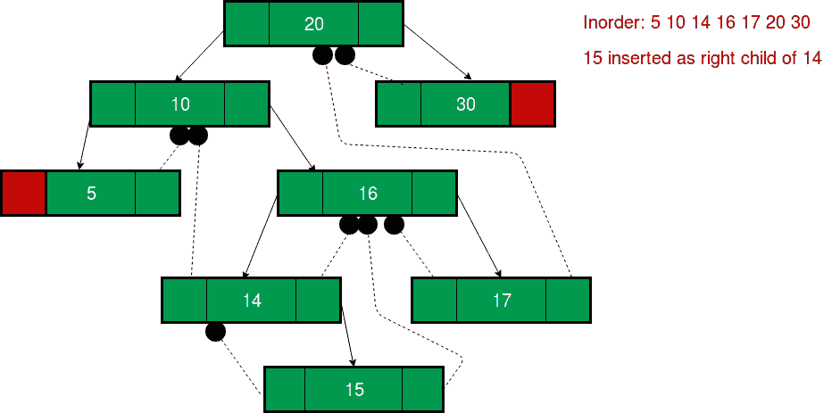

# 线程二叉树|插入

> 原文:[https://www . geeksforgeeks . org/threaded-二叉树-insert/](https://www.geeksforgeeks.org/threaded-binary-tree-insertion/)

我们已经讨论了[二进制线程二叉树](https://www.geeksforgeeks.org/threaded-binary-tree/)。
在二进制线程树中的插入类似于在二叉树中的插入，但是我们将不得不在插入每个元素之后调整线程。
二进制线程节点的 C 表示:

```
struct Node
{
  struct Node *left, *right;
  int info;

  // false if left pointer points to predecessor 
  // in Inorder Traversal
  boolean lthread; 

  // false if right pointer points to successor 
  // in Inorder Traversal
  boolean rthread; 
};
```

在下面的解释中，我们考虑了插入的[二叉查找树(BST)](https://www.geeksforgeeks.org/binary-search-tree-set-1-search-and-insertion/) ，因为插入是由 BST 中的一些规则定义的。
让 **tmp 成为新插入的节点**。插入时可以有三种情况:
**情况 1:空树插入**
tmp 的左右指针都会设置为 NULL，新节点成为根。

```
root = tmp;
tmp -> left = NULL;
tmp -> right = NULL;
```

**情况 2:当新节点作为左子节点**
插入时，在适当的位置插入节点后，我们必须使其左线程和右线程分别指向前序和后继。这个节点是[为了接班人](https://www.geeksforgeeks.org/inorder-successor-in-binary-search-tree/)。所以新节点的左右线程将会-

```
tmp -> left = par ->left;
tmp -> right = par;
```

在插入之前，父节点的左指针是一个线程，但是在插入之后，它将是指向新节点的链接。

```
par -> lthread = false;
par -> left = temp;
```

以下示例显示一个节点作为其父节点的左子节点插入。


插入 13 后，


14 的前身变成 13 的前身，所以 13 的左线指向 10。
13 的后继者是 14，所以 13 的右线指向 13 的左子。
14 的左指针现在不是线程，它指向 13 的左子。
**情况 3:当新节点作为右子节点插入时**
tmp 的父节点是其之前的父节点。父节点的后续节点现在是该节点 tmp 的后续节点。所以新节点的左右线程将会-

```
tmp -> left = par;
tmp -> right = par -> right;
```

在插入之前，父节点的右指针是一个线程，但是在插入之后，它将是指向新节点的链接。

```
par -> rthread = false;
par -> right = tmp;
```

以下示例显示了作为其父节点的右子节点插入的节点。


15 插入后，



14 的后继者成为 15 的后继者，所以 15 的右线程指向 16
15 的前身是 14，所以 15 的左线程指向 14。
14 的右指针现在不是线程，它指向 15 的右子。
**C++实现在 Threaded 二叉查找树中插入新节点:**
像[标准 BST 插入](https://www.geeksforgeeks.org/binary-search-tree-set-1-search-and-insertion/)一样，我们在树中搜索键值。如果键已经存在，那么我们返回，否则在搜索终止的地方插入新的键。在 BST 中，当我们找到键或者当我们到达空的左或右指针时，搜索终止。这里，除了第一个节点的左指针和最后一个节点的右指针之外，所有左和右空指针都被线程替换。因此，当我们到达空指针或线程时，这里的搜索将不成功。

## C++

```
// Insertion in Threaded Binary Search Tree.
#include<bits/stdc++.h>
using namespace std;

struct Node
{
    struct Node *left, *right;
    int info;

    // False if left pointer points to predecessor
    // in Inorder Traversal
    bool lthread;

    // False if right pointer points to successor
    // in Inorder Traversal
    bool rthread;
};

// Insert a Node in Binary Threaded Tree
struct Node *insert(struct Node *root, int ikey)
{
    // Searching for a Node with given value
    Node *ptr = root;
    Node *par = NULL; // Parent of key to be inserted
    while (ptr != NULL)
    {
        // If key already exists, return
        if (ikey == (ptr->info))
        {
            printf("Duplicate Key !\n");
            return root;
        }

        par = ptr; // Update parent pointer

        // Moving on left subtree.
        if (ikey < ptr->info)
        {
            if (ptr -> lthread == false)
                ptr = ptr -> left;
            else
                break;
        }

        // Moving on right subtree.
        else
        {
            if (ptr->rthread == false)
                ptr = ptr -> right;
            else
                break;
        }
    }

    // Create a new node
    Node *tmp = new Node;
    tmp -> info = ikey;
    tmp -> lthread = true;
    tmp -> rthread = true;

    if (par == NULL)
    {
        root = tmp;
        tmp -> left = NULL;
        tmp -> right = NULL;
    }
    else if (ikey < (par -> info))
    {
        tmp -> left = par -> left;
        tmp -> right = par;
        par -> lthread = false;
        par -> left = tmp;
    }
    else
    {
        tmp -> left = par;
        tmp -> right = par -> right;
        par -> rthread = false;
        par -> right = tmp;
    }

    return root;
}

// Returns inorder successor using rthread
struct Node *inorderSuccessor(struct Node *ptr)
{
    // If rthread is set, we can quickly find
    if (ptr -> rthread == true)
        return ptr->right;

    // Else return leftmost child of right subtree
    ptr = ptr -> right;
    while (ptr -> lthread == false)
        ptr = ptr -> left;
    return ptr;
}

// Printing the threaded tree
void inorder(struct Node *root)
{
    if (root == NULL)
        printf("Tree is empty");

    // Reach leftmost node
    struct Node *ptr = root;
    while (ptr -> lthread == false)
        ptr = ptr -> left;

    // One by one print successors
    while (ptr != NULL)
    {
        printf("%d ",ptr -> info);
        ptr = inorderSuccessor(ptr);
    }
}

// Driver Program
int main()
{
    struct Node *root = NULL;

    root = insert(root, 20);
    root = insert(root, 10);
    root = insert(root, 30);
    root = insert(root, 5);
    root = insert(root, 16);
    root = insert(root, 14);
    root = insert(root, 17);
    root = insert(root, 13);

    inorder(root);

    return 0;
}
```

## Java 语言(一种计算机语言，尤用于创建网站)

```
// Java program Insertion in Threaded Binary Search Tree.
import java.util.*;
class solution
{
static class Node
{
     Node left, right;
    int info;

    // False if left pointer points to predecessor
    // in Inorder Traversal
    boolean lthread;

    // False if right pointer points to successor
    // in Inorder Traversal
    boolean rthread;
};

// Insert a Node in Binary Threaded Tree
static Node insert( Node root, int ikey)
{
    // Searching for a Node with given value
    Node ptr = root;
    Node par = null; // Parent of key to be inserted
    while (ptr != null)
    {
        // If key already exists, return
        if (ikey == (ptr.info))
        {
            System.out.printf("Duplicate Key !\n");
            return root;
        }

        par = ptr; // Update parent pointer

        // Moving on left subtree.
        if (ikey < ptr.info)
        {
            if (ptr . lthread == false)
                ptr = ptr . left;
            else
                break;
        }

        // Moving on right subtree.
        else
        {
            if (ptr.rthread == false)
                ptr = ptr . right;
            else
                break;
        }
    }

    // Create a new node
    Node tmp = new Node();
    tmp . info = ikey;
    tmp . lthread = true;
    tmp . rthread = true;

    if (par == null)
    {
        root = tmp;
        tmp . left = null;
        tmp . right = null;
    }
    else if (ikey < (par . info))
    {
        tmp . left = par . left;
        tmp . right = par;
        par . lthread = false;
        par . left = tmp;
    }
    else
    {
        tmp . left = par;
        tmp . right = par . right;
        par . rthread = false;
        par . right = tmp;
    }

    return root;
}

// Returns inorder successor using rthread
static  Node inorderSuccessor( Node ptr)
{
    // If rthread is set, we can quickly find
    if (ptr . rthread == true)
        return ptr.right;

    // Else return leftmost child of right subtree
    ptr = ptr . right;
    while (ptr . lthread == false)
        ptr = ptr . left;
    return ptr;
}

// Printing the threaded tree
static void inorder( Node root)
{
    if (root == null)
        System.out.printf("Tree is empty");

    // Reach leftmost node
     Node ptr = root;
    while (ptr . lthread == false)
        ptr = ptr . left;

    // One by one print successors
    while (ptr != null)
    {
        System.out.printf("%d ",ptr . info);
        ptr = inorderSuccessor(ptr);
    }
}

// Driver Program
public static void main(String[] args)
{
     Node root = null;

    root = insert(root, 20);
    root = insert(root, 10);
    root = insert(root, 30);
    root = insert(root, 5);
    root = insert(root, 16);
    root = insert(root, 14);
    root = insert(root, 17);
    root = insert(root, 13);

    inorder(root);
} 
}
//contributed by Arnab Kundu
```

## 蟒蛇 3

```
# Insertion in Threaded Binary Search Tree.
class newNode:
    def __init__(self, key):

        # False if left pointer points to
        # predecessor in Inorder Traversal
        self.info = key
        self.left = None
        self.right =None
        self.lthread = True

        # False if right pointer points to
        # successor in Inorder Traversal
        self.rthread = True

# Insert a Node in Binary Threaded Tree
def insert(root, ikey):

    # Searching for a Node with given value
    ptr = root
    par = None # Parent of key to be inserted
    while ptr != None:

        # If key already exists, return
        if ikey == (ptr.info):
            print("Duplicate Key !")
            return root

        par = ptr # Update parent pointer

        # Moving on left subtree.
        if ikey < ptr.info:
            if ptr.lthread == False:
                ptr = ptr.left
            else:
                break

        # Moving on right subtree.
        else:
            if ptr.rthread == False:
                ptr = ptr.right
            else:
                break

    # Create a new node
    tmp = newNode(ikey)

    if par == None:
        root = tmp
        tmp.left = None
        tmp.right = None
    elif ikey < (par.info):
        tmp.left = par.left
        tmp.right = par
        par.lthread = False
        par.left = tmp
    else:
        tmp.left = par
        tmp.right = par.right
        par.rthread = False
        par.right = tmp

    return root

# Returns inorder successor using rthread
def inorderSuccessor(ptr):

    # If rthread is set, we can quickly find
    if ptr.rthread == True:
        return ptr.right

    # Else return leftmost child of
    # right subtree
    ptr = ptr.right
    while ptr.lthread == False:
        ptr = ptr.left
    return ptr

# Printing the threaded tree
def inorder(root):
    if root == None:
        print("Tree is empty")

    # Reach leftmost node
    ptr = root
    while ptr.lthread == False:
        ptr = ptr.left

    # One by one print successors
    while ptr != None:
        print(ptr.info,end=" ")
        ptr = inorderSuccessor(ptr)

# Driver Code
if __name__ == '__main__':
    root = None

    root = insert(root, 20)
    root = insert(root, 10)
    root = insert(root, 30)
    root = insert(root, 5)
    root = insert(root, 16)
    root = insert(root, 14)
    root = insert(root, 17)
    root = insert(root, 13)

    inorder(root)

# This code is contributed by PranchalK
```

## C#

```
using System;

// C# program Insertion in Threaded Binary Search Tree. 
public class solution
{
public class Node
{
     public Node left, right;
    public int info;

    // False if left pointer points to predecessor 
    // in Inorder Traversal 
    public bool lthread;

    // False if right pointer points to successor 
    // in Inorder Traversal 
    public bool rthread;
}

// Insert a Node in Binary Threaded Tree 
public static Node insert(Node root, int ikey)
{
    // Searching for a Node with given value 
    Node ptr = root;
    Node par = null; // Parent of key to be inserted
    while (ptr != null)
    {
        // If key already exists, return 
        if (ikey == (ptr.info))
        {
            Console.Write("Duplicate Key !\n");
            return root;
        }

        par = ptr; // Update parent pointer

        // Moving on left subtree. 
        if (ikey < ptr.info)
        {
            if (ptr.lthread == false)
            {
                ptr = ptr.left;
            }
            else
            {
                break;
            }
        }

        // Moving on right subtree. 
        else
        {
            if (ptr.rthread == false)
            {
                ptr = ptr.right;
            }
            else
            {
                break;
            }
        }
    }

    // Create a new node 
    Node tmp = new Node();
    tmp.info = ikey;
    tmp.lthread = true;
    tmp.rthread = true;

    if (par == null)
    {
        root = tmp;
        tmp.left = null;
        tmp.right = null;
    }
    else if (ikey < (par.info))
    {
        tmp.left = par.left;
        tmp.right = par;
        par.lthread = false;
        par.left = tmp;
    }
    else
    {
        tmp.left = par;
        tmp.right = par.right;
        par.rthread = false;
        par.right = tmp;
    }

    return root;
}

// Returns inorder successor using rthread 
public static Node inorderSuccessor(Node ptr)
{
    // If rthread is set, we can quickly find 
    if (ptr.rthread == true)
    {
        return ptr.right;
    }

    // Else return leftmost child of right subtree 
    ptr = ptr.right;
    while (ptr.lthread == false)
    {
        ptr = ptr.left;
    }
    return ptr;
}

// Printing the threaded tree 
public static void inorder(Node root)
{
    if (root == null)
    {
        Console.Write("Tree is empty");
    }

    // Reach leftmost node 
     Node ptr = root;
    while (ptr.lthread == false)
    {
        ptr = ptr.left;
    }

    // One by one print successors 
    while (ptr != null)
    {
        Console.Write("{0:D} ",ptr.info);
        ptr = inorderSuccessor(ptr);
    }
}

// Driver Program 
public static void Main(string[] args)
{
     Node root = null;

    root = insert(root, 20);
    root = insert(root, 10);
    root = insert(root, 30);
    root = insert(root, 5);
    root = insert(root, 16);
    root = insert(root, 14);
    root = insert(root, 17);
    root = insert(root, 13);

    inorder(root);
}
}

  // This code is contributed by Shrikant13
```

## java 描述语言

```
<script>
// javascript program Insertion in Threaded Binary Search Tree.
     class Node {
     constructor(){
this.left = null, this.right = null;
        this.info = 0;

        // False if left pointer points to predecessor
        // in Inorder Traversal
        this.lthread = false;

        // False if right pointer points to successor
        // in Inorder Traversal
        this.rthread = false;
    }
    }

    // Insert a Node in Binary Threaded Tree
    function insert(root , ikey) {
        // Searching for a Node with given value
var ptr = root;
var par = null; // Parent of key to be inserted
        while (ptr != null) {
            // If key already exists, return
            if (ikey == (ptr.info)) {
                document.write("Duplicate Key !\n");
                return root;
            }

            par = ptr; // Update parent pointer

            // Moving on left subtree.
            if (ikey < ptr.info) {
                if (ptr.lthread == false)
                    ptr = ptr.left;
                else
                    break;
            }

            // Moving on right subtree.
            else {
                if (ptr.rthread == false)
                    ptr = ptr.right;
                else
                    break;
            }
        }

        // Create a new node
var tmp = new Node();
        tmp.info = ikey;
        tmp.lthread = true;
        tmp.rthread = true;

        if (par == null) {
            root = tmp;
            tmp.left = null;
            tmp.right = null;
        } else if (ikey < (par.info)) {
            tmp.left = par.left;
            tmp.right = par;
            par.lthread = false;
            par.left = tmp;
        } else {
            tmp.left = par;
            tmp.right = par.right;
            par.rthread = false;
            par.right = tmp;
        }

        return root;
    }

    // Returns inorder successor using rthread
    function inorderSuccessor(ptr) {
        // If rthread is set, we can quickly find
        if (ptr.rthread == true)
            return ptr.right;

        // Else return leftmost child of right subtree
        ptr = ptr.right;
        while (ptr.lthread == false)
            ptr = ptr.left;
        return ptr;
    }

    // Printing the threaded tree
    function inorder(root) {
        if (root == null)
            document.write("Tree is empty");

        // Reach leftmost node
var ptr = root;
        while (ptr.lthread == false)
            ptr = ptr.left;

        // One by one print successors
        while (ptr != null) {
            document.write(ptr.info+" ");
            ptr = inorderSuccessor(ptr);
        }
    }

    // Driver Program

var root = null;

        root = insert(root, 20);
        root = insert(root, 10);
        root = insert(root, 30);
        root = insert(root, 5);
        root = insert(root, 16);
        root = insert(root, 14);
        root = insert(root, 17);
        root = insert(root, 13);

        inorder(root);

// This code contributed by aashish1995
</script>
```

**Output**

```
5 10 13 14 16 17 20 30 
```

本文由 [**Anuj Chauhan**](https://www.facebook.com/anuj0503) 供稿。如果你喜欢 GeeksforGeeks 并想投稿，你也可以使用[write.geeksforgeeks.org](https://write.geeksforgeeks.org)写一篇文章或者把你的文章邮寄到 review-team@geeksforgeeks.org。看到你的文章出现在极客博客主页上，帮助其他极客。
如果发现有不正确的地方，或者想分享更多关于上述话题的信息，请写评论。