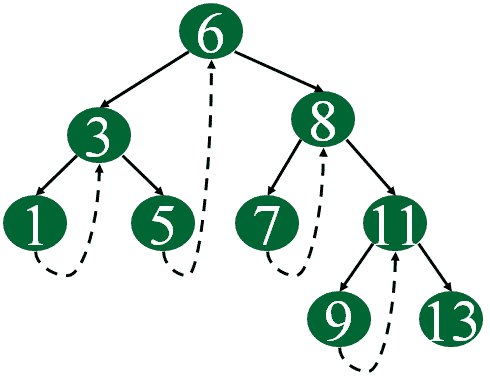
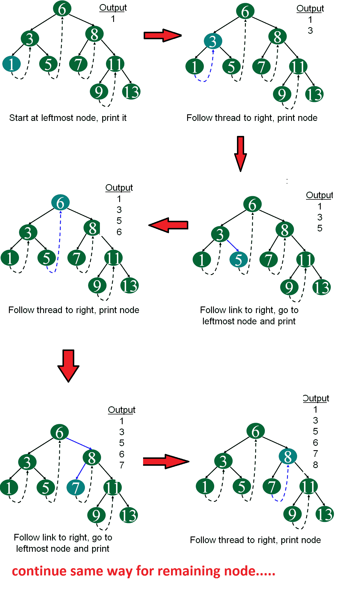

# 线程二叉树

> 原文:[https://www.geeksforgeeks.org/threaded-binary-tree/](https://www.geeksforgeeks.org/threaded-binary-tree/)

[二叉树的有序遍历](https://www.geeksforgeeks.org/618/)可以使用递归来完成，也可以使用辅助栈来完成[。线程二叉树的思想是使有序遍历更快，并且不需要堆栈和递归。通过使所有正常情况下为空的右子指针指向节点的下一个后继节点(如果存在的话)，二叉树被线程化。
线程二叉树有两种类型。
***单线程:*** 其中空右指针指向顺序后继(如果后继存在)
***双线程:*** 其中左和右空指针分别指向顺序前置和顺序后继。前置线程对于反向顺序遍历和后置顺序遍历非常有用。
线程对于快速访问节点的祖先也很有用。
下图显示了一个单线程二叉树的例子。虚线代表螺纹。](https://www.geeksforgeeks.org/inorder-tree-traversal-without-recursion/)



**一个线程节点的 C 表示**
下面是一个单线程节点的 C 表示。

## C

```
struct Node
{
    int data;
    struct Node *left, *right;
    bool rightThread; 
}
```

**线程节点的 Java 表示**

下面是单线程节点的 Java 表示。

## Java 语言(一种计算机语言，尤用于创建网站)

```
static class Node
{
    int data;
    Node left, right;
    boolean rightThread; 
}

// This code contributed by aashish1995
```

## 蟒蛇 3

```
class Node:
    def __init__(self, data,rightThread):
        self.data = data;
        self.left = None;
        self.right = None;
        self.rightThread = rightThread;

# This code is contributed by umadevi9616
```

## C#

```
public class Node
{
   public int data;
   public Node left, right;
   public bool rightThread; 
}

// This code is contributed by aashish1995
```

## java 描述语言

```
<script>
 class Node {
        constructor(val) {
            this.data = val;
            this.left = null;
            this.right = null;
            this.rightThread = false;
        }
    }

// This code contributed by aashish1995
</script>
```

由于右指针有两个用途，布尔变量 rightThread 用于指示右指针是指向右子还是右后继。同样，我们可以为一个双线程二叉树添加 leftThread。
**使用线程的有序遍历**
下面是线程二叉树中有序遍历的代码。

## C

```
// Utility function to find leftmost node in a tree rooted
// with n
struct Node* leftMost(struct Node* n)
{
    if (n == NULL)
        return NULL;

    while (n->left != NULL)
        n = n->left;

    return n;
}

// C code to do inorder traversal in a threaded binary tree
void inOrder(struct Node* root)
{
    struct Node* cur = leftMost(root);
    while (cur != NULL) {
        printf("%d ", cur->data);

        // If this node is a thread node, then go to
        // inorder successor
        if (cur->rightThread)
            cur = cur->right;
        else // Else go to the leftmost child in right
             // subtree
            cur = leftmost(cur->right);
    }
}
```

## Java 语言(一种计算机语言，尤用于创建网站)

```
// Utility function to find leftmost node in a tree rooted
// with n
Node leftMost(Node n)
{
    if (n == null)
        return null;

    while (n.left != null)
        n = n.left;

    return n;
}

// C code to do inorder traversal in a threaded binary tree
static void inOrder(Node root)
{
    Node cur = leftMost(root);
    while (cur != null) {
        System.out.printf("%d ", cur.data);

        // If this node is a thread node, then go to
        // inorder successor
        if (cur.rightThread)
            cur = cur.right;
        else // Else go to the leftmost child in right
             // subtree
            cur = leftmost(cur.right);
    }
}

// This code contributed by aashish1995
```

## 蟒蛇 3

```
# Utility function to find leftmost Node in a tree rooted
# with n
def leftMost(n):

    if (n == None):
        return None;

    while (n.left != None):
        n = n.left;

    return n;

# C code to do inorder traversal in a threaded binary tree
def inOrder(root):

    cur = leftMost(root);
    while (cur != None):
        print(cur.data," ");

        # If this Node is a thread Node, then go to
        # inorder successor
        if (cur.rightThread):
            cur = cur.right;
        else: # Else go to the leftmost child in right
             # subtree
            cur = leftmost(cur.right);

# This code is contributed by Rajput-Ji
```

## C#

```
// Utility function to find leftmost node in a tree rooted
// with n
Node leftMost(Node n)
{
  if (n == null)
    return null;

  while (n.left != null)
    n = n.left;

  return n;
}

// C code to do inorder traversal in a threaded binary tree
static void inOrder(Node root)
{
  Node cur = leftMost(root);
  while (cur != null)
  {
    Console.Write("{0} ", cur.data);

    // If this node is a thread node, then go to
    // inorder successor
    if (cur.rightThread)
      cur = cur.right;
    else // Else go to the leftmost child in right
      // subtree
      cur = leftmost(cur.right);
  }
}

// This code is contributed by gauravrajput1
```

## java 描述语言

```
<script>

// Utility function to find leftmost node in a tree rooted
// with n
function leftMost(n)
{
    if (n == null)
        return null;

    while (n.left != null)
        n = n.left;

    return n;
}

// JavaScript code to do inorder traversal in
// a threaded binary tree
function inOrder(root)
{
    let cur = leftMost(root);
    while (cur != null) {
        document.write(cur.data+" ");

        // If this node is a thread node, then go to
        // inorder successor
        if (cur.rightThread)
            cur = cur.right;
        else // Else go to the leftmost child in right
             // subtree
            cur = leftmost(cur.right);
        }
}

// This code is contributed by unknown2108

</script>
```

下图演示了使用线程的有序遍历。



我们将很快讨论线程二叉树中的插入和删除。
**来源:**
[【http://en.wikipedia.org/wiki/Threaded_binary_tree】](http://en.wikipedia.org/wiki/Threaded_binary_tree)
[【www.cs.berkeley.edu/~kamil/teaching/su02/080802.ppt】](http://www.cs.berkeley.edu/~kamil/teaching/su02/080802.ppt)
如发现任何不正确的地方，或想分享更多关于以上讨论话题的信息，请写评论