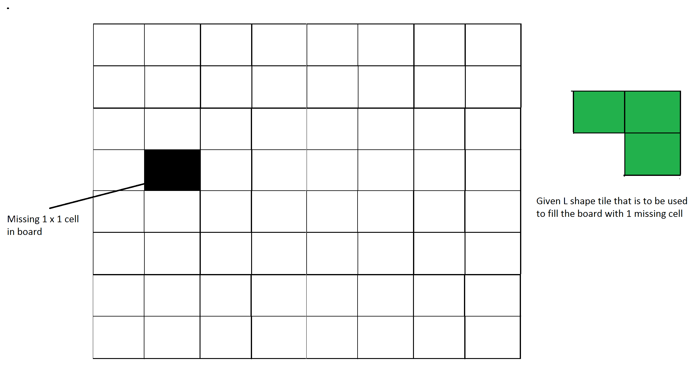
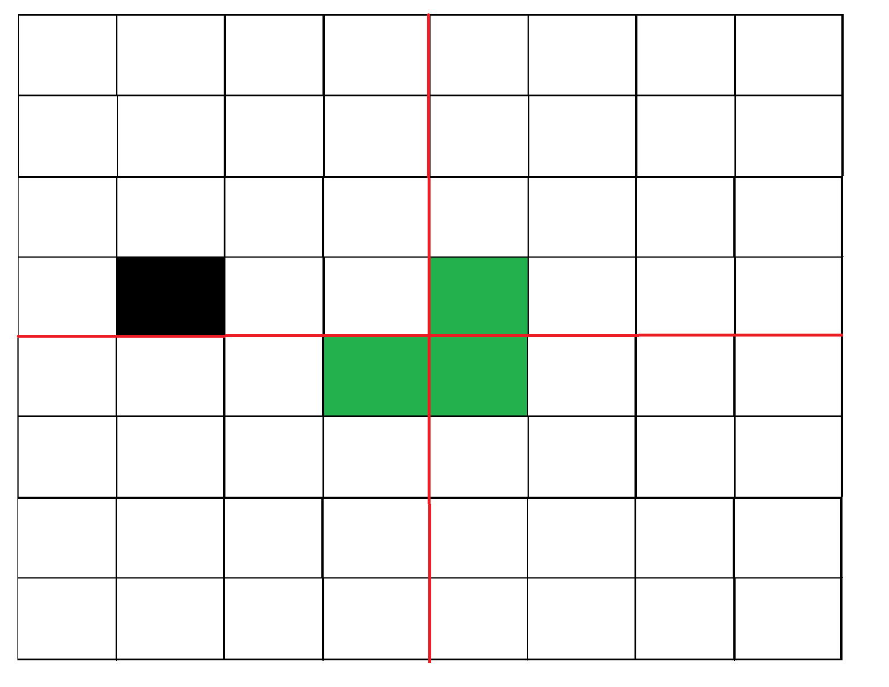
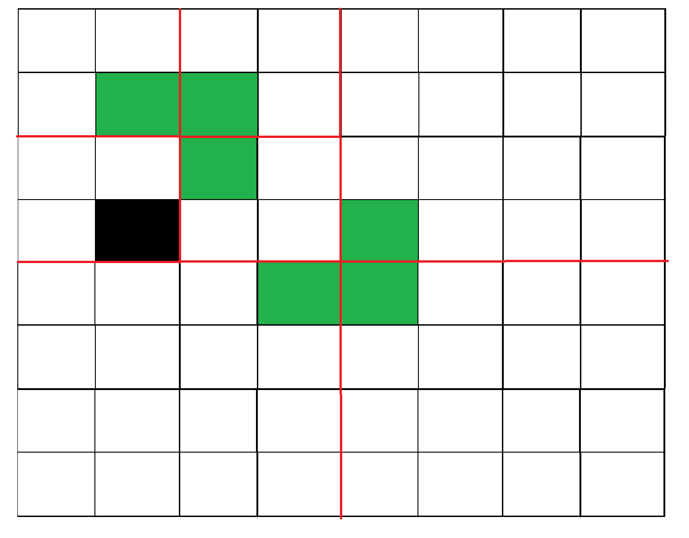
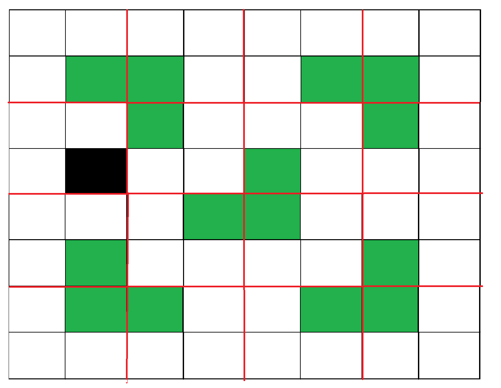

# 使用分治算法的平铺问题

> 原文:[https://www . geesforgeks . org/tiling-问题-使用分治算法/](https://www.geeksforgeeks.org/tiling-problem-using-divide-and-conquer-algorithm/)

给定一个 n 乘 n 的板，其中 n 的形式为 2 <sup>k</sup> ，其中 k > = 1(基本上 n 是 2 的幂，最小值为 2)。该板缺少一个单元(大小为 1 x 1)。用 L 形瓷砖填充木板。L 形瓷砖是一个 2×2 的正方形，缺少一个 1×1 大小的单元。



图 1:示例输入
这个问题可以用分治法解决。下面是递归算法。

```
// n is size of given square, p is location of missing cell
Tile(int n, Point p)

1) Base case: n = 2, A 2 x 2 square with one cell missing is nothing 
   but a tile and can be filled with a single tile.

2) Place a L shaped tile at the center such that it does not cover
   the n/2 * n/2 subsquare that has a missing square. Now all four 
 subsquares of size n/2 x n/2 have a missing cell (a cell that doesn't
   need to be filled).  See figure 2 below.

3) Solve the problem recursively for following four. Let p1, p2, p3 and
   p4 be positions of the 4 missing cells in 4 squares.
   a) Tile(n/2, p1)
   b) Tile(n/2, p2)
   c) Tile(n/2, p3)
   d) Tile(n/2, p3)
```

下图显示了上述算法的工作情况



图 2:放置第一块瓷砖后



图 3:第一个子方块的循环。



图 4:显示了所有四个子方块的第一步。

**例:**

```
Input :  size = 2 and mark coordinates = (0, 0)
Output : 
-1      1
1       1
Coordinate (0, 0) is marked. So, no tile is there. In the remaining three positions, 
a tile is placed with its number as 1.
Input : size = 4 and mark coordinates = (0, 0)
Output :
-1      3       2       2
3       3       1       2
4       1       1       5
4       4       5       5
```

以下是上述想法的实现:

## C++

```
// C++ program to place tiles
#include <bits/stdc++.h>
using namespace std;

int size_of_grid, b, a, cnt = 0;
int arr[128][128];

// Placing tile at the given coordinates
void place(int x1, int y1, int x2,
           int y2, int x3, int y3)
{
    cnt++;
    arr[x1][y1] = cnt;
    arr[x2][y2] = cnt;
    arr[x3][y3] = cnt;
}
// Quadrant names
// 1   2
// 3   4

// Function based on divide and conquer
int tile(int n, int x, int y)
{
    int r, c;
    if (n == 2) {
        cnt++;
        for (int i = 0; i < n; i++) {
            for (int j = 0; j < n; j++) {
                if (arr[x + i][y + j] == 0) {
                    arr[x + i][y + j] = cnt;
                }
            }
        }
        return 0;
    }
    // finding hole location
    for (int i = x; i < x + n; i++) {
        for (int j = y; j < y + n; j++) {
            if (arr[i][j] != 0)
                r = i, c = j;
        }
    }

    // If missing tile is 1st quadrant
    if (r < x + n / 2 && c < y + n / 2)
        place(x + n / 2, y + (n / 2) - 1, x + n / 2,
              y + n / 2, x + n / 2 - 1, y + n / 2);

    // If missing Tile is in 3rd quadrant
    else if (r >= x + n / 2 && c < y + n / 2)
        place(x + (n / 2) - 1, y + (n / 2), x + (n / 2),
              y + n / 2, x + (n / 2) - 1, y + (n / 2) - 1);

    // If missing Tile is in 2nd quadrant
    else if (r < x + n / 2 && c >= y + n / 2)
        place(x + n / 2, y + (n / 2) - 1, x + n / 2,
              y + n / 2, x + n / 2 - 1, y + n / 2 - 1);

    // If missing Tile is in 4th quadrant
    else if (r >= x + n / 2 && c >= y + n / 2)
        place(x + (n / 2) - 1, y + (n / 2), x + (n / 2),
              y + (n / 2) - 1, x + (n / 2) - 1,
              y + (n / 2) - 1);

    // dividing it again in 4 quadrants
    tile(n / 2, x, y + n / 2);
    tile(n / 2, x, y);
    tile(n / 2, x + n / 2, y);
    tile(n / 2, x + n / 2, y + n / 2);

    return 0;
}
// Driver program to test above function
int main()
{
    // size of box
    size_of_grid = 8;
    memset(arr, 0, sizeof(arr));
    // Coordinates which will be marked
    a = 0, b = 0;
    // Here tile can not be placed
    arr[a][b] = -1;
    tile(size_of_grid, 0, 0);
    // The grid is
    for (int i = 0; i < size_of_grid; i++) {
        for (int j = 0; j < size_of_grid; j++)
            cout << arr[i][j] << " \t";
        cout << "\n";
    }
}
```

## Java 语言(一种计算机语言，尤用于创建网站)

```
// Java program to place tiles
public class GFG
{
  static int size_of_grid, b, a, cnt = 0;
  static int[][] arr = new int[128][128];

  // Placing tile at the given coordinates
  static void place(int x1, int y1, int x2,
                    int y2, int x3, int y3)
  {
    cnt++;
    arr[x1][y1] = cnt;
    arr[x2][y2] = cnt;
    arr[x3][y3] = cnt;
  }
  // Quadrant names
  // 1   2
  // 3   4

  // Function based on divide and conquer
  static int tile(int n, int x, int y)
  {
    int r = 0, c = 0;
    if (n == 2)
    {
      cnt++;
      for (int i = 0; i < n; i++)
      {
        for (int j = 0; j < n; j++)
        {
          if (arr[x + i][y + j] == 0)
          {
            arr[x + i][y + j] = cnt;
          }
        }
      }
      return 0;
    }

    // finding hole location
    for (int i = x; i < x + n; i++)
    {
      for (int j = y; j < y + n; j++)
      {
        if (arr[i][j] != 0)
        {
          r = i;
          c = j;
        }

      }
    }

    // If missing tile is 1st quadrant
    if (r < x + n / 2 && c < y + n / 2)
      place(x + n / 2, y + (n / 2) - 1, x + n / 2,
            y + n / 2, x + n / 2 - 1, y + n / 2);

    // If missing Tile is in 3rd quadrant
    else if (r >= x + n / 2 && c < y + n / 2)
      place(x + (n / 2) - 1, y + (n / 2), x + (n / 2),
            y + n / 2, x + (n / 2) - 1, y + (n / 2) - 1);

    // If missing Tile is in 2nd quadrant
    else if (r < x + n / 2 && c >= y + n / 2)
      place(x + n / 2, y + (n / 2) - 1, x + n / 2,
            y + n / 2, x + n / 2 - 1, y + n / 2 - 1);

    // If missing Tile is in 4th quadrant
    else if (r >= x + n / 2 && c >= y + n / 2)
      place(x + (n / 2) - 1, y + (n / 2), x + (n / 2),
            y + (n / 2) - 1, x + (n / 2) - 1,
            y + (n / 2) - 1);

    // dividing it again in 4 quadrants
    tile(n / 2, x, y + n / 2);
    tile(n / 2, x, y);
    tile(n / 2, x + n / 2, y);
    tile(n / 2, x + n / 2, y + n / 2); 
    return 0;
  }

  // Driver code
  public static void main(String[] args)
  {

    // size of box
    size_of_grid = 8;

    // Coordinates which will be marked
    a = 0; b = 0;

    // Here tile can not be placed
    arr[a][b] = -1;
    tile(size_of_grid, 0, 0);

    // The grid is
    for (int i = 0; i < size_of_grid; i++)
    {
      for (int j = 0; j < size_of_grid; j++)
        System.out.print(arr[i][j] + " ");
      System.out.println();;
    }
  }
}

// This code is contributed by divyeshrabadiya07.
```

## C#

```
// C# program to place tiles
using System;
class GFG
{

    static int size_of_grid, b, a, cnt = 0;
    static int[,] arr = new int[128, 128];

    // Placing tile at the given coordinates
    static void place(int x1, int y1, int x2,
               int y2, int x3, int y3)
    {
        cnt++;
        arr[x1, y1] = cnt;
        arr[x2, y2] = cnt;
        arr[x3, y3] = cnt;
    }
    // Quadrant names
    // 1   2
    // 3   4

    // Function based on divide and conquer
    static int tile(int n, int x, int y)
    {
        int r = 0, c = 0;
        if (n == 2)
        {
            cnt++;
            for (int i = 0; i < n; i++)
            {
                for (int j = 0; j < n; j++)
                {
                    if (arr[x + i, y + j] == 0)
                    {
                        arr[x + i, y + j] = cnt;
                    }
                }
            }
            return 0;
        }

        // finding hole location
        for (int i = x; i < x + n; i++)
        {
            for (int j = y; j < y + n; j++)
            {
                if (arr[i, j] != 0)
                {
                    r = i;
                    c = j;
                }

            }
        }

        // If missing tile is 1st quadrant
        if (r < x + n / 2 && c < y + n / 2)
            place(x + n / 2, y + (n / 2) - 1, x + n / 2,
                  y + n / 2, x + n / 2 - 1, y + n / 2);

        // If missing Tile is in 3rd quadrant
        else if (r >= x + n / 2 && c < y + n / 2)
            place(x + (n / 2) - 1, y + (n / 2), x + (n / 2),
                  y + n / 2, x + (n / 2) - 1, y + (n / 2) - 1);

        // If missing Tile is in 2nd quadrant
        else if (r < x + n / 2 && c >= y + n / 2)
            place(x + n / 2, y + (n / 2) - 1, x + n / 2,
                  y + n / 2, x + n / 2 - 1, y + n / 2 - 1);

        // If missing Tile is in 4th quadrant
        else if (r >= x + n / 2 && c >= y + n / 2)
            place(x + (n / 2) - 1, y + (n / 2), x + (n / 2),
                  y + (n / 2) - 1, x + (n / 2) - 1,
                  y + (n / 2) - 1);

        // dividing it again in 4 quadrants
        tile(n / 2, x, y + n / 2);
        tile(n / 2, x, y);
        tile(n / 2, x + n / 2, y);
        tile(n / 2, x + n / 2, y + n / 2); 
        return 0;
    }

  // Driver code
  static void Main()
  {

    // size of box
    size_of_grid = 8;

    // Coordinates which will be marked
    a = 0; b = 0;

    // Here tile can not be placed
    arr[a, b] = -1;
    tile(size_of_grid, 0, 0);

    // The grid is
    for (int i = 0; i < size_of_grid; i++)
    {
        for (int j = 0; j < size_of_grid; j++)
            Console.Write(arr[i,j] + " ");
        Console.WriteLine();
    }
  }
}

// This code is contributed by divyesh072019.
```

## 蟒蛇 3

```
# Python3 program to place tiles
size_of_grid = 0
b = 0
a = 0
cnt = 0
arr = [[0 for i in range(128)] for j in range(128)]

def place(x1, y1, x2, y2, x3, y3):
    global cnt
    cnt += 1
    arr[x1][y1] = cnt;
    arr[x2][y2] = cnt;
    arr[x3][y3] = cnt;

def tile(n, x, y):
    global cnt
    r = 0
    c = 0
    if (n == 2):
        cnt += 1
        for i in range(n):
            for j in range(n):
                if(arr[x + i][y + j] == 0):
                    arr[x + i][y + j] = cnt
        return 0;   
    for i in range(x, x + n):
        for j in range(y, y + n):
            if (arr[i][j] != 0):
                r = i
                c = j 
    if (r < x + n / 2 and c < y + n / 2):
        place(x + int(n / 2), y + int(n / 2) - 1, x + int(n / 2), y + int(n / 2), x + int(n / 2) - 1, y + int(n / 2))

    elif(r >= x + int(n / 2) and c < y + int(n / 2)):
        place(x + int(n / 2) - 1, y + int(n / 2), x + int(n / 2), y + int(n / 2), x + int(n / 2) - 1, y + int(n / 2) - 1)

    elif(r < x + int(n / 2) and c >= y + int(n / 2)):
        place(x + int(n / 2), y + int(n / 2) - 1, x + int(n / 2), y + int(n / 2), x + int(n / 2) - 1, y + int(n / 2) - 1)

    elif(r >= x + int(n / 2) and c >= y + int(n / 2)):
        place(x + int(n / 2) - 1, y + int(n / 2), x + int(n / 2), y + int(n / 2) - 1, x + int(n / 2) - 1, y + int(n / 2) - 1)

    tile(int(n / 2), x, y + int(n / 2));
    tile(int(n / 2), x, y);
    tile(int(n / 2), x + int(n / 2), y);
    tile(int(n / 2), x + int(n / 2), y + int(n / 2));

    return 0

size_of_grid = 8
a = 0
b = 0
arr[a][b] = -1
tile(size_of_grid, 0, 0)

for i in range(size_of_grid):
    for j in range(size_of_grid):
        print(arr[i][j], end=" ")
    print()

# This code is contributed by rag2127
```

## java 描述语言

```
<script>

// Javascript program to place tiles
var size_of_grid, b, a, cnt = 0;
var arr = Array.from(Array(128), ()=>Array(128).fill(0));

// Placing tile at the given coordinates
function place(x1, y1, x2, y2, x3, y3)
{
    cnt++;
    arr[x1][y1] = cnt;
    arr[x2][y2] = cnt;
    arr[x3][y3] = cnt;
}

// Quadrant names
// 1   2
// 3   4

// Function based on divide and conquer
function tile(n, x, y)
{
    var r, c;
    if (n == 2) {
        cnt++;
        for (var i = 0; i < n; i++) {
            for (var j = 0; j < n; j++) {
                if (arr[x + i][y + j] == 0) {
                    arr[x + i][y + j] = cnt;
                }
            }
        }
        return 0;
    }
    // finding hole location
    for (var i = x; i < x + n; i++) {
        for (var j = y; j < y + n; j++) {
            if (arr[i][j] != 0)
                r = i, c = j;
        }
    }

    // If missing tile is 1st quadrant
    if (r < x + n / 2 && c < y + n / 2)
        place(x + n / 2, y + (n / 2) - 1, x + n / 2,
              y + n / 2, x + n / 2 - 1, y + n / 2);

    // If missing Tile is in 3rd quadrant
    else if (r >= x + n / 2 && c < y + n / 2)
        place(x + (n / 2) - 1, y + (n / 2), x + (n / 2),
              y + n / 2, x + (n / 2) - 1, y + (n / 2) - 1);

    // If missing Tile is in 2nd quadrant
    else if (r < x + n / 2 && c >= y + n / 2)
        place(x + n / 2, y + (n / 2) - 1, x + n / 2,
              y + n / 2, x + n / 2 - 1, y + n / 2 - 1);

    // If missing Tile is in 4th quadrant
    else if (r >= x + n / 2 && c >= y + n / 2)
        place(x + (n / 2) - 1, y + (n / 2), x + (n / 2),
              y + (n / 2) - 1, x + (n / 2) - 1,
              y + (n / 2) - 1);

    // dividing it again in 4 quadrants
    tile(n / 2, x, y + n / 2);
    tile(n / 2, x, y);
    tile(n / 2, x + n / 2, y);
    tile(n / 2, x + n / 2, y + n / 2);

    return 0;
}

// Driver program to test above function
// size of box
size_of_grid = 8;

// Coordinates which will be marked
a = 0, b = 0;

// Here tile can not be placed
arr[a][b] = -1;
tile(size_of_grid, 0, 0);

// The grid is
for (var i = 0; i < size_of_grid; i++) {
    for (var j = 0; j < size_of_grid; j++)
        document.write(arr[i][j] + "   ");
    document.write("<br>");
}

// This code is contributed by rutvik_56.
</script>
```

**Output**

```
-1     9     8     8     4     4     3     3     
9     9     7     8     4     2     2     3     
10     7     7     11     5     5     2     6     
10     10     11     11     1     5     6     6     
14     14     13     1     1     19     18     18     
14     12     13     13     19     19     17     18     
15     12     12     16     20     17     17     21     
15     15     16     16     20     20     21     21     
```

**时间复杂度:**
上述递归算法的递归关系可以写成如下。c 是一个常数。
T(n) = 4T(n/2) + C
以上递归可以用[主方法](https://www.geeksforgeeks.org/analysis-algorithm-set-4-master-method-solving-recurrences/)求解，时间复杂度为 O(n <sup>2</sup>

**这是如何工作的？**
使用数学归纳法可以证明分治算法的工作原理。让输入方块的大小为 2 <sup>k</sup> x 2 <sup>k</sup> ，其中 k > =1。
基本情况:我们知道对于 k = 1 问题是可以解决的。我们有一个 2×2 的正方形，少了一个单元格。
归纳假设:让问题可以为 k-1 解决。
现在我们需要证明的是，如果问题对于 k-1 可以解，那么对于 k 可以解。对于 k，我们在中间放置一个 L 形瓷砖，我们有四个子曲面，尺寸为 2 <sup>k-1</sup> x 2 <sup>k-1</sup> ，如上图 2 所示。所以如果我们能解 4 个子正方形，我们就能解完整的正方形。

**参考文献:**
http://www.comp.nus.edu.sg/~sanjay/cs3230/dandc.pdf
本文由**阿沛·拉提**供稿。如果你发现任何不正确的地方，或者你想分享更多关于上面讨论的话题的信息，请写评论。