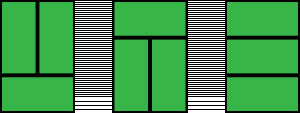
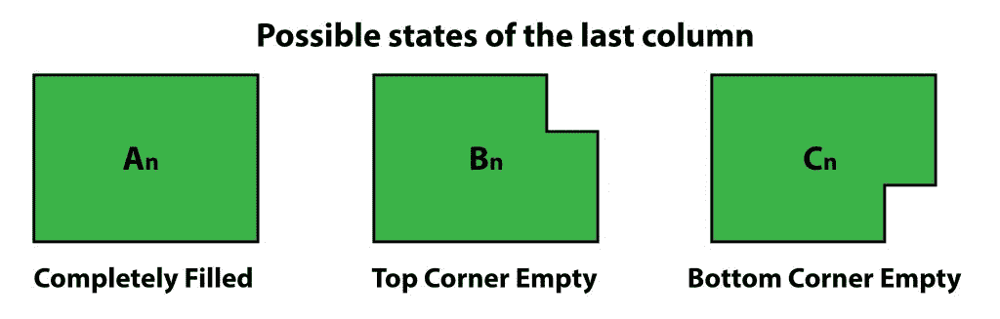
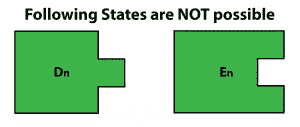
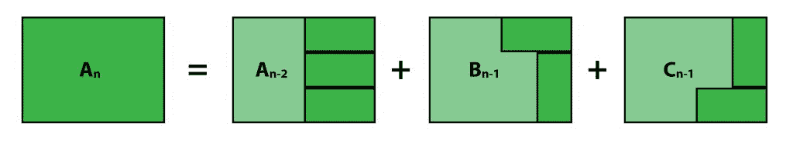
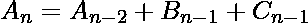
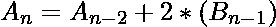
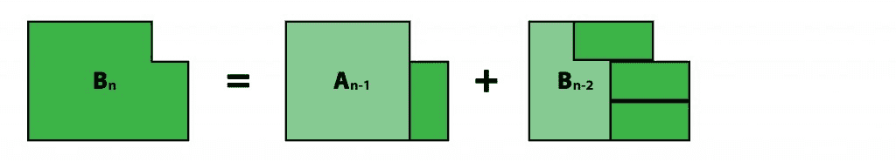
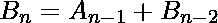

# 用骨牌平铺

> 原文:[https://www.geeksforgeeks.org/tiling-with-dominoes/](https://www.geeksforgeeks.org/tiling-with-dominoes/)

给定一块*3×n*的板子，找出用*2×1*多米诺骨牌填充的方法。
***例 1***
以下是所有 **3** 可能的方法来填充一个**3×2**板。



***例 2***
这里有一种可能的填充 3×8 板的方法。你必须找到所有可能的方法。


**例:**

```
Input : 2
Output : 3

Input : 8
Output : 153

Input : 12
Output : 2131
```

**定义子问题:**
在填充板的任何时候，最后一列可能处于三种状态:



```
An =  No. of ways to completely fill a 3 x n board. *(We need to find this)*
Bn =  No. of ways to fill a 3 x n board with top corner in last column not filled.
Cn =  No. of ways to fill a 3 x n board with bottom corner in last column not filled.
```

**注意:**以下状态无法到达:



**寻找 Reccurences**
**注:**即使 **Bn** 和 **Cn** 是不同的状态，但对于相同的 **'n'** 它们将是相等的。*即* **Bn = Cn**
因此，我们只需要计算其中的一个。
**计算安:**





**计算 Bn:**




**最终递归关系为:**

**基本情况:**

## C++

```
// C++ program to find no. of ways
// to fill a 3xn board with 2x1 dominoes.
#include <iostream>
using namespace std;

int countWays(int n)
{
    int A[n + 1], B[n + 1];
    A[0] = 1, A[1] = 0, B[0] = 0, B[1] = 1;
    for (int i = 2; i <= n; i++) {
        A[i] = A[i - 2] + 2 * B[i - 1];
        B[i] = A[i - 1] + B[i - 2];
    }

    return A[n];
}

int main()
{
    int n = 8;
    cout << countWays(n);
    return 0;
}
```

## Java 语言(一种计算机语言，尤用于创建网站)

```
// Java program to find no. of ways
// to fill a 3xn board with 2x1 dominoes.
import java.io.*;

class GFG {

    static int countWays(int n)
    {
        int []A = new int[n+1];
        int []B = new int[n+1];
        A[0] = 1; A[1] = 0;
        B[0] = 0; B[1] = 1;
        for (int i = 2; i <= n; i++)
        {
            A[i] = A[i - 2] + 2 * B[i - 1];
            B[i] = A[i - 1] + B[i - 2];
        }

        return A[n];
    }

    // Driver code
    public static void main (String[] args)
    {
        int n = 8;
        System.out.println(countWays(n));
    }
}

// This code is contributed by anuj_67.
```

## 蟒蛇 3

```
# Python 3 program to find no. of ways
# to fill a 3xn board with 2x1 dominoes.

def countWays(n):

    A = [0] * (n + 1)
    B = [0] * (n + 1)
    A[0] = 1
    A[1] = 0
    B[0] = 0
    B[1] = 1
    for i in range(2, n+1):
        A[i] = A[i - 2] + 2 * B[i - 1]
        B[i] = A[i - 1] + B[i - 2]

    return A[n]

n = 8
print(countWays(n))

# This code is contributed by Smitha
```

## C#

```
// C# program to find no. of ways
// to fill a 3xn board with 2x1 dominoes.
using System;

class GFG {

    static int countWays(int n)
    {
        int []A = new int[n+1];
        int []B = new int[n+1];
        A[0] = 1; A[1] = 0;
        B[0] = 0; B[1] = 1;
        for (int i = 2; i <= n; i++)
        {
            A[i] = A[i - 2] + 2 * B[i - 1];
            B[i] = A[i - 1] + B[i - 2];
        }

        return A[n];
    }

    // Driver code
    public static void Main ()
    {
        int n = 8;
        Console.WriteLine(countWays(n));
    }
}

// This code is contributed by anuj_67.
```

## java 描述语言

```
<script>
    // Javascript program to find no. of ways
    // to fill a 3xn board with 2x1 dominoes.

    function countWays(n)
    {
        let A = new Array(n+1);
        let B = new Array(n+1);
        A[0] = 1; A[1] = 0;
        B[0] = 0; B[1] = 1;
        for (let i = 2; i <= n; i++)
        {
            A[i] = A[i - 2] + 2 * B[i - 1];
            B[i] = A[i - 1] + B[i - 2];
        }

        return A[n];
    }

    let n = 8;
      document.write(countWays(n));

    // This code is contributed by rameshtravel07.
</script>
```

## 服务器端编程语言（Professional Hypertext Preprocessor 的缩写）

```
<?php
// PHP program to find no. of ways
// to fill a 3xn board with 2x1 dominoes.

function countWays($n)
{
    $A = array();
    $B = array();
    $A[0] = 1; $A[1] = 0;
    $B[0] = 0; $B[1] = 1;
    for ( $i = 2; $i <= $n; $i++)
    {
        $A[$i] = $A[$i - 2] + 2 *
                 $B[$i - 1];
        $B[$i] = $A[$i - 1] +
                 $B[$i - 2];
    }

    return $A[$n];
}

// Driver Code
$n = 8;
echo countWays($n);

// This code is contributed by anuj_67.
?>
```

**Output :** 

```
153
```