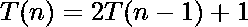
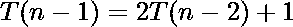
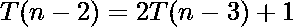
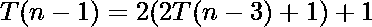
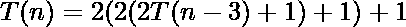
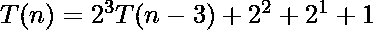
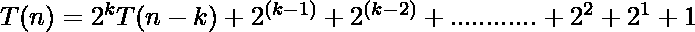
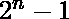
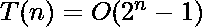
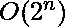

# 时间复杂度分析|河内塔(递归)

> 原文:[https://www . geesforgeks . org/时间-复杂性-分析-塔-河内-递归/](https://www.geeksforgeeks.org/time-complexity-analysis-tower-hanoi-recursion/)

[河内塔](https://www.geeksforgeeks.org/c-program-for-tower-of-hanoi/)是一个数学难题，我们有三个杆和 n 个圆盘。拼图的目标是将整个堆叠移动到另一个棒上，遵循以下简单规则:
1)一次只能移动一个磁盘。
2)每次移动包括从一个堆栈中取出上层磁盘，并将其放在另一个堆栈的顶部，即只有当磁盘是堆栈中最上面的磁盘时，才能移动该磁盘。
3)任何磁盘都不能放在较小的磁盘上。

伪代码

```
TOH(n, x, y, z)
{
   if (n >= 1)
   {
      // put (n-1) disk to z by using y
      TOH((n-1), x, z, y)

       // move larger disk to right place
       move:x-->y

      // put (n-1) disk to right place 
      TOH((n-1), z, y, x)
   }
}
```

递归分析

递归方程:—-方程-1

通过反变换求解:
 ———方程-2
 ———方程-3

借助方程-3
——方程-4，将 T(n-2)的值放入方程-2

借助方程-4

将 T(n-1)的值代入方程-1

泛化后:


基础条件 T(1)= 1
n–k = 1
k = n-1
put，k = n-1
T4】

是 GP 系列，和为

，或者你可以说是指数

对于 5 个磁盘，即 n=5，需要 2^5-1=31 移动。