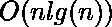
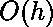
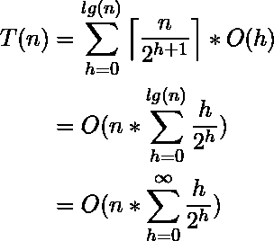
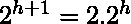
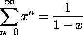
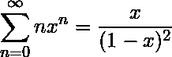
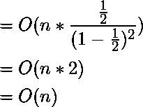

# 堆一堆的时间复杂度

> 原文:[https://www . geeksforgeeks . org/时间-构建堆的复杂性/](https://www.geeksforgeeks.org/time-complexity-of-building-a-heap/)

考虑以下构建输入数组 a 的堆的算法

```
BUILD-HEAP(A) 
    heapsize := size(A); 
    for i := floor(heapsize/2) downto 1 
        do HEAPIFY(A, i); 
    end for 
END

```

快速浏览一下上面的算法，运行时间是，因为每次调用 **Heapify** 都要花费和 **Build-Heap** 进行这样的调用。
这个上限虽然正确，但并不是渐近紧的。

我们可以通过观察 **Heapify** 的运行时间依赖于树‘h’的高度(等于 lg(n)，其中 n 是节点数)并且大多数子树的高度都很小，从而推导出一个更紧的界限。
随着我们沿着树向上移动，高度“h”增加。**构建堆**的第 3 行从最后一个内部节点(heapsize/2)的索引(高度=1)到根(1)的索引(高度= lg(n))运行一个循环。因此， **Heapify** 对于每个节点花费不同的时间，这就是。

为了找到构建堆的时间复杂度，我们必须知道高度为 h 的节点数量
为此，我们使用了这样一个事实，即大小为 n 的堆最多有高度为 h 的个节点

现在为了推导时间复杂度，我们将**构建-堆**的总成本表示为-

(1) 

步骤 2 使用 Big-Oh 符号的属性来忽略上限函数和常数 2( )。类似地，在第三步中，求和的上限可以增加到无穷大，因为我们使用的是大-哦符号。

无限 G.P 之和(x < 1)

(2) 

微分两边，乘以 x，我们得到

(3) 

将(3)中得到的结果放回推导(1)中，我们得到

(4) 

因此证明了建立二进制堆的时间复杂度是。

**参考:**T2[http://www.cs.sfu.ca/CourseCentral/307/petra/2009/SLN_2.pdf](http://www.cs.sfu.ca/CourseCentral/307/petra/2009/SLN_2.pdf)

本文由**奇拉·曼瓦尼**供稿。如果你喜欢 GeeksforGeeks 并想投稿，你也可以使用[contribute.geeksforgeeks.org](http://www.contribute.geeksforgeeks.org)写一篇文章或者把你的文章邮寄到 contribute@geeksforgeeks.org。看到你的文章出现在极客博客主页上，帮助其他极客。

如果你发现任何不正确的地方，或者你想分享更多关于上面讨论的话题的信息，请写评论。