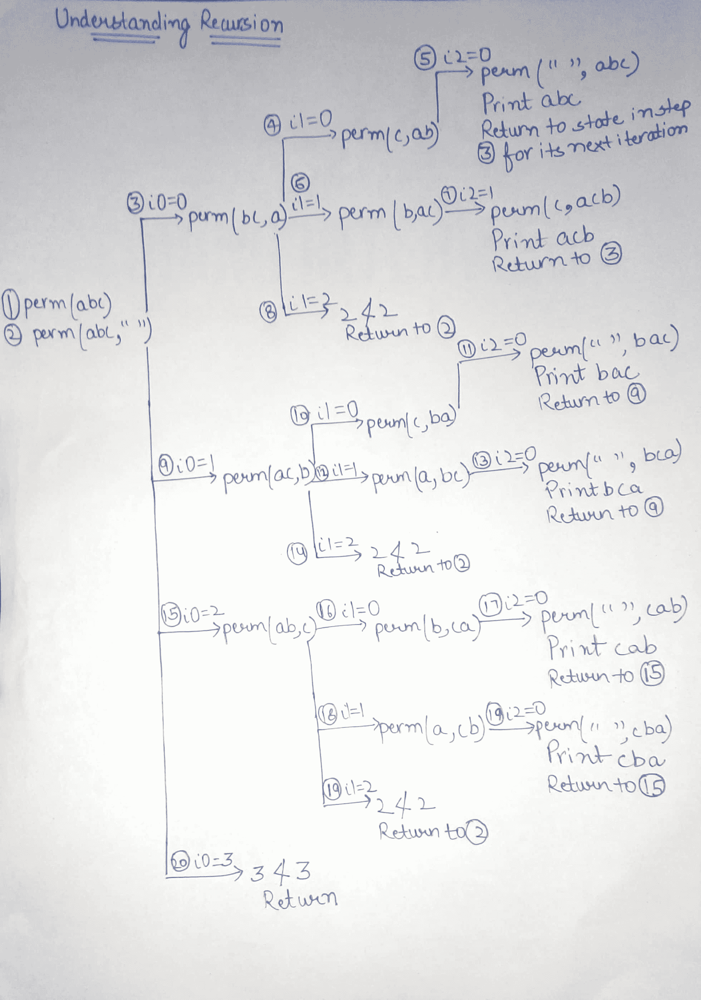

# 字符串所有排列的时间复杂度

> 原文:[https://www . geesforgeks . org/time-complexity-排列-string/](https://www.geeksforgeeks.org/time-complexity-permutations-string/)

打印字符串所有排列的时间复杂性。

```
1\. void perm(String str){
2\.    perm(str, "");
3\.  }
4.
5\. void perm(String str, String prefix){
6\.     if(str.length() == 0){
7\.         System.out.println(prefix);
8\.     } else{
9\.        for(int i = 0; i < str.length(); i++){
10\.           String rem = str.substring(0, i) + 
                           str.substring(i + 1);
11\.           perm(rem, prefix + str.charAt(i));
12\.       }
13\.    }
14\. }

```

**理解代码:**

**第 1-3 行:**当调用函数 **perm** 传递**“ABC”**作为字符串参数时，对 perm(str，“”)进行内部调用。这意味着它以空前缀(第二个参数)开始，为整个字符串(第一个参数)创建置换。

**第 6-8 行:**这是将停止递归的基本情况。如果输入字符串中没有要置换的字符，则打印变量**前缀**中的当前置换并返回。

**第 9-12 行:**for 循环一次从输入字符串中挑选一个字符来更新前缀字符串。也就是说，循环使用更新的前缀和另一个字符串 **rem** 再次调用函数 perm，该字符串收集输入字符串的剩余字符。

借助下图了解这一点:



**分析时间复杂度:**

1.函数 perm 在其基本情况下被调用多少次？
从上面解释的递归中我们可以理解，对于长度为 3 的字符串，它打印的是 6 个排列，实际上是 3！。这是因为如果它需要生成排列，就需要为每个槽选择字符。如果我们的字符串中有 3 个字符，在第一个槽中，有 3 个选择，下一个槽有 2 个选择(前面 3 个选择中的每一个，即乘法而不是加法)等等。这就说明有 **n！**排列印刷在基本情况下，这是什么显示在图像中。

2.函数 perm 在其基本情况之前被调用多少次？
考虑第 9 行到第 12 行被 **n** 命中的次数。所以不会超过(n * n！)函数调用。

3.每个函数调用需要多长时间？
由于需要打印字符串前缀的每个字符，因此执行第 7 行将花费 O(n)个时间。由于字符串连接，第 10 行和第 11 行也将花费 O(n)个时间，因为 rem、前缀和 str.charAt(i)的总和将始终为 n。因此，每个函数调用对应于 O(n)个工作。

4.总运行时间是多少？
调用 perm O(n * n！)次(作为上限)并且每次调用花费 O(n)个时间，总运行时间不会超过 **O(n^2 * n！)**。

**来源:**破解盖尔·拉克曼·麦克道尔的编码访谈