# 递归斐波那契程序的时间复杂度

> 原文:[https://www . geesforgeks . org/时间-复杂性-递归-斐波那契-程序/](https://www.geeksforgeeks.org/time-complexity-recursive-fibonacci-program/)

[斐波那契数](https://www.geeksforgeeks.org/program-for-nth-fibonacci-number/)是以下整数序列中的数 0，1，1，2，3，5，8，13……
数学上斐波那契数可以用下面的递归公式来写。

```
For seed values F(0) = 0 and F(1) = 1
F(n) = F(n-1) + F(n-2)

```

在继续阅读本文之前，请确保您熟悉[程序中讨论的斐波那契数列](https://www.geeksforgeeks.org/program-for-nth-fibonacci-number/)的递归方法

**递归斐波那契程序分析:**
我们知道斐波那契的递归方程是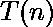 = 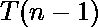 + 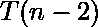 + 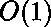。
这意味着，计算 fib(n)所花费的时间等于计算 fib(n-1)和 fib(n-2)所花费的时间之和。这也包括执行前面加法的恒定时间。

在求解上述递归方程时，我们得到斐波那契的上限为，但这不是严格的上限。斐波那契可以用数学方法表示为线性递归函数，这一事实可以用来找到紧上界。
现在斐波那契定义为

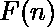 = 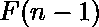 + 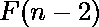

该功能的特征方程为
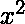=+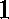
––=

通过二次公式求解，我们可以得到根为
=(+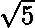)//=(–)/

现在我们知道线性递归函数的解被给出为
 = 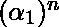 + 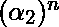

其中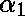和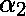是特征方程的根。
所以对于我们的斐波那契函数 =  + 解将是

 = 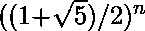 + 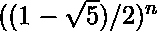
显然和是渐近相同的，因为这两个函数都表示同一事物。
因此可以说
 = 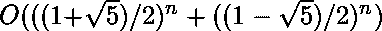
或者我们可以写在下面(利用[大 O 记数法](https://www.geeksforgeeks.org/analysis-of-algorithms-set-3asymptotic-notations/)的性质我们可以降低阶项)
=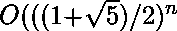
=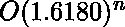
这就是斐波那契的紧上界。\

**好玩事实:**
1.6180 也叫黄金比例。你可以在这里阅读更多关于黄金分割的内容:[数学中的黄金分割](https://www.mathsisfun.com/numbers/golden-ratio.html)

本文由 [**维奈乔希**](https://auth.geeksforgeeks.org/profile.php?user=Vineet Joshi) 供稿。如果你喜欢 GeeksforGeeks 并想投稿，你也可以使用[contribute.geeksforgeeks.org](http://www.contribute.geeksforgeeks.org)写一篇文章或者把你的文章邮寄到 contribute@geeksforgeeks.org。看到你的文章出现在极客博客主页上，帮助其他极客。

如果你发现任何不正确的地方，或者你想分享更多关于上面讨论的话题的信息，请写评论。