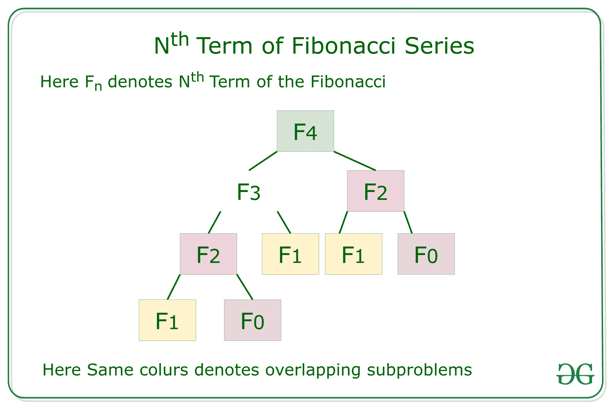

# 算法中的时空权衡

> 原文:[https://www . geeksforgeeks . org/时空权衡算法/](https://www.geeksforgeeks.org/time-space-trade-off-in-algorithms/)

在本文中，我们将讨论算法中的时空权衡。权衡是一件事增加而另一件事减少的情况。这是一种解决问题的方法:

*   要么用更少的时间和更多的空间，要么
*   花很长时间在很小的空间里。

最好的算法是有助于解决需要更少内存空间和更少时间来生成输出的问题。但总的来说，并不总是能够同时达到这两个条件。最常见的情况是使用[查找表](https://www.geeksforgeeks.org/sparse-table/)的[算法](https://www.geeksforgeeks.org/fundamentals-of-algorithms/)。这意味着对于每一个可能的值，一些问题的答案都可以写下来。解决这个问题的一个方法是写下整个**查找表**，这将让你很快找到答案，但会占用很多空间。另一种方法是不写任何东西就计算答案，这种方法占用的空间很小，但可能需要很长时间。因此，时间效率越高的算法，空间效率就越低。

### <u>时空权衡的类型</u>

*   压缩或未压缩数据
*   重新渲染或存储图像
*   较小的代码或循环展开
*   查找表或重新计算

[**<u>压缩或未压缩数据</u>**](https://www.geeksforgeeks.org/compressing-and-decompressing-files-in-java/) **:** 一种时空权衡可以应用于**数据存储**的问题。如果存储的数据是未压缩的，则占用的空间更大，但时间更短。但是如果数据是压缩存储的，运行解压缩算法需要的空间更少，但时间更长。在许多情况下，可以直接处理压缩数据。在压缩位图索引的情况下，使用压缩比不使用压缩更快。

**<u>重新渲染或存储图像</u> :** 在这种情况下，仅存储源并将其渲染为图像将占用更多空间但更少时间，即在[缓存中存储图像](https://www.geeksforgeeks.org/cache-memory-in-computer-organization/)比重新渲染更快，但需要更多内存空间。

**<u>更小的代码或</u>** [**<u>循环展开</u>**](https://www.geeksforgeeks.org/loop-unrolling/) **:** 更小的代码在内存中占据更少的空间，但它需要更高的计算时间，这是在每次迭代结束时跳回循环开始所需要的。循环展开可以优化执行速度，但代价是增加了二进制文件的大小。它占用更多的内存空间，但需要更少的计算时间。

**<u>查找表或重新计算</u> :** 在查找表中，实现可以包括整个表，这减少了计算时间，但增加了所需的内存量。它可以重新计算，即根据需要计算表条目，增加计算时间，但减少内存需求。

**例如:**在数学术语中，[斐波那契数](https://www.geeksforgeeks.org/program-for-nth-fibonacci-number/)的序列**F<sub>n</sub>T5】由递归关系定义:**

> F<sub>n</sub>= F<sub>n–1</sub>+F<sub>n–2</sub>，
> 其中，F <sub>0</sub> = 0，F <sub>1</sub> = 1。

从上述递推关系中利用[递推](https://www.geeksforgeeks.org/recursion/)找到 **N <sup>次</sup>斐波那契项**的简单解法。

下面是使用递归的实现:

## C++

```
// C++ program to find Nth Fibonacci
// number using recursion
#include <iostream>
using namespace std;

// Function to find Nth Fibonacci term
int Fibonacci(int N)
{
    // Base Case
    if (N < 2)
        return N;

    // Recursively computing the term
    // using recurrence relation
    return Fibonacci(N - 1) + Fibonacci(N - 2);
}

// Driver Code
int main()
{
    int N = 5;

    // Function Call
    cout << Fibonacci(N);

    return 0;
}
```

## Java 语言(一种计算机语言，尤用于创建网站)

```
// Java program to find Nth Fibonacci
// number using recursion
class GFG {

    // Function to find Nth Fibonacci term
    static int Fibonacci(int N)
    {
        // Base Case
        if (N < 2)
            return N;

        // Recursively computing the term
        // using recurrence relation
        return Fibonacci(N - 1) + Fibonacci(N - 2);
    }

    // Driver Code
    public static void main(String[] args)
    {
        int N = 5;

        // Function Call
        System.out.print(Fibonacci(N));
    }
}

// This code is contributed by rutvik_56.
```

## C#

```
// C# program to find Nth Fibonacci
// number using recursion
using System;
class GFG
{

  // Function to find Nth Fibonacci term
  static int Fibonacci(int N)
  {

    // Base Case
    if (N < 2)
      return N;

    // Recursively computing the term
    // using recurrence relation
    return Fibonacci(N - 1) + Fibonacci(N - 2);
  }

  // Driver Code
  public static void Main(string[] args)
  {
    int N = 5;

    // Function Call
    Console.Write(Fibonacci(N));
  }
}

// This code is contributed by pratham76.
```

**Output:** 

```
5
```

***时间复杂度:**O(2<sup>N</sup>)*
***辅助空间:** O(1)*

**说明:**由于一次又一次对同一子问题进行多次计算，上述实现的时间复杂度是指数级的。使用的辅助空间最小。但是我们的目标是降低方法的时间复杂性，即使它需要额外的空间。下面是讨论的优化方法。

**高效方法:**对上述方法进行优化，思路是利用[动态规划](https://www.geeksforgeeks.org/dynamic-programming/)对[重叠子问题](https://www.geeksforgeeks.org/overlapping-subproblems-property-in-dynamic-programming-dp-1/)进行[记忆](https://www.geeksforgeeks.org/memoization-1d-2d-and-3d/)来降低复杂度，如下递归树所示:

[](https://media.geeksforgeeks.org/wp-content/uploads/20200914184241/fibonacci.jpg)

下面是上述方法的实现:

## C++

```
// C++ program to find Nth Fibonacci
// number using recursion
#include <iostream>
using namespace std;

// Function to find Nth Fibonacci term
int Fibonacci(int N)
{
    int f[N + 2];
    int i;

    // 0th and 1st number of the
    // series are 0 and 1
    f[0] = 0;
    f[1] = 1;

    // Iterate over the range [2, N]
    for (i = 2; i <= N; i++) {

        // Add the previous 2 numbers
        // in the series and store it
        f[i] = f[i - 1] + f[i - 2];
    }

    // Return Nth Fibonacci Number
    return f[N];
}

// Driver Code
int main()
{
    int N = 5;

    // Function Call
    cout << Fibonacci(N);

    return 0;
}
```

**Output:** 

```
5
```

***时间复杂度:**O(N)*
T5**辅助空间:** O(N)

**说明:**上述实现的时间复杂度是线性的，通过使用辅助空间来存储重叠子问题状态，以便在需要时可以进一步使用。