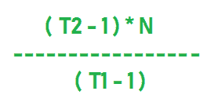

# 简单利息要求本金本身变成 Y 倍的次数

> 原文:[https://www . geeksforgeeks . org/times-简单利息所需的本金变成 y 倍-本身/](https://www.geeksforgeeks.org/times-required-by-simple-interest-for-the-principal-to-become-y-times-itself/)

假设一定数量的钱在 **N1** 年内变成 **T1** 倍。任务是找到年数即 **N2** 这样金额就变成了 **T2** 乘以本身的相同的单利利率。

**示例:**

> **输入:** T1 = 5，N1 = 7，T2 = 25
> T3】输出: 42
> 
> **输入:** T1 = 3，N1 = 5，T2 = 6
> T3】输出: 12.5

**进场:**

> 让我们考虑第一个例子，其中 T1 = 5，N1 = 7，T2 = 25
> 现在，让 P 本金变成 5P，即(T1 * P)，那么收到的简单利息就是 4P。
> (As S.I =金额–P)
> 现在，在第二种情况下，P 变成了 25P 即(T2 * P)，那么收到的单利就是 24P。
> 现在，如果我们在 N1 获得 4P 利息，即 7 年，那么我们将在 7 * 6 年内，即 42 年内获得 24P
> 的利息。

**公式:**



下面是上述方法的实现:

## C++

```
// C++ implementation of the approach
#include <bits/stdc++.h>
using namespace std;

// Function to return the no. of years
float noOfYears(int t1, int n1, int t2)
{
    float years = ((t2 - 1) * n1 / (float)(t1 - 1));

    return years;
}

// Driver code
int main()
{
    int T1 = 3, N1 = 5, T2 = 6;

    cout << noOfYears(T1, N1, T2);

    return 0;
}
```

## Java 语言(一种计算机语言，尤用于创建网站)

```
// Java implementation of the approach
class GFG
{

// Function to return the no. of years
static float noOfYears(int t1, int n1, int t2)
{
    float years = ((t2 - 1) * n1 / (float)(t1 - 1));

    return years;
}

// Driver code
public static void main(String[] args)
{
    int T1 = 3, N1 = 5, T2 = 6;

    System.out.println(noOfYears(T1, N1, T2));
}
}

// This code is contributed by Code_Mech
```

## 蟒蛇 3

```
# Python3 implementation of the approach

# Function to return the no. of years
def noOfYears(t1, n1, t2):

    years = (t2 - 1) * n1 / (t1 - 1)
    return years

# Driver code
if __name__ == "__main__":

    T1, N1, T2 = 3, 5, 6
    print(noOfYears(T1, N1, T2))

# This code is contributed
# by Rituraj Jain
```

## C#

```
// C# implementation for above approach
using System;

class GFG
{

// Function to return the no. of years
static float noOfYears(int t1, int n1, int t2)
{
    float years = ((t2 - 1) * n1 / (float)(t1 - 1));

    return years;
}

// Driver code
public static void Main(String[] args)
{
    int T1 = 3, N1 = 5, T2 = 6;

    Console.WriteLine(noOfYears(T1, N1, T2));
}
}

/* This code contributed by PrinciRaj1992 */
```

## 服务器端编程语言（Professional Hypertext Preprocessor 的缩写）

```
<?php
// PHP implementation for above approach

// Function to return the no. of years
function noOfYears($t1, $n1, $t2)
{
    $years = (($t2 - 1) * $n1 / ($t1 - 1));

    return $years;
}

// Driver code
$T1 = 3;
$N1 = 5;
$T2 = 6;

print(noOfYears($T1, $N1, $T2));

// This code contributed by mits
?>
```

## java 描述语言

```
<script>

// Javascript implementation of the approach

// Function to return the no. of years
function noOfYears(t1, n1, t2)
{
    var years = ((t2 - 1) * n1 / (t1 - 1));

    return years;
}

// Driver code
var T1 = 3, N1 = 5, T2 = 6;
document.write( noOfYears(T1, N1, T2));

// This code is contributed by rutvik_56.
</script>
```

**Output:** 

```
12.5
```