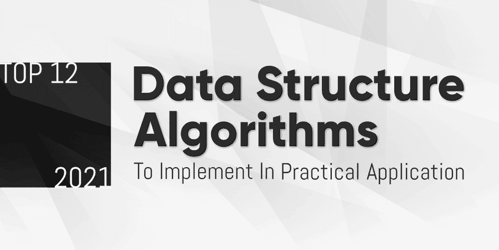

# 2021 年在实际应用中实现的 12 大数据结构算法

> 原文:[https://www . geeksforgeeks . org/top-12-数据结构-算法-实现-实际应用-2021 年/](https://www.geeksforgeeks.org/top-12-data-structure-algorithms-to-implement-in-practical-applications-in-2021/)

**新年…新的开始…！！！**

*你今年有什么计划？？？(做程序员)*

当然，如果你是一名程序员，那么今年你也将编写代码，构建项目，你将解决很多编码问题。

我们来谈谈 ***数据结构和算法*** …

计算机科学的心脏和程序员生活在编码世界的气息…

许多初学者通过学习计算机科学的这两个重要工具开始学习编程。你可能练习了很多，但是你有没有试着去了解这些算法在现实世界的应用中有什么帮助。当然，学习它们是有原因的。大多数新手程序员学习它是为了工作，但是如果我们了解这些算法在现实世界中的实际实现，这难道不有趣吗？

新的一年即将到来，在这个新的一年里，我们鼓励你去检查著名算法的实际场景，而不是仅仅为了一份工作而学习它们。在这篇博客中，我们将讨论这些算法在现实世界中的一些实际实现。

无论你是一个新生还是一个有经验的人，你都会发现阅读很有趣。这篇文章将刷新有经验的程序员的记忆。

### 1. [**斐波那契数列**](https://www.geeksforgeeks.org/program-for-nth-fibonacci-number/)

当然，你一生中可能会经历一次斐波那契数列的程序实现。作为一名学生，你可能会要求实施斐波那契数列的程序，或者你可能会在 XYZ 公司的面试中问这个问题。

**对！！！**我们说的是同一个系列，我们应用数学公式*****an= an2+an1***来获得我们程序中的系列。我们实现代码，使系列 0、1、1、2、3、5、8、13 和 21 无限。在这个系列中，我们通过将连续的系列相加得到下一个最高的数字。**

**你写了程序，你通过了考试或者通过了面试，但是你有没有尝试过搜索这个系列在现实世界中的应用？*有什么可能* *场景* *利用* *这个算法* *在* *这个* *真实的* *世界中？***

**这个序列的美可以用来 ***计算英里到公里，反之亦然*** 。你会得到一个近乎准确的结果(不准确但足够准确)。在斐波那契数列中，你可以将任何数字视为英里，下一个数字将以公里为单位。**

> **考虑序列 1，2，3，5，8，13，21，34，55，89，…**
> 
>  **在上面的例子中，你可以取两个连续的数字 8 和 13。较小的数字以英里为单位，即 8，较大的数字以公里为单位，即 13。
> 
> 8 英里= 13 公里。**

### **2.[回文算法](https://www.geeksforgeeks.org/check-if-a-number-is-palindrome/)**

**这是程序员中另一种流行的算法。回文数字或字符串以相反的顺序读取。比如…关卡，夫人，12021。实现这个算法也是很多公司面试过程中常见的问题。**

**你在实现回文数字的程序时测试你的逻辑能力，但是你能不能想想这个著名算法的实际情况？哪里可以用？**

**回文用于 ***DNA 序列处理*** 。但是在这个过程中是如何使用的呢？**

**许多 DNA 序列正在变得可用。为了存储这些 DNA 序列的信息，我们使用了分子生物学数据库。这些数据库的容量在未来会更大，因此在数据库中有效地交流和存储数据是很重要的。**

**为了获得更好的性能，压缩这些 DNA 序列非常重要。为了压缩这些序列，可以使用 CTW(上下文树加权方法)。这种方法将 DNA 序列压缩到每个符号不到两位。**

**DNA 序列的两个主要特征结构是已知的。一种是回文或反向恭维，另一种是近似重复。使用散列和动态编程，该算法在编码下一个符号之前搜索近似重复和回文。如果它找到一个足够长的回文或近似重复，那么算法用长度和距离来表示它。**

### **3.[阵列](https://www.geeksforgeeks.org/array-data-structure/)**

***编程中要学习的第一个数据结构……***

***许多应用中最常用和最广泛使用的数据结构……***

**每个初学者的编程之旅都是从解决数组问题开始的。作为一名程序员，您肯定会在应用程序中大量使用这种数据结构。这种数据结构用于需要在一个地方收集对象的所有可能情况。从简单到复杂的软件或 web 应用程序阵列主要用于在网页上动态地存储和显示数据。让我们举一个在实际应用中使用数组的好例子…**

**我们都必须至少使用过一次 ***在线订票系统*** 。它可能是为了预订火车票，也可能是公共汽车、航班、电影或任何其他节目。如果我们想预订任何座位，那么只需点击一个方块，它就会被预订。**

***你有没有想过，你在任何系统上在线预订的座位都是二维数组？***

**当你预订座位时，它位于某个特定的行列中。这可以用一个二维数组来表示，比如一个座位[4][5]。因此，数组适用于各种在线预订系统。希望你明白了这一点，理解了 Array 在现实世界中的应用。**

### **4.[堆叠](https://www.geeksforgeeks.org/stack-data-structure/)**

**作为一个初学者，你可能肯定读过堆栈数据结构的常见例子……橱柜里的一堆盘子或书，但是除了这个基本例子之外，你能想一想另一个堆栈的例子吗？**

***是否有任何真实世界的应用程序是基于*一个*堆栈数据结构的概念构建和工作的？***

*****对！！！*** *还有……***

**记事本或微软 Word 等 ***文本编辑器使用堆栈数据结构来完成编辑器中的撤销任务。栈的另一个很好的例子是浏览器在你的笔记本电脑或系统中工作。*****

**无论何时在文本编辑器中执行活动，都会创建一个堆栈。使用推送操作，您可以存储动作、其元数据，如动作类型、动作的性质、数据等。使用弹出操作执行撤消操作，最后一个操作(存储在堆栈顶部)将从堆栈中移除或撤消。**

**堆栈数据结构的另一个很好的例子是浏览器在您的笔记本电脑或系统上的工作。假设你去 www.google.com，然后去 www.geeksforgeeks.org。之后，您将参观[www.youtube.com](www.youtube.com)。使用推送操作将这些信息存储在堆栈数据结构中。当您点击浏览器中的后退按钮时，您将转到上一页，这是在堆栈中执行的弹出操作。**

**因此，如果你在 www.youtube.com 页面上，并且你按下了返回按钮，那么你访问了前一页 www.geeksforgeeks.org。再次按下后退按钮执行弹出操作，您将返回到 www.google.com 页面。**

### **5.[链表](https://www.geeksforgeeks.org/data-structures/linked-list/)**

**程序员中另一种流行且常见的数据结构是链表。现在考虑一下这种数据结构在现实应用程序中的用途。**

**我们的手机上都有一个**音乐播放器，上面有歌曲。假设你的清单上有 5-6 首歌。当您为这些歌曲创建播放列表时，它是基于链表的概念工作的。这些歌曲一首接一首地播放，这是单链表最好的例子之一。歌曲是连接的，你可以从第三首到第四首，但不能返回(单链表的行为)。****

****当您实现双向播放歌曲的功能时，它遵循双向链表的行为。在双向链表中，节点是双向连接的。因此，在播放列表中，您可以从歌曲 3 移到歌曲 4，也可以从歌曲 3 移到歌曲 2。您将同时拥有上一个和下一个按钮。所以双向导航是可能的。****

****当您以重复模式播放歌曲时，它会遵循循环链表的行为。在循环链表中，最后一个节点与第一个节点相连。因此，一旦最后一首歌完成，第一首歌将再次播放，它将以循环模式播放，永远不会停止。****

### ****6.[二分搜索法算法](https://www.geeksforgeeks.org/binary-search/)****

****作为一名程序员，你可能知道二分搜索法算法。这种算法也被称为半区间搜索、对数搜索或二进制斩波。在这个算法中，我们在排序的数组中搜索目标值。****

****这种算法使搜索过程更加容易，因为您不需要比较数字列表中的每个元素。二分搜索法是在有序数据列表中搜索目标值的快速方法。它给了你高效完成这个过程的力量。你可以找到很多二分搜索法算法的例子，比如在字典中搜索单词的意思，但是你知道现实世界中使用二分搜索法方法的应用程序吗？****

****该算法的现实场景之一是 ***在应用程序*** 中验证用户凭证。使用二分搜索法，您可以在几秒钟内验证数百万用户的凭据。****

****这种算法也用于许多编程语言库中，如 Java、。NET、C++ STL 等等。Python 的 list.sort()方法使用[<u>【Timsort】</u>](http://en.wikipedia.org/wiki/Timsort)，后者(AFAIK)使用二分搜索法定位元素的位置。99%的 3D 游戏和应用程序也使用了二分搜索法。****

### ****7.[合并排序算法](https://www.geeksforgeeks.org/merge-sort/)****

****合并排序基于分治技术的概念。我们将列表分成几个子列表，直到子列表不包含任何元素。之后，我们合并这些子列表以获得元素的排序列表。这是对该算法的简单而简短的介绍，但是您知道它在现实应用中的用途吗？****

****很多人爱通过任何一个电商网站 做 ***网购。你知道这些电商网站都用这个算法吗？大多数电子商务网站都有“你可能会喜欢的 T4”栏目。**这一部分维护所有用户账户的数组，然后选择与你的选择数组反转次数最少的那个，开始推荐他们已经购买的，或者他们喜欢的。(下一次这部分将提醒你在这些网站购物时二分搜索法的用途)*****

### ****8.[阿姆斯特朗编号](https://www.geeksforgeeks.org/program-for-armstrong-numbers/)****

****程序员中另一个流行的程序是检查这个数字是否是阿姆斯特朗。在阿姆斯特朗数中，一个数的数字立方之和等于这个数本身。例如，153 和 371 是阿姆斯特朗数。阿姆斯特朗数字主要用于数据加密和解密的数据安全应用。****

****访问 [IJITEE](https://levelup.gitconnected.com/applications-of-some-of-the-famous-algorithms-cdaecee58ed1) 的链接。阿姆斯壮号为 ***无线传感器网络*** 均有提及。他们使用了基于阿姆斯特朗的安全算法，使用阿姆斯特朗号生成 128 位密钥。用于 [AES 算法](https://en.wikipedia.org/wiki/Advanced_Encryption_Standard)进行数据加密和解密。****

### ****9.[霍夫曼编码](https://www.geeksforgeeks.org/huffman-coding-greedy-algo-3/)****

****霍夫曼编码与密码学和数据压缩结合使用。它用于无损数据压缩。根据概率，它的实现方式是不需要保留同一事物的多个副本。****

****Huffman 编码用于 ***压缩格式，如*** ***GZIP、PKZIP(WinZip********等)******T21】和 BZIP2* 。所有与互联网的通信都使用霍夫曼编码。大多数图像文件，如 JPEG 和 PNG 都是霍夫曼编码的。此外，像 MP3 这样的音乐文件是霍夫曼编码的。********

******霍夫曼码将固定长度的代码转换成可变长度的代码。使用生成所需压缩比的 JPEG 和 MPEG 技术对其进行进一步压缩。******

### ******10.[动态编程](https://www.geeksforgeeks.org/dynamic-programming/)******

******计算机科学学生和程序员最喜欢的另一个话题是动态编程。 [0-1 背包问题](https://www.geeksforgeeks.org/0-1-knapsack-problem-dp-10/)、[断字问题](https://www.geeksforgeeks.org/word-break-problem-dp-32/)、[最长公共子序列](https://www.geeksforgeeks.org/longest-common-subsequence-dp-4/)所有这些问题都是动态规划中最热门、最常见的问题。你解决它，你使用你的逻辑能力，但实际上在现实世界中，这个概念被使用…******

******动态规划广泛应用于 ***生物信息学、数学和经济学*** 。在 ***序列比对、蛋白质折叠、RNA 结构预测********等生物信息学任务中，蛋白质-DNA 结合*** 采用动态规划。********

****在数学中，DP 用于矩阵乘法，矩阵乘法在火箭技术中应用广泛。火箭的路径是通过求解许多参数来决定的。所有的决策问题都可以用动态规划来优化解决。****

### ****11.[图形](https://www.geeksforgeeks.org/graph-data-structure-and-algorithms/)****

****无论你是去某个地方旅行、外出还是试图找到到达特定目的地的路线。你用手机里最好的朋友谷歌地图。你知道谷歌地图使用的是 Graph 数据结构吗？****

****图形数据结构是一种非常强大的数据结构。不仅地球，整个宇宙都可以用这个图来表示。从微小的亚原子粒子到巨大的宇宙，你可以借助图形来表现每一件事。****

****当你使用谷歌地图时，所有的城市和州就像一个有距离信息的图表一样连接在一起。从一个城市到另一个城市有很多方法，但是要找到两个城市之间的最短路径，你需要使用一些算法。Dijkstra 算法是一种非常强大的算法，可以用来寻找两个城市之间的最短路径。****

****为了决定到达目的地的最短路径，迪克斯特拉的算法会在你的手机中启用你的 ***导航系统/GPS*** 。优步使用匈牙利算法将每辆车分配给想要搭车的人。****

*******脸书还使用图数据*** ***结构*** ***来实现新闻提要或追随者*** 。它使用[图形应用编程接口](https://developers.facebook.com/docs/graph-api/)来实现应用程序中的大部分内容。一切都可以用顶点或节点来表示，如页面、地点、群组、评论、照片、相册、故事、视频、笔记等。每一种联系或关系都是脸书的优势。图形应用编程接口以顶点和边的形式存储数据。****

### ****12.[特里数据结构](https://www.geeksforgeeks.org/advanced-data-structures/)****

****这是一个面向程序员的高级数据结构主题。你学习它可能是为了工作，你也喜欢根据它解决问题，但是这个高级主题在现实应用中有什么用。*它在我们的日常生活中落实在哪里？*让我们来看看那个有趣的答案…****

****你每天都在使用手机，你也在使用手机中的刷卡功能。这种滑动功能在您的移动键盘上，并且在编写文档时自动更正使用 Trie 数据结构。Trie 数据结构保存了手机中的字符值。****

*******网络浏览器历史*** 也采用了 Trie 数据结构。你访问过的网站的网址是由 Trie 数据结构组织的。当用户键入以前使用的网址的前缀时，浏览器使用这个强大的数据结构来完成网址。****

### ****最终想法****

****现在您已经了解了著名数据结构和算法的实际用例。 ***知道这些著名的算法是如何在我们的日常生活中实现的，这不是很有趣吗？**T3】*****

****我们中的许多人对这些数据结构和算法的有趣用例一无所知。我们在某个地方使用它，但是我们没有意识到。学东西之前先知道一件事的好处总是好的。这些只是我们介绍的一堆数据结构和算法，但是我们在日常生活中使用了几种算法。****

****现在，新的一年思考其他算法的实际使用案例…****

****还有，这个新的一年不仅仅是为了学习而学习这些算法，还要学习这些算法来实现一些自己感兴趣的现实世界应用。****