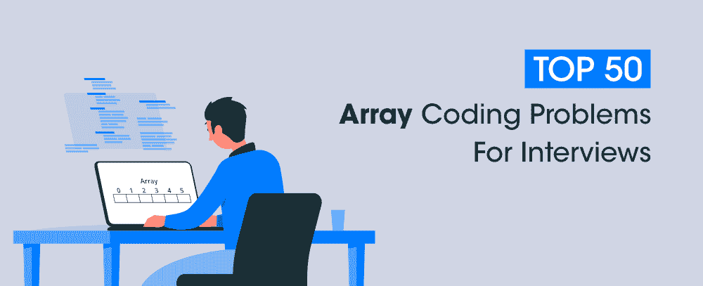

# 面试前 50 大数组编码问题

> 原文:[https://www . geesforgeks . org/top-50-数组-编码-问题-面试/](https://www.geeksforgeeks.org/top-50-array-coding-problems-for-interviews/)

以下是阵列上常见访谈问题的前 50 名列表。本文中的问题分为三个层次，以便读者可以根据难度一步步练习。

### <u>一级</u>

1.  [峰元素](https://practice.geeksforgeeks.org/problems/peak-element/1)
2.  [求数组中的最小和最大元素](https://practice.geeksforgeeks.org/problems/find-minimum-and-maximum-element-in-an-array4428/1)
3.  [写程序反转阵列](https://practice.geeksforgeeks.org/problems/reverse-a-string/1)
4.  [编写程序对给定数组进行排序](https://practice.geeksforgeeks.org/problems/sort-the-array0055/1)
5.  [求数组中第 k 个最大和第 k 个最小的数](https://practice.geeksforgeeks.org/problems/kth-smallest-element5635/1)
6.  [找出数组中出现的整数](https://practice.geeksforgeeks.org/problems/find-the-frequency/1)
7.  [对 0、1 和 2s 的数组进行排序](https://practice.geeksforgeeks.org/problems/sort-an-array-of-0s-1s-and-2s4231/1)
8.  [给定和的子阵列](https://practice.geeksforgeeks.org/problems/subarray-with-given-sum-1587115621/1)
9.  [将所有负元素移到阵列的一侧](https://practice.geeksforgeeks.org/problems/move-all-negative-elements-to-end1813/1)
10.  [求两个排序数组的并集和交集](https://practice.geeksforgeeks.org/problems/union-of-two-arrays3538/1)

### <u>二级</u>

1.  [编写一个程序，循环旋转一个数组](https://practice.geeksforgeeks.org/problems/cyclically-rotate-an-array-by-one2614/1)
2.  [查找缺失的整数](https://practice.geeksforgeeks.org/problems/missing-number-in-array1416/1)
3.  [用给定的总和计数对](https://practice.geeksforgeeks.org/problems/count-pairs-with-given-sum5022/1)
4.  [在数组中查找重复项](https://practice.geeksforgeeks.org/problems/find-duplicates-in-an-array/1)
5.  [使用快速排序算法对数组进行排序](https://practice.geeksforgeeks.org/problems/quick-sort/1)
6.  [在三个排序的数组中找到公共元素](https://practice.geeksforgeeks.org/problems/common-elements1132/1)
7.  [找到整数数组中的第一个重复元素](https://practice.geeksforgeeks.org/problems/first-repeating-element4018/1)
8.  [找到给定整数数组中的第一个非重复元素](https://practice.geeksforgeeks.org/problems/non-repeating-element3958/1)
9.  [等于 1 和 0 的子阵列](https://practice.geeksforgeeks.org/problems/count-subarrays-with-equal-number-of-1s-and-0s-1587115620/1)
10.  [将数组重新排列成正负交替的项目](https://practice.geeksforgeeks.org/problems/array-of-alternate-ve-and-ve-nos1401/1)
11.  [查找是否有和等于零的子阵](https://practice.geeksforgeeks.org/problems/subarray-with-0-sum-1587115621/1)
12.  [寻找最大和连续子阵列](https://practice.geeksforgeeks.org/problems/kadanes-algorithm-1587115620/1)
13.  [求一个大数的阶乘](https://practice.geeksforgeeks.org/problems/factorials-of-large-numbers2508/1#)
14.  [查找最大乘积子阵列](https://practice.geeksforgeeks.org/problems/maximum-product-subarray3604/1/)
15.  [找到最长的连续子序列](https://practice.geeksforgeeks.org/problems/longest-consecutive-subsequence2449/1)
16.  [找到旋转排序数组中的最小元素](https://practice.geeksforgeeks.org/problems/minimum-element-in-a-sorted-and-rotated-array3611/1)
17.  [配置中的最大和](https://practice.geeksforgeeks.org/problems/max-sum-in-the-configuration/1)
18.  [最小平台](https://practice.geeksforgeeks.org/problems/minimum-platforms-1587115620/1)
19.  [最小化高度之间的最大差异](https://practice.geeksforgeeks.org/problems/minimize-the-heights3351/1#)
20.  [到达终点的最小跳跃次数](https://practice.geeksforgeeks.org/problems/minimum-number-of-jumps-1587115620/1#)
21.  [库存跨度问题](https://practice.geeksforgeeks.org/problems/stock-span-problem-1587115621/1)
22.  [找到一个和给定值相加的三元组](https://practice.geeksforgeeks.org/problems/triplet-sum-in-array-1587115621/1)
23.  [最小正缺失数](https://practice.geeksforgeeks.org/problems/smallest-positive-missing-number-1587115621/1)
24.  [找到最大 1 个数的行](https://practice.geeksforgeeks.org/problems/row-with-max-1s0023/1)
25.  [螺旋打印矩阵](https://practice.geeksforgeeks.org/problems/spirally-traversing-a-matrix-1587115621/1)
26.  [判断一个数组是否是另一个数组的子集](https://practice.geeksforgeeks.org/problems/array-subset-of-another-array2317/1)
27.  [在一个数组中实现两个堆栈](https://practice.geeksforgeeks.org/problems/implement-two-stacks-in-an-array/1)
28.  [多数元素](https://practice.geeksforgeeks.org/problems/majority-element-1587115620/1)
29.  [波阵](https://practice.geeksforgeeks.org/problems/wave-array-1587115621/1)
30.  [收集雨水](https://practice.geeksforgeeks.org/problems/trapping-rain-water-1587115621/1)

### <u>三级</u>

1.  [最大指数](https://practice.geeksforgeeks.org/problems/maximum-index-1587115620/1)
2.  [两个数组中的最大和路径](https://practice.geeksforgeeks.org/problems/max-sum-path-in-two-arrays/1)
3.  [查找缺失并重复](https://practice.geeksforgeeks.org/problems/find-missing-and-repeating2512/1)
4.  [股票买卖问题](https://practice.geeksforgeeks.org/problems/stock-buy-and-sell-1587115621/1#)
5.  [在排序的数组中与给定的和配对](https://practice.geeksforgeeks.org/problems/pair-in-array-whose-sum-is-closest-to-x1124/0/?company)
6.  [巧克力配送问题](https://practice.geeksforgeeks.org/problems/chocolate-distribution-problem3825/1)
7.  [最长连续子序列](https://practice.geeksforgeeks.org/problems/longest-consecutive-subsequence2449/1)
8.  [不能表示为和的最小正整数](https://practice.geeksforgeeks.org/problems/b6b608d4eb1c45f2b5cace77c4914f302ff0f80d/1)
9.  [硬币兑换问题](https://practice.geeksforgeeks.org/problems/coin-change2448/1)
10.  [最长交替子序列](https://practice.geeksforgeeks.org/problems/longest-alternating-subsequence5951/1#)

**相关文章:**

## [面试前 50 大字符串编码问题](https://www.geeksforgeeks.org/top-50-string-coding-problems-for-interviews/)

## [面试的 50 大树编码问题](https://www.geeksforgeeks.org/top-50-tree-coding-problems-for-interviews/)

## [面试前 50 大动态编程编码问题](https://www.geeksforgeeks.org/top-50-dynamic-programming-coding-problems-for-interviews/)