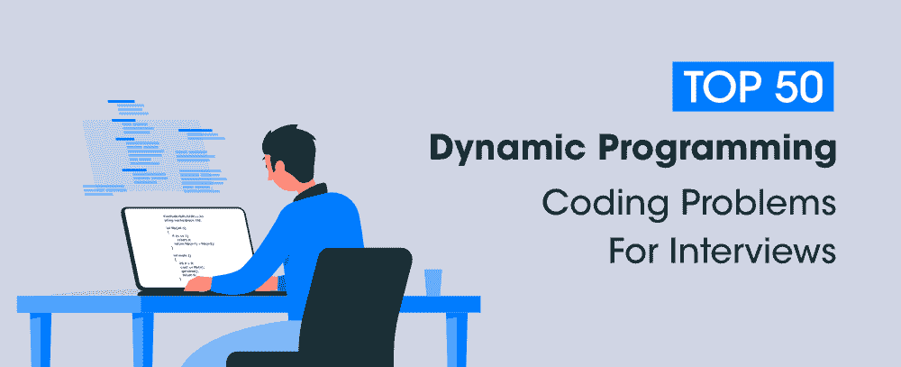

# 面试前 50 大动态编程编码问题

> 原文:[https://www . geesforgeks . org/top-50-动态-编程-编码-问题-面试/](https://www.geeksforgeeks.org/top-50-dynamic-programming-coding-problems-for-interviews/)

以下是动态规划的 50 大常见面试问题。本文中的问题分为三个层次，以便读者可以根据难度一步步练习。

### <u>一级</u>

1.  [第 n 个加泰罗尼亚号码](https://practice.geeksforgeeks.org/problems/nth-catalan-number0817/1/)
2.  [最小操作](https://practice.geeksforgeeks.org/problems/find-optimum-operation/0)
3.  [重复删除回文子串后删除字符串的最少步骤](https://practice.geeksforgeeks.org/problems/minimum-steps-to-delete-a-string2956/1)
4.  [最小硬币数](https://practice.geeksforgeeks.org/problems/-minimum-number-of-coins4426/1)
5.  [切绳时的最大乘积](https://practice.geeksforgeeks.org/problems/maximum-product-cutting4522/1)
6.  [走一段距离的方法](https://practice.geeksforgeeks.org/problems/count-number-of-hops-1587115620/1)
7.  [将一个字符串转换成另一个字符串的最少删除和插入次数](https://practice.geeksforgeeks.org/problems/minimum-number-of-deletions-and-insertions0209/1)
8.  [最小和子序列，使得每四个连续元素中至少有一个被选取](https://practice.geeksforgeeks.org/problems/minimum-four-sum-subsequence/1)

### <u>二级</u>

1.  [子集和问题](https://practice.geeksforgeeks.org/problems/subset-sum-problem-1611555638/1/)
2.  [最长公共子序列](https://practice.geeksforgeeks.org/problems/longest-common-subsequence-1587115620/1)
3.  [最长递增子序列](https://practice.geeksforgeeks.org/problems/longest-increasing-subsequence-1587115620/1)
4.  [编辑距离](https://practice.geeksforgeeks.org/problems/edit-distance3702/1)
5.  [矩阵中最长的路径](https://practice.geeksforgeeks.org/problems/path-in-matrix3805/1)
6.  [游戏的最佳策略](https://practice.geeksforgeeks.org/problems/optimal-strategy-for-a-game-1587115620/1)
7.  [0-1 背包问题](https://practice.geeksforgeeks.org/problems/0-1-knapsack-problem0945/1)
8.  [最短公共超序列](https://practice.geeksforgeeks.org/problems/shortest-common-supersequence0322/1)
9.  [分区问题](https://practice.geeksforgeeks.org/problems/subset-sum-problem2014/1)
10.  [切杆](https://practice.geeksforgeeks.org/problems/rod-cutting0840/1)
11.  [硬币兑换问题](https://practice.geeksforgeeks.org/problems/coin-change2448/1)
12.  [断字问题](https://practice.geeksforgeeks.org/problems/word-break1352/1)
13.  [掷骰子问题](https://practice.geeksforgeeks.org/problems/dice-throw5349/1)
14.  [箱子堆放](https://practice.geeksforgeeks.org/problems/box-stacking/1)
15.  [鸡蛋掉落拼图](https://practice.geeksforgeeks.org/problems/egg-dropping-puzzle-1587115620/1)
16.  [最大链条长度](https://practice.geeksforgeeks.org/problems/max-length-chain/1)
17.  [最长公共子串](https://practice.geeksforgeeks.org/problems/longest-common-substring/0)
18.  [交错串](https://practice.geeksforgeeks.org/problems/interleaved-strings/1/)
19.  [最大和增加子序列](https://practice.geeksforgeeks.org/problems/maximum-sum-increasing-subsequence4749/1)
20.  [最小跳跃次数](https://practice.geeksforgeeks.org/problems/minimum-number-of-jumps/0)
21.  [计数 a^i、b^j、c^k 类型的子序列](https://practice.geeksforgeeks.org/problems/count-subsequences-of-type-ai-bj-ck4425/1)
22.  [获取最小平方](https://practice.geeksforgeeks.org/problems/get-minimum-squares0538/1)
23.  [第 n 个斐波那契数](https://practice.geeksforgeeks.org/problems/nth-fibonacci-number1335/1)
24.  [最长回文子串](https://practice.geeksforgeeks.org/problems/longest-palindrome-in-a-string1956/1/)
25.  [总解码消息](https://practice.geeksforgeeks.org/problems/total-decoding-messages1235/1)
26.  [独特的英国标准时间](https://practice.geeksforgeeks.org/problems/unique-bsts-1587115621/1)
27.  [得分最高的玩家](https://practice.geeksforgeeks.org/problems/player-with-max-score/1/)
28.  [组成回文](https://practice.geeksforgeeks.org/problems/form-a-palindrome2544/1/)
29.  [绕词问题](https://practice.geeksforgeeks.org/problems/word-wrap1646/1)
30.  [计数回文子序列](https://practice.geeksforgeeks.org/problems/count-palindromic-subsequences/1/)
31.  [连续两次不跳过完成任务的最短时间](https://practice.geeksforgeeks.org/problems/skip-the-work5752/1)

### <u>三级</u>

1.  [最小分区](https://practice.geeksforgeeks.org/problems/minimum-sum-partition3317/1)
2.  [布尔圆括号问题](https://practice.geeksforgeeks.org/problems/boolean-parenthesization5610/1)
3.  [矩阵链乘法](https://practice.geeksforgeeks.org/problems/matrix-chain-multiplication0303/1)
4.  [最长之字形子序列](https://practice.geeksforgeeks.org/problems/longest-zig-zag-sub-sequence2656/1/)
5.  [最大利润](https://practice.geeksforgeeks.org/problems/maximum-profit4657/1)
6.  [最小成本路径](https://practice.geeksforgeeks.org/problems/minimum-cost-path3833/1)
7.  [油漆工的隔断问题](https://practice.geeksforgeeks.org/problems/the-painters-partition-problem1535/1)
8.  [回文分区](https://practice.geeksforgeeks.org/problems/palindromic-patitioning4845/1)
9.  [数组分区](https://practice.geeksforgeeks.org/problems/array-partition/1/)
10.  [二进制字符串中 0 和 1 的最大差值](https://practice.geeksforgeeks.org/problems/maximum-difference-of-zeros-and-ones-in-binary-string4111/1)
11.  [计算一个数字的数字分组](https://practice.geeksforgeeks.org/problems/count-digit-groupings-of-a-number1520/1/)

**相关文章:**

## [面试前 50 大数组编码问题](https://www.geeksforgeeks.org/top-50-array-coding-problems-for-interviews/)

## [面试前 50 大字符串编码问题](https://www.geeksforgeeks.org/top-50-string-coding-problems-for-interviews/)

## [面试的 50 大树编码问题](https://www.geeksforgeeks.org/top-50-tree-coding-problems-for-interviews/)