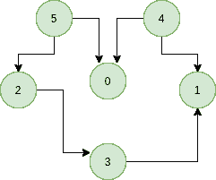
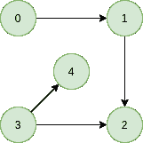

# 卡恩拓扑排序算法

> 原文:[https://www . geeksforgeeks . org/拓扑-排序-基于索引的解决方案/](https://www.geeksforgeeks.org/topological-sorting-indegree-based-solution/)

**D** 方向 **A** 循环 **G** 图(DAG)的拓扑排序是顶点的线性排序，使得对于每个有向边 uv，顶点 u 在排序中位于 v 之前。如果图形不是 DAG，则不可能对图形进行拓扑排序。
比如下面图的一个拓扑排序是“5 4 2 3 1 0？。一个图可以有多个拓扑排序。例如，下图的另一个拓扑排序是“4 5 2 0 3 1”。拓扑排序中的第一个顶点始终是入度为 0 的顶点(没有入边的顶点)。


我们来看几个解释恰当的例子，
**例:**

> **输入:**
> 
> 
> 
> **输出:** 5 4 2 3 1 0
> **解释:**DAG 的拓扑排序是按照这样的顺序进行的，即对于每个有向边 uv，顶点 u 在排序中位于 v 之前。5 没有传入边缘。4 没有输入边，2 和 0 有来自 4 和 5 的输入边，最后放置 1。
> **输入:**
> 
> 
> 
> **输出:** 0 3 4 1 2
> **说明:** 0 和 3 没有入边，4 和 1 有 0 和 3 的入边。2 最后被放置。

已经讨论了一个基于离散傅立叶变换的解决方案来寻找拓扑排序。
**<u>解决方案</u> :** 在本文中，我们将看到另一种方法来寻找有向无环图(DAG)中顶点的线性顺序。该方法基于以下事实:
**一个 DAG G 至少有一个内角为 0 度的顶点和一个外角为 0 度的顶点**。
**证明:**对上述事实有一个简单的证明，即 DAG 不包含循环，这意味着所有路径的长度都是有限的。现在让 S 成为从 u(源)到 v(目的地)的最长路径。由于 S 是最长的路径，因此 u 不会有输入边，v 也不会有输出边，如果出现这种情况，那么 S 就不会是最长的路径
= > indegree(u) = 0 和 outdegree(v) = 0
**算法:**寻找 DAG 拓扑顺序的步骤:
**步骤-1:** 计算 DAG 中每个顶点的入度(输入边数)，并初始化访问的数量
**步骤-2:** 拾取所有入度为 0 的顶点，并将其添加到队列中(入队操作)
**步骤-3:** 从队列中移除一个顶点(出队操作)，然后。

1.  将访问节点的计数增加 1。
2.  所有相邻节点的度数减少 1。
3.  如果相邻节点的入度降低到零，则将其添加到队列中。

**步骤 4:** 重复步骤 3，直到队列为空。
**步骤 5:** 如果访问节点的数量不等于图中的节点数量，那么对于给定的图，拓扑排序是不可能的。
**如何找到各个节点的 in-degree？**
计算每个顶点的入度有 2 种方法:

1.  取一个将跟踪
    的度内数组，遍历数组的边，简单地将目的节点的计数器增加 1。

```
for each node in Nodes
    indegree[node] = 0;
for each edge(src, dest) in Edges
    indegree[dest]++
```

1.  时间复杂度:O(V+E)
2.  遍历每个节点的列表，然后将与其连接的所有节点的入度增加 1。

```
    for each node in Nodes
        If (list[node].size()!=0) then
        for each dest in list
            indegree[dest]++;
```

1.  时间复杂度:外 for 循环执行 V 次，内 for 循环执行 E 次，因此整体时间复杂度为 O(V+E)。
    算法的整体时间复杂度为 O(V+E)

下面是上述算法的 C++实现。该实现使用上面讨论的方法 2 来寻找度数。

## C++

```
// A C++ program to print topological
// sorting of a graph using indegrees.
#include <bits/stdc++.h>
using namespace std;

// Class to represent a graph
class Graph {
    // No. of vertices'
    int V;

    // Pointer to an array containing
    // adjacency listsList
    list<int>* adj;

public:
    // Constructor
    Graph(int V);

    // Function to add an edge to graph
    void addEdge(int u, int v);

    // prints a Topological Sort of
    // the complete graph
    void topologicalSort();
};

Graph::Graph(int V)
{
    this->V = V;
    adj = new list<int>[V];
}

void Graph::addEdge(int u, int v)
{
    adj[u].push_back(v);
}

// The function to do
// Topological Sort.
void Graph::topologicalSort()
{
    // Create a vector to store
    // indegrees of all
    // vertices. Initialize all
    // indegrees as 0.
    vector<int> in_degree(V, 0);

    // Traverse adjacency lists
    // to fill indegrees of
    // vertices.  This step
    // takes O(V+E) time
    for (int u = 0; u < V; u++) {
        list<int>::iterator itr;
        for (itr = adj[u].begin();
             itr != adj[u].end(); itr++)
            in_degree[*itr]++;
    }

    // Create an queue and enqueue
    // all vertices with indegree 0
    queue<int> q;
    for (int i = 0; i < V; i++)
        if (in_degree[i] == 0)
            q.push(i);

    // Initialize count of visited vertices
    int cnt = 0;

    // Create a vector to store
    // result (A topological
    // ordering of the vertices)
    vector<int> top_order;

    // One by one dequeue vertices
    // from queue and enqueue
    // adjacents if indegree of
    // adjacent becomes 0
    while (!q.empty()) {
        // Extract front of queue
        // (or perform dequeue)
        // and add it to topological order
        int u = q.front();
        q.pop();
        top_order.push_back(u);

        // Iterate through all its
        // neighbouring nodes
        // of dequeued node u and
        // decrease their in-degree
        // by 1
        list<int>::iterator itr;
        for (itr = adj[u].begin();
             itr != adj[u].end(); itr++)

            // If in-degree becomes zero,
            // add it to queue
            if (--in_degree[*itr] == 0)
                q.push(*itr);

        cnt++;
    }

    // Check if there was a cycle
    if (cnt != V) {
        cout << "There exists a cycle in the graph\n";
        return;
    }

    // Print topological order
    for (int i = 0; i < top_order.size(); i++)
        cout << top_order[i] << " ";
    cout << endl;
}

// Driver program to test above functions
int main()
{
    // Create a graph given in the
    // above diagram
    Graph g(6);
    g.addEdge(5, 2);
    g.addEdge(5, 0);
    g.addEdge(4, 0);
    g.addEdge(4, 1);
    g.addEdge(2, 3);
    g.addEdge(3, 1);

    cout << "Following is a Topological Sort of\n";
    g.topologicalSort();

    return 0;
}
```

## Java 语言(一种计算机语言，尤用于创建网站)

```
// A Java program to print topological
// sorting of a graph using indegrees
import java.util.*;

// Class to represent a graph
class Graph {
    // No. of vertices
    int V;

    // An Array of List which contains
    // references to the Adjacency List of
    // each vertex
    List<Integer> adj[];
    // Constructor
    public Graph(int V)
    {
        this.V = V;
        adj = new ArrayList[V];
        for (int i = 0; i < V; i++)
            adj[i] = new ArrayList<Integer>();
    }

    // Function to add an edge to graph
    public void addEdge(int u, int v)
    {
        adj[u].add(v);
    }
    // prints a Topological Sort of the
    // complete graph
    public void topologicalSort()
    {
        // Create a array to store
        // indegrees of all
        // vertices. Initialize all
        // indegrees as 0.
        int indegree[] = new int[V];

        // Traverse adjacency lists
        // to fill indegrees of
        // vertices. This step takes
        // O(V+E) time
        for (int i = 0; i < V; i++) {
            ArrayList<Integer> temp
                = (ArrayList<Integer>)adj[i];
            for (int node : temp) {
                indegree[node]++;
            }
        }

        // Create a queue and enqueue
        // all vertices with indegree 0
        Queue<Integer> q
            = new LinkedList<Integer>();
        for (int i = 0; i < V; i++) {
            if (indegree[i] == 0)
                q.add(i);
        }

        // Initialize count of visited vertices
        int cnt = 0;

        // Create a vector to store result
        // (A topological ordering of the vertices)
        Vector<Integer> topOrder = new Vector<Integer>();
        while (!q.isEmpty()) {
            // Extract front of queue
            // (or perform dequeue)
            // and add it to topological order
            int u = q.poll();
            topOrder.add(u);

            // Iterate through all its
            // neighbouring nodes
            // of dequeued node u and
            // decrease their in-degree
            // by 1
            for (int node : adj[u]) {
                // If in-degree becomes zero,
                // add it to queue
                if (--indegree[node] == 0)
                    q.add(node);
            }
            cnt++;
        }

        // Check if there was a cycle
        if (cnt != V) {
            System.out.println(
                "There exists a cycle in the graph");
            return;
        }

        // Print topological order
        for (int i : topOrder) {
            System.out.print(i + " ");
        }
    }
}
// Driver program to test above functions
class Main {
    public static void main(String args[])
    {
        // Create a graph given in the above diagram
        Graph g = new Graph(6);
        g.addEdge(5, 2);
        g.addEdge(5, 0);
        g.addEdge(4, 0);
        g.addEdge(4, 1);
        g.addEdge(2, 3);
        g.addEdge(3, 1);
        System.out.println(
            "Following is a Topological Sort");
        g.topologicalSort();
    }
}
```

## 计算机编程语言

```
# A Python program to print topological sorting of a graph
# using indegrees
from collections import defaultdict

# Class to represent a graph
class Graph:
    def __init__(self, vertices):
        self.graph = defaultdict(list) # dictionary containing adjacency List
        self.V = vertices # No. of vertices

    # function to add an edge to graph
    def addEdge(self, u, v):
        self.graph[u].append(v)

    # The function to do Topological Sort.
    def topologicalSort(self):

        # Create a vector to store indegrees of all
        # vertices. Initialize all indegrees as 0.
        in_degree = [0]*(self.V)

        # Traverse adjacency lists to fill indegrees of
           # vertices.  This step takes O(V + E) time
        for i in self.graph:
            for j in self.graph[i]:
                in_degree[j] += 1

        # Create an queue and enqueue all vertices with
        # indegree 0
        queue = []
        for i in range(self.V):
            if in_degree[i] == 0:
                queue.append(i)

        # Initialize count of visited vertices
        cnt = 0

        # Create a vector to store result (A topological
        # ordering of the vertices)
        top_order = []

        # One by one dequeue vertices from queue and enqueue
        # adjacents if indegree of adjacent becomes 0
        while queue:

            # Extract front of queue (or perform dequeue)
            # and add it to topological order
            u = queue.pop(0)
            top_order.append(u)

            # Iterate through all neighbouring nodes
            # of dequeued node u and decrease their in-degree
            # by 1
            for i in self.graph[u]:
                in_degree[i] -= 1
                # If in-degree becomes zero, add it to queue
                if in_degree[i] == 0:
                    queue.append(i)

            cnt += 1

        # Check if there was a cycle
        if cnt != self.V:
            print "There exists a cycle in the graph"
        else :
            # Print topological order
            print top_order

g = Graph(6)
g.addEdge(5, 2);
g.addEdge(5, 0);
g.addEdge(4, 0);
g.addEdge(4, 1);
g.addEdge(2, 3);
g.addEdge(3, 1);

print "Following is a Topological Sort of the given graph"
g.topologicalSort()

# This code is contributed by Neelam Yadav
```

## java 描述语言

```
<script>
// A Javascript program to print topological
// sorting of a graph using indegrees

// No. of vertices
let V;

// An Array of List which contains
    // references to the Adjacency List of
    // each vertex
let adj;

function Graph(v)
{
    V = v;
    adj = new Array(V);
    for (let i = 0; i < V; i++)
            adj[i] = [];
}

// Function to add an edge to graph
function addEdge(u, v)
{
    adj[u].push(v);
}

// prints a Topological Sort of the
    // complete graph
function topologicalSort()
{

    // Create a array to store
        // indegrees of all
        // vertices. Initialize all
        // indegrees as 0.
        let indegree = new Array(V);
         for(let i = 0; i < V; i++)
            indegree[i] = 0;

        // Traverse adjacency lists
        // to fill indegrees of
        // vertices. This step takes
        // O(V+E) time
        for (let i = 0; i < V; i++) {
            let temp
                = adj[i];
            for (let node = 0; node < temp.length; node++) {
                indegree[temp[node]]++;
            }
        }

        // Create a queue and enqueue
        // all vertices with indegree 0
        let q = [];
        for (let i = 0; i < V; i++) {
            if (indegree[i] == 0)
                q.push(i);
        }

        // Initialize count of visited vertices
        let cnt = 0;

        // Create a vector to store result
        // (A topological ordering of the vertices)
        let topOrder = [];
        while (q.length!=0)
        {

            // Extract front of queue
            // (or perform dequeue)
            // and add it to topological order
            let u = q.shift();
            topOrder.push(u);

            // Iterate through all its
            // neighbouring nodes
            // of dequeued node u and
            // decrease their in-degree
            // by 1
            for (let node = 0; node < adj[u].length; node++)
            {

                // If in-degree becomes zero,
                // add it to queue
                if (--indegree[adj[u][node]] == 0)
                    q.push(adj[u][node]);
            }
            cnt++;
        }

        // Check if there was a cycle
        if (cnt != V) {
            document.write(
                "There exists a cycle in the graph");
            return;
        }

        // Print topological order
        for (let i = 0; i < topOrder.length; i++)
        {
            document.write(topOrder[i] + " ");
        }

}

// Driver program to test above functions
// Create a graph given in the above diagram
Graph(6);
addEdge(5, 2);
addEdge(5, 0);
addEdge(4, 0);
addEdge(4, 1);
addEdge(2, 3);
addEdge(3, 1);
document.write(
"Following is a Topological Sort<br>");
topologicalSort();

// This code is contributed by avanitrachhadiya2155
</script>
```

**输出:**

```
Following is a Topological Sort
4 5 2 0 3 1
```

**复杂度分析:**

*   **时间复杂度:** O(V+E)。
    外 for 循环执行 V 次，内 for 循环执行 E 次。
*   **辅助空间:** O(V)。
    队列需要存储图的所有顶点。所以需要的空间是 O(V)

本文由 **Chirag Agarwal** 供稿。如果你发现任何不正确的地方，请写评论，或者你想分享更多关于上面讨论的话题的信息