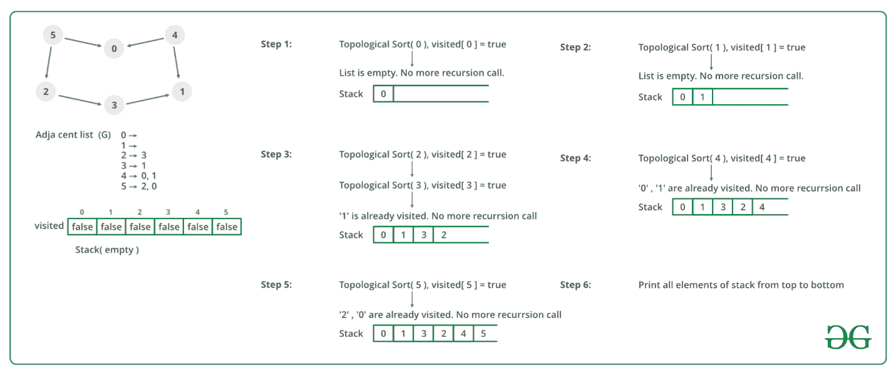

# 拓扑排序

> 原文:[https://www.geeksforgeeks.org/topological-sorting/](https://www.geeksforgeeks.org/topological-sorting/)

有向无环图的拓扑排序是顶点的线性排序，使得对于每个有向边 u ^ v，顶点 u 在排序中位于 v 之前。如果图形不是 DAG，则不可能对图形进行拓扑排序。

例如，下图的拓扑排序为“5 4 2 3 1 0”。一个图可以有多个拓扑排序。例如，下图的另一种拓扑排序是“4 5 2 3 1 0”。拓扑排序中的第一个顶点总是一个入度为 0 的顶点(没有引入边的顶点)。

[](https://media.geeksforgeeks.org/wp-content/cdn-uploads/graph.png)

***【拓扑排序 vs 深度优先遍历(DFS)*** :

在 [DFS](https://www.geeksforgeeks.org/depth-first-traversal-for-a-graph/) 中，我们打印一个顶点，然后递归调用其相邻顶点的 DFS。在拓扑排序中，我们需要在相邻顶点之前打印一个顶点。例如，在给定的图形中，顶点“5”应打印在顶点“0”之前，但与 [DFS](https://www.geeksforgeeks.org/depth-first-traversal-for-a-graph/) 不同，顶点“4”也应打印在顶点“0”之前。所以拓扑排序不同于 DFS。例如，所示图的 DFS 是“5 2 3 1 0 4”，但它不是拓扑排序。

**寻找拓扑排序的算法:**

我们建议先看看 [DFS](https://www.geeksforgeeks.org/depth-first-traversal-for-a-graph/) 的实现。我们可以修改 [DFS](https://www.geeksforgeeks.org/depth-first-traversal-for-a-graph/) 来找到图的拓扑排序。在 [DFS](https://www.geeksforgeeks.org/depth-first-traversal-for-a-graph/) 中，我们从一个顶点开始，我们首先打印它，然后递归地为它的相邻顶点调用 DFS。在拓扑排序中，我们使用临时堆栈。我们不会立即打印顶点，我们首先递归地为其所有相邻顶点调用拓扑排序，然后将其推送到堆栈中。最后，打印堆栈的内容。请注意，只有当一个顶点的所有相邻顶点(及其相邻顶点等)都已经在堆栈中时，该顶点才会被推入堆栈。

下图说明了上述方法:



以下是拓扑排序的实现。请参见深度代码[断开图的第一次遍历](https://www.geeksforgeeks.org/depth-first-traversal-for-a-graph/)，并注意第二次遍历给出的代码和下面的代码之间的区别。

## C++

```
// A C++ program to print topological
// sorting of a DAG
#include <iostream>
#include <list>
#include <stack>
using namespace std;

// Class to represent a graph
class Graph {
    // No. of vertices'
    int V;

    // Pointer to an array containing adjacency listsList
    list<int>* adj;

    // A function used by topologicalSort
    void topologicalSortUtil(int v, bool visited[],
                             stack<int>& Stack);

public:
    // Constructor
    Graph(int V);

    // function to add an edge to graph
    void addEdge(int v, int w);

    // prints a Topological Sort of
    // the complete graph
    void topologicalSort();
};

Graph::Graph(int V)
{
    this->V = V;
    adj = new list<int>[V];
}

void Graph::addEdge(int v, int w)
{
    // Add w to v’s list.
    adj[v].push_back(w);
}

// A recursive function used by topologicalSort
void Graph::topologicalSortUtil(int v, bool visited[],
                                stack<int>& Stack)
{
    // Mark the current node as visited.
    visited[v] = true;

    // Recur for all the vertices
    // adjacent to this vertex
    list<int>::iterator i;
    for (i = adj[v].begin(); i != adj[v].end(); ++i)
        if (!visited[*i])
            topologicalSortUtil(*i, visited, Stack);

    // Push current vertex to stack
    // which stores result
    Stack.push(v);
}

// The function to do Topological Sort.
// It uses recursive topologicalSortUtil()
void Graph::topologicalSort()
{
    stack<int> Stack;

    // Mark all the vertices as not visited
    bool* visited = new bool[V];
    for (int i = 0; i < V; i++)
        visited[i] = false;

    // Call the recursive helper function
    // to store Topological
    // Sort starting from all
    // vertices one by one
    for (int i = 0; i < V; i++)
        if (visited[i] == false)
            topologicalSortUtil(i, visited, Stack);

    // Print contents of stack
    while (Stack.empty() == false) {
        cout << Stack.top() << " ";
        Stack.pop();
    }
}

// Driver Code
int main()
{
    // Create a graph given in the above diagram
    Graph g(6);
    g.addEdge(5, 2);
    g.addEdge(5, 0);
    g.addEdge(4, 0);
    g.addEdge(4, 1);
    g.addEdge(2, 3);
    g.addEdge(3, 1);

    cout << "Following is a Topological Sort of the given "
            "graph \n";

    // Function Call
    g.topologicalSort();

    return 0;
}
```

## Java 语言(一种计算机语言，尤用于创建网站)

```
// A Java program to print topological
// sorting of a DAG
import java.io.*;
import java.util.*;

// This class represents a directed graph
// using adjacency list representation
class Graph {
    // No. of vertices
    private int V;

    // Adjacency List as ArrayList of ArrayList's
    private ArrayList<ArrayList<Integer> > adj;

    // Constructor
    Graph(int v)
    {
        V = v;
        adj = new ArrayList<ArrayList<Integer> >(v);
        for (int i = 0; i < v; ++i)
            adj.add(new ArrayList<Integer>());
    }

    // Function to add an edge into the graph
    void addEdge(int v, int w) { adj.get(v).add(w); }

    // A recursive function used by topologicalSort
    void topologicalSortUtil(int v, boolean visited[],
                             Stack<Integer> stack)
    {
        // Mark the current node as visited.
        visited[v] = true;
        Integer i;

        // Recur for all the vertices adjacent
        // to thisvertex
        Iterator<Integer> it = adj.get(v).iterator();
        while (it.hasNext()) {
            i = it.next();
            if (!visited[i])
                topologicalSortUtil(i, visited, stack);
        }

        // Push current vertex to stack
        // which stores result
        stack.push(new Integer(v));
    }

    // The function to do Topological Sort.
    // It uses recursive topologicalSortUtil()
    void topologicalSort()
    {
        Stack<Integer> stack = new Stack<Integer>();

        // Mark all the vertices as not visited
        boolean visited[] = new boolean[V];
        for (int i = 0; i < V; i++)
            visited[i] = false;

        // Call the recursive helper
        // function to store
        // Topological Sort starting
        // from all vertices one by one
        for (int i = 0; i < V; i++)
            if (visited[i] == false)
                topologicalSortUtil(i, visited, stack);

        // Print contents of stack
        while (stack.empty() == false)
            System.out.print(stack.pop() + " ");
    }

    // Driver code
    public static void main(String args[])
    {
        // Create a graph given in the above diagram
        Graph g = new Graph(6);
        g.addEdge(5, 2);
        g.addEdge(5, 0);
        g.addEdge(4, 0);
        g.addEdge(4, 1);
        g.addEdge(2, 3);
        g.addEdge(3, 1);

        System.out.println("Following is a Topological "
                           + "sort of the given graph");
        // Function Call
        g.topologicalSort();
    }
}
// This code is contributed by Aakash Hasija
```

## 计算机编程语言

```
# Python program to print topological sorting of a DAG
from collections import defaultdict

# Class to represent a graph

class Graph:
    def __init__(self, vertices):
        self.graph = defaultdict(list)  # dictionary containing adjacency List
        self.V = vertices  # No. of vertices

    # function to add an edge to graph
    def addEdge(self, u, v):
        self.graph[u].append(v)

    # A recursive function used by topologicalSort
    def topologicalSortUtil(self, v, visited, stack):

        # Mark the current node as visited.
        visited[v] = True

        # Recur for all the vertices adjacent to this vertex
        for i in self.graph[v]:
            if visited[i] == False:
                self.topologicalSortUtil(i, visited, stack)

        # Push current vertex to stack which stores result
        stack.append(v)

    # The function to do Topological Sort. It uses recursive
    # topologicalSortUtil()
    def topologicalSort(self):
        # Mark all the vertices as not visited
        visited = [False]*self.V
        stack = []

        # Call the recursive helper function to store Topological
        # Sort starting from all vertices one by one
        for i in range(self.V):
            if visited[i] == False:
                self.topologicalSortUtil(i, visited, stack)

        # Print contents of the stack
        print(stack[::-1])  # return list in reverse order

# Driver Code
g = Graph(6)
g.addEdge(5, 2)
g.addEdge(5, 0)
g.addEdge(4, 0)
g.addEdge(4, 1)
g.addEdge(2, 3)
g.addEdge(3, 1)

print ("Following is a Topological Sort of the given graph")

# Function Call
g.topologicalSort()

# This code is contributed by Neelam Yadav
```

## C#

```
// A C# program to print topological
// sorting of a DAG
using System;
using System.Collections.Generic;

// This class represents a directed graph
// using adjacency list representation
class Graph {

    // No. of vertices
    private int V;

    // Adjacency List as ArrayList
    // of ArrayList's
    private List<List<int> > adj;

    // Constructor
    Graph(int v)
    {
        V = v;
        adj = new List<List<int> >(v);
        for (int i = 0; i < v; i++)
            adj.Add(new List<int>());
    }

    // Function to add an edge into the graph
    public void AddEdge(int v, int w) { adj[v].Add(w); }

    // A recursive function used by topologicalSort
    void TopologicalSortUtil(int v, bool[] visited,
                             Stack<int> stack)
    {

        // Mark the current node as visited.
        visited[v] = true;

        // Recur for all the vertices
        // adjacent to this vertex
        foreach(var vertex in adj[v])
        {
            if (!visited[vertex])
                TopologicalSortUtil(vertex, visited, stack);
        }

        // Push current vertex to
        // stack which stores result
        stack.Push(v);
    }

    // The function to do Topological Sort.
    // It uses recursive topologicalSortUtil()
    void TopologicalSort()
    {
        Stack<int> stack = new Stack<int>();

        // Mark all the vertices as not visited
        var visited = new bool[V];

        // Call the recursive helper function
        // to store Topological Sort starting
        // from all vertices one by one
        for (int i = 0; i < V; i++) {
            if (visited[i] == false)
                TopologicalSortUtil(i, visited, stack);
        }

        // Print contents of stack
        foreach(var vertex in stack)
        {
            Console.Write(vertex + " ");
        }
    }

    // Driver code
    public static void Main(string[] args)
    {

        // Create a graph given
        // in the above diagram
        Graph g = new Graph(6);
        g.AddEdge(5, 2);
        g.AddEdge(5, 0);
        g.AddEdge(4, 0);
        g.AddEdge(4, 1);
        g.AddEdge(2, 3);
        g.AddEdge(3, 1);

        Console.WriteLine("Following is a Topological "
                          + "sort of the given graph");

        // Function Call
        g.TopologicalSort();
    }
}

// This code is contributed by Abhinav Galodha
```

**Output**

```
Following is a Topological Sort of the given graph 
5 4 2 3 1 0 
```

**复杂度分析:**

*   **时间复杂度:** O(V+E)。
    上面的算法就是有额外栈的 DFS。所以时间复杂度和 DFS 是一样的。
*   **辅助空间:** O(V)。
    堆栈需要额外的空间。

**注意:**在这里，我们也可以用矢量代替堆栈。如果使用向量，则以相反的顺序打印元素，以获得拓扑排序。

**应用:**
拓扑排序主要用于根据作业之间给定的依赖关系调度作业。在计算机科学中，这种类型的应用出现在指令调度、在电子表格中重新计算公式值时对公式单元求值的排序、逻辑综合、确定编译任务在 make 文件中执行的顺序、数据序列化以及解析链接器中的符号依赖关系[ [2](http://en.wikipedia.org/wiki/Topological_sorting) ]。

**相关文章:**
[卡恩的拓扑排序算法](https://www.geeksforgeeks.org/topological-sorting-indegree-based-solution/):另一种 O(V + E)算法。
[有向无环图的所有拓扑分类](https://www.geeksforgeeks.org/all-topological-sorts-of-a-directed-acyclic-graph/)

**参考文献:**
[http://www . personal . Kent . edu/~ rmuhamma/Algorithms/myalgor/topoosort . htm](http://www.personal.kent.edu/~rmuhamma/Algorithms/MyAlgorithms/GraphAlgor/topoSort.htm)
[【http://en.wikipedia.org/wiki/Topological_sorting】](http://en.wikipedia.org/wiki/Topological_sorting)
如果您发现任何不正确的地方，或者您想分享更多关于上述主题的信息，请写评论