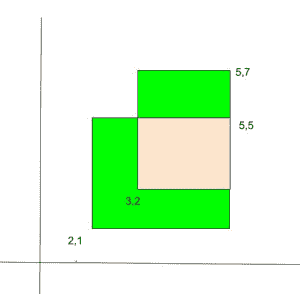

# 两个重叠矩形的总面积

> 原文:[https://www . geesforgeks . org/total-area-two-overlap-矩形/](https://www.geeksforgeeks.org/total-area-two-overlapping-rectangles/)

给定平面上两个重叠的矩形。我们得到了两个矩形的左下角和右上角。我们需要找到总面积(下图中的绿色和粉色区域)。



**示例:**

```
Input : Point l1 = {2, 2}, r1 = {5, 7};
        Point l2 = {3, 4}, r2 = {6, 9};
Output :Total Area = 24 

Input : Point l1 = {2, 1}, r1 = {5, 5};
        Point l2 = {3, 2}, r2 = {5, 7};
Output :Total Area = 16
```

在[杜松](https://www.geeksforgeeks.org/juniper-interview-experience-set-5-sde111/)中询问

我们基本上是将两个矩形的面积相加。这包括相交部分两次，所以我们减去相交部分的面积。

```
Total Area = (Area of 1st rectangle + 
              Area of 2nd rectangle) - 
              Area of Intersecting part
```

矩形面积= x _ 距离* y _ 距离

其中，第一个矩形的
x _ distance = ABS(L1 . x–R1 . x)
第一个矩形的 y _ distance = ABS(L1 . y–R1 . y)

同样，我们可以计算第二个矩形的面积。

对于相交部分的面积，
相交矩形的 x _ distance = min(R1 . x，R2 . x)–max(L1 . x，l2.x)
第一个矩形的 y _ distance = min(R1 . y，R2 . y)–max(L1 . y，l2.y)

如果 x_distance 或 y_distance 为负，则两个矩形不相交。在这种情况下，重叠区域为 0。

下面是上述方法的实现:

## C++

```
// C++ program to find total area of two
// overlapping Rectangles
#include <bits/stdc++.h>
using namespace std;

struct Point {
    int x, y;
};

// Returns Total Area  of two overlap
// rectangles
int overlappingArea(Point l1, Point r1,
                    Point l2, Point r2)
{
    // Area of 1st Rectangle
    int area1 = abs(l1.x - r1.x)
      * abs(l1.y - r1.y);

    // Area of 2nd Rectangle
    int area2 = abs(l2.x - r2.x)
      * abs(l2.y - r2.y);

    // Length of intersecting part i.e
    // start from max(l1.x, l2.x) of
    // x-coordinate and end at min(r1.x,
    // r2.x) x-coordinate by subtracting
    // start from end we get required
    // lengths
    int x_dist = min(r1.x, r2.x)
                  - max(l1.x, l2.x);
    int y_dist = (min(r1.y, r2.y)
                  - max(l1.y, l2.y));
    int areaI = 0;
    if( x_dist > 0 && y_dist > 0 )
    {
        areaI = x_dist * y_dist;
    }

    return (area1 + area2 - areaI);
}

// Driver Code
int main()
{
    Point l1 = { 2, 2 }, r1 = { 5, 7 };
    Point l2 = { 3, 4 }, r2 = { 6, 9 };

    // Function Call
    cout << overlappingArea(l1, r1, l2, r2);
    return 0;
}
```

## Java 语言(一种计算机语言，尤用于创建网站)

```
// Java program to find total area of two
// overlapping Rectangles
class GFG {

    static class Point {
        int x, y;

        public Point(int x, int y)
        {
            this.x = x;
            this.y = y;
        }
    };

    // Returns Total Area of two overlap
    // rectangles
    static int overlappingArea(Point l1, Point r1,
                               Point l2, Point r2)
    {
        // Area of 1st Rectangle
        int area1
            = Math.abs(l1.x - r1.x)
              * Math.abs(l1.y - r1.y);

        // Area of 2nd Rectangle
        int area2
            = Math.abs(l2.x - r2.x)
              * Math.abs(l2.y - r2.y);

        // Length of intersecting part i.e
        // start from max(l1.x, l2.x) of
        // x-coordinate and end at min(r1.x,
        // r2.x) x-coordinate by subtracting
        // start from end we get required
        // lengths

        int x_dist = (Math.min(r1.x, r2.x)
                      - Math.max(l1.x, l2.x);
        int y_dist = (Math.min(r1.y, r2.y)
                 - Math.max(l1.y, l2.y);
        int areaI = 0;
        if( x_dist > 0 && y_dist > 0 )
        {
            areaI = x_dist * y_dist;
        }

        return (area1 + area2 - areaI);
    }

    // Driver Code
    public static void main(String[] args)
    {
        Point l1 = new Point(2, 2), r1 = new Point(5, 7);
        Point l2 = new Point(3, 4), r2 = new Point(6, 9);

        // Function Call
        System.out.println(overlappingArea(l1, r1, l2, r2));
    }
}

// This code is contributed by PrinciRaj1992
```

## 蟒蛇 3

```
# Python program to find total area of two
# overlapping Rectangles
# Returns Total Area  of two overlap
#  rectangles

def overlappingArea(l1, r1, l2, r2):
    x = 0
    y = 1

    # Area of 1st Rectangle
    area1 = abs(l1[x] - r1[x]) * abs(l1[y] - r1[y])

    # Area of 2nd Rectangle
    area2 = abs(l2[x] - r2[x]) * abs(l2[y] - r2[y])

    ''' Length of intersecting part i.e 
        start from max(l1[x], l2[x]) of 
        x-coordinate and end at min(r1[x],
        r2[x]) x-coordinate by subtracting 
        start from end we get required 
        lengths '''
    x_dist = (min(r1[x], r2[x]) -
              max(l1[x], l2[x]))

    y_dist = (min(r1[y], r2[y]) -
              max(l1[y], l2[y]))
    areaI = 0
    if x_dist > 0 and y_dist > 0:
        areaI = x_dist * y_dist

    return (area1 + area2 - areaI)

# Driver's Code
l1 = [2, 2]
r1 = [5, 7]
l2 = [3, 4]
r2 = [6, 9]

# Function call
print(overlappingArea(l1, r1, l2, r2))

# This code is contributed by Manisha_Ediga
```

## C#

```
// C# program to find total area of two
// overlapping Rectangles
using System;

class GFG {
    public class Point {
        public int x, y;

        public Point(int x, int y)
        {
            this.x = x;
            this.y = y;
        }
    };

    // Returns Total Area of two overlap
    // rectangles
    static int overlappingArea(Point l1, Point r1, Point l2,
                               Point r2)
    {
        // Area of 1st Rectangle
        int area1
            = Math.Abs(l1.x - r1.x) * Math.Abs(l1.y - r1.y);

        // Area of 2nd Rectangle
        int area2
            = Math.Abs(l2.x - r2.x) * Math.Abs(l2.y - r2.y);

        // Length of intersecting part i.e
        // start from max(l1.x, l2.x) of
        // x-coordinate and end at min(r1.x,
        // r2.x) x-coordinate by subtracting
        // start from end we get required
        // lengths
        int x_dist
            = (Math.Min(r1.x, r2.x) - Math.Max(l1.x, l2.x));
        int y_dist
            = (Math.Min(r1.y, r2.y) - Math.Max(l1.y, l2.y));
        int areaI = 0;
        if (x_dist > 0 && y_dist > 0) {
            areaI = x_dist * y_dist;
        }

        return (area1 + area2 - areaI);
    }

    // Driver Code
    public static void Main(String[] args)
    {
        Point l1 = new Point(2, 2), r1 = new Point(5, 7);
        Point l2 = new Point(3, 4), r2 = new Point(6, 9);

        // Function Call
        Console.WriteLine(overlappingArea(l1, r1, l2, r2));
    }
}

// This code is contributed by PrinciRaj1992
```

## java 描述语言

```
<script>

// Javascript program to find total area of two
// overlapping Rectangles
// Returns Total Area  of two overlap
//  rectangles

function overlappingArea(l1, r1, l2, r2)
{
    let x = 0
    let y = 1

    // Area of 1st Rectangle
    let area1 = Math.abs(l1[x] - r1[x]) * Math.abs(l1[y] - r1[y])

    // Area of 2nd Rectangle
    let area2 = Math.abs(l2[x] - r2[x]) * Math.abs(l2[y] - r2[y])

    // Length of intersecting part i.e
    // start from max(l1[x], l2[x]) of
    // x-coordinate and end at min(r1[x],
    // r2[x]) x-coordinate by subtracting
    // start from end we get required
    // lengths
    let x_dist = (Math.min(r1[x], r2[x]) -
              Math.max(l1[x], l2[x]))

    let y_dist = (Math.min(r1[y], r2[y]) -
              Math.max(l1[y], l2[y]))
    let areaI = 0
    if (x_dist > 0 && y_dist > 0)
        areaI = x_dist * y_dist

    return (area1 + area2 - areaI)
}

    // Driver Code

    let l1 = [2, 2]
    let r1 = [5, 7]
    let l2 = [3, 4]
    let r2 = [6, 9]

    // Function call
   document.write(overlappingArea(l1, r1, l2, r2))

// This code is contributed by jana_sayantan.  

</script>
```

**Output**

```
24
```