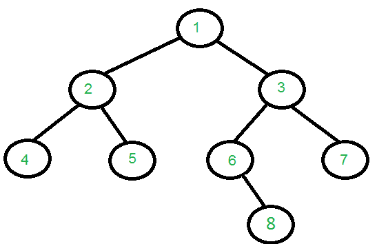
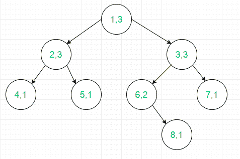
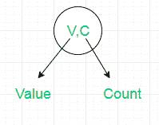

# 欧拉回路树中遍历的总节点数

> 原文:[https://www . geesforgeks . org/total-nodes-in-Euler-tour-tree/](https://www.geeksforgeeks.org/total-nodes-traversed-in-euler-tour-tree/)

[*欧拉树之旅*](https://www.geeksforgeeks.org/euler-tour-tree/) 已经讨论过了，它将树的层次结构展平成一个数组，该数组包含精确的 *2*N-1* 值。在这篇文章中，任务是证明欧拉巡树的度是节点数减 1 的 2 倍。这里的度是指欧拉巡回赛中遍历的节点总数。
**举例:**

> 输入:
> 
> 
> 
> 输出:15
> 输入:
> 
> 
> 
> 输出:17

说明:
使用**例 1** :



其中



> **可以看到，欧拉游中每个节点的计数正好等于节点的出度加 1。**
> 数学上可以表示为:
> ![$\displaystyle Total=\sum_{node_i=1}^{N} Out_D_e_g[node_i]+1$  ](img/9a3cd2be94f55ec51e2fd47209130f61.png "Rendered by QuickLaTeX.com")
> ![$\displaystyle Total= N + \sum_{node_i=1}^{N} Out_D_e_g[node_i]$  ](img/6f79be1d345d1dff3af3f738dac302ca.png "Rendered by QuickLaTeX.com")
> 其中
> ***Total*** 表示欧拉巡树中的节点总数
> 表示给定树中的第 ith 个节点
> N 表示给定树中的节点总数
> ![Out_D_e_g[node_i]  ](img/d6400c08d6d41652a2221383b2da8eb2.png "Rendered by QuickLaTeX.com")表示
> 的子节点数】

## C++

```
// C++ program to check the number of nodes
// in Euler Tour tree.
#include <bits/stdc++.h>
using namespace std;

#define MAX 1001

// Adjacency list representation of tree
vector<int> adj[MAX];

// Function to add edges to tree
void add_edge(int u, int v)
{
    adj[u].push_back(v);
}

// Program to check if calculated Value is
// equal to 2*size-1
void checkTotalNumberofNodes(int actualAnswer,
                              int size)
{
    int calculatedAnswer = size;

    // Add out-degree of each node
    for (int i = 1; i <= size; i++)
        calculatedAnswer += adj[i].size();

    if (actualAnswer == calculatedAnswer)
        cout << "Calculated Answer is " << calculatedAnswer
                     << " and is Equal to Actual Answer\n";
    else
        cout << "Calculated Answer is Incorrect\n";
}
int main()
{ // Constructing 1st tree from example
    int N = 8;
    add_edge(1, 2);
    add_edge(1, 3);
    add_edge(2, 4);
    add_edge(2, 5);
    add_edge(3, 6);
    add_edge(3, 7);
    add_edge(6, 8);

    // Out_deg[node[i]] is equal to adj[i].size()
    checkTotalNumberofNodes(2 * N - 1, N);

    // clear previous stored tree
    for (int i = 1; i <= N; i++)
        adj[i].clear();

    // Constructing 2nd tree from example
    N = 9;
    add_edge(1, 2);
    add_edge(1, 3);
    add_edge(2, 4);
    add_edge(2, 5);
    add_edge(2, 6);
    add_edge(3, 9);
    add_edge(5, 7);
    add_edge(5, 8);

    // Out_deg[node[i]] is equal to adj[i].size()
    checkTotalNumberofNodes(2 * N - 1, N);

    return 0;
}
```

## Java 语言(一种计算机语言，尤用于创建网站)

```
// Java program to check the number of nodes
// in Euler Tour tree.
import java.util.*;

class GFG
{
    static final int MAX = 1001;

    // Adjacency list representation of tree
    static Vector<Integer>[] adj = new Vector[MAX];

    // Function to add edges to tree
    static void add_edge(int u, int v)
    {
        adj[u].add(v);
    }

    // Program to check if calculated Value is
    // equal to 2*size-1
    static void checkTotalNumberofNodes(int actualAnswer,
                                        int size)
    {
        int calculatedAnswer = size;

        // Add out-degree of each node
        for (int i = 1; i <= size; i++)
            calculatedAnswer += adj[i].size();

        if (actualAnswer == calculatedAnswer)
            System.out.print("Calculated Answer is " +
                                    calculatedAnswer +
                  " and is Equal to Actual Answer\n");
        else
            System.out.print("Calculated Answer is Incorrect\n");
    }

    // Driver Code
    public static void main(String[] args)
    {
        for (int i = 0; i < MAX; i++)
            adj[i] = new Vector<Integer>();

        // Constructing 1st tree from example
        int N = 8;
        add_edge(1, 2);
        add_edge(1, 3);
        add_edge(2, 4);
        add_edge(2, 5);
        add_edge(3, 6);
        add_edge(3, 7);
        add_edge(6, 8);

        // Out_deg[node[i]] is equal to adj[i].size()
        checkTotalNumberofNodes(2 * N - 1, N);

        // clear previous stored tree
        for (int i = 1; i <= N; i++)
            adj[i].clear();

        // Constructing 2nd tree from example
        N = 9;
        add_edge(1, 2);
        add_edge(1, 3);
        add_edge(2, 4);
        add_edge(2, 5);
        add_edge(2, 6);
        add_edge(3, 9);
        add_edge(5, 7);
        add_edge(5, 8);

        // Out_deg[node[i]] is equal to adj[i].size()
        checkTotalNumberofNodes(2 * N - 1, N);
    }
}

// This code is contributed by Rajput-Ji
```

## C#

```
// C# program to check the number
// of nodes in Euler Tour tree.
using System;
using System.Collections.Generic;

class GFG
{
    static readonly int MAX = 1001;

    // Adjacency list representation of tree
    static List<int>[] adj = new List<int>[MAX];

    // Function to add edges to tree
    static void add_edge(int u, int v)
    {
        adj[u].Add(v);
    }

    // Program to check if calculated Value is
    // equal to 2*size-1
    static void checkTotalNumberofNodes(int actualAnswer,
                                        int size)
    {
        int calculatedAnswer = size;

        // Add out-degree of each node
        for (int i = 1; i <= size; i++)
            calculatedAnswer += adj[i].Count;

        if (actualAnswer == calculatedAnswer)
            Console.Write("Calculated Answer is " +
                                 calculatedAnswer +
               " and is Equal to Actual Answer\n");
        else
            Console.Write("Calculated Answer " +
                              "is Incorrect\n");
    }

    // Driver Code
    public static void Main(String[] args)
    {
        for (int i = 0; i < MAX; i++)
            adj[i] = new List<int>();

        // Constructing 1st tree from example
        int N = 8;
        add_edge(1, 2);
        add_edge(1, 3);
        add_edge(2, 4);
        add_edge(2, 5);
        add_edge(3, 6);
        add_edge(3, 7);
        add_edge(6, 8);

        // Out_deg[node[i]] is equal to adj[i].Count
        checkTotalNumberofNodes(2 * N - 1, N);

        // clear previous stored tree
        for (int i = 1; i <= N; i++)
            adj[i].Clear();

        // Constructing 2nd tree from example
        N = 9;
        add_edge(1, 2);
        add_edge(1, 3);
        add_edge(2, 4);
        add_edge(2, 5);
        add_edge(2, 6);
        add_edge(3, 9);
        add_edge(5, 7);
        add_edge(5, 8);

        // Out_deg[node[i]] is equal to adj[i].Count
        checkTotalNumberofNodes(2 * N - 1, N);
    }
}

// This code is contributed by PrinciRaj1992
```

## java 描述语言

```
<script>

// Javascript program to check the number
// of nodes in Euler Tour tree.
var MAX = 1001;

// Adjacency list representation of tree
var adj = Array.from(Array(MAX), ()=>Array());

// Function to add edges to tree
function add_edge(u, v)
{
    adj[u].push(v);
}

// Program to check if calculated Value is
// equal to 2*size-1
function checkTotalNumberofNodes(actualAnswer, size)
{
    var calculatedAnswer = size;

    // push out-degree of each node
    for (var i = 1; i <= size; i++)
        calculatedAnswer += adj[i].length;
    if (actualAnswer == calculatedAnswer)
        document.write("Calculated Answer is " +
                             calculatedAnswer +
           " and is Equal to Actual Answer<br>");
    else
        document.write("Calculated Answer " +
                          "is Incorrect<br>");
}

// Driver Code
for (var i = 0; i < MAX; i++)
    adj[i] = [];

// Constructing 1st tree from example
var N = 8;
add_edge(1, 2);
add_edge(1, 3);
add_edge(2, 4);
add_edge(2, 5);
add_edge(3, 6);
add_edge(3, 7);
add_edge(6, 8);

// Out_deg[node[i]] is equal to adj[i].Count
checkTotalNumberofNodes(2 * N - 1, N);

// clear previous stored tree
for (var i = 1; i <= N; i++)
    adj[i] = []

// Constructing 2nd tree from example
N = 9;
add_edge(1, 2);
add_edge(1, 3);
add_edge(2, 4);
add_edge(2, 5);
add_edge(2, 6);
add_edge(3, 9);
add_edge(5, 7);
add_edge(5, 8);

// Out_deg[node[i]] is equal to adj[i].Count
checkTotalNumberofNodes(2 * N - 1, N);

// This code is contributed by itsok.
</script>
```

**输出:**

```
Calculated Answer is 15 and is Equal to Actual Answer
Calculated Answer is 17 and is Equal to Actual Answer
```