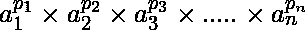
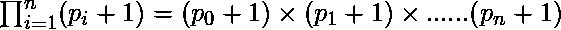

# 给定数的除数总数

> 原文:[https://www . geesforgeks . org/total-number-dividers-给定-number/](https://www.geeksforgeeks.org/total-number-divisors-given-number/)

给定一个正整数 n，我们要求 n 的除数总数

**示例:**

```
Input : n = 25
Output : 3
Divisors are 1, 5 and 25.

Input : n = 24
Output : 8
Divisors are 1, 2, 3, 4, 6, 8
12 and 24.
```

我们已经讨论了打印所有除数的不同方法(这里的和这里的)。这里的任务比较简单，我们需要计算除数。
首先把从 2 到 max_size 的所有素数存储在一个数组中，这样我们只需要检查素数因子。现在我们只希望以下面的形式计算 n 的因式分解:
**n =**
=
其中 *a <sub>i</sub>* 是质因数， *p <sub>i</sub>* 是它们的整数次方。
所以，对于这个因式分解，我们有公式可以求出除数 n 的总数，也就是:


## C++

```
// CPP program for finding number of divisor
#include <bits/stdc++.h>

using namespace std;

// program for finding no. of divisors
int divCount(int n)
{
    // sieve method for prime calculation
    bool hash[n + 1];
    memset(hash, true, sizeof(hash));
    for (int p = 2; p * p < n; p++)
        if (hash[p] == true)
            for (int i = p * 2; i < n; i += p)
                hash[i] = false;

    // Traversing through all prime numbers
    int total = 1;
    for (int p = 2; p <= n; p++) {
        if (hash[p]) {

            // calculate number of divisor
            // with formula total div = 
            // (p1+1) * (p2+1) *.....* (pn+1)
            // where n = (a1^p1)*(a2^p2).... 
            // *(an^pn) ai being prime divisor
            // for n and pi are their respective 
            // power in factorization
            int count = 0;
            if (n % p == 0) {
                while (n % p == 0) {
                    n = n / p;
                    count++;
                }
                total = total * (count + 1);
            }
        }
    }
    return total;
}

// driver program
int main()
{
    int n = 24;
    cout << divCount(n);
    return 0;
}
```

## Java 语言(一种计算机语言，尤用于创建网站)

```
// Java program for finding
// number of divisor
import java.io.*;
import java.util.*;
import java.lang.*;

class GFG
{
// program for finding 
// no. of divisors
static int divCount(int n)
{
    // sieve method for prime calculation
    boolean hash[] = new boolean[n + 1];
    Arrays.fill(hash, true);
    for (int p = 2; p * p < n; p++)
        if (hash[p] == true)
            for (int i = p * 2; i < n; i += p)
                hash[i] = false;

    // Traversing through 
    // all prime numbers
    int total = 1;
    for (int p = 2; p <= n; p++) 
    {
        if (hash[p])
        {

            // calculate number of divisor
            // with formula total div = 
            // (p1+1) * (p2+1) *.....* (pn+1)
            // where n = (a1^p1)*(a2^p2).... 
            // *(an^pn) ai being prime divisor
            // for n and pi are their respective 
            // power in factorization
            int count = 0;
            if (n % p == 0) 
            {
                while (n % p == 0) 
                {
                    n = n / p;
                    count++;
                }
                total = total * (count + 1);
            }
        }
    }
    return total;
}

// Driver Code
public static void main(String[] args)
{
    int n = 24;
    System.out.print(divCount(n));
}
}

// This code is contributed 
// by Akanksha Rai(Abby_akku)
```

## 蟒蛇 3

```
# Python3 program for finding 
# number of divisor

# program for finding 
# no. of divisors
def divCount(n):

    # sieve method for
    # prime calculation
    hh = [1] * (n + 1);

    p = 2;
    while((p * p) < n):
        if (hh[p] == 1):
            for i in range((p * 2), n, p):
                hh[i] = 0;
        p += 1;

    # Traversing through 
    # all prime numbers
    total = 1;
    for p in range(2, n + 1):
        if (hh[p] == 1):

            # calculate number of divisor
            # with formula total div = 
            # (p1+1) * (p2+1) *.....* (pn+1)
            # where n = (a1^p1)*(a2^p2).... 
            # *(an^pn) ai being prime divisor
            # for n and pi are their respective 
            # power in factorization
            count = 0;
            if (n % p == 0):
                while (n % p == 0):
                    n = int(n / p);
                    count += 1;
                total *= (count + 1);

    return total;

# Driver Code
n = 24;
print(divCount(n));

# This code is contributed by mits
```

## C#

```
// C# program for finding
// number of divisor
using System;

class GFG
{
// program for finding 
// no. of divisors
static int divCount(int n)
{
    // sieve method for prime calculation
    bool[] hash = new bool[n + 1];
    for (int p = 2; p * p < n; p++)
        if (hash[p] == false)
            for (int i = p * 2;
                     i < n; i += p)
                hash[i] = true;

    // Traversing through 
    // all prime numbers
    int total = 1;
    for (int p = 2; p <= n; p++) 
    {
        if (hash[p] == false)
        {

            // calculate number of divisor
            // with formula total div = 
            // (p1+1) * (p2+1) *.....* (pn+1)
            // where n = (a1^p1)*(a2^p2).... 
            // *(an^pn) ai being prime divisor
            // for n and pi are their respective 
            // power in factorization
            int count = 0;
            if (n % p == 0) 
            {
                while (n % p == 0) 
                {
                    n = n / p;
                    count++;
                }
                total = total * (count + 1);
            }
        }
    }
    return total;
}

// Driver Code
public static void Main()
{
    int n = 24;
    Console.WriteLine(divCount(n));
}
}

// This code is contributed 
// by mits
```

## 服务器端编程语言（Professional Hypertext Preprocessor 的缩写）

```
<?php
// PHP program for finding 
// number of divisor

// program for finding 
// no. of divisors
function divCount($n)
{
    // sieve method for
    // prime calculation
    $hash = array_fill(0, $n + 1, 1);

    for ($p = 2; 
        ($p * $p) < $n; $p++)
        if ($hash[$p] == 1)
            for ($i = ($p * 2); 
                 $i < $n; $i= ($i + $p))
                $hash[$i] = 0;

    // Traversing through 
    // all prime numbers
    $total = 1;
    for ($p = 2; $p <= $n; $p++)
    {
        if ($hash[$p] == 1) 
        {

            // calculate number of divisor
            // with formula total div = 
            // (p1+1) * (p2+1) *.....* (pn+1)
            // where n = (a1^p1)*(a2^p2).... 
            // *(an^pn) ai being prime divisor
            // for n and pi are their respective 
            // power in factorization
            $count = 0;
            if ($n % $p == 0) 
            {
                while ($n % $p == 0)
                {
                    $n = ($n / $p);
                    $count++;
                }
                $total = $total * 
                        ($count + 1);
            }
        }
    }
    return $total;
}

// Driver Code
$n = 24;
echo divCount($n);

// This code is contributed by mits
?>
```

## java 描述语言

```
<script>

// Javascript program for finding number of divisor

// program for finding no. of divisors
function divCount(n)
{
    // sieve method for prime calculation
    var hash = Array(n+1).fill(true);
    for (var p = 2; p * p < n; p++)
        if (hash[p] == true)
            for (var i = p * 2; i < n; i += p)
                hash[i] = false;

    // Traversing through all prime numbers
    var total = 1;
    for (var p = 2; p <= n; p++) {
        if (hash[p]) {

            // calculate number of divisor
            // with formula total div = 
            // (p1+1) * (p2+1) *.....* (pn+1)
            // where n = (a1^p1)*(a2^p2).... 
            // *(an^pn) ai being prime divisor
            // for n and pi are their respective 
            // power in factorization
            var count = 0;
            if (n % p == 0) {
                while (n % p == 0) {
                    n = parseInt(n / p);
                    count++;
                }
                total = total * (count + 1);
            }
        }
    }
    return total;
}

// driver program
var n = 24;
document.write( divCount(n));

</script>
```

**Output:** 

```
8
```

参考:[除数。](http://primes.utm.edu/glossary/xpage/tau.html)
本文由 [**希瓦姆·普拉丹(anuj_charm)**](http://www.facebook.com/ma5ter6it) 供稿。如果你喜欢 GeeksforGeeks 并想投稿，你也可以使用[contribute.geeksforgeeks.org](http://www.contribute.geeksforgeeks.org)写一篇文章或者把你的文章邮寄到 contribute@geeksforgeeks.org。看到你的文章出现在极客博客主页上，帮助其他极客。
如果发现有不正确的地方，或者想分享更多关于上述话题的信息，请写评论。