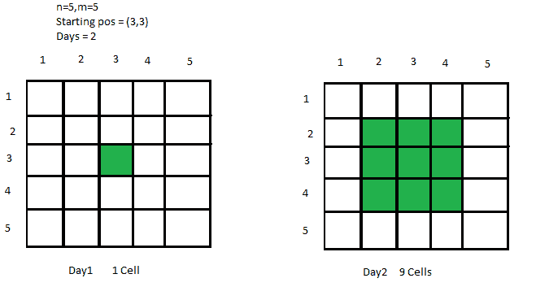
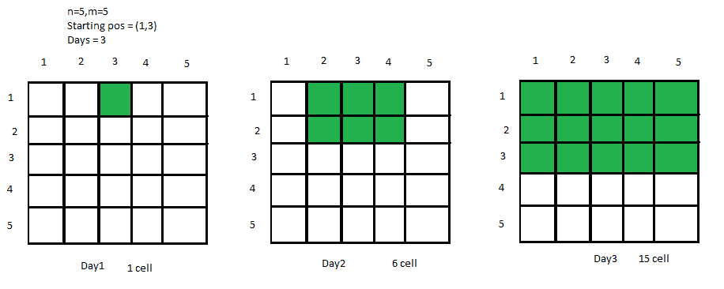
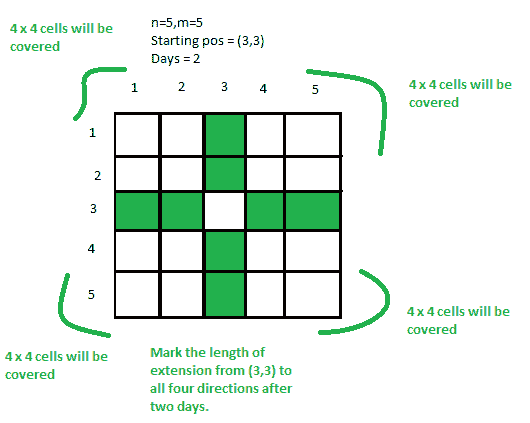

# D 天后覆盖在基质中的细胞总数

> 原文:[https://www . geeksforgeeks . org/d 天后矩阵覆盖的细胞总数/](https://www.geeksforgeeks.org/total-number-of-cells-covered-in-a-matrix-after-d-days/)

给定一个 **N * M** 矩阵和一个病毒的起始位置 **(X，Y)** ，任务是找出 **D** 天后被覆盖细胞的数量，如果病毒每天从其当前细胞传播到其**相邻的**细胞。

[](https://media.geeksforgeeks.org/wp-content/uploads/20200604135338/223-1.png)

**例:**

> **输入:** N = 5，M = 5，X = 1，Y = 3，D = 3
> 
> [](https://media.geeksforgeeks.org/wp-content/uploads/20200604135333/1406-5.png)
> 
> **输出:** 15
> **说明:**
> 从图中我们可以清楚的看到 3 天后 15 个细胞被覆盖。
> **输入:** N = 10，M = 10，X = 7，Y = 8，D = 4
> **输出:** 42
> **解释:**
> 在制作一个 N * M 矩阵并填充相邻单元格 4 天后，我们将获得 42 个被覆盖的单元格。

**方法:**
要解决上述问题，我们必须清楚地观察到，从一个起始细胞开始，我们只需要在 **D** 天后，找出细胞朝向**顶部、右侧、底部**和**左侧**的**延伸**。然后计算形成的每个**四边形单元格**内的总单元格，并全部相加。
因此，考虑到四边形的边界，总答案将是 **D 天**后所有四边形细胞的总和+沿顶部、右侧、下侧、左侧和 1(起始细胞)的总细胞。
以下是向四个方向延伸的条件:

> 延伸至顶部-> **分钟(D，X-1)**
> 延伸至向下- > **分钟(D，N-X)**
> 延伸至左侧- > **分钟(D，Y-1)**
> 延伸至右侧- > **分钟(D，M-Y)**

请看下图，了解清楚:

[](https://media.geeksforgeeks.org/wp-content/uploads/20200604141844/3164-1.png)

现在将**上*左**、**上*右**、**下*左**、**下*右**相乘，将它们全部相加，同时也将 4 个方向的直线上的总单元格相加。我们还添加 **1** (用于起始单元格)来获得结果单元格。
以下是上述方法的实施:

## C++

```
// C++ implementation to find the
// Total number of cells covered
// in a matrix after D days

#include <bits/stdc++.h>
using namespace std;

// Function to return the total
// infected cells after d days
int solve(int n, int m, int x,
        int y, int d)
{
    // Top extension
    int top = min(d, x - 1);

    // Bottom extension
    int down = min(d, n - x);

    // Left extension
    int left = min(d, y - 1);

    // Right extension
    int right = min(d, m - y);

    // Calculating the cells
    // in each quadrilateral
    int quad1 = top * left;
    int quad2 = left * down;
    int quad3 = down * right;
    int quad4 = right * top;

    // Sum all of them to get
    // total cells in each
    // quadrilateral
    int totalsq = quad1 + quad2
                + quad3 + quad4;

    // Add the singleblocks
    // along the lines of top,
    // down, left, right
    int singleBlocks = top + down
                    + left + right + 1;

    // Return the ans
    return totalsq + singleBlocks;
}

// Driver code
int main()
{
    int n, m, x, y, d;

    // Dimensions of cell
    n = 10, m = 10;

    // Starting Coordinates
    x = 7, y = 8;

    // Number of Days
    d = 4;
    d--;

    // Function Call
    cout << solve(n, m, x, y, d);
}
```

## Java 语言(一种计算机语言，尤用于创建网站)

```
// Java implementation to find the
// total number of cells covered
// in a matrix after D days
import java.util.*;

class GFG{

// Function to return the total
// infected cells after d days
static int solve(int n, int m, int x,
                 int y, int d)
{

    // Top extension
    int top = Math.min(d, x - 1);

    // Bottom extension
    int down = Math.min(d, n - x);

    // Left extension
    int left = Math.min(d, y - 1);

    // Right extension
    int right = Math.min(d, m - y);

    // Calculating the cells
    // in each quadrilateral
    int quad1 = top * left;
    int quad2 = left * down;
    int quad3 = down * right;
    int quad4 = right * top;

    // Sum all of them to get
    // total cells in each
    // quadrilateral
    int totalsq = quad1 + quad2 +
                  quad3 + quad4;

    // Add the singleblocks
    // along the lines of top,
    // down, left, right
    int singleBlocks = top + down +
                      left + right + 1;

    // Return the ans
    return totalsq + singleBlocks;
}

// Driver code
public static void main(String[] args)
{

    // Dimensions of cell
    int n = 10, m = 10;

    // Starting coordinates
    int x = 7, y = 8;

    // Number of days
    int d = 4;
    d--;

    // Function call
    System.out.println(solve(n, m, x, y, d));
}
}

// This code is contributed by Pratima Pandey
```

## 蟒蛇 3

```
# Python3 implementation to find the
# total number of cells covered in
# a matrix after D days

# Function to return the total
# infected cells after d days
def solve(n, m, x, y, d):

    # Top extension
    top = min(d, x - 1)

    # Bottom extension
    down = min(d, n - x)

    # Left extension
    left = min(d, y - 1)

    # Right extension
    right = min(d, m - y)

    # Calculating the cells
    # in each quadrilateral
    quad1 = top * left
    quad2 = left * down
    quad3 = down * right
    quad4 = right * top

    # Sum all of them to get
    # total cells in each
    # quadrilateral
    totalsq = (quad1 + quad2 +
               quad3 + quad4)

    # Add the singleblocks
    # along the lines of top,
    # down, left, right
    singleBlocks = (top + down +
                   left + right + 1)

    # Return the ans
    return totalsq + singleBlocks

# Driver Code
if __name__ == '__main__':

    # Dimensions of cell
    n = 10
    m = 10

    # Starting Coordinates
    x = 7
    y = 8

    # Number of Days
    d = 4
    d -= 1

    # Function Call
    print(solve(n, m, x, y, d))

# This code is contributed by Shivam Singh
```

## C#

```
// C# implementation to find the
// total number of cells covered
// in a matrix after D days
using System;
class GFG{

// Function to return the total
// infected cells after d days
static int solve(int n, int m, int x,
                 int y, int d)
{

    // Top extension
    int top = Math.Min(d, x - 1);

    // Bottom extension
    int down = Math.Min(d, n - x);

    // Left extension
    int left = Math.Min(d, y - 1);

    // Right extension
    int right = Math.Min(d, m - y);

    // Calculating the cells
    // in each quadrilateral
    int quad1 = top * left;
    int quad2 = left * down;
    int quad3 = down * right;
    int quad4 = right * top;

    // Sum all of them to get
    // total cells in each
    // quadrilateral
    int totalsq = quad1 + quad2 +
                  quad3 + quad4;

    // Add the singleblocks
    // along the lines of top,
    // down, left, right
    int singleBlocks = top + down +
                      left + right + 1;

    // Return the ans
    return totalsq + singleBlocks;
}

// Driver code
public static void Main(String[] args)
{

    // Dimensions of cell
    int n = 10, m = 10;

    // Starting coordinates
    int x = 7, y = 8;

    // Number of days
    int d = 4;
    d--;

    // Function call
    Console.WriteLine(solve(n, m, x, y, d));
}
}

// This code is contributed by Rohit_ranjan
```

## java 描述语言

```
<script>

// JavaScript implementation to find the
// total number of cells covered
// in a matrix after D days

// Function to return the total
// infected cells after d days
function solve(n, m, x, y, d)
{

    // Top extension
    let top = Math.min(d, x - 1);

    // Bottom extension
    let down = Math.min(d, n - x);

    // Left extension
    let left = Math.min(d, y - 1);

    // Right extension
    let right = Math.min(d, m - y);

    // Calculating the cells
    // in each quadrilateral
    let quad1 = top * left;
    let quad2 = left * down;
    let quad3 = down * right;
    let quad4 = right * top;

    // Sum all of them to get
    // total cells in each
    // quadrilateral
    let totalsq = quad1 + quad2 +
                  quad3 + quad4;

    // Add the singleblocks
    // along the lines of top,
    // down, left, right
    let singleBlocks = top + down +
                      left + right + 1;

    // Return the ans
    return totalsq + singleBlocks;
}

// Driver Code

    // Dimensions of cell
    let n = 10, m = 10;

    // Starting coordinates
    let x = 7, y = 8;

    // Number of days
    let d = 4;
    d--;

    // Function call
    document.write(solve(n, m, x, y, d));

 // This code is contributed by sanjoy_62.
</script>
```

**Output:** 

```
42
```

**时间复杂度:** *O(1)*