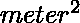
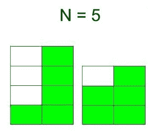
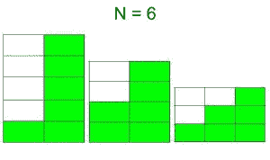
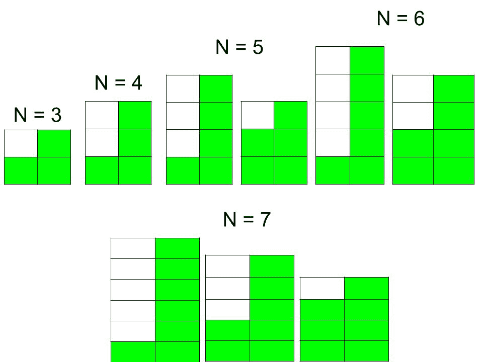

# 可由 N 个盒子制作的不同楼梯总数

> 原文:[https://www . geeksforgeeks . org/n 盒不同楼梯总数/](https://www.geeksforgeeks.org/total-number-of-different-staircase-that-can-made-from-n-boxes/)

给定 N 盒单位尺寸，即(1×1 )。任务是找出不同楼梯的总数，这些楼梯可以由具有以下规则的盒子制成:

*   楼梯必须严格按降序排列。
*   每个楼梯至少包含两个台阶。(总步数等于楼梯的宽度。)

**示例**:

> **输入** : N = 5
> **输出** : 2
> 两个楼梯如下:
> 
> 
> 
> **输入** : N = 6
> **输出** : 3
> 三个楼梯如下:
> 
> 

如果我们考虑总步数= 2，我们可以观察到，如果 N 增加 2，楼梯的数量增加 1。我们可以从下图来说明上述事情:



现在，如果总步数大于 2(假设，总步数= K)，那么我们可以把这个事情作为首先为楼梯创建一个基础(基础需要等于总步数的框)，并在其上放置另一个步长为 K 的楼梯，K–1 有框 N–K(因为 K 个框已经用于创建基础)。因此，我们可以使用自下而上的动态规划来解决这个问题。

下面是上述方法的实现:

## C++

```
// C++ program to find the total number of
// different staircase that can made
// from N boxes
#include <iostream>
using namespace std;

// Function to find the total number of
// different staircase that can made
// from N boxes
int countStaircases(int N)
{
    // DP table, there are two states.
    // First describes the number of boxes
    // and second describes the step
    int memo[N + 5][N + 5];

    // Initialize all the elements of
    // the table to zero
    for (int i = 0; i <= N; i++) {
        for (int j = 0; j <= N; j++) {
            memo[i][j] = 0;
        }
    }

    // Base case
    memo[3][2] = memo[4][2] = 1;

    for (int i = 5; i <= N; i++) {
        for (int j = 2; j <= i; j++) {

            // When step is equal to 2
            if (j == 2) {
                memo[i][j] = memo[i - j][j] + 1;
            }

            // When step is greater than 2
            else {
                memo[i][j] = memo[i - j][j] +
                             memo[i - j][j - 1];
            }
        }
    }

    // Count the total staircase
    // from all the steps
    int answer = 0;
    for (int i = 1; i <= N; i++)
        answer = answer + memo[N][i];   

    return answer;
}

// Driver Code
int main()
{
    int N = 7;

    cout << countStaircases(N);

    return 0;
}
```

## Java 语言(一种计算机语言，尤用于创建网站)

```
// Java program to find the total number of
// different staircase that can made
// from N boxes

import java.util.*;

class GFG
{
        // Function to find the total number of
        // different staircase that can made
        // from N boxes
        static int countStaircases(int N)
        {
            // DP table, there are two states.
            // First describes the number of boxes
            // and second describes the step
            int [][] memo=new int[N + 5][N + 5];

            // Initialize all the elements of
            // the table to zero
            for (int i = 0; i <= N; i++) {
                for (int j = 0; j <= N; j++) {
                    memo[i][j] = 0;
                }
            }

            // Base case
            memo[3][2] = memo[4][2] = 1;

            for (int i = 5; i <= N; i++) {
                for (int j = 2; j <= i; j++) {

                    // When step is equal to 2
                    if (j == 2) {
                        memo[i][j] = memo[i - j][j] + 1;
                    }

                    // When step is greater than 2
                    else {
                        memo[i][j] = memo[i - j][j] +
                                    memo[i - j][j - 1];
                    }
                }
            }

            // Count the total staircase
            // from all the steps
            int answer = 0;
            for (int i = 1; i <= N; i++)
                answer = answer + memo[N][i];

            return answer;
        }

        // Driver Code
        public static void main(String [] args)
        {
            int N = 7;

            System.out.println(countStaircases(N));

        }

}

// This code is contributed
// by ihritik
```

## 蟒蛇 3

```
# Python 3 program to find the total
# number of different staircase that
# can made from N boxes

# Function to find the total number
# of different staircase that can
# made from N boxes
def countStaircases(N):

    # DP table, there are two states.
    # First describes the number of boxes
    # and second describes the step
    memo = [[0 for x in range(N + 5)]
               for y in range(N + 5)]

    # Initialize all the elements of
    # the table to zero
    for i in range(N + 1):
        for j in range (N + 1):
            memo[i][j] = 0

    # Base case
    memo[3][2] = memo[4][2] = 1

    for i in range (5, N + 1) :
        for j in range (2, i + 1) :

            # When step is equal to 2
            if (j == 2) :
                memo[i][j] = memo[i - j][j] + 1

            # When step is greater than 2
            else :
                memo[i][j] = (memo[i - j][j] +
                              memo[i - j][j - 1])

    # Count the total staircase
    # from all the steps
    answer = 0
    for i in range (1, N + 1):
        answer = answer + memo[N][i]

    return answer

# Driver Code
if __name__ == "__main__":

    N = 7

    print (countStaircases(N))

# This code is contributed
# by ChitraNayal
```

## C#

```
// C# program to find the total number
// of different staircase that can made
// from N boxes
using System;

class GFG
{

// Function to find the total number
// of different staircase that can
// made from N boxes
static int countStaircases(int N)
{
    // DP table, there are two states.
    // First describes the number of boxes
    // and second describes the step
    int [,] memo = new int[N + 5, N + 5];

    // Initialize all the elements
    // of the table to zero
    for (int i = 0; i <= N; i++)
    {
        for (int j = 0; j <= N; j++)
        {
            memo[i, j] = 0;
        }
    }

    // Base case
    memo[3, 2] = memo[4, 2] = 1;

    for (int i = 5; i <= N; i++)
    {
        for (int j = 2; j <= i; j++)
        {

            // When step is equal to 2
            if (j == 2)
            {
                memo[i, j] = memo[i - j, j] + 1;
            }

            // When step is greater than 2
            else
            {
                memo[i, j] = memo[i - j, j] +
                             memo[i - j, j - 1];
            }
        }
    }

    // Count the total staircase
    // from all the steps
    int answer = 0;
    for (int i = 1; i <= N; i++)
        answer = answer + memo[N, i];

    return answer;
}

// Driver Code
public static void Main()
{
    int N = 7;

    Console.WriteLine(countStaircases(N));
}
}

// This code is contributed
// by Subhadeep
```

## 服务器端编程语言（Professional Hypertext Preprocessor 的缩写）

```
<?php
// PHP program to find the total
// number of different staircase
// that can made from N boxes

// Function to find the total
// number of different staircase
// that can made from N boxes
function countStaircases($N)
{

    // Initialize all the elements
    // of the table to zero
    for ($i = 0; $i <= $N; $i++)
    {
        for ($j = 0; $j <= $N; $j++)
        {
            $memo[$i][$j] = 0;
        }
    }

    // Base case
    $memo[3][2] = $memo[4][2] = 1;

    for ($i = 5; $i <= $N; $i++)
    {
        for ($j = 2; $j <= $i; $j++)
        {

            // When step is equal to 2
            if ($j == 2)
            {
                $memo[$i][$j] = $memo[$i - $j][$j] + 1;
            }

            // When step is greater than 2
            else
            {
                $memo[$i][$j] = $memo[$i - $j][$j] +
                                $memo[$i - $j][$j - 1];
            }
        }
    }

    // Count the total staircase
    // from all the steps
    $answer = 0;
    for ($i = 1; $i <= $N; $i++)
        $answer = $answer + $memo[$N][$i];

    return $answer;
}

// Driver Code
$N = 7;

echo countStaircases($N);

// This code is contributed
// by Shivi_Aggarwal
?>
```

## java 描述语言

```
<script>
        // Javascript program to find the total number of
        // different staircase that can made
        // from N boxes

        // Function to find the total number of
        // different staircase that can made
            // from N boxes
        function countStaircases(N)
        {
            // DP table, there are two states.
            // First describes the number of boxes
            // and second describes the step
            let memo=new Array(N + 5);
             for(let i=0;i<N+5;i++)
            {
                memo[i]=new Array(N+5);
                for(let j=0;j<N+5;j++)
                {
                    memo[i][j]=0;
                }
            }
            // Initialize all the elements of
            // the table to zero
            for (let i = 0; i <= N; i++) {
                for (let j = 0; j <= N; j++) {
                    memo[i][j] = 0;
                }
            }

            // Base case
            memo[3][2] = memo[4][2] = 1;

            for (let i = 5; i <= N; i++) {
                for (let j = 2; j <= i; j++) {

                    // When step is equal to 2
                    if (j == 2) {
                        memo[i][j] = memo[i - j][j] + 1;
                    }

                    // When step is greater than 2
                    else {
                        memo[i][j] = memo[i - j][j] +
                                    memo[i - j][j - 1];
                    }
                }
            }

            // Count the total staircase
            // from all the steps
            let answer = 0;
            for (let i = 1; i <= N; i++)
                answer = answer + memo[N][i];

            return answer;
           }

        // Driver Code
        let N = 7;
        document.write(countStaircases(N));

// This code is contributed by rag2127
</script>
```

**Output:** 

```
4
```

**时间复杂度** : O( )。