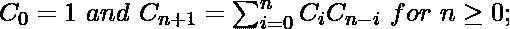

# 使用加泰罗尼亚文编号的可能二分搜索法树总数

> 原文:[https://www . geeksforgeeks . org/total-number-of-可能-binary-search-trees-use-Catalan-number/](https://www.geeksforgeeks.org/total-number-of-possible-binary-search-trees-using-catalan-number/)

给定一个整数 **N** ，任务是用 **N** 键统计可能的[二分搜索法树](https://www.geeksforgeeks.org/binary-search-tree-data-structure/)的数量。

**示例:**

```
Input: N = 2
Output: 2
For N = 2, there are 2 unique BSTs
     1               2  
      \            /
       2         1

Input: N = 9
Output: 4862
```

**方法:**用 **N** 键将要形成的二分搜索法树的数量可以通过简单地计算[加泰罗尼亚数字](https://www.geeksforgeeks.org/program-nth-catalan-number/)系列中相应的数字来计算。
前几个加泰罗尼亚数字为 **n = 0、1、2、3、…** 是 **1、1、2、5、14、42、132、429、1430、4862、…**
加泰罗尼亚数字满足以下递归公式:



下面是上述方法的实现:

## C++

```
// C++ implementation of the approach
#include <iostream>
using namespace std;

// Function to return the count
// of unique BSTs with n keys
int uniqueBSTs(int n)
{
    int n1, n2, sum = 0;

    // Base cases
    if (n == 1 || n == 0)
        return 1;

    // Find the nth Catalan number
    for (int i = 1; i <= n; i++) {

        // Recursive calls
        n1 = uniqueBSTs(i - 1);
        n2 = uniqueBSTs(n - i);
        sum += n1 * n2;
    }

    // Return the nth Catalan number
    return sum;
}

// Driver code
int main()
{
    int n = 2;

    // Function call
    cout << uniqueBSTs(n);

    return 0;
}
```

## Java 语言(一种计算机语言，尤用于创建网站)

```
// Java implementation of the approach
import java.io.*;

class GFG {

    // Function to return the count
    // of unique BSTs with n keys
    static int uniqueBSTs(int n)
    {
        int n1, n2, sum = 0;

        // Base cases
        if (n == 1 || n == 0)
            return 1;

        // Find the nth Catalan number
        for (int i = 1; i <= n; i++) {

            // Recursive calls
            n1 = uniqueBSTs(i - 1);
            n2 = uniqueBSTs(n - i);
            sum += n1 * n2;
        }

        // Return the nth Catalan number
        return sum;
    }

    // Driver code
    public static void main(String[] args)
    {

        int n = 2;

        // Function call
        System.out.println(uniqueBSTs(n));
    }
}

// This code is contributed by jit_t.
```

## 蟒蛇 3

```
# Python3 implementation of the approach

# Function to return the count
# of unique BSTs with n keys

def uniqueBSTs(n):

    n1, n2, sum = 0, 0, 0

    # Base cases
    if (n == 1 or n == 0):
        return 1

    # Find the nth Catalan number
    for i in range(1, n + 1):

        # Recursive calls
        n1 = uniqueBSTs(i - 1)
        n2 = uniqueBSTs(n - i)
        sum += n1 * n2

    # Return the nth Catalan number
    return sum

# Driver code
n = 2

# Function call
print(uniqueBSTs(n))

# This code is contributed by Mohit Kumar
```

## C#

```
// C# implementation of the approach
using System;

class GFG {

    // Function to return the count
    // of unique BSTs with n keys
    static int uniqueBSTs(int n)
    {
        int n1, n2, sum = 0;

        // Base cases
        if (n == 1 || n == 0)
            return 1;

        // Find the nth Catalan number
        for (int i = 1; i <= n; i++)
        {
            // Recursive calls
            n1 = uniqueBSTs(i - 1);
            n2 = uniqueBSTs(n - i);
            sum += n1 * n2;
        }

        // Return the nth Catalan number
        return sum;
    }

    // Driver code
    static public void Main()
    {

        int n = 2;

        // Function call
        Console.WriteLine(uniqueBSTs(n));
    }
}

// This code is contributed by ajit.
```

## java 描述语言

```
<script>
    // Javascript implementation of the approach

    // Function to return the count
    // of unique BSTs with n keys
    function uniqueBSTs(n)
    {
        let n1, n2, sum = 0;

        // Base cases
        if (n == 1 || n == 0)
            return 1;

        // Find the nth Catalan number
        for (let i = 1; i <= n; i++)
        {
            // Recursive calls
            n1 = uniqueBSTs(i - 1);
            n2 = uniqueBSTs(n - i);
            sum += n1 * n2;
        }

        // Return the nth Catalan number
        return sum;
    }

    let n = 2;

    // Function call
    document.write(uniqueBSTs(n));

</script>
```

**Output**

```
2
```

**问题可以用动态规划的方式解决。**
以下是循环树的一个片段:

```
                       G(4)
           /      |        |        \
         G(0)G(3) G(1)G(2)  G(2)G(1) G(3)G(0)        
        /    |          \
    G(0)G(2)  G(1)G(1)  G(2)G(0)                               
    /     \
G(0)G(1)  G(1)G(0) // base case                        
```

**注:**没有记忆，时间复杂度以 O(N×N！).
给定一个序列 1…n，为了从序列中构造一个二叉查找树(BST)，我们可以枚举序列中的每个数字 I，并将该数字作为根，自然，其左侧的子序列 1…(i-1)将位于根的左分支，类似地，右子序列(i+1)…n 位于根的右分支。然后，我们可以递归地从子序列构建子树。通过上述方法，我们可以确保我们构建的 BST 都是唯一的，因为它们都有唯一的根。

**问题是计算唯一 BST 的个数。为此，我们需要定义两个函数:**

```
1.G(n): the number of unique BST for a 
  sequence of length n.
2.F(i, n), 1 <= i <= n: The number of unique 
 BST, where the number i is the root of BST, 
 and the sequence ranges from 1 to n. As one can 
 see, G(n) is the actual function we need to calculate 
 in order to solve the problem. And G(n) can be derived
 from F(i, n), which at the end, would recursively refer 
 to G(n).
First of all, given the above definitions, we can see 
that the total number of unique BST G(n), is the sum of 
BST F(i) using each number i as a root. i.e.,
***G(n) = F(1, n) + F(2, n) + ... + F(n, n).***
Given a sequence 1…n, we pick a number i out of the 
sequence as the root, then the number of 
unique BST with the specified root F(i), is the 
cartesian product of the number of BST for 
its left and right subtrees.For example, F(2, 4): 
the number of unique BST tree with number 2 
as its root. To construct an unique BST out of the 
entire sequence [1, 2, 3, 4] with 2 as the 
root, which is to say, we need to construct an unique 
BST out of its left subsequence [1] and another BST out 
of the right subsequence [3,4], and then combine them 
together (i.e. cartesian 
product). ***F(i, n) = G(i-1) * G(n-i)    1 <= i <= n*** 
Combining the above two formulas, we obtain the 
recursive formula for G(n). i.e.

***G(n) = G(0) * G(n-1) + G(1) * G(n-2) + … + G(n-1) * G(0)*** 
```

在计算方面，我们需要从较低的数字开始，因为 G(n)
的值取决于 G(0) … G(n-1)的值。

下面是上述算法的上述实现:

## C++

```
// C++ dynamic programming implementation of the approach
#include <iostream>
using namespace std;

// Function to return the count
// of unique BSTs with n keys
int uniqueBSTs(int n)
{
    // construct a dp array to store the
    // subsequent results
    int dparray[n + 1] = { 0 };

    // there is only one combination to construct a
    // BST out of a sequence of
    dparray[0] = dparray[1] = 1;

    // length 1 (only a root) or 0 (empty tree).
    for (int i = 2; i <= n; ++i)
    {
        // choosing every value as root
        for (int k = 1; k <= i; ++k)
        {
            dparray[i] += dparray[k - 1] * dparray[i - k];
        }
    }
    return dparray[n];
}

// Driver code
int main()
{
    int n = 2;

    // Function call
    cout << uniqueBSTs(n);

    return 0;
}
```

## Java 语言(一种计算机语言，尤用于创建网站)

```
// Java dynamic programming implementation of the approach
import java.io.*;
import java.util.*;
class GFG
{

    // Function to return the count
    // of unique BSTs with n keys
    static int uniqueBSTs(int n)
    {

        // construct a dp array to store the
        // subsequent results
        int[] dparray = new int[n + 1];
        Arrays.fill(dparray, 0);

        // there is only one combination to construct a
        // BST out of a sequence of
        dparray[0] = dparray[1] = 1;

        // length 1 (only a root) or 0 (empty tree).
        for (int i = 2; i <= n; ++i)
        {

            // choosing every value as root
            for (int k = 1; k <= i; ++k)
            {
                dparray[i] += dparray[k - 1] * dparray[i - k];
            }
        }
        return dparray[n];
    }

    // Driver code
    public static void main (String[] args)
    {
        int n = 2;

        // Function call
        System.out.println(uniqueBSTs(n));
    }
}

// This code is contributed by avanitrachhadiya2155
```

## 蟒蛇 3

```
# Python3 dynamic programming
# implementation of the approach

# Function to return the count
# of unique BSTs with n keys
def uniqueBSTs(n):

    # Construct a dp array to store the
    # subsequent results
    dparray = [0 for i in range(n + 1)]

    # There is only one combination to
    # construct a BST out of a sequence of
    dparray[0] = 1
    dparray[1] = 1

    # length 1 (only a root) or 0 (empty tree).
    for i in range(2, n + 1, 1):

        # Choosing every value as root
        for k in range(1, i + 1, 1):
            dparray[i] += (dparray[k - 1] *
                           dparray[i - k])

    return dparray[n]

# Driver code
if __name__ == '__main__':

    n = 2

    # Function call
    print(uniqueBSTs(n))

# This code is contributed by bgangwar59
```

## C#

```
// C# dynamic programming implementation
// of the approach
using System;

class GFG{

// Function to return the count
// of unique BSTs with n keys
static int uniqueBSTs(int n)
{

    // construct a dp array to store the
    // subsequent results
    int[] dparray = new int[n + 1];

    // there is only one combination to
    // construct a BST out of a sequence of
    dparray[0] = dparray[1] = 1;

    // length 1 (only a root) or 0 (empty tree).
    for(int i = 2; i <= n; ++i)
    {

        // Choosing every value as root
        for(int k = 1; k <= i; ++k)
        {
            dparray[i] += dparray[k - 1] *
                          dparray[i - k];
        }
    }
    return dparray[n];
}

// Driver code
public static void Main(String[] args)
{
    int n = 2;

    // Function call
    Console.WriteLine(uniqueBSTs(n));
}
}

// This code is contributed by Amit Katiyar
```

## java 描述语言

```
<script>

    // Javascript dynamic programming
    // implementation of the approach

    // Function to return the count
    // of unique BSTs with n keys
    function uniqueBSTs(n)
    {

        // construct a dp array to store the
        // subsequent results
        let dparray = new Array(n + 1);
        dparray.fill(0);

        // there is only one combination to construct a
        // BST out of a sequence of
        dparray[0] = dparray[1] = 1;

        // length 1 (only a root) or 0 (empty tree).
        for (let i = 2; i <= n; ++i)
        {

            // choosing every value as root
            for (let k = 1; k <= i; ++k)
            {
                dparray[i] += dparray[k - 1] * dparray[i - k];
            }
        }
        return dparray[n];
    }

    let n = 2;

    // Function call
    document.write(uniqueBSTs(n));

</script>
```

**Output**

```
2
```