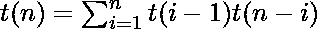
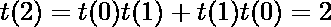
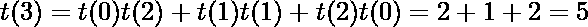
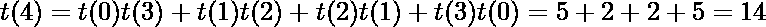

# 具有 n 个键的可能的二分搜索法树和二叉树的总数

> 原文:[https://www . geeksforgeeks . org/total-number-of-the-number-of-of-sequence-binary-search-trees-with-n-key/](https://www.geeksforgeeks.org/total-number-of-possible-binary-search-trees-with-n-keys/)

具有 n 个不同键的可能二分搜索法树的总数(countBST(n)) = [加泰罗尼亚数字 Cn](https://www.geeksforgeeks.org/program-nth-catalan-number) = (2n)！/ ((n + 1)！* n！)
对于 n = 0，1，2，3，…加泰罗尼亚数字的值是 1，1，2，5，14，42，132，429，1430，4862，…。二分搜索法树的数量也是如此。
具有 n 个不同键的可能二叉树总数(countBT(n))= countBT(n)* n！

下面是查找 n 个数的 BST 和二叉树计数的代码。查找第 n 个加泰罗尼亚号码的代码取自[此处](https://www.geeksforgeeks.org/program-nth-catalan-number/)。

## C++

```
// See https://www.geeksforgeeks.org/program-nth-catalan-number/
// for reference of below code.

#include <bits/stdc++.h>
using namespace std;

// A function to find factorial of a given number
unsigned long int factorial(unsigned int n)
{
    unsigned long int res = 1;

    // Calculate value of [1*(2)*---*(n-k+1)] / [k*(k-1)*---*1]
    for (int i = 1; i <= n; ++i)
    {
        res *= i;
    }

    return res;
}

unsigned long int binomialCoeff(unsigned int n, unsigned int k)
{
    unsigned long int res = 1;

    // Since C(n, k) = C(n, n-k)
    if (k > n - k)
        k = n - k;

    // Calculate value of [n*(n-1)*---*(n-k+1)] / [k*(k-1)*---*1]
    for (int i = 0; i < k; ++i)
    {
        res *= (n - i);
        res /= (i + 1);
    }

    return res;
}

// A Binomial coefficient based function to find nth catalan
// number in O(n) time
unsigned long int catalan(unsigned int n)
{
    // Calculate value of 2nCn
    unsigned long int c = binomialCoeff(2*n, n);

    // return 2nCn/(n+1)
    return c/(n+1);
}

// A function to count number of BST with n nodes
// using catalan
unsigned long int countBST(unsigned int n)
{
    // find nth catalan number
    unsigned long int count = catalan(n);

    // return nth catalan number
    return count;
}

// A function to count number of binary trees with n nodes
unsigned long int countBT(unsigned int n)
{
    // find count of BST with n numbers
    unsigned long int count = catalan(n);

    // return count * n!
    return count * factorial(n);
}

// Driver Program to test above functions
int main()
{

    int count1,count2, n = 5;

    // find count of BST and binary trees with n nodes
        count1 = countBST(n);
        count2 = countBT(n);

    // print count of BST and binary trees with n nodes
    cout<<"Count of BST with "<<n<<" nodes is "<<count1<<endl;
        cout<<"Count of binary trees with "<<n<<" nodes is "<<count2;

    return 0;
}
```

## Java 语言(一种计算机语言，尤用于创建网站)

```
// See https://www.geeksforgeeks.org/program-nth-catalan-number/
// for reference of below code.
import java.io.*;

class GFG
{

// A function to find
// factorial of a given number
static int factorial(int n)
{
    int res = 1;

    // Calculate value of
    // [1*(2)*---*(n-k+1)] /
    // [k*(k-1)*---*1]
    for (int i = 1; i <= n; ++i)
    {
        res *= i;
    }

    return res;
}

static int binomialCoeff(int n,
                         int k)
{
    int res = 1;

    // Since C(n, k) = C(n, n-k)
    if (k > n - k)
        k = n - k;

    // Calculate value of
    // [n*(n-1)*---*(n-k+1)] /
    // [k*(k-1)*---*1]
    for (int i = 0; i < k; ++i)
    {
        res *= (n - i);
        res /= (i + 1);
    }

    return res;
}

// A Binomial coefficient
// based function to find
// nth catalan number in
// O(n) time
static int catalan( int n)
{

    // Calculate value of 2nCn
    int c = binomialCoeff(2 * n, n);

    // return 2nCn/(n+1)
    return c / (n + 1);
}

// A function to count number of
// BST with n nodes using catalan
static int countBST( int n)
{
    // find nth catalan number
    int count = catalan(n);

    // return nth catalan number
    return count;
}

// A function to count number
// of binary trees with n nodes
static int countBT(int n)
{
    // find count of BST
    // with n numbers
    int count = catalan(n);

    // return count * n!
    return count * factorial(n);
}

// Driver Code
public static void main (String[] args)
{
    int count1, count2, n = 5;

    // find count of BST and
    // binary trees with n nodes
    count1 = countBST(n);
    count2 = countBT(n);

    // print count of BST and
    // binary trees with n nodes
    System.out.println("Count of BST with "+
                            n +" nodes is "+
                                    count1);
    System.out.println("Count of binary " +
                             "trees with "+
                         n + " nodes is " +
                                   count2);
}
}

// This code is contributed by ajit
```

## 蟒蛇 3

```
# See https:#www.geeksforgeeks.org/program-nth-catalan-number/
# for reference of below code.

# A function to find factorial of a given number
def factorial(n) :
    res = 1

    # Calculate value of [1*(2)*---*
    #(n-k+1)] / [k*(k-1)*---*1]
    for i in range(1, n + 1):
        res *= i
    return res

def binomialCoeff(n, k):

    res = 1

    # Since C(n, k) = C(n, n-k)
    if (k > n - k):
        k = n - k

    # Calculate value of [n*(n-1)*---*(n-k+1)] /
    # [k*(k-1)*---*1]
    for i in range(k):

        res *= (n - i)
        res //= (i + 1)

    return res

# A Binomial coefficient based function to
# find nth catalan number in O(n) time
def catalan(n):

    # Calculate value of 2nCn
    c = binomialCoeff(2 * n, n)

    # return 2nCn/(n+1)
    return c // (n + 1)

# A function to count number of BST
# with n nodes using catalan
def countBST(n):

    # find nth catalan number
    count = catalan(n)

    # return nth catalan number
    return count

# A function to count number of binary
# trees with n nodes
def countBT(n):

    # find count of BST with n numbers
    count = catalan(n)

    # return count * n!
    return count * factorial(n)

# Driver Code
if __name__ == '__main__':

    n = 5

    # find count of BST and binary
    # trees with n nodes
    count1 = countBST(n)
    count2 = countBT(n)

    # print count of BST and binary trees with n nodes
    print("Count of BST with", n, "nodes is", count1)
    print("Count of binary trees with", n,
                       "nodes is", count2)

# This code is contributed by
# Shubham Singh(SHUBHAMSINGH10)
```

## C#

```
// See https://www.geeksforgeeks.org/program-nth-catalan-number/
// for reference of below code.
using System;

class GFG
{

// A function to find
// factorial of a given number
static int factorial(int n)
{
    int res = 1;

    // Calculate value of
    // [1*(2)*---*(n-k+1)] /
    // [k*(k-1)*---*1]
    for (int i = 1; i <= n; ++i)
    {
        res *= i;
    }

    return res;
}

static int binomialCoeff(int n,
                         int k)
{
    int res = 1;

    // Since C(n, k) = C(n, n-k)
    if (k > n - k)
        k = n - k;

    // Calculate value of
    // [n*(n-1)*---*(n-k+1)] /
    // [k*(k-1)*---*1]
    for (int i = 0; i < k; ++i)
    {
        res *= (n - i);
        res /= (i + 1);
    }

    return res;
}

// A Binomial coefficient
// based function to find
// nth catalan number in
// O(n) time
static int catalan(int n)
{

    // Calculate value
    // of 2nCn
    int c = binomialCoeff(2 * n, n);

    // return 2nCn/(n+1)
    return c / (n + 1);
}

// A function to count
// number of BST with
// n nodes using catalan
static int countBST(int n)
{
    // find nth catalan number
    int count = catalan(n);

    // return nth catalan number
    return count;
}

// A function to count number
// of binary trees with n nodes
static int countBT(int n)
{
    // find count of BST
    // with n numbers
    int count = catalan(n);

    // return count * n!
    return count * factorial(n);
}

// Driver Code
static public void Main ()
{
    int count1, count2, n = 5;

    // find count of BST 
    // and binary trees
    // with n nodes
    count1 = countBST(n);
    count2 = countBT(n);

    // print count of BST and
    // binary trees with n nodes
    Console.WriteLine("Count of BST with "+
                           n +" nodes is "+
                                   count1);
    Console.WriteLine("Count of binary " +
                            "trees with "+
                        n + " nodes is " +
                                   count2);
    }
}

// This code is contributed
// by akt_mit
```

## 服务器端编程语言（Professional Hypertext Preprocessor 的缩写）

```
<?php
// See https://www.geeksforgeeks.org/program-nth-catalan-number/
// for reference of below code.
// A function to find factorial
// of a given number
function factorial($n)
{
    $res = 1;

    // Calculate value of
    // [1*(2)*---*(n-k+1)] /
    // [k*(k-1)*---*1]
    for ($i = 1; $i <= $n; ++$i)
    {
        $res *= $i;
    }

    return $res;
}

function binomialCoeff($n, $k)
{
    $res = 1;

    // Since C(n, k) = C(n, n-k)
    if ($k > $n - $k)
        $k = $n - $k;

    // Calculate value of
    // [n*(n-1)*---*(n-k+1)] /
    // [k*(k-1)*---*1]
    for ($i = 0; $i < $k; ++$i)
    {
        $res *= ($n - $i);
        $res = (int)$res / ($i + 1);
    }

    return $res;
}

// A Binomial coefficient
// based function to find
// nth catalan number in
// O(n) time
function catalan($n)
{
    // Calculate value of 2nCn
    $c = binomialCoeff(2 * $n, $n);

    // return 2nCn/(n+1)
    return (int)$c / ($n + 1);
}

// A function to count
// number of BST with
// n nodes using catalan
function countBST($n)
{
    // find nth catalan number
    $count = catalan($n);

    // return nth
    // catalan number
    return $count;
}

// A function to count
// number of binary
// trees with n nodes
function countBT($n)
{
    // find count of
    // BST with n numbers
    $count = catalan($n);

    // return count * n!
    return $count *
           factorial($n);
}

// Driver Code
$count1;
$count2;
$n = 5;

// find count of BST and
// binary trees with n nodes
$count1 = countBST($n);
$count2 = countBT($n);

// print count of BST and
// binary trees with n nodes
echo "Count of BST with " , $n ,
     " nodes is ", $count1,"\n";

echo "Count of binary trees with " ,
           $n ," nodes is ",$count2;

// This code is contributed by ajit
?>
```

## java 描述语言

```
<script>

// See https://www.geeksforgeeks.org/program-nth-catalan-number/
// for reference of below code.

    // A function to find
    // factorial of a given number
    function factorial(n)
    {
        let res = 1;

        // Calculate value of
        // [1*(2)*---*(n-k+1)] /
        // [k*(k-1)*---*1]
        for (let i = 1; i <= n; ++i)
        {
            res *= i;
        }

        return res;
    }

    function binomialCoeff(n, k)
    {
        let res = 1;

        // Since C(n, k) = C(n, n-k)
        if (k > n - k)
            k = n - k;

        // Calculate value of
        // [n*(n-1)*---*(n-k+1)] /
        // [k*(k-1)*---*1]
        for (let i = 0; i < k; ++i)
        {
            res *= (n - i);
            res /= (i + 1);
        }

        return res;
    }

    // A Binomial coefficient
    // based function to find
    // nth catalan number in
    // O(n) time
    function catalan(n)
    {

        // Calculate value
        // of 2nCn
        let c = binomialCoeff(2 * n, n);

        // return 2nCn/(n+1)
        return c / (n + 1);
    }

    // A function to count
    // number of BST with
    // n nodes using catalan
    function countBST(n)
    {
        // find nth catalan number
        let count = catalan(n);

        // return nth catalan number
        return count;
    }

    // A function to count number
    // of binary trees with n nodes
    function countBT(n)
    {
        // find count of BST
        // with n numbers
        let count = catalan(n);

        // return count * n!
        return count * factorial(n);
    }

    let count1, count2, n = 5;

    // find count of BST 
    // and binary trees
    // with n nodes
    count1 = countBST(n);
    count2 = countBT(n);

    // print count of BST and
    // binary trees with n nodes
    document.write("Count of BST with "+
                           n +" nodes is "+
                                   count1 + "</br>");
    document.write("Count of binary " +
                            "trees with "+
                        n + " nodes is " +
                                   count2);

</script>
```

**输出:**

```
Count of BST with 5 nodes is 42
Count of binary trees with 5 nodes is 5040
```

**枚举证明**

考虑所有可能的二分搜索法树，每个元素都在根处。如果有 n 个节点，那么对于每一个选择的根节点，都有 n–1 个非根节点，并且这些非根节点必须被划分为小于所选根的节点和大于所选根的节点。

假设节点 I 被选为根。然后是比 I 小的 I–1 个节点和比 I 大的 n–1 个节点。对于这两组节点中的每一组，都有一定数量的可能子树。

设 t(n)为 n 个节点的 BSt 总数。以 I 为根的 BST 总数为 t(I–1)t(n–I)。这两项相乘是因为左右子树的排列是独立的。也就是说，对于左侧树中的每个排列和右侧树中的每个排列，您会得到一个根为 I 的 BST。

对 I 求和给出了具有 n 个节点的二分搜索法树的总数。



基本情况是 t(0) = 1 和 t(1) = 1，即有一个空的 BST 和一个有一个节点的 BST。




同样，关系 countBT(n)= countBT(n)* n！保持。至于每一个可能的 BST，那里都可以有 n 个！二叉树，其中 n 是 BST 中的节点数。
本文由 Shubham Agarwal 供稿。如果你喜欢 GeeksforGeeks 并想投稿，你也可以写一篇文章并将你的文章邮寄到[contribute@geeksforgeeks.org](http://contribute@geeksforgeeks.org)。看到你的文章出现在极客博客主页上，帮助其他极客。
发现有不正确的地方请写评论，或者想分享更多以上讨论话题的信息