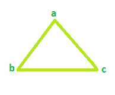

# 循环图中生成树的总数

> 原文:[https://www . geesforgeks . org/循环图中生成树的总数/](https://www.geeksforgeeks.org/total-number-of-spanning-trees-in-a-cycle-graph/)

给定循环图中的顶点数。任务是找到可能的生成树总数。
**注:**循环/圆图是只包含一个循环的图。生成树是图中覆盖图的所有顶点的最短路径。

**示例:**

```
Input: Vertices = 3
Output: Total Spanning tree = 3

Input: Vertices = 4
Output: Total Spanning tree = 4
```

**示例 1:**
**对于顶点= 3 的循环图**



**生成树可能是 3**


**示例 2:**
**对于顶点= 4 的循环图**


**生成树可能是 4**


因此，生成树的数量总是等于循环图中的顶点数量。

**下面是需要的实现:**

## C++

```
// C++ program to find number of
// spanning trees
#include <bits/stdc++.h>
using namespace std;

// function that calculates the
// total Spanning tree
int Spanning(int vertices)
{
    result = 0;

    result = vertices;
    return result;
}

// Driver code
int main()
{
    int vertices = 4;

    cout << "Spanning tree = " << Spanning(vertices);
    return 0;
}
```

## Java 语言(一种计算机语言，尤用于创建网站)

```
// Java program to find number of
// spanning trees

import java.io.*;

class GFG {

// function that calculates the
// total Spanning tree
static int Spanning(int vertices)
{
    int result = 0;

    result = vertices;
    return result;
}

// Driver code
    public static void main (String[] args) {
    int vertices = 4;

    System.out.println("Spanning tree = " + Spanning(vertices));
    }
}
// This code is contributed 
// by chandan_jnu..
```

## 蟒蛇 3

```
# Python program to find number of
# spanning trees

# function that calculates the
# total Spanning tree
def Spanning( vertices):
        result = 0

    result = vertices
    return result

# Driver code
vertices = 4
print("Spanning tree = ",
       Spanning(vertices))

# This code is contributed
# by Sanjit_Prasad
```

## C#

```
// C# program to find number
// of spanning trees
using System;

// function that calculates
// the total Spanning tree
class GFG
{
public int Spanning(int vertices)
{
    int result = 0;

    result = vertices;
    return result;
}

// Driver code
public static void Main()
{
    GFG g = new GFG();
    int vertices = 4;

    Console.WriteLine("Spanning tree = {0}",  
                      g.Spanning(vertices));
}
}

// This code is contributed
// by Soumik
```

## 服务器端编程语言（Professional Hypertext Preprocessor 的缩写）

```
<?php
// PHP program to find number of
// spanning trees

// function that calculates the
// total Spanning tree
function Spanning($vertices)
{
    $result = 0;

    $result = $vertices;
    return $result;
}

// Driver code
$vertices = 4;

echo "Spanning tree = " .
     Spanning($vertices);

// This code is contributed
// by Ankita Saini
?>
```

## java 描述语言

```
<script>

// Javascript program to find number of
// spanning trees

// Function that calculates the
// total Spanning tree
function Spanning(vertices)
{
    result = 0;
    result = vertices;
    return result;
}

// Driver code
var vertices = 4;
document.write("Spanning tree = " +
               Spanning(vertices));

// This code is contributed by noob2000

</script>
```

**Output:** 

```
Spanning tree = 4
```