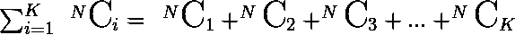

# 大小子集总数最多 K

> 原文:[https://www . geeksforgeeks . org/最多 k 个子集的总数/](https://www.geeksforgeeks.org/total-number-of-subsets-of-size-at-most-k/)

给定集合大小的数字 **N** 和数字 **K** ，任务是找到 N 个元素的集合中最多有 K 个元素的子集的计数，即子集的大小小于或等于 K。
**示例:**

> **输入:** N = 3，K = 2
> **输出:** 6
> 包含 1 个元素的子集= {1}、{2}、{3}
> 包含 2 个元素的子集= {1，2}、{1，3}、{1，2}
> 由于 K = 2，因此对于长度 Atmos K，将只考虑上述子集，因此计数为 6。
> **输入:** N = 5，K = 2
> **输出:** 15

**进场:**

1.  因为可以由 N 个项目构成的恰好 K 个元素的子集的数量是( <sup>N</sup> C <sub>K</sub> )。因此对于“最多”，所需的计数将是
    

2.  为了计算 <sup>N</sup> C <sub>K</sub> 的值，使用了[二项式系数](https://www.geeksforgeeks.org/dynamic-programming-set-9-binomial-coefficient/)。请[参考这篇文章，看看它是如何工作的](https://www.geeksforgeeks.org/binomial-coefficient-dp-9/)。

3.  为了得到长度为 K 的所需子集，运行一个从 1 到 K 的循环，并为 I 的每个值加上 <sup>N</sup> C <sub>i</sub>

以下是上述方法的实现:

## C++

```
// C++ code to find total number of
// Subsets of size at most K

#include <bits/stdc++.h>
using namespace std;

// Function to compute the value
// of Binomial Coefficient C(n, k)
int binomialCoeff(int n, int k)
{
    int C[n + 1][k + 1];
    int i, j;

    // Calculate value of Binomial Coefficient
    // in bottom up manner
    for (i = 0; i <= n; i++) {
        for (j = 0; j <= min(i, k); j++) {

            // Base Cases
            if (j == 0 || j == i)
                C[i][j] = 1;

            // Calculate value using previously
            // stored values
            else
                C[i][j] = C[i - 1][j - 1] + C[i - 1][j];
        }
    }

    return C[n][k];
}

// Function to calculate sum of
// nCj from j = 1 to k
int count(int n, int k)
{
    int sum = 0;
    for (int j = 1; j <= k; j++) {

        // Calling the nCr function
        // for each value of j
        sum = sum + binomialCoeff(n, j);
    }

    return sum;
}

// Driver code
int main()
{
    int n = 3, k = 2;
    cout << count(n, k) << endl;

    n = 5, k = 2;
    cout << count(n, k) << endl;
    return 0;
}
```

## Java 语言(一种计算机语言，尤用于创建网站)

```
// Java code to find total number of
// Subsets of size at most K
import java.lang.*;
class GFG
{

// Function to compute the value
// of Binomial Coefficient C(n, k)
public static int binomialCoeff(int n, int k)
{
    int[][] C = new int[n + 1][k + 1];
    int i, j;

    // Calculate value of Binomial Coefficient
    // in bottom up manner
    for (i = 0; i <= n; i++)
    {
        for (j = 0; j <= Math.min(i, k); j++)
        {

            // Base Cases
            if (j == 0 || j == i)
                C[i][j] = 1;

            // Calculate value using previously
            // stored values
            else
                C[i][j] = C[i - 1][j - 1] + C[i - 1][j];
        }
    }

    return C[n][k];
}

// Function to calculate sum of
// nCj from j = 1 to k
public static int count(int n, int k)
{
    int sum = 0;
    for (int j = 1; j <= k; j++)
    {

        // Calling the nCr function
        // for each value of j
        sum = sum + binomialCoeff(n, j);
    }

    return sum;
}

// Driver code
public static void main(String args[])
{
    GFG g = new GFG();
    int n = 3, k = 2;
    System.out.print(count(n, k));

    int n1 = 5, k1 = 2;
    System.out.print(count(n1, k1));
}
}

// This code is contributed by SoumikMondal
```

## 蟒蛇 3

```
# Python code to find total number of
# Subsets of size at most K

# Function to compute the value
# of Binomial Coefficient C(n, k)
def binomialCoeff(n, k):
    C = [[0 for i in range(k + 1)] for j in range(n + 1)];
    i, j = 0, 0;

    # Calculate value of Binomial Coefficient
    # in bottom up manner
    for i in range(n + 1):
        for j in range( min(i, k) + 1):

            # Base Cases
            if (j == 0 or j == i):
                C[i][j] = 1;

            # Calculate value using previously
            # stored values
            else:
                C[i][j] = C[i - 1][j - 1] + C[i - 1][j];
    return C[n][k];

# Function to calculate sum of
# nCj from j = 1 to k
def count(n, k):
    sum = 0;
    for j in range(1, k+1):

        # Calling the nCr function
        # for each value of j
        sum = sum + binomialCoeff(n, j);
    return sum;

# Driver code
if __name__ == '__main__':
    n = 3;
    k = 2;
    print(count(n, k), end="");

    n1 = 5;
    k1 = 2;
    print(count(n1, k1));

# This code is contributed by 29AjayKumar
```

## C#

```
// C# code to find total number of
// Subsets of size at most K
using System;

class GFG
{

    // Function to compute the value
    // of Binomial Coefficient C(n, k)
    public static int binomialCoeff(int n, int k)
    {
        int[,] C = new int[n + 1, k + 1];
        int i, j;

        // Calculate value of Binomial Coefficient
        // in bottom up manner
        for (i = 0; i <= n; i++)
        {
            for (j = 0; j <= Math.Min(i, k); j++)
            {

                // Base Cases
                if (j == 0 || j == i)
                    C[i, j] = 1;

                // Calculate value using previously
                // stored values
                else
                    C[i, j] = C[i - 1, j - 1] + C[i - 1, j];
            }
        }

        return C[n, k];
    }

    // Function to calculate sum of
    // nCj from j = 1 to k
    public static int count(int n, int k)
    {
        int sum = 0;
        for (int j = 1; j <= k; j++)
        {

            // Calling the nCr function
            // for each value of j
            sum = sum + binomialCoeff(n, j);
        }

        return sum;
    }

    // Driver code
    public static void Main()
    {

        int n = 3, k = 2;
        Console.Write(count(n, k));

        int n1 = 5, k1 = 2;
        Console.Write(count(n1, k1));
    }
}

// This code is contributed by AnkitRai01
```

## java 描述语言

```
<script>
// Javascript implementation of the
// above approach

// Function for the binomial coefficient
function binomialCoeff(n, k)
{

    var C = new Array(n + 1);
    // Loop to create 2D array using 1D array
    for (var i = 0; i < C.length; i++) {
        C[i] = new Array(k + 1);
    }
    var i, j;

    // Calculate value of Binomial Coefficient
    // in bottom up manner
    for (i = 0; i <= n; i++) {
        for (j = 0; j <= Math.min(i, k); j++) {
            // Base Cases
            if (j == 0 || j == i)
                C[i][j] = 1;

            // Calculate value using previously
            // stored values
            else
                C[i][j] = C[i - 1][j - 1] + C[i - 1][j];
        }
    }

    return C[n][k];
}

// Function to calculate sum of
// nCj from j = 1 to k
function count(n, k)
{
    var sum = 0;
    for (var j = 1; j <= k; j++) {

        // Calling the nCr function
        // for each value of j
        sum = sum + binomialCoeff(n, j);
    }

    return sum;
}

// Driver code
var n = 3;
var k = 2;
document.write(count(n, k));

var n = 5;
var k = 2;
document.write(count(n, k));

// This code is contributed by ShubhamSingh10
</script>
```

**Output**

```
6
15
```