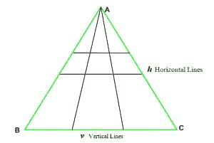
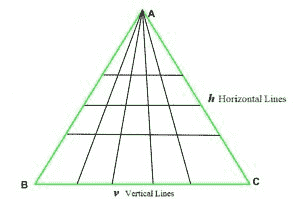
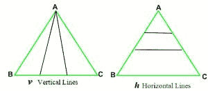

# 有 H 水平线和 V 垂直线时形成的三角形总数

> 原文:[https://www . geesforgeks . org/总三角形数-当有-h-水平线和-v-垂直线时形成/](https://www.geeksforgeeks.org/total-number-of-triangles-formed-when-there-are-h-horizontal-and-v-vertical-lines/)

给定一个三角形 **ABC** 。 **H** 从侧边 **AB** 到 **AC** 的水平线(如图)和从顶点 **A** 到侧边 **BC** 的 **V** 垂直线被绘制出来，任务是找出形成的三角形总数。
**举例:**

> **输入:** H = 2，V = 2
> T3】输出: 18
> 
> 
> 
> 如上图所示，形成的三角形总数为 18 个。
> **输入:** H = 3，V = 4
> **输出:** 60
> 
> 

**方法:**如下图所示，我们可以推导出上述问题的通用公式:

1.  如果只有 **h** 条水平线，那么三角形总数为 **(h + 1)** 。
2.  如果只有 **v** 垂直线，那么三角形总数为 **(v + 1) * (v + 2) / 2。**。



1.  所以，总三角形是**水平线构成的三角形*垂直线构成的三角形**即 **(h + 1) * (( v + 1) * (v + 2) / 2)** 。

以下是上述方法的实现:

## C++

```
// C++ implementation of the approach
#include <bits/stdc++.h>
using namespace std;
#define LLI long long int

// Function to return total triangles
LLI totalTriangles(LLI h, LLI v)
{
    // Only possible triangle is
    // the given triangle
    if (h == 0 && v == 0)
        return 1;

    // If only vertical lines are present
    if (h == 0)
        return ((v + 1) * (v + 2) / 2);

    // If only horizontal lines are present
    if (v == 0)
        return (h + 1);

    // Return total triangles
    LLI Total = (h + 1) * ((v + 1) * (v + 2) / 2);

    return Total;
}

// Driver code
int main()
{
    int h = 2, v = 2;
    cout << totalTriangles(h, v);

    return 0;
}
```

## Java 语言(一种计算机语言，尤用于创建网站)

```
// Java implementation of the approach
class GFG {

    // Function to return total triangles
    public static int totalTriangles(int h, int v)
    {
        // Only possible triangle is
        // the given triangle
        if (h == 0 && v == 0)
            return 1;

        // If only vertical lines are present
        if (h == 0)
            return ((v + 1) * (v + 2) / 2);

        // If only horizontal lines are present
        if (v == 0)
            return (h + 1);

        // Return total triangles
        int total = (h + 1) * ((v + 1) * (v + 2) / 2);

        return total;
    }

    // Driver code
    public static void main(String[] args)
    {
        int h = 2, v = 2;
        System.out.print(totalTriangles(h, v));
    }
}
```

## C#

```
// C# implementation of the approach
using System;

class GFG
{

    // Function to return total triangles
    public static int totalTriangles(int h, int v)
    {
        // Only possible triangle is
        // the given triangle
        if (h == 0 && v == 0)
            return 1;

        // If only vertical lines are present
        if (h == 0)
            return ((v + 1) * (v + 2) / 2);

        // If only horizontal lines are present
        if (v == 0)
            return (h + 1);

        // Return total triangles
        int total = (h + 1) * ((v + 1) * (v + 2) / 2);

        return total;
    }

    // Driver code
    public static void Main()
    {
        int h = 2, v = 2;
        Console.Write(totalTriangles(h, v));
    }
}

// This code is contributed by Ryuga
```

## 蟒蛇 3

```
# Python3 implementation of the approach

# Function to return total triangles
def totalTriangles(h, v):

    # Only possible triangle is
    # the given triangle
    if (h == 0 and v == 0):
        return 1

    # If only vertical lines are present
    if (h == 0):
        return ((v + 1) * (v + 2) / 2)

    # If only horizontal lines are present
    if (v == 0):
        return (h + 1)

    # Return total triangles
    total = (h + 1) * ((v + 1) * (v + 2) / 2)

    return total

# Driver code
h = 2
v = 2
print(int(totalTriangles(h, v)))
```

## 服务器端编程语言（Professional Hypertext Preprocessor 的缩写）

```
<?php
// PHP implementation of the above approach

// Function to return total triangles
function totalTriangles($h, $v)
{
    // Only possible triangle is
    // the given triangle
    if ($h == 0 && $v == 0)
        return 1;

    // If only vertical lines are present
    if ($h == 0)
        return (($v + 1) * ($v + 2) / 2);

    // If only horizontal lines are present
    if ($v == 0)
        return ($h + 1);

    // Return total triangles
    $Total = ($h + 1) * (($v + 1) *
                         ($v + 2) / 2);

    return $Total;
}

// Driver code
$h = 2;
$v = 2;
echo totalTriangles($h, $v);

// This code is contributed by Arnab Kundu
?>
```

## java 描述语言

```
<script>

// javascript implementation of the approach  
// Function to return total triangles

function totalTriangles(h , v)
{
    // Only possible triangle is
    // the given triangle
    if (h == 0 && v == 0)
        return 1;

    // If only vertical lines are present
    if (h == 0)
        return ((v + 1) * (v + 2) / 2);

    // If only horizontal lines are present
    if (v == 0)
        return (h + 1);

    // Return total triangles
    var total = (h + 1) * ((v + 1) * (v + 2) / 2);

    return total;
}

// Driver code
var h = 2, v = 2;
document.write(totalTriangles(h, v));

// This code contributed by shikhasingrajput

</script>
```

**Output:** 

```
18
```

**时间复杂度:**O(1)
T3】辅助空间: O(1)