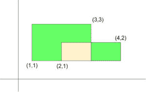

# 所有给定矩形覆盖的单元总数

> 原文:[https://www . geeksforgeeks . org/全给定矩形覆盖的单位细胞总数/](https://www.geeksforgeeks.org/total-number-of-unit-cells-covered-by-all-given-rectangles/)

给定一个由 **N** 矩形的坐标组成的矩阵 **A[][]** ，使得 **{A[i][0]、A[i][1]}** 表示矩形的左下坐标， **{A[i][2]、A[i][3]}** 表示矩形的右上坐标，任务是找出所有矩形覆盖的单元格总数。

**例:**

> **输入:** N = 2，
> A[][] = {{1，1，3，3}，{2，1，4，2 } }
> T4】输出:5
> T7】说明:T9】
> 
> 
> 
> 第一个矩形包含以下 4 个单元格:
> {(1，1)，(1，2)，(2，2)，(2，1)}，{(1，2)，(1，3)，(2，3)，(2，2)}，{(2，1)，(2，2)，(3，1)}，{(2，2)，(2，3)，(3)，(3，3)，(3，2)}
> 第二个矩形包含 2 个单元格:
> {(2，1)，(2，2)，(3，2)，(3)，(3，1)}，{(3，1)}
> 
> **输入:** N = 3，
> A[][] = {{1，3，4，5}，{3，1，7，4}，{5，3，8，6 } }
> T4】输出: 24

**方法:**
按照以下步骤解决问题:

1.  创建一个布尔矩阵 **arr[MAX][MAX]** ，其中 arr[i][j] = 1，如果(I，j)被任何给定的矩形包围。否则，arr[i][j] = 0。
2.  对于每个矩形，从**左下角**到**右上角**迭代，对于所有(I，j)框，将它们标记为 arr[i][j] = 1。
3.  最后，我们将维护一个变量**区域**来存储包围的单元格数量。增加**面积**如果 **arr[i][j] == 1** 。
4.  打印**区域**的最终值。

下面是上述方法的实现:

## C++

```
// C++ program to find the
// number of cells enclosed
// by the given rectangles

#include <bits/stdc++.h>
using namespace std;
#define MAX 1001
bool arr[MAX][MAX];

// Update the coordinates lying
// within the rectangle
void updateArray(int x1, int y1,
                int x2, int y2)
{
    for (int i = x1; i < x2; i++) {
        for (int j = y1; j < y2; j++) {
            // Update arr[i][j] for
            // all (i, j) lying within
            // the rectangle
            arr[i][j] = true;
        }
    }
}

// Function to return the total
// area covered by rectangles
int findAreaCovered()
{
    // Stores the number
    // of cells
    int area = 0;

    for (int i = 0; i < MAX; i++) {
        for (int j = 0; j < MAX; j++) {
            // arr[i]][[j]==1 means that grid
            // is filled by some rectangle
            if (arr[i][j] == true) {
                area++;
            }
        }
    }

    return area;
}

// Driver Code
int main()
{
    int N = 3;

    // (A[i][0], A[i][1]) denotes the
    // coordinate of the bottom
    // left of the rectangle
    // (A[i][2], A[i][3]) denotes the
    // coordinate of upper right
    // of the rectangle
    vector<vector<int> > A = {
        { 1, 3, 4, 5 },
        { 3, 1, 7, 4 },
        { 5, 3, 8, 6 }
    };

    // Update the coordinates that
    // lie within the rectangle
    for (int i = 0; i < N; i++) {
        updateArray(A[i][0], A[i][1],
                    A[i][2], A[i][3]);
    }

    int area = findAreaCovered();
    cout << area;
    return 0;
}
```

## Java 语言(一种计算机语言，尤用于创建网站)

```
// Java program to find the number
// of cells enclosed by the given
// rectangles
class GFG{

static final int MAX = 1001;
static boolean [][]arr = new boolean[MAX][MAX];

// Update the coordinates lying
// within the rectangle
static void updateArray(int x1, int y1,
                        int x2, int y2)
{
    for(int i = x1; i < x2; i++)
    {
        for(int j = y1; j < y2; j++)
        {

            // Update arr[i][j] for
            // all (i, j) lying within
            // the rectangle
            arr[i][j] = true;
        }
    }
}

// Function to return the total
// area covered by rectangles
static int findAreaCovered()
{

    // Stores the number
    // of cells
    int area = 0;

    for(int i = 0; i < MAX; i++)
    {
        for(int j = 0; j < MAX; j++)
        {

            // arr[i]][[j]==1 means that grid
            // is filled by some rectangle
            if (arr[i][j] == true)
            {
                area++;
            }
        }
    }
    return area;
}

// Driver Code
public static void main(String[] args)
{
    int N = 3;

    // (A[i][0], A[i][1]) denotes the
    // coordinate of the bottom
    // left of the rectangle
    // (A[i][2], A[i][3]) denotes the
    // coordinate of upper right
    // of the rectangle
    int [][]A = { { 1, 3, 4, 5 },
                  { 3, 1, 7, 4 },
                  { 5, 3, 8, 6 } };

    // Update the coordinates that
    // lie within the rectangle
    for(int i = 0; i < N; i++)
    {
        updateArray(A[i][0], A[i][1],
                    A[i][2], A[i][3]);
    }

    int area = findAreaCovered();
    System.out.print(area);
}
}

// This code is contributed by amal kumar choubey
```

## 蟒蛇 3

```
# Python3 program to find the
# number of cells enclosed
# by the given rectangles
MAX = 1001
arr = [[False for i in range(MAX)]
              for j in range(MAX)]

# Update the coordinates lying
# within the rectangle
def updateArray(x1, y1, x2, y2):

    for i in range(x1, x2):
        for j in range(y1, y2):

            # Update arr[i][j] for
            # all (i, j) lying within
            # the rectangle
            arr[i][j] = True

# Function to return the total
# area covered by rectangles
def findAreaCovered():

    # Stores the number
    # of cells
    area = 0

    for i in range(MAX):
        for j in range(MAX):

            # arr[i]][[j]==1 means that grid
            # is filled by some rectangle
            if arr[i][j]:
                area += 1

    return area

# Driver code
if __name__=="__main__":

    N = 3

    # (A[i][0], A[i][1]) denotes the
    # coordinate of the bottom
    # left of the rectangle
    # (A[i][2], A[i][3]) denotes the
    # coordinate of upper right
    # of the rectangle
    A = [ [ 1, 3, 4, 5 ],
          [ 3, 1, 7, 4 ],
          [ 5, 3, 8, 6 ] ];

    # Update the coordinates that
    # lie within the rectangle
    for i in range(N):
        updateArray(A[i][0], A[i][1],
                    A[i][2], A[i][3]);

    area = findAreaCovered();
    print(area)

# This code is contributed by rutvik_56
```

## C#

```
// C# program to find the number
// of cells enclosed by the given
// rectangles
using System;

class GFG{

static readonly int MAX = 1001;
static bool [,]arr = new bool[MAX, MAX];

// Update the coordinates lying
// within the rectangle
static void updateArray(int x1, int y1,
                        int x2, int y2)
{
    for(int i = x1; i < x2; i++)
    {
        for(int j = y1; j < y2; j++)
        {

            // Update arr[i,j] for
            // all (i, j) lying within
            // the rectangle
            arr[i, j] = true;
        }
    }
}

// Function to return the total
// area covered by rectangles
static int findAreaCovered()
{

    // Stores the number
    // of cells
    int area = 0;

    for(int i = 0; i < MAX; i++)
    {
        for(int j = 0; j < MAX; j++)
        {

            // arr[i],[j]==1 means that grid
            // is filled by some rectangle
            if (arr[i, j] == true)
            {
                area++;
            }
        }
    }
    return area;
}

// Driver Code
public static void Main(String[] args)
{
    int N = 3;

    // (A[i,0], A[i,1]) denotes the
    // coordinate of the bottom
    // left of the rectangle
    // (A[i,2], A[i,3]) denotes the
    // coordinate of upper right
    // of the rectangle
    int [,]A = { { 1, 3, 4, 5 },
                 { 3, 1, 7, 4 },
                 { 5, 3, 8, 6 } };

    // Update the coordinates that
    // lie within the rectangle
    for(int i = 0; i < N; i++)
    {
        updateArray(A[i, 0], A[i, 1],
                    A[i, 2], A[i, 3]);
    }

    int area = findAreaCovered();
    Console.Write(area);
}
}

// This code is contributed by Rajput-Ji
```

## java 描述语言

```
<script>

// JavaScript program for the above approach

let MAX = 1001;
let arr = new Array(MAX);
for (var i = 0; i < arr.length; i++) {
    arr[i] = new Array(2);
}

// Update the coordinates lying
// within the rectangle
function updateArray(x1, y1, x2, y2)
{
    for(let i = x1; i < x2; i++)
    {
        for(let j = y1; j < y2; j++)
        {

            // Update arr[i][j] for
            // all (i, j) lying within
            // the rectangle
            arr[i][j] = true;
        }
    }
}

// Function to return the total
// area covered by rectangles
function findAreaCovered()
{

    // Stores the number
    // of cells
    let area = 0;

    for(let i = 0; i < MAX; i++)
    {
        for(let j = 0; j < MAX; j++)
        {

            // arr[i]][[j]==1 means that grid
            // is filled by some rectangle
            if (arr[i][j] == true)
            {
                area++;
            }
        }
    }
    return area;
}

// Driver Code

    let N = 3;

    // (A[i][0], A[i][1]) denotes the
    // coordinate of the bottom
    // left of the rectangle
    // (A[i][2], A[i][3]) denotes the
    // coordinate of upper right
    // of the rectangle
    let A = [[ 1, 3, 4, 5 ],
                  [ 3, 1, 7, 4 ],
                  [ 5, 3, 8, 6 ]];

    // Update the coordinates that
    // lie within the rectangle
    for(let i = 0; i < N; i++)
    {
        updateArray(A[i][0], A[i][1],
                    A[i][2], A[i][3]);
    }

    let area = findAreaCovered();
    document.write(area);

</script>
```

**Output:** 

```
24
```

***时间复杂度:**O(N<sup>3</sup>)*
***辅助空间:** O (N <sup>2</sup> )*