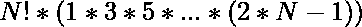
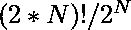

# 有效送货上门安排总数

> 原文:[https://www . geesforgeks . org/total-number-of-valid-home-delivery-arranges/](https://www.geeksforgeeks.org/total-number-of-valid-home-delivery-arrangements/)

给定订单数量，找出订单的有效安排数量，其中订单的交付总是在订单接收之后。

**示例:**

> **输入:** N = 1
> **输出:** 1
> 这里，总事件为 2。他们是{P1，D1}。
> 总的可能安排是 2！= 2.[D1 P1]和[P1 D1]。
> 所以唯一有效的安排可能是:【D1 P1】。
> 【P1 D1】是无效安排，因为第一批订单的交付是在第一批订单提货之前完成的。
> 
> **输入:** N = 2
> **输出:** 6
> 这里，总事件为 4。他们是{P1、D1、P2、D2}。
> 这里，总的可能安排是 4 个！= 24.
> 其中有效安排 6 个:
> 【P1、P2、D1、D2】【P1、D1、P2、D2】【P1、P2、D2、D1】【P2、P1、D2、D1】【P2、P1、D1、D2】，以及【P2、D2、P1、D1】。
> 其余均为无效安排。
> 一些无效安排:
> 【P1、D1、D2、P2】–提货前交付第二订单
> 【P2、D1、P1、D2】–提货前交付第一订单
> 【D1、D2、P2、P1】–提货前交付两个订单

**方法 1:**

1.  考虑 N = 4，我们总共有 8 个事件。
2.  有 4 场提货活动{P1、P2、P3、P4}和 4 场送货活动{D1、D2、D3、D4}。
3.  如果我们只考虑皮卡事件，对皮卡之间的安排没有限制。所以，总共可能安排 4 个！
4.  现在我们考虑送货。我们从最后一辆皮卡开始。
    *   对 D4 来说，我们只能把 D4 排在 P4 之后。
        那是 P1、P2、P3、P4、__。所以只有 1 个有效位置。
    *   对于 D3，我们可以将 D3 放置在以下任何一个位置。
        他们是 P1、P2、P3、__、P4、__、D4、__。所以有 3 个有效位置。
    *   对于 D2，我们可以将 D2 置于以下任何一个位置。
        分别是 P1、P2、__、P3、__、P4、__、D4、__、D3 __。所以 5 个有效位置。
    *   对于 D1，我们可以将 D1 置于以下任何一个位置。
        分别是 P1，__，P2，__，P3，__，P4，__，D4，__，D3 __ _，D2，_ _。7 个有效位置。

对于任意 N，总有效安排:


下面是上述方法的实现。

## C++

```
// C++ implementation of the above approach

#include <bits/stdc++.h>
using namespace std;

// Function to find arrangements
int Arrangements(int N)
{
    int result = 1;

    for(int i = 1; i <= N; i++)
    {
       // Here, i for factorial and
       // (2*i-1) for series
       result = result * i * (2 * i - 1);
    }
    return result;
}

// Driver code
int main()
{
    int N = 4;

    cout << Arrangements(N);

    return 0;
}
```

## Java 语言(一种计算机语言，尤用于创建网站)

```
// Java implementation of the above approach
class GFG{

// Function to find arrangements
public static int Arrangements(int N)
{
    int result = 1;

    for(int i = 1; i <= N; i++)
    {

        // Here, i for factorial and
        // (2*i-1) for series
       result = result * i * (2 * i - 1);
    }
    return result;
}

// Driver code   
public static void main(String[] args)
{
    int N = 4;

    System.out.print(Arrangements(N));
}
}

// This code is contributed by divyeshrabadiya07
```

## 蟒蛇 3

```
# Python3 implementation of the above approach

# Function to find arrangements
def Arrangements(N):

    result = 1

    for i in range(1, N + 1):

        # Here, i for factorial and
        # (2*i-1) for series
        result = result * i * (2 * i - 1)

    return result

# Driver code
N = 4;
print(Arrangements(N));

# This code is contributed by Akanksha_Rai
```

## C#

```
// C# implementation of the above approach
using System;

class GFG{

// Function to find arrangements
public static int Arrangements(int N)
{
    int result = 1;

    for(int i = 1; i <= N; i++)
    {

       // Here, i for factorial and
       // (2*i-1) for series
       result = result * i * (2 * i - 1);
    }
    return result;
}

// Driver code
public static void Main(String[] args)
{
    int N = 4;

    Console.Write(Arrangements(N));
}
}

// This code is contributed by AnkitRai01
```

## java 描述语言

```
<script>

// Javascript implementation of the above approach

// Function to find arrangements
function Arrangements(N)
{
    let result = 1;

    for(let i = 1; i <= N; i++)
    {

        // Here, i for factorial and
        // (2*i-1) for series
        result = result * i * (2 * i - 1);
    }
    return result;
}

// Driver code
let N = 4;

document.write(Arrangements(N));

// This code is contributed by _saurabh_jaiswal

</script>
```

**Output:** 

```
2520
```

***时间复杂度:O(N)***
***辅助空间复杂度:O(1)***

**方法 2:**

1.  对于 N 个订单，我们有
2.  所以可能的排列总数是
3.  现在，每个订单只有在提货后才有效。

对于每一个[π，π]，我们不能改变这种安排。每个这样的订单只有一个有效的安排。所以我们需要对每个订单除以 2。所以总的有效排列是

下面是上述方法的实现。

## C++

```
// C++ implementation of the above approach

#include <bits/stdc++.h>
using namespace std;

// Function to find arrangements
int Arrangements(int N)
{
    int result = 1;

    for (int i = 1; i <= 2 * N; i += 2)
        result = (result * i * (i + 1)) / 2;

    return result;
}

// Driver code
int main()
{
    int N = 4;

    cout << Arrangements(N);

    return 0;
}
```

## Java 语言(一种计算机语言，尤用于创建网站)

```
// Java implementation of the above approach
import java.util.*;
class GFG{

// Function to find arrangements
public static int Arrangements(int N)
{
    int result = 1;

    for (int i = 1; i <= 2 * N; i += 2)
        result = (result * i * (i + 1)) / 2;

    return result;
}

// Driver code
public static void main(String args[])
{
    int N = 4;

    System.out.print(Arrangements(N));
}
}

// This code is contributed by Code_Mech
```

## 蟒蛇 3

```
# Python3 implementation of the above approach

# Function to find arrangements
def Arrangements(N):
    result = 1;

    for i in range(1, (2 * N) + 1, 2):
        result = (result * i * (i + 1)) / 2;

    return int(result);

# Driver code
if __name__ == '__main__':
    N = 4;

    print(Arrangements(N));

# This code is contributed by gauravrajput1
```

## C#

```
// C# implementation of the above approach
using System;
class GFG{

// Function to find arrangements
public static int Arrangements(int N)
{
    int result = 1;

    for (int i = 1; i <= 2 * N; i += 2)
        result = (result * i * (i + 1)) / 2;

    return result;
}

// Driver code
public static void Main()
{
    int N = 4;

    Console.Write(Arrangements(N));
}
}

// This code is contributed by Code_Mech
```

## java 描述语言

```
<script>
// Javascript implementation of the above approach

// Function to find arrangements
function Arrangements(N)
{
    var result = 1;

    for (var i = 1; i <= 2 * N; i += 2)
        result = parseInt( (result * i * (i + 1)) / 2);

    return result;
}

var  N = 4;
document.write( Arrangements(N));

// This code is contributed by SoumikMondal
</script>
```

**Output:** 

```
2520
```

***时间复杂度:O(N)***
***辅助空间复杂度:O(1)***