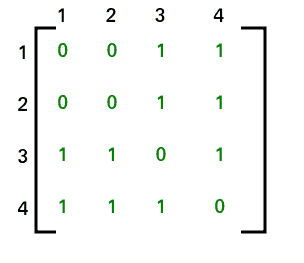
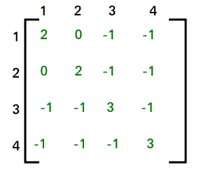

# 图中生成树的总数

> 原文:[https://www . geesforgeks . org/total-number-生成树-graph/](https://www.geeksforgeeks.org/total-number-spanning-trees-graph/)

如果一个图是有 n 个顶点的完全图，那么生成树的总数是 n (n-2) ，其中 n 是图中的节点数。在完全图中，任务等于计算具有 n 个节点的不同标记树，这些节点具有[凯莱公式](https://www.geeksforgeeks.org/g-fact-20-cayleys-formula-for-number-of-labelled-trees/)。

**图形不完整怎么办？**
遵循给定的步骤:-
步骤 1:为给定的图创建邻接矩阵。
第二步:用节点的度数替换所有对角元素。例如，邻接矩阵(1，1)位置的元素将被节点 1 的度代替，邻接矩阵(2，2)位置的元素将被节点 2 的度代替，以此类推。
步骤 3:将所有非对角线 1 替换为-1。
步骤 4:计算任何元素的共因子。
第五步:你得到的辅助因子是该图的生成树总数。

考虑以下图表:

上图的邻接矩阵如下:

应用 STEP 2 和 STEP 3 后，邻接矩阵看起来像

(1，1)的协因子是 8。因此，可以形成的生成树总数是 8。
注意-所有元素的共因子都是相同的。因此，我们可以计算矩阵中任何元素的协因子。

这种方法也被称为[基尔霍夫定理](https://en.wikipedia.org/wiki/Kirchhoff%27s_theorem)。它也可以应用于完全图。

请参考以下链接，以获得上述程序的证明。
[https://en . Wikipedia . org/wiki/Kirchhoff % 27s _ 定理#Proof_outline](https://en.wikipedia.org/wiki/Kirchhoff%27s_theorem#Proof_outline)

本文由 **Kapil Khandelwal** 供稿。如果你喜欢极客博客并想投稿，你也可以写一篇文章并把你的文章邮寄到 contribute@geeksforgeeks.org。看到你的文章出现在极客博客主页上，帮助其他极客。

如果您发现任何不正确的地方，或者您想分享更多关于上面讨论的主题的信息，请写评论