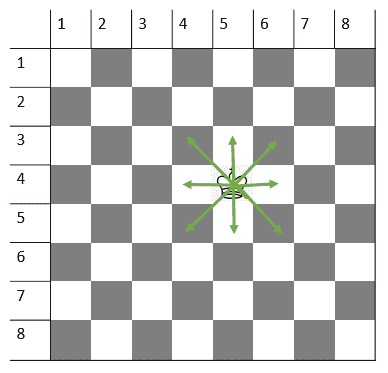

# 王者在棋盘上能达到的总位置，精确到 M 步|第 2 集

> 原文:[https://www . geeksforgeeks . org/total-position-在棋盘上国王可以到达的位置-精确到 m-moves-set-2/](https://www.geeksforgeeks.org/total-position-where-king-can-reach-on-a-chessboard-in-exactly-m-moves-set-2/)

给定国王在 **8 X 8 棋盘**上的位置，任务是计算国王在 **m** 移动中可以访问的方块总数。国王的位置用行号和列号表示。
**注:**当前被国王收购的广场已经被访问，将计入结果。
**示例:**

> **输入:** r = 4，c = 4，m = 1
> **输出:** 9
> **输入:** r = 4，c = 4，m = 2
> **输出:** 25

**进场:**一个王者可以任意方向(即水平、垂直、对角)移动一个方块。因此，在一次移动中，国王可以访问其相邻的广场。



因此，在 **m** 移动中，可以访问距离国王当前位置 **m** 单位距离内的一个正方形(将 1 个正方形视为 1 个单位距离)。

1.  对于棋盘上的所有方块，检查特定的方块是否距离国王当前位置不超过 **m** 单位距离。
2.  如果步骤 1 为真，则递增计数。
3.  打印**计数**

以下是上述方法的实现:

## C++

```
// C++ implementation of the approach
#include <bits/stdc++.h>
using namespace std;

// Function to return the count of squares
// that can be visited by king in m moves
int countSquares(int r, int c, int m)
{

    // To store the count of squares
    int squares = 0;

    // Check all squares of
    // the chessboard
    for (int i = 1; i <= 8; i++) {
        for (int j = 1; j <= 8; j++) {

            // Check if square (i, j) is
            // at a distance <= m units
            // from king's current position
            if (max(abs(i - r), abs(j - c)) <= m)
                squares++;
        }
    }

    // Return count of squares
    return squares;
}

// Driver code
int main()
{
    int r = 4, c = 4, m = 1;

    cout << countSquares(r, c, m) << endl;

    return 0;
}
```

## Java 语言(一种计算机语言，尤用于创建网站)

```
// Java implementation of the approach
class GFG {

    // Function to return the count of squares
    // that can be visited by king in m moves
    static int countSquares(int r, int c, int m)
    {
        // To store the count of squares
        int squares = 0;

        // Check all squares of
        // the chessboard
        for (int i = 1; i <= 8; i++) {
            for (int j = 1; j <= 8; j++) {

                // Check if square (i, j) is
                // at a distance <= m units
                // from king's current position
                if (Math.max(Math.abs(i - r), Math.abs(j - c)) <= m)
                    squares++;
            }
        }

        // Return count of squares
        return squares;
    }

    // Driver code
    public static void main(String[] args)
    {
        int r = 4, c = 4, m = 1;
        System.out.print(countSquares(r, c, m));
    }
}
```

## C#

```
// C# implementation of the approach
using System;
class GFG {

    // Function to return the count of squares
    // that can be visited by king in m moves
    static int countSquares(int r, int c, int m)
    {
        // To store the count of squares
        int squares = 0;

        // Check all squares of
        // the chessboard
        for (int i = 1; i <= 8; i++) {
            for (int j = 1; j <= 8; j++) {

                // Check if square (i, j) is
                // at a distance <= m units
                // from king's current position
                if (Math.Max(Math.Abs(i - r), Math.Abs(j - c)) <= m)
                    squares++;
            }
        }

        // Return count of squares
        return squares;
    }

    // Driver code
    public static void Main()
    {
        int r = 4, c = 4, m = 1;
        Console.Write(countSquares(r, c, m));
    }
}
```

## 蟒蛇 3

```
# Python implementation of the approach

# Function to return the count of squares
# that can be visited by king in m moves
def countSquares(r, c, m):

    # To store the count of squares
    squares = 0

    # Check all squares of
    # the chessboard
    for i in range (1, 9):
        for j in range (1, 9):

            # Check if square (i, j) is
            # at a distance <= m units
            # from king's current position
            if(max(abs(i - r), abs(j - c)) <= m):
                squares = squares + 1

    # Return count of squares
    return squares

# Driver code
r = 4
c = 4
m = 1

print(countSquares(r, c, m));
```

## 服务器端编程语言（Professional Hypertext Preprocessor 的缩写）

```
<?php
// PHP implementation of the approach

// Function to return the count of squares
// that can be visited by king in m moves
function countSquares($r, $c, $m)
{

    // To store the count of squares
    $squares = 0;

    // Check all squares of
    // the chessboard
    for ($i = 1; $i <= 8; $i++)
    {
        for ($j = 1; $j <= 8; $j++)
        {

            // Check if square (i, j) is
            // at a distance <= m units
            // from king's current position
            if (max(abs($i - $r),
                    abs($j - $c)) <= $m)
                $squares++;
        }
    }

    // Return count of squares
    return $squares;
}

// Driver code
$r = 4;
$c = 4;
$m = 1;

echo countSquares($r, $c, $m);

// This code is contributed by Ryuga
?>
```

## java 描述语言

```
<script>

// Javascript implementation of the approach 

    // Function to return the count of squares
    // that can be visited by king in m moves
    function countSquares(r, c, m)
    {
        // To store the count of squares
        let squares = 0;

        // Check all squares of
        // the chessboard
        for (let i = 1; i <= 8; i++) {
            for (let j = 1; j <= 8; j++) {

                // Check if square (i, j) is
                // at a distance <= m units
                // from king's current position
                if (Math.max(Math.abs(i - r), Math.abs(j - c)) <= m)
                    squares++;
            }
        }

        // Return count of squares
        return squares;
    }

// Driver Code

         let r = 4, c = 4, m = 1;
        document.write(countSquares(r, c, m));

</script>
```

**Output:** 

```
9
```