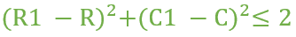
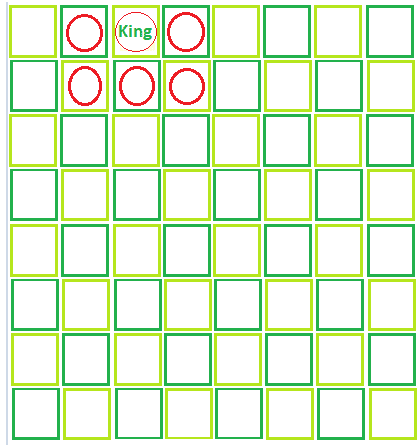

# 在棋盘上，国王可以在精确的 M 次移动中到达的总位置

> 原文:[https://www . geeksforgeeks . org/total-position-在棋盘上国王可以到达的位置-精确移动中的棋盘/](https://www.geeksforgeeks.org/total-position-where-king-can-reach-on-a-chessboard-in-exactly-m-moves/)

给定一个整数 **M** ，一个 **8 * 8** 棋盘和国王被放置在棋盘的一个方格上。让王者坐标为 **(R，C)** 。
**注意**当且仅当满足以下条件时，国王可以移动到坐标为**(C1 R1)**的正方形。



任务是精确计算 **M** 移动中王者从给定方块可以到达的位置数(不包括初始位置)。
**例:**

> **输入:**行= 1，列= 3，招式= 1
> **输出:**王者可以达到的位置总数= 5
> 
> 
> 
> **输入:**行= 2，列= 5，招式= 2
> **输出:**王者可达位置总数= 19

**进场:**计算国王可参观的棋盘左上方方块 **(a，b)** 的坐标和右下方方块 **(c，d)** 的坐标。那么王者可以访问的细胞总数将是**(c–a+1)*(d–b+1)–1**。
以下是上述方法的实施:

## C++

```
// C++ implementation of above approach
#include <iostream>
using namespace std;

// Function to return the number of squares that
// the king can reach in the given number of moves
int Square(int row, int column, int moves)
{
    int a = 0, b = 0, c = 0, d = 0, total = 0;

    // Calculate initial and final coordinates
    a = row - moves;
    b = row + moves;
    c = column - moves;
    d = column + moves;

    // Since chessboard is of size 8X8 so if
    // any coordinate is less than 1 or greater than 8
    // make it 1 or 8.
    if (a < 1)
        a = 1;
    if (c < 1)
        c = 1;
    if (b > 8)
        b = 8;
    if (d > 8)
        d = 8;

    // Calculate total positions
    total = (b - a + 1) * (d - c + 1) - 1;
    return total;
}

// Driver code
int main()
{
    int R = 4, C = 5, M = 2;
    cout << Square(R, C, M);

    return 0;
}
```

## Java 语言(一种计算机语言，尤用于创建网站)

```
// Java implementation of above approach
class GFG
{

// Function to return the number
// of squares that the king can
// reach in the given number of moves
static int Square(int row, int column,
                            int moves)
{
    int a = 0, b = 0, c = 0,
        d = 0, total = 0;

    // Calculate initial and final coordinates
    a = row - moves;
    b = row + moves;
    c = column - moves;
    d = column + moves;

    // Since chessboard is of size 8X8
    // so if any coordinate is less
    // than 1 or greater than 8 make
    // it 1 or 8.
    if (a < 1)
        a = 1;
    if (c < 1)
        c = 1;
    if (b > 8)
        b = 8;
    if (d > 8)
        d = 8;

    // Calculate total positions
    total = (b - a + 1) * (d - c + 1) - 1;
    return total;
}

// Driver code
public static void main(String []args)
{
    int R = 4, C = 5, M = 2;
    System.out.println(Square(R, C, M));
}
}

// This code is contributed by Ita_c.
```

## 蟒蛇 3

```
# Python3 implementation of above approach

# Function to return the number of
# squares that the king can reach
# in the given number of moves
def Square(row, column, moves) :

    a = 0; b = 0; c = 0;
    d = 0; total = 0;

    # Calculate initial and final
    # coordinates
    a = row - moves;
    b = row + moves;
    c = column - moves;
    d = column + moves;

    # Since chessboard is of size 8X8
    # so if any coordinate is less than
    # 1 or greater than 8 make it 1 or 8.
    if (a < 1) :
        a = 1;
    if (c < 1) :
        c = 1;
    if (b > 8) :
        b = 8;
    if (d > 8) :
        d = 8;

    # Calculate total positions
    total = (b - a + 1) * (d - c + 1) - 1;
    return total;

# Driver code
if __name__ == "__main__" :

    R = 4; C = 5; M = 2;
    print(Square(R, C, M));

# This code is contributed by Ryuga
```

## C#

```
// C# implementation of above approach
using System;

class GFG
{

// Function to return the number
// of squares that the king can
// reach in the given number of moves
static int Square(int row, int column,
                            int moves)
{
    int a = 0, b = 0, c = 0,
        d = 0, total = 0;

    // Calculate initial and final coordinates
    a = row - moves;
    b = row + moves;
    c = column - moves;
    d = column + moves;

    // Since chessboard is of size 8X8
    // so if any coordinate is less
    // than 1 or greater than 8 make
    // it 1 or 8.
    if (a < 1)
        a = 1;
    if (c < 1)
        c = 1;
    if (b > 8)
        b = 8;
    if (d > 8)
        d = 8;

    // Calculate total positions
    total = (b - a + 1) * (d - c + 1) - 1;
    return total;
}

// Driver code
public static void Main()
{
    int R = 4, C = 5, M = 2;
    Console.Write(Square(R, C, M));
}
}

// this code is contributed by Ita_c.
```

## 服务器端编程语言（Professional Hypertext Preprocessor 的缩写）

```
<?php
// PHP implementation of above approach

// Function to return the number of
// squares that the king can reach
// in the given number of moves
function Square($row, $column, $moves)
{
    $a = 0; $b = 0; $c = 0;
    $d = 0; $total = 0;

    // Calculate initial and final coordinates
    $a = $row - $moves;
    $b = $row + $moves;
    $c = $column - $moves;
    $d = $column + $moves;

    // Since chessboard is of size 8X8 so
    // if any coordinate is less than 1
    // or greater than 8 make it 1 or 8.
    if ($a < 1)
        $a = 1;
    if ($c < 1)
        $c = 1;
    if ($b > 8)
        $b = 8;
    if ($d > 8)
        $d = 8;

    // Calculate total positions
    $total = ($b - $a + 1) *
             ($d - $c + 1) - 1;
    return $total;
}

// Driver code
$R = 4; $C = 5; $M = 2;
echo Square($R, $C, $M);

// This code is contributed
// by Akanksha Rai
?>
```

## java 描述语言

```
<script>

// Javascript implementation of above approach

// Function to return the number of squares that
// the king can reach in the given number of moves
function Square(row, column, moves)
{
    var a = 0, b = 0, c = 0, d = 0, total = 0;

    // Calculate initial and final coordinates
    a = row - moves;
    b = row + moves;
    c = column - moves;
    d = column + moves;

    // Since chessboard is of size 8X8 so if
    // any coordinate is less than 1 or greater than 8
    // make it 1 or 8.
    if (a < 1)
        a = 1;
    if (c < 1)
        c = 1;
    if (b > 8)
        b = 8;
    if (d > 8)
        d = 8;

    // Calculate total positions
    total = (b - a + 1) * (d - c + 1) - 1;
    return total;
}

// Driver code
var R = 4, C = 5, M = 2;
document.write( Square(R, C, M));

// This code is contributed by rrrtnx.
</script>
```

**Output:** 

```
24
```