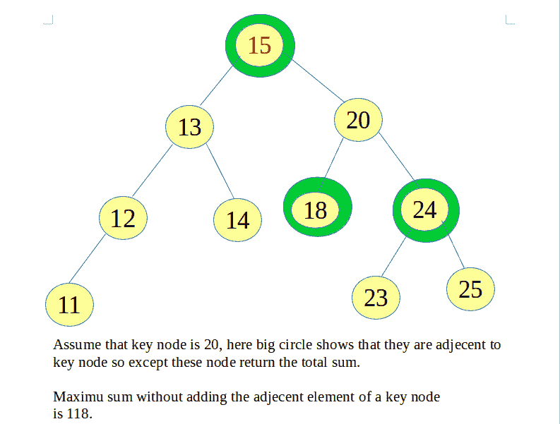

# BST 中给定节点除相邻节点外的总和

> 原文:[https://www . geeksforgeeks . org/total-sum-给定 bst 中的相邻节点除外/](https://www.geeksforgeeks.org/total-sum-except-adjacent-of-a-given-node-in-bst/)

给定一个基本节点和一个关键节点，求基本节点的总和，除了那些与关键节点相邻的节点。

**示例:**



1:-先求 BST 的总和
2:-搜索关键节点并追踪其父节点。
3:-如果键节点存在，则从总和中减去其相邻节点的总和
4:-如果键不存在于 BST 中，则返回-1。

## C++

```
// C++ program to find total sum except a given Node in BST
#include <bits/stdc++.h>
using namespace std;

struct Node {
    int data;
    struct Node *left, *right;
};

// insertion of Node in Tree
Node* getNode(int n)
{
    struct Node* root = new Node;
    root->data = n;
    root->left = NULL;
    root->right = NULL;
    return root;
}

// total sum of bst
int sum(struct Node* root)
{
    if (root == NULL)
        return 0;

    return root->data + sum(root->left) + sum(root->right);
}

// sum of all element except those which are adjecent to key Node
int adjSum(Node* root, int key)
{

    int parent = root->data;

    while (root != NULL) {
        if (key < root->data) {
            parent = root->data;
            root = root->left;
        }
        else if (root->data == key) // key Node matches
        {
            // if the left Node and right Node of key is
            // not null then add all adjecent Node and
            // subtract from totalSum
            if (root->left != NULL && root->right != NULL)
                return (parent + root->left->data +
                                 root->right->data);

            // if key is leaf
            if (root->left == NULL && root->right == NULL)
                return parent;

            // If only left child is null
            if (root->left == NULL)
                return (parent + root->right->data);

            // If only right child is NULL
            if (root->right == NULL)
                return (parent + root->left->data);
        }

        else {
            parent = root->data;
            root = root->right;
        }
    }

    return 0;
}

int findTotalExceptKey(Node *root, int key)
{
    return sum(root) - adjSum(root, key);
}

// Driver code
int main()
{
    struct Node* root = getNode(15);
    root->left = getNode(13);
    root->left->left = getNode(12);
    root->left->left->left = getNode(11);
    root->left->right = getNode(14);
    root->right = getNode(20);
    root->right->left = getNode(18);
    root->right->right = getNode(24);
    root->right->right->left = getNode(23);
    root->right->right->right = getNode(25);
    int key = 20;
    printf("%d ", findTotalExceptKey(root, key));
    return 0;
}
```

## Java 语言(一种计算机语言，尤用于创建网站)

```
// Java program to find total sum
// except a given Node in BST
class GFG
{
static class Node
{
    int data;
    Node left, right;
};

// insertion of Node in Tree
static Node getNode(int n)
{
    Node root = new Node();
    root.data = n;
    root.left = null;
    root.right = null;
    return root;
}

// total sum of bst
static int sum(Node root)
{
    if (root == null)
        return 0;

    return root.data + sum(root.left) +
                       sum(root.right);
}

// sum of all element except those
// which are adjecent to key Node
static int adjSum(Node root, int key)
{
    int parent = root.data;

    while (root != null)
    {
        if (key < root.data)
        {
            parent = root.data;
            root = root.left;
        }
        else if (root.data == key) // key Node matches
        {
            // if the left Node and right Node of key is
            // not null then add all adjecent Node and
            // subtract from totalSum
            if (root.left != null && root.right != null)
                return (parent + root.left.data +
                                root.right.data);

            // if key is leaf
            if (root.left == null && root.right == null)
                return parent;

            // If only left child is null
            if (root.left == null)
                return (parent + root.right.data);

            // If only right child is null
            if (root.right == null)
                return (parent + root.left.data);
        }
        else
        {
            parent = root.data;
            root = root.right;
        }
    }
    return 0;
}

static int findTotalExceptKey(Node root, int key)
{
    return sum(root) - adjSum(root, key);
}

// Driver code
public static void main(String[] args)
{
    Node root = getNode(15);
    root.left = getNode(13);
    root.left.left = getNode(12);
    root.left.left.left = getNode(11);
    root.left.right = getNode(14);
    root.right = getNode(20);
    root.right.left = getNode(18);
    root.right.right = getNode(24);
    root.right.right.left = getNode(23);
    root.right.right.right = getNode(25);
    int key = 20;
    System.out.printf("%d ",
               findTotalExceptKey(root, key));
}
}

// This code is contributed by 29AjayKumar
```

## 蟒蛇 3

```
# Python3 program to find total sum
# except a given Node in BST
class getNode:

    def __init__(self, n):

        self.data = n
        self.left = None
        self.right = None

# Total sum of bst
def sum(root):

    if (root == None):
        return 0

    return (root.data + sum(root.left) +
                        sum(root.right))

# Sum of all element except those
# which are adjecent to key Node
def adjSum(root, key):

    parent = root.data

    while (root != None):
        if (key < root.data):
            parent = root.data
            root = root.left
        elif (root.data == key):

            # Key Node matches
            # if the left Node and right Node of key is
            # not None then add all adjecent Node and
            # subtract from totalSum
            if (root.left != None and
               root.right != None):
                return (parent + root.left.data +
                                 root.right.data)

            # If key is leaf
            if (root.left == None and
               root.right == None):
                return parent

            # If only left child is None
            if (root.left == None):
                return (parent + root.right.data)

            # If only right child is None
            if (root.right == None):
                return (parent + root.left.data)

        else:
            parent = root.data
            root = root.right

    return 0

def findTotalExceptKey(root, key):

    return sum(root) - adjSum(root, key)

# Driver code
if __name__ == '__main__':

    root = getNode(15)
    root.left = getNode(13)
    root.left.left = getNode(12)
    root.left.left.left = getNode(11)
    root.left.right = getNode(14)
    root.right = getNode(20)
    root.right.left = getNode(18)
    root.right.right = getNode(24)
    root.right.right.left = getNode(23)
    root.right.right.right = getNode(25)

    key = 20

    print(findTotalExceptKey(root, key))

# This code is contributed by bgangwar59
```

## C#

```
// C# program to find total sum
// except a given Node in BST
using System;

class GFG
{
class Node
{
    public int data;
    public Node left, right;
};

// insertion of Node in Tree
static Node getNode(int n)
{
    Node root = new Node();
    root.data = n;
    root.left = null;
    root.right = null;
    return root;
}

// total sum of bst
static int sum(Node root)
{
    if (root == null)
        return 0;

    return root.data + sum(root.left) +
                       sum(root.right);
}

// sum of all element except those
// which are adjecent to key Node
static int adjSum(Node root, int key)
{
    int parent = root.data;

    while (root != null)
    {
        if (key < root.data)
        {
            parent = root.data;
            root = root.left;
        }
        else if (root.data == key) // key Node matches
        {
            // if the left Node and right Node of key is
            // not null then add all adjecent Node and
            // subtract from totalSum
            if (root.left != null && root.right != null)
                return (parent + root.left.data +
                                 root.right.data);

            // if key is leaf
            if (root.left == null && root.right == null)
                return parent;

            // If only left child is null
            if (root.left == null)
                return (parent + root.right.data);

            // If only right child is null
            if (root.right == null)
                return (parent + root.left.data);
        }
        else
        {
            parent = root.data;
            root = root.right;
        }
    }
    return 0;
}

static int findTotalExceptKey(Node root, int key)
{
    return sum(root) - adjSum(root, key);
}

// Driver code
public static void Main(String[] args)
{
    Node root = getNode(15);
    root.left = getNode(13);
    root.left.left = getNode(12);
    root.left.left.left = getNode(11);
    root.left.right = getNode(14);
    root.right = getNode(20);
    root.right.left = getNode(18);
    root.right.right = getNode(24);
    root.right.right.left = getNode(23);
    root.right.right.right = getNode(25);
    int key = 20;
    Console.Write("{0} ",
            findTotalExceptKey(root, key));
}
}

// This code is contributed by PrinciRaj1992
```

## java 描述语言

```
<script>

// Javascript program to find total sum
// except a given Node in BST
class Node
{
    constructor(data)
    {
        this.left = null;
        this.right = null;
        this.data = data;
    }
};

// Insertion of Node in Tree
function getNode(n)
{
    let root = new Node(n);
    return root;
}

// Total sum of bst
function sum(root)
{
    if (root == null)
        return 0;

    return root.data + sum(root.left) +
                       sum(root.right);
}

// Sum of all element except those
// which are adjecent to key Node
function adjSum(root, key)
{
    let parent = root.data;

    while (root != null)
    {
        if (key < root.data)
        {
            parent = root.data;
            root = root.left;
        }

        // key Node matches
        else if (root.data == key)
        {

            // If the left Node and right Node of key is
            // not null then add all adjecent Node and
            // subtract from totalSum
            if (root.left != null && root.right != null)
                return (parent + root.left.data +
                                root.right.data);

            // If key is leaf
            if (root.left == null && root.right == null)
                return parent;

            // If only left child is null
            if (root.left == null)
                return (parent + root.right.data);

            // If only right child is null
            if (root.right == null)
                return (parent + root.left.data);
        }
        else
        {
            parent = root.data;
            root = root.right;
        }
    }
    return 0;
}

function findTotalExceptKey(root, key)
{
    return sum(root) - adjSum(root, key);
}

// Driver code
let root = getNode(15);
root.left = getNode(13);
root.left.left = getNode(12);
root.left.left.left = getNode(11);
root.left.right = getNode(14);
root.right = getNode(20);
root.right.left = getNode(18);
root.right.right = getNode(24);
root.right.right.left = getNode(23);
root.right.right.right = getNode(25);

let key = 20;
document.write(findTotalExceptKey(root, key));

// This code is contributed by divyeshrabadiya07

</script>
```

**Output:** 

```
118
```

时间复杂度:O(n) + O(h)，其中 n 为 BST 中的节点数，h 为 BST 的高度。我们可以把时间复杂度写成 O(n)。