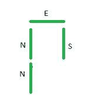
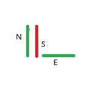

# 通过给定字符串表示的路径所需的总时间

> 原文:[https://www . geesforgeks . org/按给定字符串表示的路径行驶所需的总时间/](https://www.geeksforgeeks.org/total-time-required-to-travel-a-path-denoted-by-a-given-string/)

给定由字符**【N】【S】【E】**和**【W】**组成的字符串**路径**，分别表示在北、南、东、西方向上的 1 个单位移动，任务是找出从原点开始行进完整路径所花费的时间，如果在未游览和游览的路段上分别花费 2 分钟和 1 分钟。

**示例:**

> **输入:**路径=【NNES】
> **输出:** 8
> 
> [](https://media.geeksforgeeks.org/wp-content/uploads/20210515120050/Capture1.JPG)
> 
> **说明:**由于每个段位只访问一次，成本= 2 * 4 = 8。
> 
> **输入:**路径=“NSE”
> **输出:** 5
> 
> [](https://media.geeksforgeeks.org/wp-content/uploads/20210515121035/Capture2.JPG)
> 
> **解说:**
> 第一步:北行。耗时= 2 分钟。
> 第 2 步:在同一游览路段向南行驶。花费的时间= 1 分钟。
> 第三步:向东旅行。耗时= 2 分钟。因此，总耗时= 2 + 1 + 2 = 5。

**方法:**想法是使用一个[集合](https://www.geeksforgeeks.org/set-in-cpp-stl/)来存储所有访问的片段，并且在访问每个片段之前，检查它是否存在于集合中。按照以下步骤解决问题。

*   初始化一个集合 **s** 来存储一对整数。该集合将存储所有访问过的段。
*   初始化表示当前位置的两个整数 **x** = 0 和 **y** = 0。另外，初始化一个变量**时间** = 0，以存储完成整个路径所需的总时间。
*   [遍历字符串](https://www.geeksforgeeks.org/iterate-over-characters-of-a-string-in-c/)并遵循以下步骤
    *   将两个整数 **p** 和 **q** 分别初始化为 **x** 和 **y** 。
    *   如果**路径【I】**等于**【N】**增量 **y** ，否则如果**路径【I】**等于**S’**减量 **y，**否则如果**路径【I】**等于**【E】**增量 **x** ，否则减量 **x** 。
    *   检查段{ **p** + **x** ， **q** + **y** } [是否存在于集合中](https://www.geeksforgeeks.org/set-find-function-in-c-stl/)。如果在**时间**值上加 1，否则在**时间值上加 2。**
    *   [将](https://www.geeksforgeeks.org/unordered_set-insert-function-in-c-stl/)分段{ **p** + **x** ， **q** + **y** 插入到集合中。
*   完成以上步骤后，打印**时间值。**

下面是上述方法的实现。

## C++

```
// C++ code for the above approach
#include <bits/stdc++.h>
using namespace std;

// Function to calculate time
// taken to travel the path
void calcTotalTime(string path)
{
    // Stores total time
    int time = 0;

    // Initial position
    int x = 0, y = 0;

    // Stores visited segments
    set<pair<int, int> > s;

    for (int i = 0; i < path.size(); i++) {

        int p = x;
        int q = y;

        if (path[i] == 'N')
            y++;

        else if (path[i] == 'S')
            y--;

        else if (path[i] == 'E')
            x++;

        else if (path[i] == 'W')
            x--;

        // Check whether segment
        // is present in the set
        if (s.find({ p + x, q + y })
            == s.end()) {
            // Increment the value
            // of time by 2
            time += 2;

            // Insert segment into the set
            s.insert({ p + x, q + y });
        }
        else
            time += 1;
    }

    // Print the value
    // of time
    cout << time << endl;
}

// Driver Code
int main()
{
    string path = "NSE";

    calcTotalTime(path);

    return 0;
}
```

## Java 语言(一种计算机语言，尤用于创建网站)

```
// Java program for above approach
import java.util.*;

class GFG{

// Function to calculate time
// taken to travel the path
static void calcTotalTime(String path)
{

    // Stores total time
    int time = 0;

    // Initial position
    int x = 0, y = 0;

    // Stores visited segments
    Set<String> s = new HashSet<>();
    for(int i = 0; i < path.length(); i++)
    {
        int p = x;
        int q = y;

        if (path.charAt(i) == 'N')
            y++;

        else if (path.charAt(i) == 'S')
            y--;

        else if (path.charAt(i) == 'E')
            x++;

        else if (path.charAt(i) == 'W')
            x--;

        // Check whether segment
        // is present in the set
        String o = (p + x) + " " + (q + y);
        if (!s.contains(o))
        {

            // Increment the value
            // of time by 2
            time += 2;

            // Insert segment into the set
            s.add(o);
        }
        else
            time += 1;
    }

    // Print the value
    // of time
    System.out.println(time);
}

// Driver Code
public static void main(String[] args)
{
    String path = "NSE";

    calcTotalTime(path);
}
}

// This code is contributed by Hritik
```

## 蟒蛇 3

```
# Python 3 code for the above approach

# Function to calculate time
# taken to travel the path
def calcTotalTime(path):

    # Stores total time
    time = 0

    # Initial position
    x = 0
    y = 0

    # Stores visited segments
    s = set([])

    for i in range(len(path)):

        p = x
        q = y

        if (path[i] == 'N'):
            y += 1

        elif (path[i] == 'S'):
            y -= 1

        elif (path[i] == 'E'):
            x += 1

        elif (path[i] == 'W'):
            x -= 1

        # Check whether segment
        # is present in the set
        if (p + x, q + y) not in s:
            # Increment the value
            # of time by 2
            time += 2

            # Insert segment into the set
            s.add((p + x, q + y))

        else:
            time += 1

    # Print the value
    # of time
    print(time)

# Driver Code
if __name__ == "__main__":

    path = "NSE"

    calcTotalTime(path)

    # This code is contributed by ukasp.
```

## C#

```
// C# program for the above approach
using System;
using System.Collections.Generic;

class GFG{

// Function to calculate time
// taken to travel the path
static void calcTotalTime(string path)
{

    // Stores total time
    int time = 0;

    // Initial position
    int x = 0, y = 0;

    // Stores visited segments
    HashSet<string> s = new HashSet<string>();
    for(int i = 0; i < path.Length; i++)
    {
        int p = x;
        int q = y;

        if (path[i] == 'N')
            y++;

        else if (path[i] == 'S')
            y--;

        else if (path[i] == 'E')
            x++;

        else if (path[i] == 'W')
            x--;

        // Check whether segment
        // is present in the set
        string o = (p + x) + " " + (q + y);
        if (s.Contains(o) == false)
        {

            // Increment the value
            // of time by 2
            time += 2;

            // Insert segment into the set
            s.Add(o);
        }
        else
            time += 1;
    }

    // Print the value
    // of time
    Console.Write(time);
}

// Driver Code
public static void Main()
{
    string path = "NSE";

    calcTotalTime(path);
}
}

// This code is contributed by bgangwar59
```

## java 描述语言

```
<script>

// Javascript code for the above approach

// Function to calculate time
// taken to travel the path
function calcTotalTime(path)
{

    // Stores total time
    var time = 0;

    // Initial position
    var x = 0, y = 0;

    // Stores visited segments
    var s = new Set();

    for(var i = 0; i < path.length; i++)
    {
        var p = x;
        var q = y;

        if (path[i] == 'N')
            y++;

        else if (path[i] == 'S')
            y--;

        else if (path[i] == 'E')
            x++;

        else if (path[i] == 'W')
            x--;

        // Check whether segment
        // is present in the set
        if (!s.has([p + x, q + y].toString()))
        {

            // Increment the value
            // of time by 2
            time += 2;

            // Insert segment into the set
            s.add([p + x, q + y].toString());
        }
        else
            time += 1;
    }

    // Print the value
    // of time
    document.write(time)
}

// Driver Code
var path = "NSE";

calcTotalTime(path);

</script>
```

**Output:** 

```
5
```

***时间复杂度:** O(NlogN)*
***辅助空间:** O(N)*