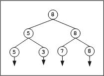
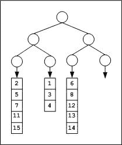
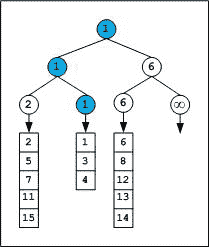
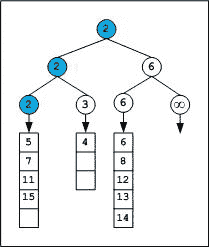

# 锦标赛树(胜者树)和二进制堆

> 原文:[https://www . geesforgeks . org/锦标赛-树和二进制-堆/](https://www.geeksforgeeks.org/tournament-tree-and-binary-heap/)

给定一队 N 名选手。找到第二好的玩家至少需要多少场比赛？

我们可以使用基于锦标赛树(二进制堆)的对手参数。

[锦标赛树](http://en.wikipedia.org/wiki/Selection_algorithm#Tournament_Algorithm)是最小(最大)堆的一种形式，是一个完整的二叉树。每个外部节点代表一个玩家，内部节点代表赢家。在锦标赛树中，每个内部节点都包含赢家，每个叶子节点都包含一个玩家。

具有 N 个叶(外部)节点的二叉树中将有 N–1 个内部节点。详见[本帖](https://www.geeksforgeeks.org/g-fact-42/)(在文中给出的等式中放 n = 2)。

很明显，要从 N 个玩家中选出最好的玩家，(N–1)个玩家被淘汰，即我们需要最少(N–1)个游戏(比较)。数学上我们可以证明。在二叉树中，I = E–1，其中 I 是内部节点数，E 是外部节点数。这意味着要找到一个数组的最大或最小元素，我们需要 N–1 个(内部节点)比较。

**第二名选手**

在最佳玩家选择期间探索的信息可以用于在追踪次佳玩家时最小化比较的次数。比如我们可以在**(N+log<sub>2</sub>N–2)**对比中选出第二好的选手。

下图将锦标赛树(*胜者树*)显示为最大堆。注意*败者树*的概念不一样。

[](https://media.geeksforgeeks.org/wp-content/cdn-uploads/Tournament.jpg)

上面的树包含代表玩家的 4 个叶节点，有 3 个级别 0、1 和 2。最初 2 场比赛在 2 级进行，一场在 5 到 3 级之间，另一场在 7 到 8 级之间。在下一步中，在 5 到 8 点之间再进行一场比赛，以结束最后的赢家。总的来说，我们需要 3 个比较。对于第二好的选手，我们需要追踪最终获胜者的候选人，这导致第二好的选手是 7 名。

**排序数组的中值**

锦标赛树可以有效地用于寻找排序数组的中值。假设，给定 M 个大小为 L 的排序数组(为了简单起见)。我们可以将所有这些排序的数组附加到锦标赛树中，每片叶子一个数组。我们需要一棵树的高度 **CEIL (log <sub>2</sub> M)** 至少有 M 个外部节点。

举个例子。给定 3 (M = 3)个最大大小为 5 个元素的排序整数数组。

```
{ 2, 5, 7, 11, 15 } ---- Array1
{1, 3, 4} ---- Array2
{6, 8, 12, 13, 14} ---- Array3
```

锦标树的高度应该是多少？我们需要构建一个高度日志 <sub>2</sub> 3 的比赛树。= 1.585 = 2 舍入到下一个整数。高度为 2 的二叉树将有 4 片叶子，我们可以将数组连接到上面，如下图所示。

[](https://media.geeksforgeeks.org/wp-content/cdn-uploads/Winner1.jpg)

第一场比赛后，树如下所示，

[](https://media.geeksforgeeks.org/wp-content/cdn-uploads/Winner2.jpg)

我们可以观察到获胜者来自 Array2。因此，第二场比赛的下一个元素将进入游戏，游戏将沿着前一场比赛的赢家路线进行。

*注意，无穷用作哨点元素。基于保存在节点中的数据，我们可以选择哨兵字符。例如，我们通常将指针存储在节点中，而不是键中，因此空值可以作为标记。如果任何一个数组耗尽了，我们将用 sentinel 填充相应的叶子和即将到来的内部节点。*

第二次锦标赛后，树如下所示，

[](https://media.geeksforgeeks.org/wp-content/cdn-uploads/Winner3.jpg)

下一个赢家来自 Array1，因此 Array1 数组的下一个元素 5 将进入下一轮，下一场锦标赛将沿着 2 的路径进行。

锦标赛可以继续进行，直到得到(5+3+5)/2 =第 7 个元素的中值元素。请注意，有更好的算法来寻找排序数组并集的中值，详情请参见下面给出的相关链接。

一般来说，对于大小为 L <sub>1</sub> ，L <sub>2</sub> … L <sub>m</sub> 的 M 排序列表，需要时间复杂度为***O((L<sub>1</sub>+L<sub>2</sub>+…+L<sub>M</sub>)* logM)***来合并所有数组，而 ***O(m*logM)*** 则需要时间来找到中值，其中

**从十亿个未排序元素中选择最小的一百万个元素:**

作为一个简单的解决方案，我们可以对十亿个数字进行排序，选择前一百万个。

在一个有限的内存系统上，对 10 亿个元素进行排序并挑选出第一个 100 万个似乎是不切实际的。我们可以使用锦标赛树方法。在任何时候，记忆中只有树的元素。

将大阵列(可能存储在磁盘上)分割成更小的阵列，每个阵列的大小为一百万(或者更小，可以由机器排序)。对这 1000 个小型阵列进行排序，并将其作为单个文件存储在磁盘上。构建一个至少有 1000 个叶节点的锦标赛树(树的高度为 10，因为 2<sup>9</sup><1000<2<sup>10</sup>，如果单个文件的大小更小，我们将需要更多的叶节点)。每个叶节点都有一个引擎，从存储在磁盘上的排序文件中挑选下一个元素。我们可以玩锦标赛树游戏来提取前一百万个元素。

总成本=整理 1000 张各一百万张的列表+树构造+锦标赛

**实现**
我们需要以自下而上的方式构建树。首先填充所有的叶节点。从树的最左端开始，沿着宽度填充(即从 2 <sup>k-1</sup> 到 2<sup>k</sup>–1，其中 k 是树的深度)并玩游戏。通过几个例子练习后，编写代码将变得很容易。实现将在下面的代码中讨论

[使用最小比较的第二个最小元素](https://www.geeksforgeeks.org/second-minimum-element-using-minimum-comparisons/ "Permalink to Second minimum element using minimum comparisons")

**相关帖子**
[找到一个数组中最小和第二小的元素](https://www.geeksforgeeks.org/to-find-smallest-and-second-smallest-element-in-an-array/)。
[使用最小比较的第二个最小元素](https://www.geeksforgeeks.org/second-minimum-element-using-minimum-comparisons/ "Permalink to Second minimum element using minimum comparisons")

—由 **[文基](http://www.linkedin.com/in/ramanawithu)** 。如果你发现任何不正确的地方，或者你想分享更多关于上面讨论的话题的信息，请写评论。