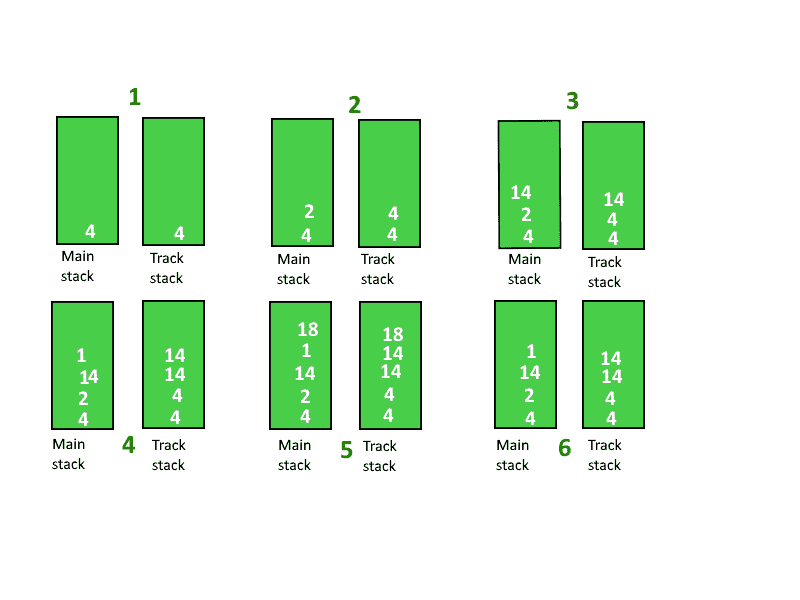

# 跟踪堆栈中的最大电流元素

> 原文:[https://www . geesforgeks . org/tracking-current-max-in-a-stack 元素/](https://www.geeksforgeeks.org/tracking-current-maximum-element-in-a-stack/)

给定一个堆栈，跟踪其中的最大值。最大值可能是堆栈的顶部元素，但是一旦一个新元素被推入或一个元素从堆栈中弹出，最大元素现在将来自其余元素。
**例:**

```
Input : 4 19 7 14 20
Output : Max Values in stack are 
         4 19 19 19 20

Input : 40 19 7 14 20 5
Output :  Max Values in stack are 
         40 40 40 40 40 40
```

**方法 1(蛮力)**:我们不断推主栈中的元素，每当要求我们返回最大元素时，我们遍历栈并打印最大元素。
**时间复杂度** : O(n)
**辅助空间** : O(1)
**方法 2(高效)**:一种有效的方法是在主栈中推送元素的同时维护一个辅助栈。这个辅助堆栈将跟踪最大元素。
**下面是做这个的分步算法** :

1.  创建一个辅助堆栈，比如“跟踪堆栈”来跟踪最大元素
2.  将第一个元素推送到 mainStack 和 trackStack。

3.  现在从第二个元素开始，将该元素推到主堆栈。将元素与轨道堆栈的顶部元素进行比较，如果当前元素大于轨道堆栈的顶部，则将当前元素推入轨道堆栈，否则将轨道堆栈的顶部元素再次推入其中。

4.  如果我们从主堆栈中弹出一个元素，那么也从跟踪堆栈中弹出一个元素。

5.  现在要计算主堆栈在任一点的最大值，我们可以简单地打印 Track 堆栈的顶部元素。

**逐级解释:**
假设元素按顺序{4，2，14，1，18}
**第一步:**推 4，电流最大值:4
**第二步:**推 2，电流最大值:4
**第三步:**推 14，电流最大值:14
**第四步:**推 1，电流最大值:14
【T16



以下是上述方法的实现:

## C++

```
// C++ program to keep track of maximum
// element in a stack
#include <bits/stdc++.h>
using namespace std;

class StackWithMax
{
    // main stack
    stack<int> mainStack;

    // stack to keep track of max element
    stack<int> trackStack;

public:
    void push(int x)
    {
        mainStack.push(x);
        if (mainStack.size() == 1)
        {
            trackStack.push(x);
            return;
        }

        // If current element is greater than
        // the top element of track stack, push
        // the current element to track stack
        // otherwise push the element at top of
        // track stack again into it.
        if (x > trackStack.top())
            trackStack.push(x);
        else
            trackStack.push(trackStack.top());
    }

    int getMax()
    {
        return trackStack.top();
    }

    int pop()
    {
        mainStack.pop();
        trackStack.pop();
    }
};

// Driver program to test above functions
int main()
{
    StackWithMax s;
    s.push(20);
    cout << s.getMax() << endl;
    s.push(10);
    cout << s.getMax() << endl;
    s.push(50);
    cout << s.getMax() << endl;
    return 0;
}
```

## Java 语言(一种计算机语言，尤用于创建网站)

```
// Java program to keep track of maximum
// element in a stack
import java.util.*;
class GfG {

static class StackWithMax
{
    // main stack
    static Stack<Integer> mainStack = new Stack<Integer> ();

    // tack to keep track of max element
    static Stack<Integer> trackStack = new Stack<Integer> ();

static void push(int x)
    {
        mainStack.push(x);
        if (mainStack.size() == 1)
        {
            trackStack.push(x);
            return;
        }

        // If current element is greater than
        // the top element of track stack, push
        // the current element to track stack
        // otherwise push the element at top of
        // track stack again into it.
        if (x > trackStack.peek())
            trackStack.push(x);
        else
            trackStack.push(trackStack.peek());
    }

    static int getMax()
    {
        return trackStack.peek();
    }

    static void pop()
    {
        mainStack.pop();
        trackStack.pop();
    }
};

// Driver program to test above functions
public static void main(String[] args)
{
    StackWithMax s = new StackWithMax();
    s.push(20);
    System.out.println(s.getMax());
    s.push(10);
    System.out.println(s.getMax());
    s.push(50);
    System.out.println(s.getMax());
}
}
```

## 蟒蛇 3

```
# Python3 program to keep track of
# maximum element in a stack

class StackWithMax:
    def __init__(self):

        # main stack
        self.mainStack = []

        # tack to keep track of
        # max element
        self.trackStack = []

    def push(self, x):
        self.mainStack.append(x)
        if (len(self.mainStack) == 1):
            self.trackStack.append(x)
            return

        # If current element is greater than
        # the top element of track stack,
        # append the current element to track
        # stack otherwise append the element
        # at top of track stack again into it.
        if (x > self.trackStack[-1]):
            self.trackStack.append(x)
        else:
            self.trackStack.append(self.trackStack[-1])

    def getMax(self):
        return self.trackStack[-1]

    def pop(self):
        self.mainStack.pop()
        self.trackStack.pop()

# Driver Code
if __name__ == '__main__':

    s = StackWithMax()
    s.push(20)
    print(s.getMax())
    s.push(10)
    print(s.getMax())
    s.push(50)
    print(s.getMax())

# This code is contributed by PranchalK
```

## C#

```
// C# program to keep track of maximum
// element in a stack
using System;
using System.Collections.Generic;

class GfG
{

public class StackWithMax
{
    // main stack
    static Stack<int> mainStack = new Stack<int> ();

    // tack to keep track of max element
    static Stack<int> trackStack = new Stack<int> ();

    public void push(int x)
    {
        mainStack.Push(x);
        if (mainStack.Count == 1)
        {
            trackStack.Push(x);
            return;
        }

        // If current element is greater than
        // the top element of track stack, push
        // the current element to track stack
        // otherwise push the element at top of
        // track stack again into it.
        if (x > trackStack.Peek())
            trackStack.Push(x);
        else
            trackStack.Push(trackStack.Peek());
    }

    public int getMax()
    {
        return trackStack.Peek();
    }

    public void pop()
    {
        mainStack.Pop();
        trackStack.Pop();
    }
};

// Driver code
public static void Main()
{
    StackWithMax s = new StackWithMax();
    s.push(20);
    Console.WriteLine(s.getMax());
    s.push(10);
    Console.WriteLine(s.getMax());
    s.push(50);
    Console.WriteLine(s.getMax());
}
}

/* This code contributed by PrinciRaj1992 */
```

## java 描述语言

```
<script>
    // Javascript program to keep track of maximum
    // element in a stack

    // main stack
    let mainStack = [];

    // tack to keep track of max element
    let trackStack = [];

    function push(x)
    {
        mainStack.push(x);
        if (mainStack.length == 1)
        {
            trackStack.push(x);
            return;
        }

        // If current element is greater than
        // the top element of track stack, push
        // the current element to track stack
        // otherwise push the element at top of
        // track stack again into it.
        if (x > trackStack[trackStack.length - 1])
            trackStack.push(x);
        else
            trackStack.push(trackStack[trackStack.length - 1]);
    }

    function getMax()
    {
        return trackStack[trackStack.length - 1];
    }

    function pop()
    {
        mainStack.pop();
        trackStack.pop();
    }

    push(20);
    document.write(getMax() + "</br>");
    push(10);
    document.write(getMax() + "</br>");
    push(50);
    document.write(getMax());

    // This code is contributed by rameshtravel07.
</script>
```

**输出:**

```
20
20
50
```

**时间复杂度** : O(1)
**辅助复杂度** : O(n)
本文由 [**罗希特**](https://www.linkedin.com/in/rohit-thapliyal-515b5913a/) 供稿。如果你喜欢 GeeksforGeeks 并想投稿，你也可以使用[write.geeksforgeeks.org](https://write.geeksforgeeks.org)写一篇文章或者把你的文章邮寄到 review-team@geeksforgeeks.org。看到你的文章出现在极客博客主页上，帮助其他极客。
如果发现有不正确的地方，或者想分享更多关于上述话题的信息，请写评论。