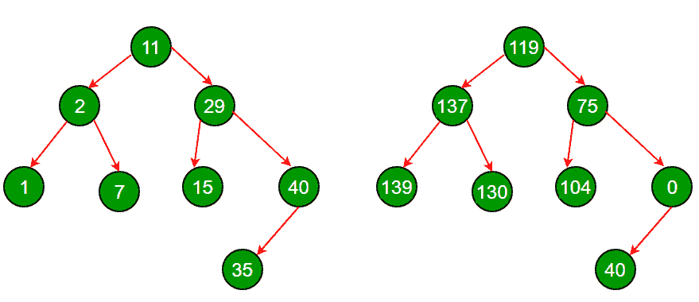

# 将 BST 转换为更大的和树

> 原文:[https://www.geeksforgeeks.org/transform-bst-sum-tree/](https://www.geeksforgeeks.org/transform-bst-sum-tree/)

给定一个 BST，将其转换为一个更大和树，其中每个节点包含大于该节点的所有节点的和。



**强烈建议尽量减少浏览器，先自己试试这个。**
**方法 1(天真):**
这个方法不要求树是 BST。以下是步骤。
1。一个节点一个节点地遍历(按序、按序等)。)
2。对于每个节点，找出大于当前节点的所有节点，将这些值相加。存储所有这些总和。
3。按照与步骤 1 中相同的顺序遍历，将每个节点值替换为它们相应的和。
这需要 O(n^2)时间复杂度。

**方法 2(仅使用一次遍历)**
通过利用树是 BST 的事实，我们可以找到 O(n)解。这个想法是反向穿越英国标准时间。对一个 BST 的反向有序遍历给了我们递减顺序的键。在访问一个节点之前，我们会访问该节点的所有更大的节点。遍历时，我们跟踪键的总和，即大于当前节点键的所有键的总和。

## C++

```
// C++ program to transform a BST to sum tree
#include<iostream>
using namespace std;

// A BST node
struct Node
{
    int data;
    struct Node *left, *right;
};

// A utility function to create a new Binary Tree Node
struct Node *newNode(int item)
{
    struct Node *temp =  new Node;
    temp->data = item;
    temp->left = temp->right = NULL;
    return temp;
}

// Recursive function to transform a BST to sum tree.
// This function traverses the tree in reverse inorder so
// that we have visited all greater key nodes of the currently
// visited node
void transformTreeUtil(struct Node *root, int *sum)
{
   // Base case
   if (root == NULL)  return;

   // Recur for right subtree
   transformTreeUtil(root->right, sum);

   // Update sum
   *sum = *sum + root->data;

   // Store old sum in current node
   root->data = *sum - root->data;

   // Recur for left subtree
   transformTreeUtil(root->left, sum);
}

// A wrapper over transformTreeUtil()
void transformTree(struct Node *root)
{
    int sum = 0; // Initialize sum
    transformTreeUtil(root, &sum);
}

// A utility function to print indorder traversal of a
// binary tree
void printInorder(struct Node *root)
{
    if (root == NULL) return;

    printInorder(root->left);
    cout << root->data << " ";
    printInorder(root->right);
}

// Driver Program to test above functions
int main()
{
    struct Node *root = newNode(11);
    root->left = newNode(2);
    root->right = newNode(29);
    root->left->left = newNode(1);
    root->left->right = newNode(7);
    root->right->left = newNode(15);
    root->right->right = newNode(40);
    root->right->right->left = newNode(35);

    cout << "Inorder Traversal of given tree\n";
    printInorder(root);

    transformTree(root);

    cout << "\n\nInorder Traversal of transformed tree\n";
    printInorder(root);

    return 0;
}
```

## Java 语言(一种计算机语言，尤用于创建网站)

```
// Java program to transform a BST to sum tree
import java.io.*;
class Node
{
  int data;
  Node left, right;

  // A utility function to create a new Binary Tree Node
  Node(int item)
  {
    data = item;
    left = right = null;
  }
}

class GFG
{

  static int sum = 0;
  static Node Root;

  // Recursive function to transform a BST to sum tree.
  // This function traverses the tree in reverse inorder so
  // that we have visited all greater key nodes of the currently
  // visited node
  static void transformTreeUtil(Node root)
  {

    // Base case
    if (root == null) 
      return;

    // Recur for right subtree
    transformTreeUtil(root.right);

    // Update sum
    sum = sum + root.data;

    // Store old sum in current node
    root.data = sum - root.data;

    // Recur for left subtree
    transformTreeUtil(root.left);
  }

  // A wrapper over transformTreeUtil()
  static void transformTree(Node root)
  {

    transformTreeUtil(root);
  }

  // A utility function to print indorder traversal of a
  // binary tree
  static void printInorder(Node root)
  {
    if (root == null)
      return;
    printInorder(root.left);
    System.out.print(root.data + " ");
    printInorder(root.right);
  }

  // Driver Program to test above functions
  public static void main (String[] args) {

    GFG.Root = new Node(11);
    GFG.Root.left = new Node(2);
    GFG.Root.right = new Node(29);
    GFG.Root.left.left = new Node(1);
    GFG.Root.left.right = new Node(7);
    GFG.Root.right.left = new Node(15);
    GFG.Root.right.right = new Node(40);
    GFG.Root.right.right.left = new Node(35);

    System.out.println("Inorder Traversal of given tree");
    printInorder(Root);

    transformTree(Root);
    System.out.println("\n\nInorder Traversal of transformed tree");
    printInorder(Root);
  }
}

// This code is contributed by avanitrachhadiya2155
```

## 蟒蛇 3

```
# Python3 program to transform a BST to sum tree

class Node:
    def __init__(self, x):
        self.data = x
        self.left = None
        self.right = None

# Recursive function to transform a BST to sum tree.
# This function traverses the tree in reverse inorder so
# that we have visited all greater key nodes of the currently
# visited node
def transformTreeUtil(root):

   # Base case
   if (root == None):
        return

   # Recur for right subtree
   transformTreeUtil(root.right)

   # Update sum
   global sum
   sum = sum + root.data

   # Store old sum in current node
   root.data = sum - root.data

   # Recur for left subtree
   transformTreeUtil(root.left)

# A wrapper over transformTreeUtil()
def transformTree(root):

    # sum = 0 #Initialize sum
    transformTreeUtil(root)

# A utility function to prindorder traversal of a
# binary tree
def printInorder(root):
    if (root == None):
        return

    printInorder(root.left)
    print(root.data, end = " ")
    printInorder(root.right)

# Driver Program to test above functions
if __name__ == '__main__':

    sum=0
    root = Node(11)
    root.left = Node(2)
    root.right = Node(29)
    root.left.left = Node(1)
    root.left.right = Node(7)
    root.right.left = Node(15)
    root.right.right = Node(40)
    root.right.right.left = Node(35)

    print("Inorder Traversal of given tree")
    printInorder(root)

    transformTree(root)

    print("\nInorder Traversal of transformed tree")
    printInorder(root)

    # This code is contributed by mohit kumar 29
```

## C#

```
// C# program to transform a BST to sum tree
using System;

public class Node
{
  public int data;
  public Node left, right;

  // A utility function to create a new Binary Tree Node
  public Node(int item)
  {
    data = item;
    left = right = null;
  }
}

public class GFG{

  static int sum = 0;
  static Node Root;

  // Recursive function to transform a BST to sum tree.
  // This function traverses the tree in reverse inorder so
  // that we have visited all greater key nodes of the currently
  // visited node
  static void transformTreeUtil(Node root)
  {

    // Base case
    if (root == null)
      return;

    // Recur for right subtree
    transformTreeUtil(root.right);

    // Update sum
    sum = sum + root.data;

    // Store old sum in current node
    root.data = sum - root.data;

    // Recur for left subtree
    transformTreeUtil(root.left);
  }

  // A wrapper over transformTreeUtil()
  static void transformTree(Node root)
  {

    transformTreeUtil(root);
  }

  // A utility function to print indorder traversal of a
  // binary tree
  static void printInorder(Node root)
  {
    if (root == null)
      return;
    printInorder(root.left);
    Console.Write(root.data + " ");
    printInorder(root.right);
  }

  // Driver Program to test above functions

  static public void Main (){
    GFG.Root = new Node(11);
    GFG.Root.left = new Node(2);
    GFG.Root.right = new Node(29);
    GFG.Root.left.left = new Node(1);
    GFG.Root.left.right = new Node(7);
    GFG.Root.right.left = new Node(15);
    GFG.Root.right.right = new Node(40);
    GFG.Root.right.right.left = new Node(35);

    Console.WriteLine("Inorder Traversal of given tree");
    printInorder(Root);

    transformTree(Root);
    Console.WriteLine("\n\nInorder Traversal of transformed tree");
    printInorder(Root);
  }
}

// This code is contributed by ab2127
```

## java 描述语言

```
<script>

// Javascript program to transform
// a BST to sum tree

// A utility function to create a
// new Binary Tree Node
class Node
{
    constructor(item)
    {
        this.data = item;
        this.left=null;
        this.right=null;
    }
}

let sum = 0;
let Root;

// Recursive function to transform a BST
// to sum tree. This function traverses
// the tree in reverse inorder so that
// we have visited all greater key nodes
// of the currently visited node
function transformTreeUtil(root)
{

    // Base case
    if (root == null)
      return;

    // Recur for right subtree
    transformTreeUtil(root.right);

    // Update sum
    sum = sum + root.data;

    // Store old sum in current node
    root.data = sum - root.data;

    // Recur for left subtree
    transformTreeUtil(root.left);
}

// A wrapper over transformTreeUtil()
function transformTree(root)
{
    transformTreeUtil(root);
}

// A utility function to print indorder
// traversal of a binary tree
function printInorder(root)
{
    if (root == null)
          return;

    printInorder(root.left);

    document.write(root.data + " ");
    printInorder(root.right);
}

// Driver code
Root = new Node(11);
Root.left = new Node(2);
Root.right = new Node(29);
Root.left.left = new Node(1);
Root.left.right = new Node(7);
Root.right.left = new Node(15);
Root.right.right = new Node(40);
Root.right.right.left = new Node(35);

document.write("Inorder Traversal of given tree<br>");
printInorder(Root);

transformTree(Root);
document.write("<br><br>Inorder Traversal of " +
               "transformed tree<br>");
printInorder(Root);

// This code is contributed by unknown2108

</script>
```

**输出:**

```
Inorder Traversal of given tree
1 2 7 11 15 29 35 40

Inorder Traversal of transformed tree
139 137 130 119 104 75 40 0
```

这个方法的时间复杂度是 O(n)，因为它对树进行简单的遍历。
https://youtu.be/hx8IADDBqb0?list = plqm7 alhxfyshcxd 7 r1j 0k y9 ZG _ gbb1 dbk

本文由 **Bhavana** 供稿。如果你发现任何不正确的地方，请写评论，或者你想分享更多关于上面讨论的话题的信息