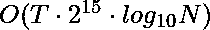

# 将 N 转换为最小可能值

> 原文:[https://www . geesforgeks . org/transform-n-to-minimum-value/](https://www.geeksforgeeks.org/transform-n-to-minimum-possible-value/)

给定两个数字和 **N** 和 **D** 。将以下两种操作中的任何一种应用于**N**:T6

1.  将 **D** 加到 **N** 上
2.  将 **N** 改为**数字(N)** ，其中**数字(N)** 为 **N** 位数之和

任务是将 **N** 转换为最小可能值。打印 **N** 的最小可能值和给定操作的应用次数(任意一项)。操作数量必须最少。
**例:**

> **输入:** N = 2，D = 1
> **输出:** 1 9
> 执行第一类操作 8 次，第二类操作 1 次
> **输入:** N = 9，D = 3
> **输出:** 3，2
> 先应用一个第一类操作，再应用第二类操作

**先决条件:**
1。[给定大整数的数字根(重复数字和)](https://www.geeksforgeeks.org/digital-rootrepeated-digital-sum-given-integer/)
2。[给定数字根的范围内的数字](https://www.geeksforgeeks.org/numbers-in-a-range-with-given-digital-root/)
**方法:**
让 Dr(x)是为整数 x 定义的函数，如下所示:

*   Dr(x) = x，如果 0 <= x <= 9
*   否则，Dr(x) = Dr(位数之和(x))

函数 Dr(x)是数字 x 的数字根。

*   Dr(a+b) = Dr(Dr(a) + Dr(b))
*   Dr(ab) = Dr(Dr(a) * Dr(b))

**重要观察:**最小值始终是最小值 over : Dr(N + kD)对于某些非负整数 k.

```
Dr(N + kD) = Dr(Dr(N) + Dr(kD))          (1)
```

现在，Dr(KD)= Dr(Dr(k)* Dr(D))
Dr(k)的可能值是 0，1，2…9，由数字 k=0，1，2…9
给出

```
Dr(x) = Dr(Sum-of-digits(x))             (2)
```

*   N 的最小值等于数字总和的最小值。如果我们把这个答案简化一次，加上 D，可以得到的最小值不会改变。因此，如果需要先执行一个 reduce 操作，然后执行一个 add 操作，那么我们可以先执行 add 操作，然后执行 reduce 操作，而不会影响我们可以到达的可能根。这从公式(1)和(2)
    的组合中显而易见
*   所以，我们可以先做所有的加法运算，再做所有的减法运算，达到任何一组运算都可能达到的任意个数。利用上述权利要求，我们可以证明最小可能值是 Dr(N + kD)的最小值，其中 0 <= k <= 9. 

*   要找到最小步数，请注意加法和数字总和运算的相对顺序确实会影响答案。此外，请注意，数字总和函数的下降速度非常快。

*   任意数字<= 10 <sup>10</sup> 到某个数字< = 90，任意数字< = 90 到某个东西< = 18，以此类推。简而言之，任何数字都可以在< = 5 步内减少到它的数字根。

*   通过这个，我们可以证明最小步长的值永远不能大于 15。这是一个宽松的上限，不是确切的上限。

*   使用强力递归算法，在每一步分支 2 个不同的方向，一个 x =数字总和(x)，另一个是 x = x+D，但只是直到递归深度为 15。就这样，我们在探索了 2 <sup>15</sup> 种不同的方式后停下来。

以下是上述方法的实现:

## C++

```
// CPP program to transform N to the minimum value
#include <bits/stdc++.h>
using namespace std;

// Initialising the answer
int min_val = INT_MAX;
int min_steps = 0;

// Function to find the digitsum
int sumOfDigits(int n)
{
    string s = to_string(n);

    int sum = 0;

    // Iterate over all digits and add them
    for (int i = 0; i < s.length(); i++) {
        sum += (s[i] - '0');
    }

    // Return the digit su,
    return sum;
}

// Function to transform N to the minimum value
void Transform(int n, int d, int steps)
{
    // If the final value is lesser than least value
    if (n < min_val) {
        min_val = n;
        min_steps = steps;
    }

    // If final value is equal to least value then check
    // for lesser number of steps to reach this value
    else if (n == min_val) {
        min_steps = min(min_steps, steps);
    }

    // The value will be obtained in less than 15 steps as
    // proved so applying normal recursive operations
    if (steps < 15) {
        Transform(sumOfDigits(n), d, steps + 1);
        Transform(n + d, d, steps + 1);
    }
}

// Driver code
int main()
{
    int N = 9, D = 3;

    // Function call
    Transform(N, D, 0);

    // Print the answers
    cout << min_val << " " << min_steps;

    return 0;
}
```

## Java 语言(一种计算机语言，尤用于创建网站)

```
// JAVA program to transform N to the minimum value
import java.util.*;

class GFG{

// Initialising the answer
static int min_val = Integer.MAX_VALUE;
static int min_steps = 0;

// Function to find the digitsum
static int sumOfDigits(int n)
{
    String s = String.valueOf(n);

    int sum = 0;

    // Iterate over all digits and add them
    for (int i = 0; i < s.length(); i++) {
        sum += (s.charAt(i) - '0');
    }

    // Return the digit su,
    return sum;
}

// Function to transform N to the minimum value
static void Transform(int n, int d, int steps)
{
    // If the final value is lesser than least value
    if (n < min_val) {
        min_val = n;
        min_steps = steps;
    }

    // If final value is equal to least value then check
    // for lesser number of steps to reach this value
    else if (n == min_val) {
        min_steps = Math.min(min_steps, steps);
    }

    // The value will be obtained in less than 15 steps as
    // proved so applying normal recursive operations
    if (steps < 15) {
        Transform(sumOfDigits(n), d, steps + 1);
        Transform(n + d, d, steps + 1);
    }
}

// Driver code
public static void main(String[] args)
{
    int N = 9, D = 3;

    // Function call
    Transform(N, D, 0);

    // Print the answers
    System.out.print(min_val+ " " +  min_steps);

}
}

// This code is contributed by 29AjayKumar
```

## 蟒蛇 3

```
# Python3 program to transform N to the minimum value
import sys;

# Initialising the answer
min_val = sys.maxsize;
min_steps = 0;

# Function to find the digitsum
def sumOfDigits(n) :

    s = str(n);

    sum = 0;

    # Iterate over all digits and add them
    for i in range(len(s)) :
        sum += (ord(s[i]) - ord('0'));

    # Return the digit su,
    return sum;

# Function to transform N to the minimum value
def Transform(n, d, steps) :
    global min_val;global min_steps;

    # If the final value is lesser than least value
    if (n < min_val) :
        min_val = n;
        min_steps = steps;

    # If final value is equal to least value then check
    # for lesser number of steps to reach this value
    elif (n == min_val) :
        min_steps = min(min_steps, steps);

    # The value will be obtained in less than 15 steps as
    # proved so applying normal recursive operations
    if (steps < 15) :
        Transform(sumOfDigits(n), d, steps + 1);
        Transform(n + d, d, steps + 1);

# Driver code
if __name__ == "__main__" :

    N = 9; D = 3;

    # Function call
    Transform(N, D, 0);

    # Print the answers
    print(min_val, min_steps);

# This code is contributed by Yash_R
```

## C#

```
// C# program to transform N to the minimum value
using System;

class GFG{

// Initialising the answer
static int min_val = int.MaxValue;
static int min_steps = 0;

// Function to find the digitsum
static int sumOfDigits(int n)
{
    string s = n.ToString();

    int sum = 0;

    // Iterate over all digits and add them
    for (int i = 0; i < s.Length; i++) {
        sum += (s[i] - '0');
    }

    // Return the digit su,
    return sum;
}

// Function to transform N to the minimum value
static void Transform(int n, int d, int steps)
{
    // If the final value is lesser than least value
    if (n < min_val) {
        min_val = n;
        min_steps = steps;
    }

    // If final value is equal to least value then check
    // for lesser number of steps to reach this value
    else if (n == min_val) {
        min_steps = Math.Min(min_steps, steps);
    }

    // The value will be obtained in less than 15 steps as
    // proved so applying normal recursive operations
    if (steps < 15) {
        Transform(sumOfDigits(n), d, steps + 1);
        Transform(n + d, d, steps + 1);
    }
}

// Driver code
public static void Main(string[] args)
{
    int N = 9, D = 3;

    // Function call
    Transform(N, D, 0);

    // Print the answers
    Console.Write(min_val+ " " +  min_steps);
}
}

// This code is contributed by Yash_R
```

## java 描述语言

```
<script>
// Javascript program to transform N to the minimum value

// Let initialising the answer
let min_val = Number.MAX_VALUE;
let min_steps = 0;

// Function to find the digitsum
function sumOfDigits(n)
{
    let s = n.toString();

    let sum = 0;

    // Iterate over all digits and add them
    for (let i = 0; i < s.length; i++) {
        sum += (s[i] - '0');
    }

    // Return the digit su,
    return sum;
}

// Function to transform N to the minimum value
function Transform(n, d, steps)
{
    // If the final value is lesser than least value
    if (n < min_val) {
        min_val = n;
        min_steps = steps;
    }

    // If final value is equal to least value then check
    // for lesser number of steps to reach this value
    else if (n == min_val) {
        min_steps = Math.min(min_steps, steps);
    }

    // The value will be obtained in less than 15 steps as
    // proved so applying normal recursive operations
    if (steps < 15) {
        Transform(sumOfDigits(n), d, steps + 1);
        Transform(n + d, d, steps + 1);
    }
}

// Driver Code

    let N = 9, D = 3;

    // Function call
    Transform(N, D, 0);

    // Prlet the answers
    document.write(min_val+ " " +  min_steps);

</script>
```

**Output:** 

```
3 2
```

**时间复杂度:** 