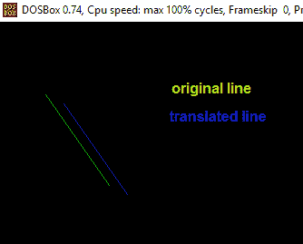
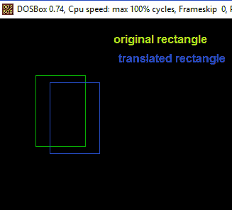

# 计算机图形中物体的平移

> 原文:[https://www . geesforgeks . org/translation-objects-computer-graphics-reference-add-请-review/](https://www.geeksforgeeks.org/translation-objects-computer-graphics-reference-added-please-review/)

在计算机图形学中，我们已经看到了如何画一些基本的图形，比如线和圆。在这篇文章中，我们将讨论计算机图形学以及二维几何中的一个重要操作的基础，这就是**变换**。
在计算机图形学中，坐标转换包括三个主要过程:

*   翻译
*   旋转
*   缩放比例

在这篇文章中，我们将只讨论**翻译**。

**什么是翻译？**

平移过程会将每个点沿指定方向移动一个恒定的距离。它可以被描述为一个刚性运动。平移也可以被解释为向每个点添加一个恒定矢量，或者移动坐标系的原点。
假设，如果点(X，Y)要按量 Dx 和 Dy 平移到一个新位置(X’，Y’)，那么可以通过将 Dx 加到 X，Dy 加到 Y 来获得新坐标，如下所示:

```
X' = Dx + X
Y' = Dy + Y

or P' = T + P where

P' = (X', Y'),
T = (Dx, Dy ),
P = (X, Y)

```

这里，P(X，Y)是原点。T(Dx，Dy)是**平移因子**，即点将被平移的量。P'(X '，Y ')是平移后 P 点的坐标。
例子:

```
Input : P[] = {5, 6}, T = {1, 1}
Output : P'[] = {6, 7}

Input : P[] = {8, 6}, T = {-1, -1}
Output : P'[] = {7, 5}

```

每当我们翻译任何物体时，我们只是翻译它的每一个点。一些基本对象及其翻译可以绘制为:

1.  **Point Translation P(X, Y) :** Here we only translate the x and y coordinates of given point as per given translation factor dx and dy respectively.
    Below is the C++ program to translate a point:

    ```
    // C++ program for translation
    // of a single coordinate
    #include<bits/stdc++.h>
    #include<graphics.h>

    using namespace std;

    // function to translate point
    void translatePoint ( int P[], int T[])
    {
        /* init graph and putpixel are used for 
           representing coordinates through graphical 
           functions 
        */
        int gd = DETECT, gm, errorcode;
        initgraph (&gd, &gm, "c:\\tc\\bgi"); 

        cout<<"Original Coordinates :"<<P[0]<<","<<P[1];

        putpixel (P[0], P[1], 1);

        // calculating translated coordinates
        P[0] = P[0] + T[0];
        P[1] = P[1] + T[1];

        cout<<"\nTranslated Coordinates :"<< P[0]<<","<< P[1];

        // Draw new coordinatses
        putpixel (P[0], P[1], 3);
        closegraph();
    }

    // driver program
    int main()
    {
        int P[2] = {5, 8}; // coordinates of point
        int T[] = {2, 1}; // translation factor
        translatePoint (P, T);
        return 0;
    } 
    ```

    输出:

    ```
    Original Coordinates : 5, 8
    Translated Coordinates : 7, 9

    ```

2.  **Line Translation:** The idea to translate a line is to translate both of the end points of the line by the given translation factor(dx, dy) and then draw a new line with inbuilt graphics function.
    Below is the C++ implementation of above idea:

    ```
    // cpp program for translation
    // of a single line
    #include<bits/stdc++.h>
    #include<graphics.h>

    using namespace std;

    // function to translate line
    void translateLine ( int P[][2], int T[])
    {
        /* init graph and line() are used for 
           representing line through graphical
           functions 
        */
        int gd = DETECT, gm, errorcode;
        initgraph (&gd, &gm, "c:\\tc\\bgi"); 

        // drawing original line using graphics functions
        setcolor (2);
        line(P[0][0], P[0][1], P[1][0], P[1][1]);

        // calculating translated coordinates
        P[0][0] = P[0][0] + T[0];
        P[0][1] = P[0][1] + T[1];
        P[1][0] = P[1][0] + T[0];
        P[1][1] = P[1][1] + T[1];

        // drawing translated line using graphics functions
        setcolor(3);
        line(P[0][0], P[0][1], P[1][0], P[1][1]);
        closegraph();
    }

    // driver program
    int main()
    {
        int P[2][2] = {5, 8, 12, 18}; // coordinates of point
        int T[] = {2, 1}; // translation factor
        translateLine (P, T);
        return 0;
    } 
    ```

    **输出** :
    [](https://media.geeksforgeeks.org/wp-content/uploads/translation-1.bmp)

3.  **Rectangle Translation :** Here we translate the x and y coordinates of both given points A(top left ) and B(bottom right) as per given translation factor dx and dy respectively and then draw a rectangle with inbuilt graphics function

    ```
    // C++ program for translation
    // of a rectangle
    #include<bits/stdc++.h>
    #include<graphics.h>
    using namespace std;

    // function to translate rectangle
    void translateRectangle ( int P[][2], int T[])
    {
        /* init graph and rectangle() are used for 
        representing rectangle through graphical functions */
        int gd = DETECT, gm, errorcode;
        initgraph (&gd, &gm, "c:\\tc\\bgi"); 
        setcolor (2);
        // rectangle (Xmin, Ymin, Xmax, Ymax)
        // original rectangle
        rectangle (P[0][0], P[0][1], P[1][0], P[1][1]);

        // calculating translated coordinates
        P[0][0] = P[0][0] + T[0];
        P[0][1] = P[0][1] + T[1];
        P[1][0] = P[1][0] + T[0];
        P[1][1] = P[1][1] + T[1];

        // translated rectangle (Xmin, Ymin, Xmax, Ymax)
        // setcolor(3);
        rectangle (P[0][0], P[0][1], P[1][0], P[1][1]);
        // closegraph();
    }

    // driver program
    int main()
    {
        // Xmin, Ymin, Xmax, Ymax as rectangle
        // coordinates of top left and bottom right points
        int P[2][2] = {5, 8, 12, 18};
        int T[] = {2, 1}; // translation factor
        translateRectangle (P, T);
        return 0;
    } 
    ```

    **输出** :
    [](https://media.geeksforgeeks.org/wp-content/uploads/translation-2.bmp)

参考文献:[http://math.hws.edu/graphicsbook/.](http://math.hws.edu/graphicsbook/.)

本文由**[Shivam Pradhan(anuj _ charm)](https://www.facebook.com/anuj.charm)**供稿。如果你喜欢 GeeksforGeeks 并想投稿，你也可以使用[contribute.geeksforgeeks.org](http://www.contribute.geeksforgeeks.org)写一篇文章或者把你的文章邮寄到 contribute@geeksforgeeks.org。看到你的文章出现在极客博客主页上，帮助其他极客。

如果你发现任何不正确的地方，或者你想分享更多关于上面讨论的话题的信息，请写评论。