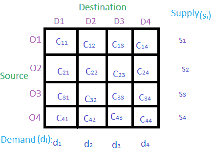

# 运输问题|第一集(简介)

> 原文:[https://www . geesforgeks . org/transport-problem-set-1-introduction/](https://www.geeksforgeeks.org/transportation-problem-set-1-introduction/)

**运输问题**是一种特殊的**线性规划问题(LPP)** ，其中货物从一组源运输到一组目的地，分别取决于源和目的地的供求关系，从而使运输的总成本最小化。它有时也被称为希区柯克问题。

**运输问题的类型:**
**均衡:**当供给和需求相等时，那么这个问题被称为均衡运输问题。

**不平衡:**当供需不相等时，则称之为运输不平衡问题。在这种类型的问题中，根据需要添加虚拟行或虚拟列，使其成为平衡问题。那么就可以像平衡问题一样解决了。

**求解方法:**
寻找初始基本可行解有三种方法:

1.  西北角单元法。
2.  最少调用单元格方法。
3.  沃格尔近似法(VAM)。

**运输问题基本结构:**

上表中**D1****D2****D3**和 **D4** 是产品/货物从不同来源发货的目的地**S1****S2****S3**和 **S4** 。 **S i** 是从源头供应 **O i** 。**DjT32】是目的地**DjT36】的需求。**CijT40】是产品从源头**SIT44】到目的地**DjT48】的成本。**********