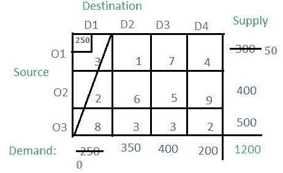
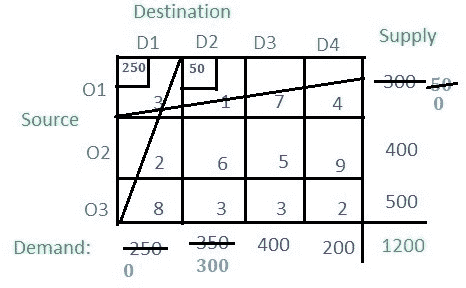
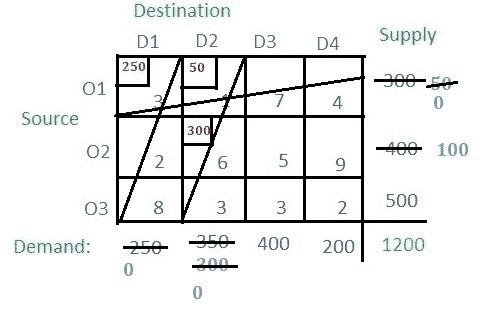
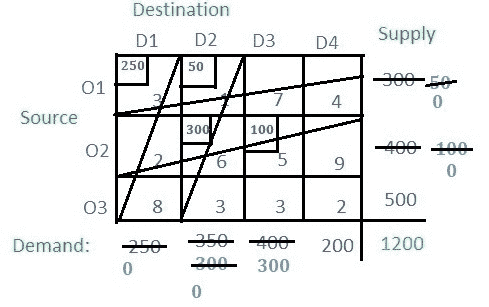
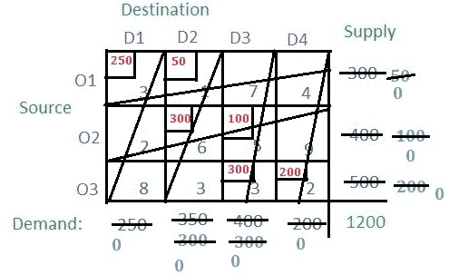

# 运输问题|第二集(西北角法)

> 原文:[https://www . geesforgeks . org/transport-problem-set-2-西北角-method/](https://www.geeksforgeeks.org/transportation-problem-set-2-northwest-corner-method/)

上一篇文章已经讨论了运输问题的介绍，在本文中，将讨论使用西北角单元法寻找初始基本可行解。

**说明:**给出三个来源 **O1** 、 **O2** 、 **O3** 和四个目的地 **D1** 、 **D2** 、 **D3** 和 **D4** 。对于源 **O1** 、 **O2** 和 **O3** ，供应分别为 **300** 、 **400** 和 **500** 。目的地**D1****D2****D3**和 **D4** 分别有需求**250****350****400**和 **200** 。

**解:**根据西北角法， **(O1，D1)** 必须是起点，即桌子的西北角。单元格中的每个值都被视为每次运输的成本。对比**栏**的需求和来源 **O1** 的供应，将最少两个分配给单元格 **(O1，D1)** ，如图所示。
对**栏 D1** 的需求已经完成，因此整个**栏 D1** 将被取消。来源 **O1** 的供应保持**300–250 = 50**。

现在从剩余的表中，即不包括列 **D1** ，检查西北角即 **(O1，D2)** ，并在各列和各行的供应中分配最小值。 **O1** 的供应量为 **50** ，少于 **D2** (即 350)的需求量，因此将 **50** 分配到单元**(D2 O1)**。由于来自行 **O1** 的供应已完成，取消行 **O1** 。对 **D2** 栏的需求保持在**350–50 = 300**。

从剩下的表格来看，西北角单元格是 **(O2，D2)** 。来源 **O2** (即 400)和需求栏 **D2** (即 300)中的最小供应量为 **300** ，因此将 **300** 分配给单元格 **(O2，D2)** 。对色谱柱 **D2** 的需求已经完成，因此取消色谱柱，剩余的氧气来源**为**400–300 = 100。

现在从剩余的表格中找到西北角，即 **(O2，D3)** ，比较 **O2** 的供应(即 100)和 **D2** (即 400)的需求，并将较小的(即 100)分配给单元格 **(O2，D2)** 。 **O2** 的供应完成，因此取消排 **O2** 。柱 **D3** 的剩余需求仍为**400–100 = 300**。

以同样的方式进行，单元格的最终值将是:

**注意:**在最后一个剩余的单元格中，各行各列的需求相等，这是单元格**(D4 O3)**。在这种情况下，来自 **O3** 的供应和对 **D4** 的需求是 **200** ，分配给该单元。最后，任何行或列都没有剩余。
现在只需将分配的值与相应的单元格值(即成本)相乘，并将其全部相加，即可得到基本解，即**(250 * 3)+(50 * 1)+(300 * 6)+(100 * 5)+(300 * 3)+(200 * 2)= 4400**