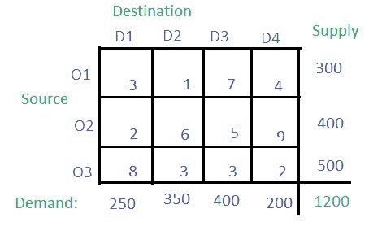
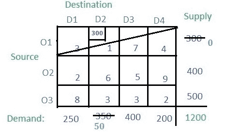
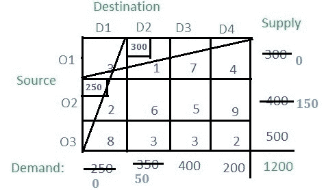
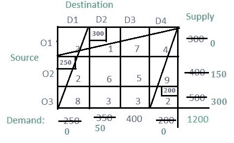
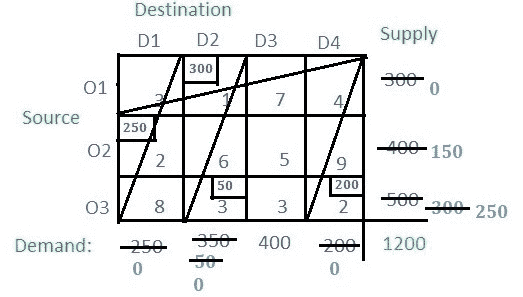
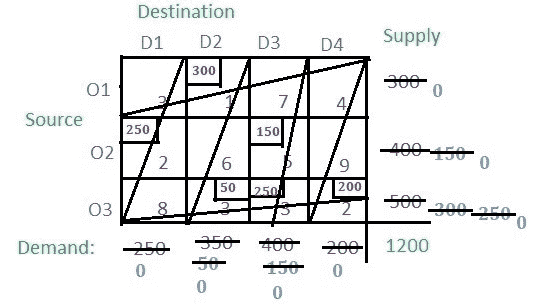

# 运输问题|集合 3(最小成本单元法)

> 原文:[https://www . geesforgeks . org/transport-problem-set-3-最小成本-cell-method/](https://www.geeksforgeeks.org/transportation-problem-set-3-least-cost-cell-method/)

**西北角**方法在上一篇文章中已经讨论过。本文将讨论**最小成本单元**方法。

**解决方案:**根据最小成本单元法，必须找到表中所有单元中成本最小的单元，即 **1** (即单元 **(O1，D2)** )。
现在检查行 **O1** 的供应和列 **D2** 的需求，并将较小的值分配给单元格。较小的值为 **300** ，因此将其分配给单元格。来自 **O1** 的供应已完成，因此取消该行，D2**栏的剩余需求为**350–300 = 50**。**

现在在剩余的单元格中找到成本最低的单元格。成本最低的有两个小区，分别是 **(O2，D1)** 和 **(O3，D4)** 成本 **2** 。让我们选择 **(O2，D1)** 。现在找到相应单元格的需求和供应，并将其中的最小值分配给该单元格，并取消分配后供应或需求变为 **0** 的行或列。

现在成本最低的小区是 **(O3，D4)** 带成本 **2** 。由于需求小于供应，将此单元配置为 **200** 。所以专栏被取消了。

未分配单元中有两个单元的成本最低。随便选一个说 **(O3，D2)** 。在相应行的供应和相应列的需求之间分配最小的单元。取消零值行或列。

现在成本最低的小区是 **(O3，D3)** 。分配供需最小值，取消零值行或列。

唯一剩下的电池是 **(O2，D3)** ，成本为 **5** ，供应为 **150** ，需求为 **150** ，即需求和供应相等。分配到这个单元。

现在只需将单元格的成本与它们各自的分配值相乘，并将其全部相加，即可得到基本解，即**(300 * 1)+(250 * 2)+(150 * 5)+(50 * 3)+(250 * 3)+(200 * 2)= 2850**