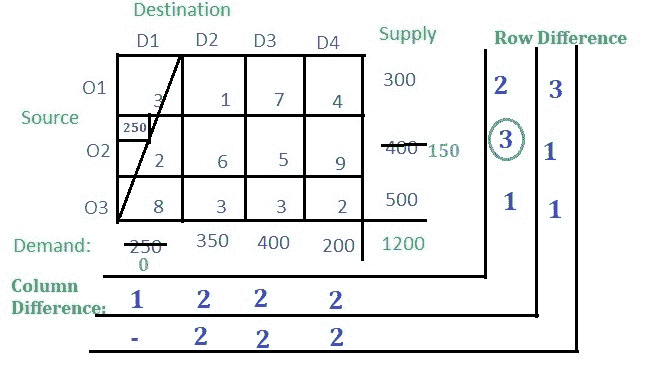
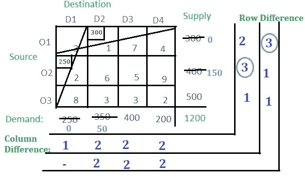
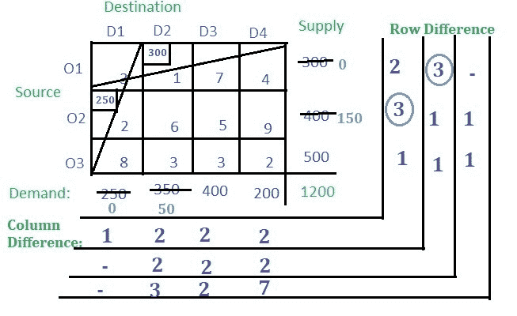
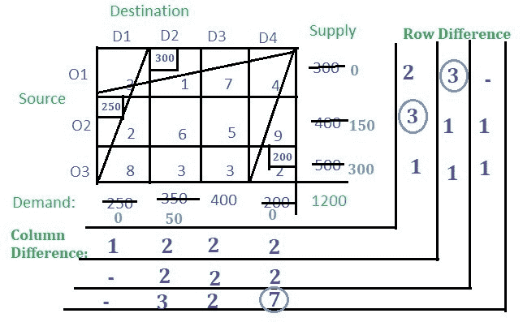
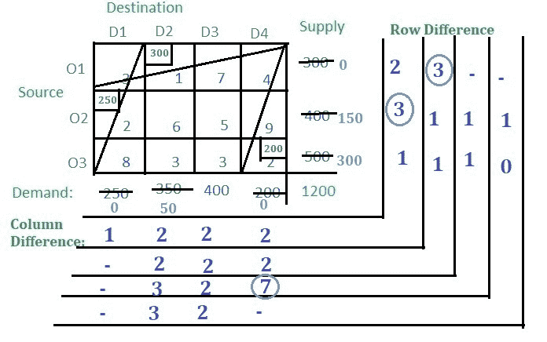
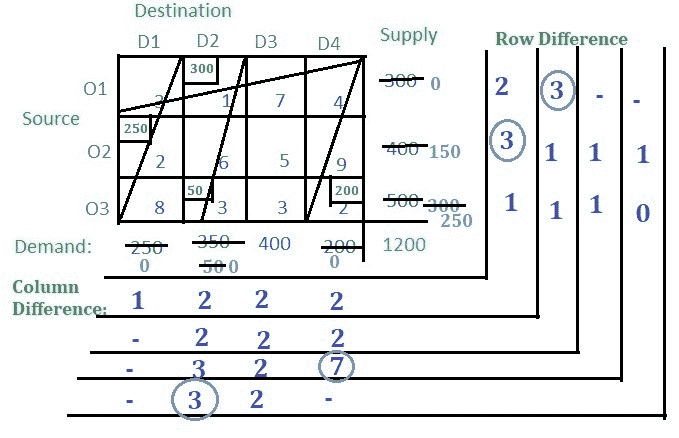
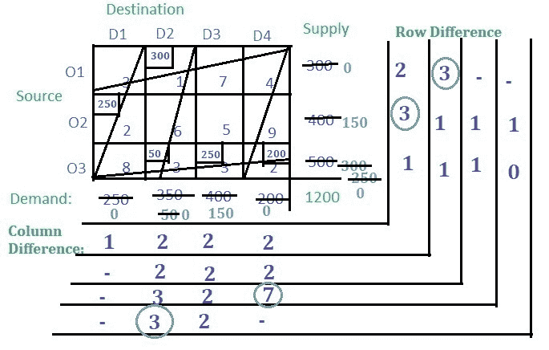
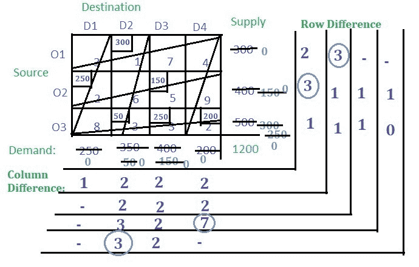

# 运输问题|集合 4(沃格尔近似法)

> 原文:[https://www . geesforgeks . org/transport-problem-set-4-vogels-approximation-method/](https://www.geeksforgeeks.org/transportation-problem-set-4-vogels-approximation-method/)

**西北角**方法和**最小成本单元**方法已经在前面的文章中讨论过。在本文中，将讨论**沃格尔近似**方法。

**解决方案:**

*   对于每一行，找到最小值，然后找到第二个最小值，取这两个最小值的绝对差值，并将其写入相应的行差值中，如下图所示。在第 **O1** 行中， **1** 为最小值， **3** 为第二小值，它们的绝对差值为 **2** 。同样，对于第 **O2** 和 **O3** 行，绝对差值分别为 **3** 和 **1** 。
*   对于每一列，找出最小值，然后是第二个最小值，取这两个最小值的绝对差值，然后将其写入相应的列差值中，如图所示。在**栏中，D1** 、 **2** 为最小值， **3** 为第二小值，它们的绝对差值为 **1** 。同样，对于 **D2** 、 **D3** 和 **D3** 栏，绝对差值分别为 **2** 、 **2** 和 **2** 。
    T21】
*   行差和列差的这些值也被称为罚分。现在选择最大惩罚。最高罚 **3** 即排 **O2** 。现在在行 **O2** 中找到成本最小的单元格，并在相应行的供应和相应列的需求之间分配最小值。需求小于供应，因此将列的需求，即 **250** 分配给单元。然后取消 **D1** 一栏。
    
*   从剩余的单元格中，找出行差和列差。
    
*   再次选择与第 **O1** 行对应的最大处罚 **3** 。第**行成本最低的单元格 O1** 为**(D2 O1)**，成本为 **1** 。将各个行和列中的最小供应和需求分配给单元格。取消零值行或列。
    
*   现在从剩余的单元格中找出行差和列差。
    
*   现在选择最大处罚为 **7** 对应栏 **D4** 。 **D4** 列中成本最小的单元格是**(D4 O3)**，成本为 **2** 。电池**(D4 O3)**的需求量小于供应量。将 **200** 分配给单元格，取消列。
    
*   从剩余的单元格中找出行差和列差。
    
*   现在最高罚 **3** 对应 **D2** 一栏。 **D2** 值最小的单元格为**(D2 O3)**。分配最小供需，取消列。
    
*   现在只有一列，所以选择成本最低的单元格并分配值。
    
*   现在只有一个单元，所以将剩余的需求或供应分配给该单元
    
*   没有余额了。所以将单元格的分配值乘以它们对应的单元格成本，然后全部相加，得到最终成本，即**(300 * 1)+(250 * 2)+(50 * 3)+(250 * 3)+(200 * 2)+(150 * 5)= 2850**