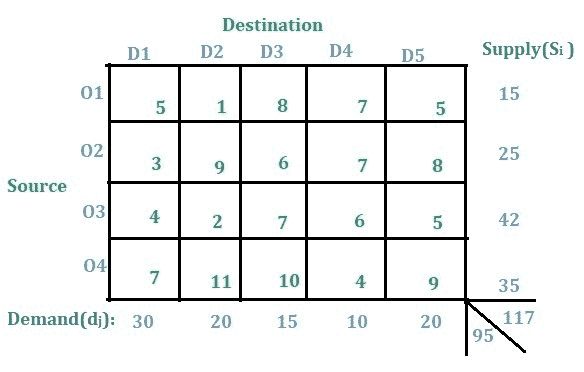
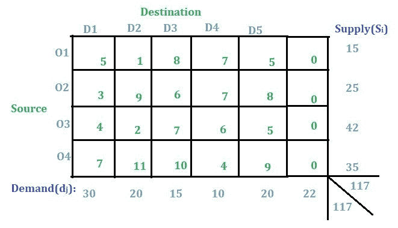

# 运输问题|第 5 集(不平衡)

> 原文:[https://www . geesforgeks . org/transport-问题集-5-不平衡/](https://www.geeksforgeeks.org/transportation-problem-set-5-unbalanced/)

运输问题的介绍已经在[这篇](https://www.geeksforgeeks.org/transportation-problem-set-1-introduction/)文章中讨论过了。本文将讨论解决不平衡运输问题的方法。

下面的运输问题是一个不平衡的运输问题。

问题是不平衡的，因为所有供给的总和，即 **O1** 、 **O2** 、 **O3** 和 **O4** 不等于所有需求的总和，即 **D1** 、 **D2** 、 **D3** 、 **D4** 和 **D5** 。

**解决方案:**
在这种类型的问题中，将使用虚拟行或虚拟列的概念。在这种情况下，由于供应大于需求，因此将添加一个虚拟需求列，并将(总供应–总需求)的需求提供给该列，即**117–95 = 22**，如下图所示。如果需求大于供应，那么就会添加一个虚拟供应行。

现在问题已经更新为平衡运输问题，可以使用以下任何一种方法来解决平衡运输问题，如前几篇文章中所述:

1.  [西北角法](https://www.geeksforgeeks.org/transportation-problem-set-2-northwest-corner-method/)
2.  [最小成本单元法](https://www.geeksforgeeks.org/transportation-problem-set-3-least-cost-cell-method/)
3.  [沃格尔近似法](https://www.geeksforgeeks.org/transportation-problem-set-4-vogels-approximation-method/)