# 运输问题|第 6 集(MODI 法–UV 法)

> 原文:[https://www . geesforgeks . org/transport-problem-set-6-modi-method-uv-method/](https://www.geeksforgeeks.org/transportation-problem-set-6-modi-method-uv-method/)

解决运输问题有两个阶段。在第一阶段，必须找到初始基本可行解，第二阶段包括优化在第一阶段获得的初始基本可行解。有三种方法可以找到初始的基本可行解，

1.  [西北角法](https://www.geeksforgeeks.org/transportation-problem-set-2-northwest-corner-method/)
2.  [最小成本单元法](https://www.geeksforgeeks.org/transportation-problem-set-3-least-cost-cell-method/)
3.  [沃格尔近似法](https://www.geeksforgeeks.org/transportation-problem-set-4-vogels-approximation-method/)

本文将通过一个示例来讨论如何优化初始基本可行解。考虑下面的运输问题。
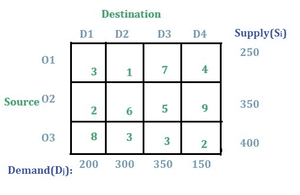

**解决方案:**

**第一步:**检查问题是否均衡。
如果来源 **O1** 、 **O2** 、 **O3** 所有供给的总和等于目的地 **D1** 、 **D2** 、 **D3** 和 **D4** 所有需求的总和，那么运输问题就是一个均衡运输问题。

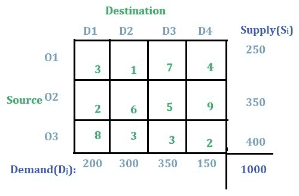

**注:**如果问题不是不平衡的，那么可以按照[这篇](https://www.geeksforgeeks.org/transportation-problem-set-5-unbalanced/)文章中讨论的那样，使用虚拟行或虚拟列的概念将不平衡问题转化为平衡问题。

**第二步:**寻找初始基本可行解。
上述三种方法中的任何一种都可以用来寻找初始基本可行解。这里将使用[西北角法](https://www.geeksforgeeks.org/transportation-problem-set-2-northwest-corner-method/)。根据西北角法，这是最终的初始基本可行解:

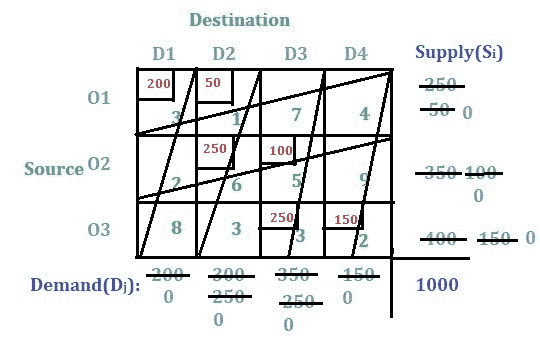

现在，运输总成本将为**(200 * 3)+(50 * 1)+(250 * 6)+(100 * 5)+(250 * 3)+(150 * 2)= 3700**。

**第三步:** U-V 法优化初始基本可行解。
以下是初步的基本可行方案:

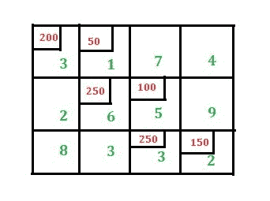

–对于 U-V 方法，必须分别找到行和列的值 **u i** 和 **v j** 。由于有三行，因此必须找到三个 **u i** 值，即第一行的 **u 1** ，第二行的 **u 2** ，第三行的 **u 3** 。
同样，对于四列四 **v j** 值必须找到，即**v1T32】、**v2T36】、**v3T40】和**v4T44】。检查下面的图像:********

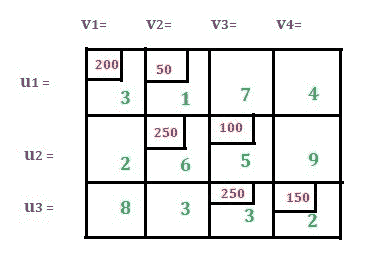

有一个单独的公式可以找到 **u i** 和 **v j** 、
**uI+vj= CijT16】，其中**CijT20】是仅分配单元的成本值。在这里阅读更多关于它的。****

在应用上述公式之前，我们需要检查**m+n–1 是否等于分配的单元格总数**，其中 **m** 是总行数， **n** 是总列数。
在这种情况下，m = 3，n = 4，分配的单元总数为 6，因此 m+n–1 = 6。m+n–1 不等于分配单元总数的情况将在后面的文章中讨论。

现在，为了找到 u 和 v 的值，我们将三个 u 中的任何一个或四个 v 中的任何一个指定为 0。让我们在这种情况下分配 **u 1 = 0** 。然后用上面的公式我们会得到 **v 1 = 3** 作为**u1+v1= 3**(即**C11T17】)和 **v 2 = 1** 作为 **u 1 + v 2 同样，我们得到了 **v 2 = 1** 的值，所以我们得到了 **u 2 = 5** 的值，这意味着 **v 3 = 0** 。从 **v 3 = 0** 的值我们得到 **u 3 = 3** ，这意味着 **v 4 = -1** 。见下图:****

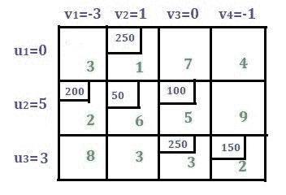

现在，使用公式**Pij= uI+vj–Cij**仅计算未分配单元格的罚款。第一行有两个未分配的单元格，第二行有两个，第三行有两个。让我们逐一计算。

1.  对于**C13T3、**P13= 0+0–7 =-7**(此处 **C 13 = 7** 、 **u 1 = 0** 、 **v 3 = 0****
2.  对于**C14T3、 **P 14 = 0 + (-1) -4 = -5****
3.  对于**C21T3、**P21= 5+3–2 = 6****
4.  对于**C24T3、**P24= 5+(-1)–9 =-5****
5.  对于**C31T3、**P31= 3+3–8 =-2****
6.  对于**C32T3、**P32= 3+1–3 = 1****

**规则:**如果我们得到的所有惩罚值都是零或负值，这意味着达到了最优性，这个答案就是最终答案。但是如果我们得到任何正值，就意味着我们需要在下一步继续进行求和。

现在求最大正罚。此处最大值为 6，对应**C21T3】细胞。现在这个细胞是新的基本细胞。该单元格也将包含在解决方案中。**

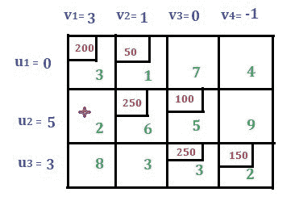

**绘制闭合路径或循环的规则。**从新的基本单元开始，画一条闭合路径，使直角转弯只在分配的单元或新的基本单元完成。请参见以下图片:

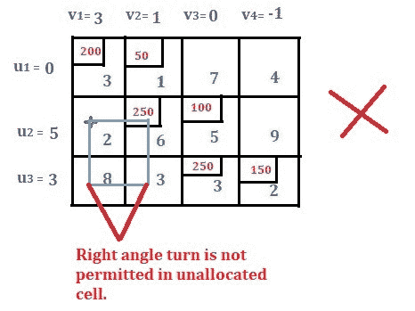
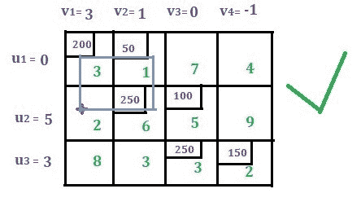

为循环中具有直角转弯(或拐角)的所有单元格指定交替的加号-减号，并在新的基本单元格处指定加号。

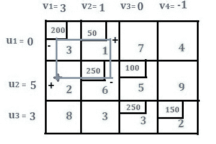

考虑带负号的单元格。比较分配的值(即在这种情况下为 200 和 250)并选择最小值(即在这种情况下选择 200)。现在从带负号的单元格中减去 200，然后在带加号的单元格中加上 200。并绘制新的迭代。循环的工作已经结束，新的解决方案如下所示。

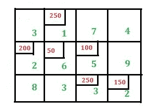

检查分配的单元总数是否等于(m+n–1)。再次使用公式**uI+vj= CijT7【其中】 **C ij** 仅是分配单元的成本值。分配 **u 1 = 0** 则得到 **v 2 = 1** 。同样，我们将得到以下值 **u i** 和 **v j** 。**

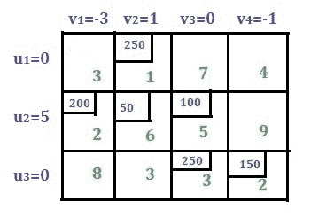

使用公式**Pij= uI+vj–CijT9】找到所有未分配单元格的惩罚。**

1.  对于**C11T3、**P11= 0+(-3)–3 =-6****
2.  对于**C13T3、**P13= 0+0–7 =-7****
3.  对于**C14T3、**P14= 0+(-1)–4 =-5****
4.  对于**C24T3、**P24= 5+(-1)–9 =-5****
5.  对于**C31T3、**P31= 0+(-3)–8 =-11****
6.  对于**C32T3、**P32= 3+1–3 = 1****

有一个正值，即 1 表示**C32T3。现在这个细胞变成了新的基本细胞。**

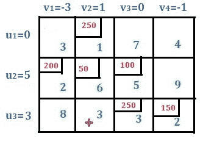

现在从新的基本单元格开始画一个循环。指定交替的加号和减号，新的基本单元格指定为加号。

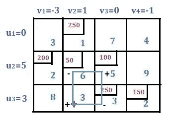

从分配给带减号单元格的值中选择最小值。从带减号的单元格中减去该值，然后添加到带加号的单元格中。现在，解决方案如下图所示:

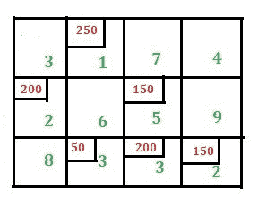

检查分配的单元总数是否等于(m+n–1)。如上求出 u 和 v 值。

现在，再次找到未分配单元格的惩罚，如上所示。

1.  对于**P11= 0+(-2)–3 =-5**
2.  对于**P13= 0+1–7 =-6**
3.  对于**P14= 0+0–4 =-4**
4.  对于**P22= 4+1–6 =-1**
5.  对于**P24= 4+0–9 =-5**
6.  对于**P31= 2+(-2)–8 =-8**

所有的惩罚值都是负值。这样就达到了最优性。

现在求总成本即**(250 * 1)+(200 * 2)+(150 * 5)+(50 * 3)+(200 * 3)+(150 * 2)= 2450**