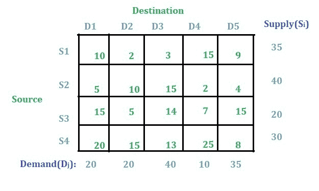
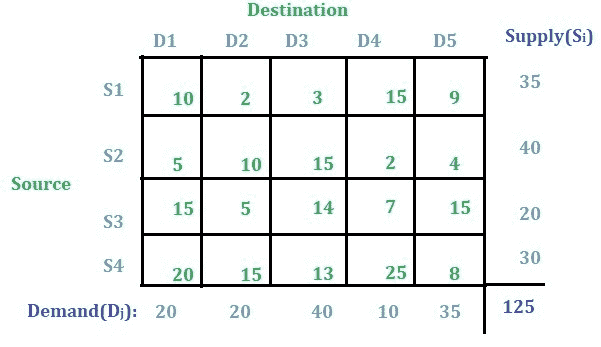
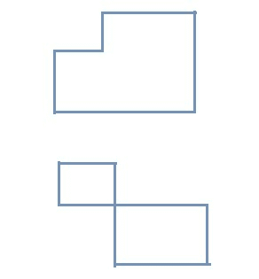
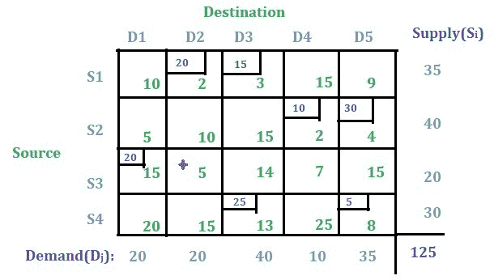
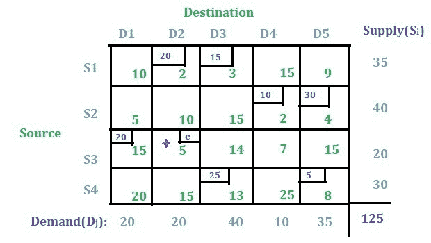
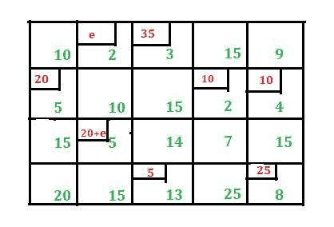

# 运输问题|集合 7(运输问题中的退化)

> 原文:[https://www . geesforgeks . org/transportation-problem-set-7-transportation 中的退化-problem/](https://www.geeksforgeeks.org/transportation-problem-set-7-degeneracy-in-transportation-problem/)

请先浏览[这篇文章](https://www.geeksforgeeks.org/transportation-problem-set-6-modi-method-uv-method/)。
本文将通过一个解释的例子来讨论运输问题中的简并性。

**解决方案:**
这个问题是均衡运输问题，因为总供给等于总需求。

**初始基本可行解:**
[这里将使用最小成本单元法](https://www.geeksforgeeks.org/transportation-problem-set-3-least-cost-cell-method/)来寻找初始基本可行解。也可以使用[西北角法](https://www.geeksforgeeks.org/transportation-problem-set-2-northwest-corner-method/)或[沃格尔近似法](https://www.geeksforgeeks.org/transportation-problem-set-4-vogels-approximation-method/)寻找初始基本可行解。

使用[最小成本单元法](https://www.geeksforgeeks.org/transportation-problem-set-3-least-cost-cell-method/)我们得到如下解。

**使用 U-V 方法优化解:**
检查 m+n–1 是否=分配的单元总数。在这种情况下，m+n–1 = 4+5–1 = 8，其中分配的小区总数为 7，因此这是运输问题中的退化情况。因此，在这种情况下，我们将必要数量(在这种情况下为 m+n–1–已分配单元总数，即 8–7 = 1)的未分配单元转换为已分配单元，以满足上述条件。

**将未分配单元格转换为已分配单元格的步骤:**

*   从未分配单元格的最小值开始。
*   逐一检查回路形成情况。
*   不应该有闭环形成。
*   选择该循环作为新分配的单元，并赋值“e”。

闭环可以是任何形式，但是所有的转折点应该只在分配的小区或者从环路开始的小区。

有 13 个未分配的单元格。从未分配的单元格中选择最少的值(在本例中为 5)。这里有两个 5s，所以你可以随机选择任何一个。让我们选择标有星号的单元格。

检查从该单元开始是否有任何闭环形成。如果按照闭环条件从该单元画出闭环，则可以观察到该单元不能完成闭环。因此，这个单元格将被选中并分配一个随机值“e”。

**注意:**如果闭环是由该单元形成的，那么我们将尝试另一个具有最小值的单元，并执行相同的过程，检查闭环是否可能。

现在，分配的单元总数变为 8，m+n–1 = 4+5–1 = 8。现在这个方案可以用 [U-V 法](https://www.geeksforgeeks.org/transportation-problem-set-6-modi-method-uv-method/)进行优化。使用 U-V 方法进行优化后，我们得到了下面的解。

最终解中出现两个“e”意味着在优化过程中进行一些迭代后，退化的条件将再次得到满足。

在计算总成本时，只需留下“e”并将分配值乘以其单元格的成本值，然后将所有值相加。所以，运输成本为**(35 * 3)+(20 * 5)+(10 * 2)+(10 * 4)+(20 * 5)+(5 * 13)+(25 * 8)= 630**。