# 运输问题集 8 |转运模型-1

> 原文:[https://www . geesforgeks . org/transport-problem-set-8-transpose-model-1/](https://www.geeksforgeeks.org/transportation-problem-set-8-transshipment-model-1/)

转运模型是运输问题下的一个模型。转运问题有两种类型:

*   源和目的地充当瞬时(即中间)节点
*   在源和目的地之间有一些瞬时节点

看给定的运输问题图。

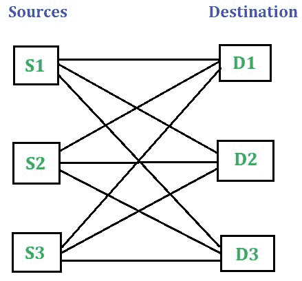

在运输问题中，货物从一个特定的来源移动到另一个特定的目的地，可能从 S1 移动到 D1、S1 移动到 D2、S1 移动到 D3、S2 移动到 D1、S2 移动到 D2 等等。

本文将讨论转运问题，其中源和目的地充当临时(即中间)节点。本文的下一部分将讨论在源和目的地之间带有一些临时(即中间)节点的转运问题。

**源和目的地作为临时节点的转运问题**T2

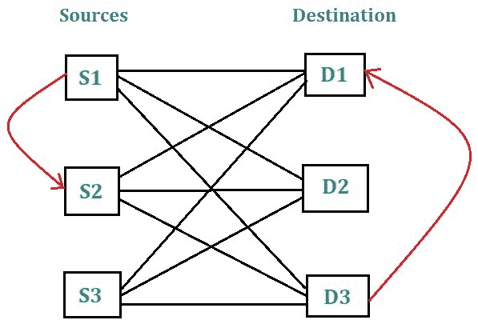

在这种方法中，货物在到达其期望的目的地之前经过一个或多个中间节点。这种方法允许货物在到达预期目的地之前从一个来源传递到另一个来源，并从一个目的地传递到另一个目的地。

**注意:**中间节点本身可以是源节点，也可以是目的节点。

考虑以下转运问题，涉及 4 个来源和 2 个目的地。来源 S1、S2、S3 和 S4 的供应值分别为 200、250、300 和 450 单位。目的地 D1 和 D2 的需求值分别为 600 台和 600 台。下表总结了不同来源和目的地之间的单位运输成本。
解决转运问题。

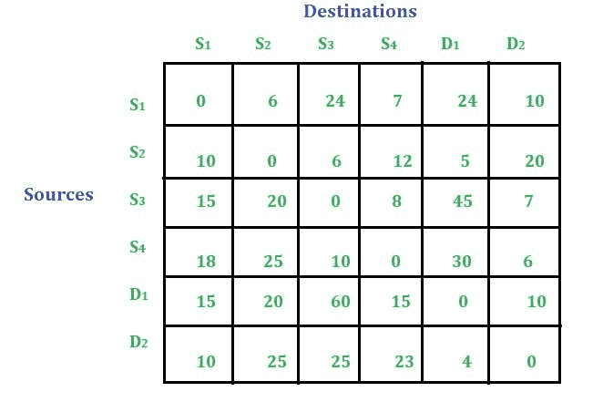

解决转运问题的步骤:

*   检查是否平衡或不平衡。平衡的，如果供给的总和=需求的总和= B，那么这里的 B 值是 1200。
    这种情况下问题是平衡的见下表。如果问题不均衡，我们可以添加虚拟行或列来使其均衡。参考[本文](https://www.geeksforgeeks.org/transportation-problem-set-5-unbalanced/)T3】

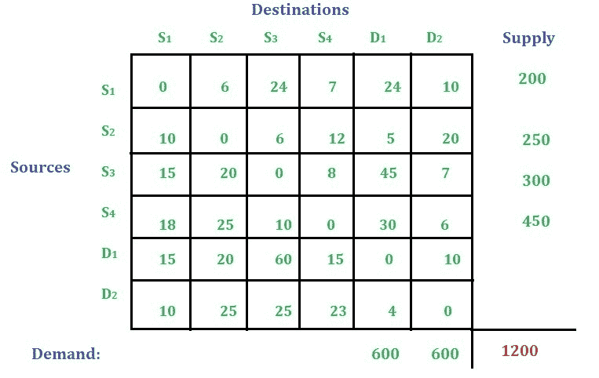

*   将 B 的值添加到所有行和列中。见下表:

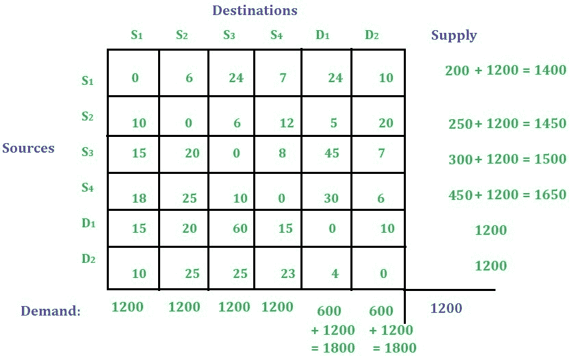

*   使用[沃格尔近似法](https://www.geeksforgeeks.org/transportation-problem-set-4-vogels-approximation-method/)计算总运输成本，因为它给出了比[最小成本单元法](https://www.geeksforgeeks.org/transportation-problem-set-3-least-cost-cell-method/)和[西北角法](https://www.geeksforgeeks.org/transportation-problem-set-2-northwest-corner-method/)更优化的解决方案。
    使用[沃格尔近似法](https://www.geeksforgeeks.org/transportation-problem-set-4-vogels-approximation-method/)求解运输问题后，得到如下解:

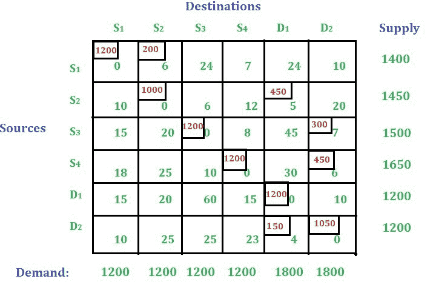

*   只需忽略零成本单元，计算运输成本。
    运输总成本为:(200 * 6)+(450 * 5)+(300 * 7)+(450 * 6)+(150 * 4)= 8850
*   绘制运输模式。注意:主对角线单元格中的分配将被忽略。
    要绘制运输图，首先绘制如下所示的四个来源和两个目的地:

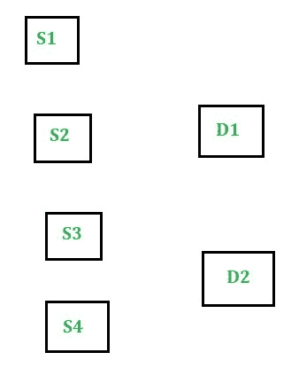

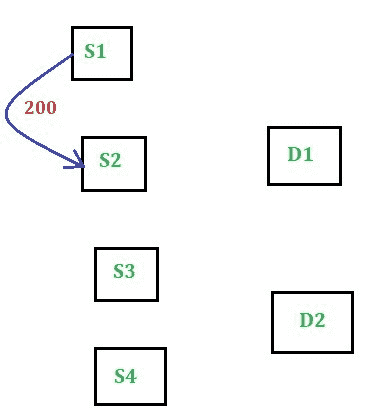

*   第二个分配的小区是(D1 S2)。这批货物从 S2 运往 D1。分配的值是 450。

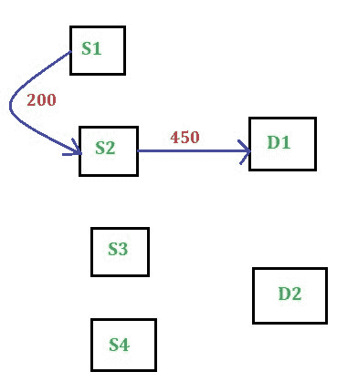

*   下一个分配的小区是(S3、D2)，然后是(S4、D2)。这两个单元的分配值分别为 300 和 450。

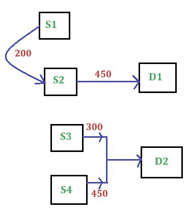

*   下一个也是最后一个分配的小区是(D1 D2)。这批货物从 D2 运往 D1。该单元格的分配值为 150。

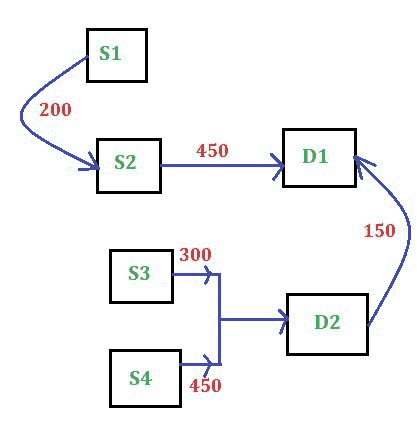