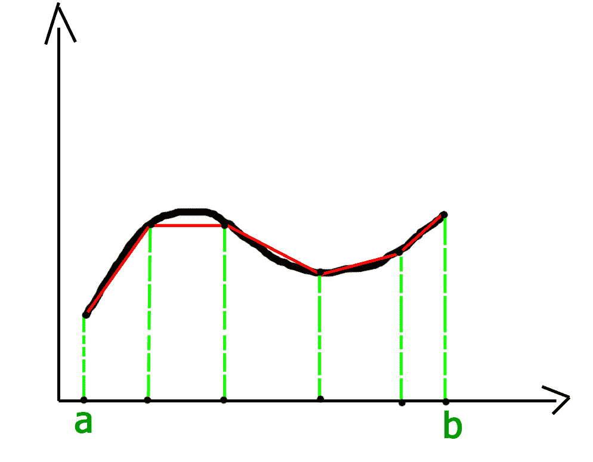

# 定积分近似值梯形法则

> 原文:[https://www . geesforgeks . org/梯形定积分近似值法则/](https://www.geeksforgeeks.org/trapezoidal-rule-for-approximate-value-of-definite-integral/)

在数值分析领域，梯形法则被用来寻找定积分的近似值。梯形法则的基本思想是假设给定函数图形下的区域为梯形，并计算其面积。
接下来:
![{\displaystyle \int _{a}^{b}f(x)\,dx\approx (b-a)\left[{\frac {f(a)+f(b)}{2}}\right]}     ](img/a63d61720d9ad96e39f6954b00dd88fd.png "Rendered by QuickLaTeX.com")
为了获得更精确的结果，图的域被分成 n 个大小相等的段，如下所示:



网格间距或线段尺寸 h = (b-a) / n.
因此，积分的近似值可由下式给出:
![\int_{a}^{b}f(x)dx=\frac{b-a}{2n}\left [ f(a)+2\left \{ \sum_{i=1}^{n-1}f(a+ih) \right \}+f(b) \right ]  ](img/bf95616ded00124ceedd823405213c43.png "Rendered by QuickLaTeX.com")

## C++

```
// C++ program to implement Trapezoidal rule
#include<stdio.h>

// A sample function whose definite integral's
// approximate value is computed using Trapezoidal
// rule
float y(float x)
{
    // Declaring the function f(x) = 1/(1+x*x)
    return 1/(1+x*x);
}

// Function to evaluate the value of integral
float trapezoidal(float a, float b, float n)
{
    // Grid spacing
    float h = (b-a)/n;

    // Computing sum of first and last terms
    // in above formula
    float s = y(a)+y(b);

    // Adding middle terms in above formula
    for (int i = 1; i < n; i++)
        s += 2*y(a+i*h);

    // h/2 indicates (b-a)/2n. Multiplying h/2
    // with s.
    return (h/2)*s;
}

// Driver program to test above function
int main()
{
    // Range of definite integral
    float x0 = 0;
    float xn = 1;

    // Number of grids. Higher value means
    // more accuracy
    int n = 6;

    printf("Value of integral is %6.4f\n",
                  trapezoidal(x0, xn, n));
    return 0;
}
```

## Java 语言(一种计算机语言，尤用于创建网站)

```
// Java program to implement Trapezoidal rule

class GFG
{
    // A sample function whose definite
    // integral's approximate value 
    // is computed using Trapezoidal
    // rule
    static float y(float x)
    {
        // Declaring the function
        // f(x) = 1/(1+x*x)
        return 1 / (1 + x * x);
    }

    // Function to evaluate the value of integral
    static float trapezoidal(float a, float b, float n)
    {
        // Grid spacing
        float h = (b - a) / n;

        // Computing sum of first and last terms
        // in above formula
        float s = y(a) + y(b);

        // Adding middle terms in above formula
        for (int i = 1; i < n; i++)
            s += 2 * y( a + i * h);

        // h/2 indicates (b-a)/2n. Multiplying h/2
        // with s.
        return (h / 2) * s;
    }

    // Driver code
    public static void main (String[] args)
    {
        // Range of definite integral
        float x0 = 0;
        float xn = 1;

        // Number of grids. Higher
        // value means more accuracy
        int n = 6;

        System.out.println("Value of integral is "+
                           Math.round(trapezoidal(x0, xn, n)
                           * 10000.0) / 10000.0);
    }
}

// This code is contributed by Anant Agarwal.
```

## 蟒蛇 3

```
# Python3 code to implement Trapezoidal rule

# A sample function whose definite
# integral's approximate value is
# computed using Trapezoidal rule
def y( x ):

    # Declaring the function
    # f(x) = 1/(1+x*x)
    return (1 / (1 + x * x))

# Function to evaluate the value of integral
def trapezoidal (a, b, n):

    # Grid spacing
    h = (b - a) / n

    # Computing sum of first and last terms
    # in above formula
    s = (y(a) + y(b))

    # Adding middle terms in above formula
    i = 1
    while i < n:
        s += 2 * y(a + i * h)
        i += 1

    # h/2 indicates (b-a)/2n.
    # Multiplying h/2 with s.
    return ((h / 2) * s)

# Driver code to test above function
# Range of definite integral
x0 = 0
xn = 1

# Number of grids. Higher value means
# more accuracy
n = 6
print ("Value of integral is ",
     "%.4f"%trapezoidal(x0, xn, n))

# This code is contributed by "Sharad_Bhardwaj".
```

## C#

```
// C# program to implement Trapezoidal
// rule.
using System;

class GFG {

    // A sample function whose definite
    // integral's approximate value
    // is computed using Trapezoidal
    // rule
    static float y(float x)
    {

        // Declaring the function
        // f(x) = 1/(1+x*x)
        return 1 / (1 + x * x);
    }

    // Function to evaluate the value
    // of integral
    static float trapezoidal(float a,
                       float b, float n)
    {

        // Grid spacing
        float h = (b - a) / n;

        // Computing sum of first and
        // last terms in above formula
        float s = y(a) + y(b);

        // Adding middle terms in above
        // formula
        for (int i = 1; i < n; i++)
            s += 2 * y( a + i * h);

        // h/2 indicates (b-a)/2n.
        // Multiplying h/2 with s.
        return (h / 2) * s;
    }

    // Driver code
    public static void Main ()
    {

        // Range of definite integral
        float x0 = 0;
        float xn = 1;

        // Number of grids. Higher
        // value means more accuracy
        int n = 6;

        Console.Write("Value of integral is "
          + Math.Round(trapezoidal(x0, xn, n)
                        * 10000.0) / 10000.0);
    }
}

// This code is contributed by nitin mittal.
```

## 服务器端编程语言（Professional Hypertext Preprocessor 的缩写）

```
<?php
// PHP program to implement Trapezoidal rule

// A sample function whose definite
// integral's approximate value is
// computed using Trapezoidal rule
function y($x)
{

    // Declaring the function
    // f(x) = 1/(1+x*x)
    return 1 / (1 + $x * $x);
}

// Function to evaluate the
// value of integral
function trapezoidal($a, $b, $n)
{

    // Grid spacing
    $h = ($b - $a) / $n;

    // Computing sum of first
    // and last terms
    // in above formula
    $s = y($a) + y($b);

    // Adding middle terms
    // in above formula
    for ($i = 1; $i < $n; $i++)
        $s += 2 * Y($a + $i * $h);

    // h/2 indicates (b-a)/2n.
    // Multiplying h/2 with s.
    return ($h / 2) * $s;
}

    // Driver Code
    // Range of definite integral
    $x0 = 0;
    $xn = 1;

    // Number of grids.
    // Higher value means
    // more accuracy
    $n = 6;

    echo("Value of integral is ");
    echo(trapezoidal($x0, $xn, $n));

// This code is contributed by nitin mittal
?>
```

## java 描述语言

```
<script>

// Javascript program to implement Trapezoidal rule

// A sample function whose definite
// integral's approximate value 
// is computed using Trapezoidal
// rule
function y(x)
{

    // Declaring the function
    // f(x) = 1/(1+x*x)
    return 1 / (1 + x * x);
}

// Function to evaluate the value of integral
function trapezoidal(a, b, n)
{

    // Grid spacing
    let h = (b - a) / n;

    // Computing sum of first and last terms
    // in above formula
    let s = y(a) + y(b);

    // Adding middle terms in above formula
    for(let i = 1; i < n; i++)
        s += 2 * y(a + i * h);

    // h/2 indicates (b-a)/2n. Multiplying h/2
    // with s.
    return (h / 2) * s;
}

// Driver code

// Range of definite integral
let x0 = 0;
let xn = 1;

// Number of grids. Higher
// value means more accuracy
let n = 6;

document.write("Value of integral is "+
               Math.round(trapezoidal(x0, xn, n) *
               10000.0) / 10000.0);

// This code is contributed by code_hunt

</script>
```

**输出:**

```
Value of integral is 0.7842
```

**参考文献:**
[https://en.wikipedia.org/wiki/Trapezoidal_rule](https://en.wikipedia.org/wiki/Trapezoidal_rule)

本文由 [**哈什·阿加瓦尔**](https://www.facebook.com/harsh.agarwal.16752) 供稿。如果你喜欢 GeeksforGeeks 并想投稿，你也可以使用[write.geeksforgeeks.org](https://write.geeksforgeeks.org)写一篇文章或者把你的文章邮寄到 review-team@geeksforgeeks.org。看到你的文章出现在极客博客主页上，帮助其他极客。
如果发现有不正确的地方，或者想分享更多关于上述话题的信息，请写评论。