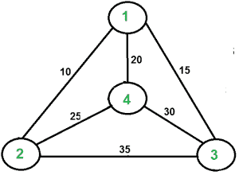

# 旅行商问题(TSP)实现

> 原文:[https://www . geeksforgeeks . org/旅行推销员-问题-tsp-实现/](https://www.geeksforgeeks.org/traveling-salesman-problem-tsp-implementation/)

[旅行商问题(TSP) :](https://www.geeksforgeeks.org/travelling-salesman-problem-set-1/) 给定一组城市和每对城市之间的距离，问题是找到恰好访问每个城市一次并返回起点的最短可能路线。
注意[哈密顿圈](https://www.geeksforgeeks.org/backtracking-set-7-hamiltonian-cycle/)和 TSP 的区别。哈密尔顿循环问题是找出是否存在一个每座城市都只参观一次的旅游。这里我们知道哈密顿圈是存在的(因为图是完整的)，事实上，许多这样的圈是存在的，问题是找到一个最小权重的哈密顿圈。
例如，考虑右侧图中所示的图形。图中的 TSP 游是 1-2-4-3-1。旅游费用是 10+25+30+15 也就是 80。
问题是著名的 NP 难问题。这个问题没有多项式时间的已知解。



**示例:**

```
Output of Given Graph:
minimum weight Hamiltonian Cycle :
10 + 25 + 30 + 15 := 80

```

在这篇文章中，讨论了一个简单解决方案的实现。

1.  考虑城市 1 作为起点和终点。由于路线是循环的，我们可以考虑任何一个点作为起点。
2.  生成全部(n-1)！城市的排列。
3.  计算每个置换的成本，并跟踪最小成本置换。
4.  以最小的代价返回置换。

以下是上述思路的实现

## C++

```
// CPP program to implement traveling salesman
// problem using naive approach.
#include <bits/stdc++.h>
using namespace std;
#define V 4

// implementation of traveling Salesman Problem
int travllingSalesmanProblem(int graph[][V], int s)
{
    // store all vertex apart from source vertex
    vector<int> vertex;
    for (int i = 0; i < V; i++)
        if (i != s)
            vertex.push_back(i);

    // store minimum weight Hamiltonian Cycle.
    int min_path = INT_MAX;
    do {

        // store current Path weight(cost)
        int current_pathweight = 0;

        // compute current path weight
        int k = s;
        for (int i = 0; i < vertex.size(); i++) {
            current_pathweight += graph[k][vertex[i]];
            k = vertex[i];
        }
        current_pathweight += graph[k][s];

        // update minimum
        min_path = min(min_path, current_pathweight);

    } while (
        next_permutation(vertex.begin(), vertex.end()));

    return min_path;
}

// Driver Code
int main()
{
    // matrix representation of graph
    int graph[][V] = { { 0, 10, 15, 20 },
                       { 10, 0, 35, 25 },
                       { 15, 35, 0, 30 },
                       { 20, 25, 30, 0 } };
    int s = 0;
    cout << travllingSalesmanProblem(graph, s) << endl;
    return 0;
}
```

## Java 语言(一种计算机语言，尤用于创建网站)

```
// Java program to implement
// traveling salesman problem
// using naive approach.
import java.util.*;
class GFG{

static int V = 4;

// implementation of traveling
// Salesman Problem
static int travllingSalesmanProblem(int graph[][],
                                    int s)
{
  // store all vertex apart
  // from source vertex
  ArrayList<Integer> vertex =
            new ArrayList<Integer>();

  for (int i = 0; i < V; i++)
    if (i != s)
      vertex.add(i);

  // store minimum weight
  // Hamiltonian Cycle.
  int min_path = Integer.MAX_VALUE;
  do
  {
    // store current Path weight(cost)
    int current_pathweight = 0;

    // compute current path weight
    int k = s;

    for (int i = 0;
             i < vertex.size(); i++)
    {
      current_pathweight +=
              graph[k][vertex.get(i)];
      k = vertex.get(i);
    }
    current_pathweight += graph[k][s];

    // update minimum
    min_path = Math.min(min_path,
                        current_pathweight);

  } while (findNextPermutation(vertex));

  return min_path;
}

// Function to swap the data
// present in the left and right indices
public static ArrayList<Integer> swap(
              ArrayList<Integer> data,
              int left, int right)
{
  // Swap the data
  int temp = data.get(left);
  data.set(left, data.get(right));
  data.set(right, temp);

  // Return the updated array
  return data;
}

// Function to reverse the sub-array
// starting from left to the right
// both inclusive
public static ArrayList<Integer> reverse(
              ArrayList<Integer> data,
              int left, int right)
{
  // Reverse the sub-array
  while (left < right)
  {
    int temp = data.get(left);
    data.set(left++,
             data.get(right));
    data.set(right--, temp);
  }

  // Return the updated array
  return data;
}

// Function to find the next permutation
// of the given integer array
public static boolean findNextPermutation(
                      ArrayList<Integer> data)
{ 
  // If the given dataset is empty
  // or contains only one element
  // next_permutation is not possible
  if (data.size() <= 1)
    return false;

  int last = data.size() - 2;

  // find the longest non-increasing
  // suffix and find the pivot
  while (last >= 0)
  {
    if (data.get(last) <
        data.get(last + 1))
    {
      break;
    }
    last--;
  }

  // If there is no increasing pair
  // there is no higher order permutation
  if (last < 0)
    return false;

  int nextGreater = data.size() - 1;

  // Find the rightmost successor
  // to the pivot
  for (int i = data.size() - 1;
           i > last; i--) {
    if (data.get(i) >
        data.get(last))
    {
      nextGreater = i;
      break;
    }
  }

  // Swap the successor and
  // the pivot
  data = swap(data,
              nextGreater, last);

  // Reverse the suffix
  data = reverse(data, last + 1,
                 data.size() - 1);

  // Return true as the
  // next_permutation is done
  return true;
}

// Driver Code
public static void main(String args[])
{
  // matrix representation of graph
  int graph[][] = {{0, 10, 15, 20},
                   {10, 0, 35, 25},
                   {15, 35, 0, 30},
                   {20, 25, 30, 0}};
  int s = 0;
  System.out.println(
  travllingSalesmanProblem(graph, s));
}
}

// This code is contributed by adityapande88
```

## 蟒蛇 3

```
# Python3 program to implement traveling salesman
# problem using naive approach.
from sys import maxsize
from itertools import permutations
V = 4

# implementation of traveling Salesman Problem
def travellingSalesmanProblem(graph, s):

    # store all vertex apart from source vertex
    vertex = []
    for i in range(V):
        if i != s:
            vertex.append(i)

    # store minimum weight Hamiltonian Cycle
    min_path = maxsize
    next_permutation=permutations(vertex)
    for i in next_permutation:

        # store current Path weight(cost)
        current_pathweight = 0

        # compute current path weight
        k = s
        for j in i:
            current_pathweight += graph[k][j]
            k = j
        current_pathweight += graph[k][s]

        # update minimum
        min_path = min(min_path, current_pathweight)

    return min_path

# Driver Code
if __name__ == "__main__":

    # matrix representation of graph
    graph = [[0, 10, 15, 20], [10, 0, 35, 25],
            [15, 35, 0, 30], [20, 25, 30, 0]]
    s = 0
    print(travellingSalesmanProblem(graph, s))
```

**Output**

```
80

```