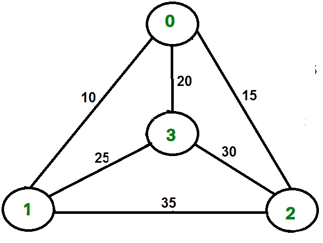

# 使用分支定界的旅行商问题

> 原文:[https://www . geesforgeks . org/旅行推销员-问题-使用分支和绑定-2/](https://www.geeksforgeeks.org/traveling-salesman-problem-using-branch-and-bound-2/)

给定一组城市和每对城市之间的距离，问题是找到一个最短的可能的旅行，正好访问每个城市一次，然后返回起点。

[](https://media.geeksforgeeks.org/wp-content/cdn-uploads/TSP.png)

例如，考虑右侧图中所示的图表。图中的 TSP 游是 0-1-3-2-0。旅游费用是 10+25+30+15 也就是 80。

我们讨论了以下解决方案
1) [简单动态规划](https://www.geeksforgeeks.org/travelling-salesman-problem-set-1/)
2) [使用 MST](https://www.geeksforgeeks.org/travelling-salesman-problem-set-2-approximate-using-mst/) 的近似解决方案

**分支和绑定解**
正如在前面的文章中看到的，在分支和绑定方法中，对于树中的当前节点，我们计算如果我们向下移动这个节点，我们可以得到的最佳可能解的边界。如果最佳可能解本身的界限比当前最佳(目前为止计算的最佳)差，那么我们忽略以该节点为根的子树。

请注意，通过一个节点的成本包括两个成本。
1)从根节点到达节点的成本(当我们到达一个节点时，我们计算了这个成本)
2)从当前节点到达叶子节点的答案的成本(我们计算了这个成本的界限，以决定是否忽略具有这个节点的子树)。

*   在**最大化问题**的情况下，如果我们遵循给定的节点，上限会告诉我们最大可能的解。例如在 [0/1 背包中，我们使用贪婪方法来寻找上限](https://www.geeksforgeeks.org/branch-and-bound-set-2-implementation-of-01-knapsack/)。
*   在**最小化问题**的情况下，如果我们遵循给定的节点，下界告诉我们最小可能的解。例如，在[工作分配问题](https://www.geeksforgeeks.org/branch-bound-set-4-job-assignment-problem/)中，我们通过将成本最低的工作分配给工人来获得下限。

在分支定界中，挑战性的部分是找出一种方法来计算最佳可能解的界限。下面是一个用来计算旅行推销员问题的边界的想法。

任何旅游的费用可以写如下。

```
Cost of a tour T = (1/2) * ∑ (Sum of cost of two edges
                              adjacent to u and in the
                              tour T) 
                   where u ∈ V
For every vertex u, if we consider two edges through it in T,
and sum their costs.  The overall sum for all vertices would
be twice of cost of tour T (We have considered every edge 
twice.)

(Sum of two tour edges adjacent to u) >= (sum of minimum weight
                                          two edges adjacent to
                                          u)

Cost of any tour >=  1/2) * ∑ (Sum of cost of two minimum
                              weight edges adjacent to u) 
                   where u ∈ V

```

例如，考虑上面显示的图表。下面是与每个节点相邻的两条边的最小成本。

```
Node     Least cost edges   Total cost            
0     (0, 1), (0, 2)            25
1     (0, 1), (1, 3)         35
2    (0, 2), (2, 3)            45
3     (0, 3), (1, 3)            45

Thus a lower bound on the cost of any tour = 
         1/2(25 + 35 + 45 + 45)
       = 75
Refer this for one more example.

```

现在我们有了一个关于下界计算的想法。让我们看看如何如何应用它的状态空间搜索树。我们开始枚举所有可能的节点(最好按照字典顺序)

**1。根节点:**不失一般性，我们假设我们从顶点“0”开始，上面已经计算了其下界。

**处理等级 2:** 下一个等级列举了我们可以到达的所有可能的顶点(请记住，在任何路径中，一个顶点只需要出现一次)，它们是，1，2，3… n(请注意，该图是完整的)。考虑我们正在计算顶点 1，因为我们从 0 移动到 1，我们的旅行现在已经包括边缘 0-1。这允许我们对根的下限进行必要的改变。

```

Lower Bound for vertex 1 = 
   Old lower bound - ((minimum edge cost of 0 + 
                    minimum edge cost of 1) / 2) 
                  + (edge cost 0-1)
```

它是如何工作的？为了包含边 0-1，我们将 0-1 的边成本相加，并减去一个边权重，使得下限保持尽可能紧，这将是 0 和 1 的最小边之和除以 2。显然，减去的边不能比这个小。

**处理其他级别:**当我们进入下一个级别时，我们再次枚举所有可能的顶点。对于在 1 之后更进一步的上述情况，我们检查 2，3，4，…n.
考虑 2 的下限当我们从 1 移动到 1 时，我们将边 1-2 包括到路线中，并改变该节点的新下限。

```
Lower bound(2) = 
     Old lower bound - ((second minimum edge cost of 1 + 
                         minimum edge cost of 2)/2)
                     + edge cost 1-2)
```

注意:公式中唯一的变化是这次我们包括了 1 的第二个最小边缘成本，因为最小边缘成本已经在上一级中被减去了。

## C++

```
// C++ program to solve Traveling Salesman Problem
// using Branch and Bound.
#include <bits/stdc++.h>
using namespace std;
const int N = 4;

// final_path[] stores the final solution ie, the
// path of the salesman.
int final_path[N+1];

// visited[] keeps track of the already visited nodes
// in a particular path
bool visited[N];

// Stores the final minimum weight of shortest tour.
int final_res = INT_MAX;

// Function to copy temporary solution to
// the final solution
void copyToFinal(int curr_path[])
{
    for (int i=0; i<N; i++)
        final_path[i] = curr_path[i];
    final_path[N] = curr_path[0];
}

// Function to find the minimum edge cost
// having an end at the vertex i
int firstMin(int adj[N][N], int i)
{
    int min = INT_MAX;
    for (int k=0; k<N; k++)
        if (adj[i][k]<min && i != k)
            min = adj[i][k];
    return min;
}

// function to find the second minimum edge cost
// having an end at the vertex i
int secondMin(int adj[N][N], int i)
{
    int first = INT_MAX, second = INT_MAX;
    for (int j=0; j<N; j++)
    {
        if (i == j)
            continue;

        if (adj[i][j] <= first)
        {
            second = first;
            first = adj[i][j];
        }
        else if (adj[i][j] <= second &&
                 adj[i][j] != first)
            second = adj[i][j];
    }
    return second;
}

// function that takes as arguments:
// curr_bound -> lower bound of the root node
// curr_weight-> stores the weight of the path so far
// level-> current level while moving in the search
//         space tree
// curr_path[] -> where the solution is being stored which
//                would later be copied to final_path[]
void TSPRec(int adj[N][N], int curr_bound, int curr_weight,
            int level, int curr_path[])
{
    // base case is when we have reached level N which
    // means we have covered all the nodes once
    if (level==N)
    {
        // check if there is an edge from last vertex in
        // path back to the first vertex
        if (adj[curr_path[level-1]][curr_path[0]] != 0)
        {
            // curr_res has the total weight of the
            // solution we got
            int curr_res = curr_weight +
                    adj[curr_path[level-1]][curr_path[0]];

            // Update final result and final path if
            // current result is better.
            if (curr_res < final_res)
            {
                copyToFinal(curr_path);
                final_res = curr_res;
            }
        }
        return;
    }

    // for any other level iterate for all vertices to
    // build the search space tree recursively
    for (int i=0; i<N; i++)
    {
        // Consider next vertex if it is not same (diagonal
        // entry in adjacency matrix and not visited
        // already)
        if (adj[curr_path[level-1]][i] != 0 &&
            visited[i] == false)
        {
            int temp = curr_bound;
            curr_weight += adj[curr_path[level-1]][i];

            // different computation of curr_bound for
            // level 2 from the other levels
            if (level==1)
              curr_bound -= ((firstMin(adj, curr_path[level-1]) +
                             firstMin(adj, i))/2);
            else
              curr_bound -= ((secondMin(adj, curr_path[level-1]) +
                             firstMin(adj, i))/2);

            // curr_bound + curr_weight is the actual lower bound
            // for the node that we have arrived on
            // If current lower bound < final_res, we need to explore
            // the node further
            if (curr_bound + curr_weight < final_res)
            {
                curr_path[level] = i;
                visited[i] = true;

                // call TSPRec for the next level
                TSPRec(adj, curr_bound, curr_weight, level+1,
                       curr_path);
            }

            // Else we have to prune the node by resetting
            // all changes to curr_weight and curr_bound
            curr_weight -= adj[curr_path[level-1]][i];
            curr_bound = temp;

            // Also reset the visited array
            memset(visited, false, sizeof(visited));
            for (int j=0; j<=level-1; j++)
                visited[curr_path[j]] = true;
        }
    }
}

// This function sets up final_path[] 
void TSP(int adj[N][N])
{
    int curr_path[N+1];

    // Calculate initial lower bound for the root node
    // using the formula 1/2 * (sum of first min +
    // second min) for all edges.
    // Also initialize the curr_path and visited array
    int curr_bound = 0;
    memset(curr_path, -1, sizeof(curr_path));
    memset(visited, 0, sizeof(curr_path));

    // Compute initial bound
    for (int i=0; i<N; i++)
        curr_bound += (firstMin(adj, i) +
                       secondMin(adj, i));

    // Rounding off the lower bound to an integer
    curr_bound = (curr_bound&1)? curr_bound/2 + 1 :
                                 curr_bound/2;

    // We start at vertex 1 so the first vertex
    // in curr_path[] is 0
    visited[0] = true;
    curr_path[0] = 0;

    // Call to TSPRec for curr_weight equal to
    // 0 and level 1
    TSPRec(adj, curr_bound, 0, 1, curr_path);
}

// Driver code
int main()
{
    //Adjacency matrix for the given graph
    int adj[N][N] = { {0, 10, 15, 20},
        {10, 0, 35, 25},
        {15, 35, 0, 30},
        {20, 25, 30, 0}
    };

    TSP(adj);

    printf("Minimum cost : %d\n", final_res);
    printf("Path Taken : ");
    for (int i=0; i<=N; i++)
        printf("%d ", final_path[i]);

    return 0;
}
```

## Java 语言(一种计算机语言，尤用于创建网站)

```
// Java program to solve Traveling Salesman Problem
// using Branch and Bound.
import java.util.*;

class GFG
{

    static int N = 4;

    // final_path[] stores the final solution ie, the
    // path of the salesman.
    static int final_path[] = new int[N + 1];

    // visited[] keeps track of the already visited nodes
    // in a particular path
    static boolean visited[] = new boolean[N];

    // Stores the final minimum weight of shortest tour.
    static int final_res = Integer.MAX_VALUE;

    // Function to copy temporary solution to
    // the final solution
    static void copyToFinal(int curr_path[])
    {
        for (int i = 0; i < N; i++)
            final_path[i] = curr_path[i];
        final_path[N] = curr_path[0];
    }

    // Function to find the minimum edge cost
    // having an end at the vertex i
    static int firstMin(int adj[][], int i)
    {
        int min = Integer.MAX_VALUE;
        for (int k = 0; k < N; k++)
            if (adj[i][k] < min && i != k)
                min = adj[i][k];
        return min;
    }

    // function to find the second minimum edge cost
    // having an end at the vertex i
    static int secondMin(int adj[][], int i)
    {
        int first = Integer.MAX_VALUE, second = Integer.MAX_VALUE;
        for (int j=0; j<N; j++)
        {
            if (i == j)
                continue;

            if (adj[i][j] <= first)
            {
                second = first;
                first = adj[i][j];
            }
            else if (adj[i][j] <= second &&
                    adj[i][j] != first)
                second = adj[i][j];
        }
        return second;
    }

    // function that takes as arguments:
    // curr_bound -> lower bound of the root node
    // curr_weight-> stores the weight of the path so far
    // level-> current level while moving in the search
    //         space tree
    // curr_path[] -> where the solution is being stored which
    //             would later be copied to final_path[]
    static void TSPRec(int adj[][], int curr_bound, int curr_weight,
                int level, int curr_path[])
    {
        // base case is when we have reached level N which
        // means we have covered all the nodes once
        if (level == N)
        {
            // check if there is an edge from last vertex in
            // path back to the first vertex
            if (adj[curr_path[level - 1]][curr_path[0]] != 0)
            {
                // curr_res has the total weight of the
                // solution we got
                int curr_res = curr_weight +
                        adj[curr_path[level-1]][curr_path[0]];

                // Update final result and final path if
                // current result is better.
                if (curr_res < final_res)
                {
                    copyToFinal(curr_path);
                    final_res = curr_res;
                }
            }
            return;
        }

        // for any other level iterate for all vertices to
        // build the search space tree recursively
        for (int i = 0; i < N; i++)
        {
            // Consider next vertex if it is not same (diagonal
            // entry in adjacency matrix and not visited
            // already)
            if (adj[curr_path[level-1]][i] != 0 &&
                    visited[i] == false)
            {
                int temp = curr_bound;
                curr_weight += adj[curr_path[level - 1]][i];

                // different computation of curr_bound for
                // level 2 from the other levels
                if (level==1)
                curr_bound -= ((firstMin(adj, curr_path[level - 1]) +
                                firstMin(adj, i))/2);
                else
                curr_bound -= ((secondMin(adj, curr_path[level - 1]) +
                                firstMin(adj, i))/2);

                // curr_bound + curr_weight is the actual lower bound
                // for the node that we have arrived on
                // If current lower bound < final_res, we need to explore
                // the node further
                if (curr_bound + curr_weight < final_res)
                {
                    curr_path[level] = i;
                    visited[i] = true;

                    // call TSPRec for the next level
                    TSPRec(adj, curr_bound, curr_weight, level + 1,
                        curr_path);
                }

                // Else we have to prune the node by resetting
                // all changes to curr_weight and curr_bound
                curr_weight -= adj[curr_path[level-1]][i];
                curr_bound = temp;

                // Also reset the visited array
                Arrays.fill(visited,false);
                for (int j = 0; j <= level - 1; j++)
                    visited[curr_path[j]] = true;
            }
        }
    }

    // This function sets up final_path[] 
    static void TSP(int adj[][])
    {
        int curr_path[] = new int[N + 1];

        // Calculate initial lower bound for the root node
        // using the formula 1/2 * (sum of first min +
        // second min) for all edges.
        // Also initialize the curr_path and visited array
        int curr_bound = 0;
        Arrays.fill(curr_path, -1);
        Arrays.fill(visited, false);

        // Compute initial bound
        for (int i = 0; i < N; i++)
            curr_bound += (firstMin(adj, i) +
                        secondMin(adj, i));

        // Rounding off the lower bound to an integer
        curr_bound = (curr_bound==1)? curr_bound/2 + 1 :
                                    curr_bound/2;

        // We start at vertex 1 so the first vertex
        // in curr_path[] is 0
        visited[0] = true;
        curr_path[0] = 0;

        // Call to TSPRec for curr_weight equal to
        // 0 and level 1
        TSPRec(adj, curr_bound, 0, 1, curr_path);
    }

    // Driver code
    public static void main(String[] args) 
    {
        //Adjacency matrix for the given graph
        int adj[][] = {{0, 10, 15, 20},
                        {10, 0, 35, 25},
                        {15, 35, 0, 30},
                        {20, 25, 30, 0}    };

        TSP(adj);

        System.out.printf("Minimum cost : %d\n", final_res);
        System.out.printf("Path Taken : ");
        for (int i = 0; i <= N; i++) 
        {
            System.out.printf("%d ", final_path[i]);
        }
    }
}

/* This code contributed by PrinciRaj1992 */
```

## 蟒蛇 3

```
# Python3 program to solve 
# Traveling Salesman Problem using 
# Branch and Bound.
import math
maxsize = float('inf')

# Function to copy temporary solution
# to the final solution
def copyToFinal(curr_path):
    final_path[:N + 1] = curr_path[:]
    final_path[N] = curr_path[0]

# Function to find the minimum edge cost 
# having an end at the vertex i
def firstMin(adj, i):
    min = maxsize
    for k in range(N):
        if adj[i][k] < min and i != k:
            min = adj[i][k]

    return min

# function to find the second minimum edge 
# cost having an end at the vertex i
def secondMin(adj, i):
    first, second = maxsize, maxsize
    for j in range(N):
        if i == j:
            continue
        if adj[i][j] <= first:
            second = first
            first = adj[i][j]

        elif(adj[i][j] <= second and 
             adj[i][j] != first):
            second = adj[i][j]

    return second

# function that takes as arguments:
# curr_bound -> lower bound of the root node
# curr_weight-> stores the weight of the path so far
# level-> current level while moving
# in the search space tree
# curr_path[] -> where the solution is being stored
# which would later be copied to final_path[]
def TSPRec(adj, curr_bound, curr_weight, 
              level, curr_path, visited):
    global final_res

    # base case is when we have reached level N 
    # which means we have covered all the nodes once
    if level == N:

        # check if there is an edge from
        # last vertex in path back to the first vertex
        if adj[curr_path[level - 1]][curr_path[0]] != 0:

            # curr_res has the total weight
            # of the solution we got
            curr_res = curr_weight + adj[curr_path[level - 1]]\
                                        [curr_path[0]]
            if curr_res < final_res:
                copyToFinal(curr_path)
                final_res = curr_res
        return

    # for any other level iterate for all vertices
    # to build the search space tree recursively
    for i in range(N):

        # Consider next vertex if it is not same 
        # (diagonal entry in adjacency matrix and 
        #  not visited already)
        if (adj[curr_path[level-1]][i] != 0 and
                            visited[i] == False):
            temp = curr_bound
            curr_weight += adj[curr_path[level - 1]][i]

            # different computation of curr_bound 
            # for level 2 from the other levels
            if level == 1:
                curr_bound -= ((firstMin(adj, curr_path[level - 1]) + 
                                firstMin(adj, i)) / 2)
            else:
                curr_bound -= ((secondMin(adj, curr_path[level - 1]) +
                                 firstMin(adj, i)) / 2)

            # curr_bound + curr_weight is the actual lower bound 
            # for the node that we have arrived on.
            # If current lower bound < final_res, 
            # we need to explore the node further
            if curr_bound + curr_weight < final_res:
                curr_path[level] = i
                visited[i] = True

                # call TSPRec for the next level
                TSPRec(adj, curr_bound, curr_weight, 
                       level + 1, curr_path, visited)

            # Else we have to prune the node by resetting 
            # all changes to curr_weight and curr_bound
            curr_weight -= adj[curr_path[level - 1]][i]
            curr_bound = temp

            # Also reset the visited array
            visited = [False] * len(visited)
            for j in range(level):
                if curr_path[j] != -1:
                    visited[curr_path[j]] = True

# This function sets up final_path
def TSP(adj):

    # Calculate initial lower bound for the root node 
    # using the formula 1/2 * (sum of first min + 
    # second min) for all edges. Also initialize the 
    # curr_path and visited array
    curr_bound = 0
    curr_path = [-1] * (N + 1)
    visited = [False] * N

    # Compute initial bound
    for i in range(N):
        curr_bound += (firstMin(adj, i) + 
                       secondMin(adj, i))

    # Rounding off the lower bound to an integer
    curr_bound = math.ceil(curr_bound / 2)

    # We start at vertex 1 so the first vertex 
    # in curr_path[] is 0
    visited[0] = True
    curr_path[0] = 0

    # Call to TSPRec for curr_weight 
    # equal to 0 and level 1
    TSPRec(adj, curr_bound, 0, 1, curr_path, visited)

# Driver code

# Adjacency matrix for the given graph
adj = [[0, 10, 15, 20],
       [10, 0, 35, 25],
       [15, 35, 0, 30],
       [20, 25, 30, 0]]
N = 4

# final_path[] stores the final solution 
# i.e. the // path of the salesman.
final_path = [None] * (N + 1)

# visited[] keeps track of the already
# visited nodes in a particular path
visited = [False] * N

# Stores the final minimum weight
# of shortest tour.
final_res = maxsize

TSP(adj)

print("Minimum cost :", final_res)
print("Path Taken : ", end = ' ')
for i in range(N + 1):
    print(final_path[i], end = ' ')

# This code is contributed by ng24_7
```

**Output :**

```
Minimum cost : 80
Path Taken : 0 1 3 2 0 

```

**时间复杂度:**分支定界的最坏情况复杂度显然和蛮力一样，因为在最坏的情况下，我们可能永远没有机会去修剪一个节点。然而，实际上它的性能非常好，这取决于 TSP 的不同实例。复杂性还取决于边界函数的选择，因为它们决定了要修剪多少节点。

**参考文献:**
[http://lcm.csa.iisc.ernet.in/dsa/node187.html](http://lcm.csa.iisc.ernet.in/dsa/node187.html)

本文由 **Anurag Rai** 供稿。如果你喜欢极客博客并想投稿，你也可以写一篇文章并把你的文章邮寄到 contribute@geeksforgeeks.org。看到你的文章出现在极客博客主页上，帮助其他极客。

如果你发现任何不正确的地方，或者你想分享更多关于上面讨论的话题的信息，请写评论。